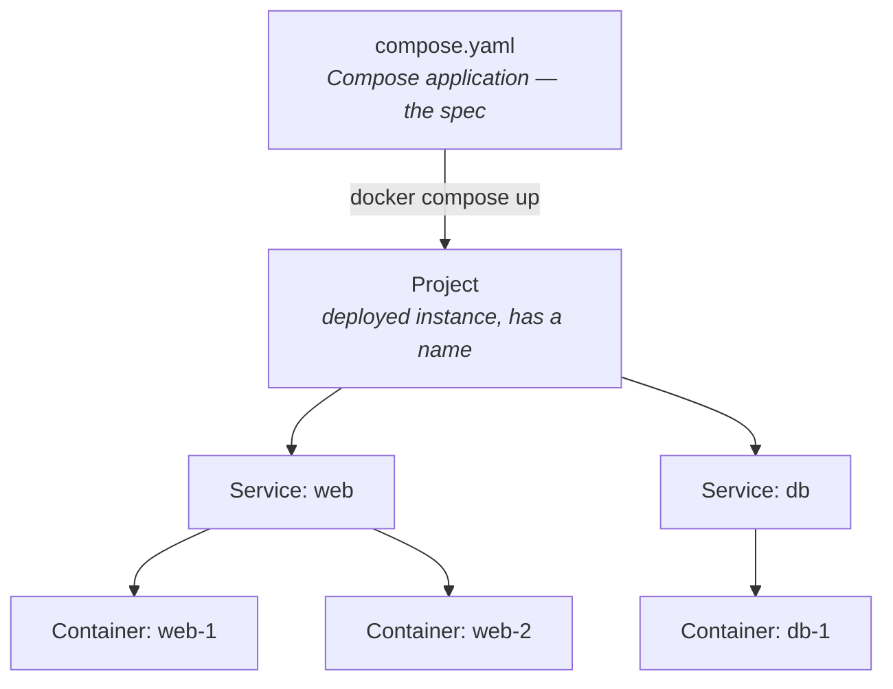
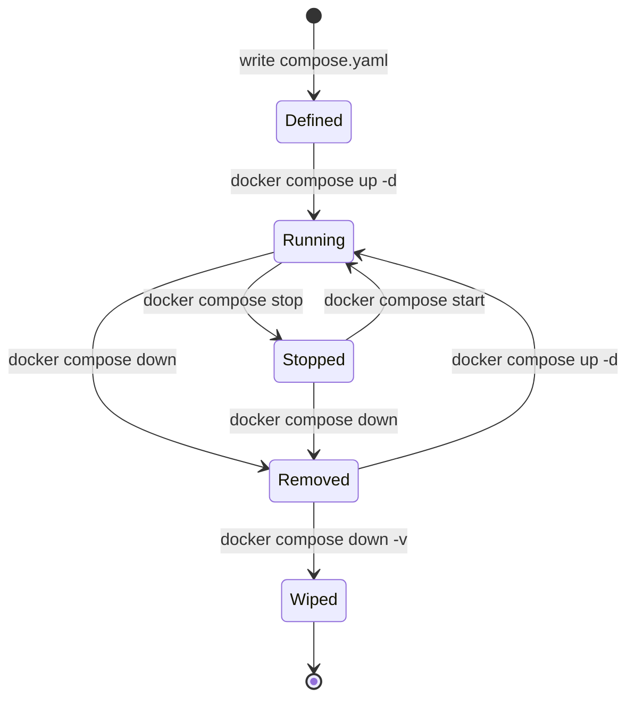

Docker Compose has a clean mental model hidden behind two of the most generic
words in software: *application* and *project*. This note pins down what each
term actually means in Compose, what `compose.yaml` defines, and which command
operates on which layer.

## What Compose manages

Compose targets **one host** — i.e. one Docker daemon at a time. It is *not* a
cluster orchestrator; that role belongs to Swarm or Kubernetes. On that single
host, Compose manages **one or more containers** that together form an
application.

So the scope is: 1 host, 1+ containers, declared in a single YAML file.

## The four-layer hierarchy



| Term | Meaning |
|---|---|
| **(Compose) application** | What `compose.yaml` *defines* — a static, declarative spec |
| **Project** | A *running instance* of that application on a host; has a name used to namespace resources |
| **Service** | One component declared under `services:` (e.g. `web`, `db`) |
| **Container** | A running instance of a service; one service can scale to N containers |

Mental model: **application is the class, project is the instance.**

- `compose.yaml` defines an *application*.
- `docker compose up` instantiates a *project* from it.
- The same application can run as **multiple projects** side-by-side on one
  host, distinguished by name.

## A note on the names

The terms are real — both the [Compose Specification][spec] ("Compose
application") and the CLI (`--project-name`, `COMPOSE_PROJECT_NAME`,
`docker compose ls` listing "projects") use them. But "application" and
"project" are everyday English words, so they collide with every other meaning
in software. In conversation, qualify them:

- **"Compose application"** or **"compose file"** — for the definition.
- **"Compose project"** — for the running instance.
- **"Stack"** — informal but widely understood. ⚠️ It *is* a formal term in
  Docker Swarm (`docker stack deploy`), so it can add confusion. In plain
  Compose it has no formal meaning.

## Project naming

When `docker compose up` runs, the project name defaults to the **directory
name** containing the compose file. Override it with `-p <name>` or the
`COMPOSE_PROJECT_NAME` environment variable.

The project name prefixes every resource Compose creates, which is how two
projects from the same file can coexist:

| Resource | Naming pattern |
|---|---|
| Container | `<project>-<service>-<replica>` |
| Network | `<project>_default` |
| Named volume | `<project>_<volname>` |

Compose identifies its containers by the `com.docker.compose.project` label,
so even at the raw Docker level you can list them:

```bash
docker ps --filter label=com.docker.compose.project
```

## Listing projects

```bash
docker compose ls
```

Sample output:

```
NAME                STATUS              CONFIG FILES
miniflux            running(2)          /home/me/dotfiles/miniflux/compose.yaml
rsshub              running(3)          /home/me/dotfiles/rsshub/docker-compose.yml
```

Useful flags:

- `-a` / `--all` — include stopped projects.
- `--format json` — machine-readable.
- `--filter name=miniflux` (or `status=running`) — narrow the list.

## Acting on a project from anywhere

The `-p <name>` flag lets you target a project without `cd`-ing to its
directory:

```bash
docker compose -p miniflux ps      # list its containers
docker compose -p miniflux logs    # tail logs
docker compose -p miniflux down    # tear it down
```

If you *are* in the directory with the compose file, drop the `-p` and
Compose infers everything.

## Lifecycle: the data-safety ladder

This is where the mental model pays off. The commands below act on a project
and differ in what they preserve.

| Command | Containers | Default network | Named volumes | Anonymous volumes | Images |
|---|---|---|---|---|---|
| `stop` | exited (kept) | kept | kept | kept | kept |
| `down` | **removed** | **removed** | kept ✅ | removed | kept |
| `down -v` | removed | removed | **removed** ⚠️ | removed | kept |
| `down --rmi all` | removed | removed | kept | removed | **removed** |
| `down -v --rmi all` | removed | removed | removed | removed | removed |

In words:

```
stop          → safest, everything preserved, just paused
down          → containers gone, data preserved (named volumes survive)
down -v       → data gone too
down -v --rmi all → nuke everything
```

### `docker compose stop`

Sends SIGTERM to processes inside the containers; they transition to "exited."
Containers, networks, volumes, and images **all still exist**. `docker ps -a`
still shows them. Restart with `docker compose start` — fast, no recreation.

### `docker compose down`

Stops the containers, then **removes** them along with the default network.
**Named volumes are kept** — this is the critical point that prevents
accidental data loss. Anonymous volumes are removed. Images are kept. The
project disappears from `docker compose ls`.

### `docker compose down -v`

Same as `down`, plus deletes named volumes → **actual data loss** (database
files, indexed content, anything persistent).

## Recreating a project from the same file

After a `down`, the compose file is untouched and named volumes still exist.
Bring the project back:

```bash
cd /path/to/compose-dir
docker compose up -d
```

`-d` runs detached. The project name defaults to the directory name, so you
get the *same* project — and your data, sitting in named volumes, comes right
back with it.

Without changing directory:

```bash
docker compose -f /path/to/compose.yaml -p miniflux up -d
```

Useful `up` variants:

| Command | Use when |
|---|---|
| `up -d` | Normal start. Reuses existing containers if config unchanged. |
| `up -d --force-recreate` | Recreate containers even if config is unchanged. |
| `up -d --pull always` | Pull the latest images before starting. |
| `up -d --build` | Rebuild local images first. |

Confirm afterwards with `docker compose ls`.

## Quick reference



- **Defined** — `compose.yaml` exists; nothing is deployed.
- **Running** — project exists, containers up.
- **Stopped** — project exists, containers exited.
- **Removed** — containers gone, named volumes preserved.
- **Wiped** — named volumes gone too; effectively back to the spec.

[spec]: https://compose-spec.io/
