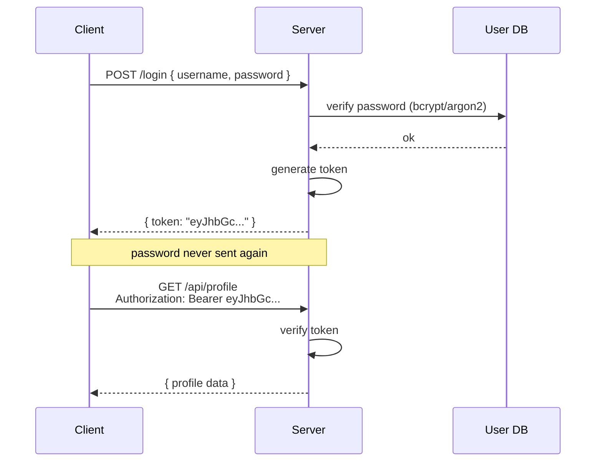

A working mental model for tokens, JWT, and the design choices a backend team faces when picking between them.

## What is a token?

A **token** is a piece of data a client presents to prove "I'm allowed to do this" or "I am who I claim to be" — without re-sending credentials (like a password) on every request.

Think of it like a concert wristband: you showed your ID at the gate once, got the wristband, and now you flash the wristband instead of re-proving who you are each time you go to the bar.

### Tokens vs. credentials

- **Credentials** (password, API key) are long-lived secrets you use to *get* a token.
- **Tokens** are usually shorter-lived and scoped — designed to be passed around, sometimes across services.

### Common kinds of tokens

| Kind | Purpose |
|------|---------|
| Access token | Authorizes API calls (OAuth) |
| ID token | Asserts who the user is (OIDC) — usually a JWT |
| Refresh token | Used to get new access tokens without re-login |
| CSRF token | Proves a request originated from your own page |
| Session token / cookie | Identifies a logged-in browser session |
| Personal access token (PAT) | Long-lived API credential (GitHub, etc.) |

## Two broad shapes a token can take

### 1. Opaque tokens

Random strings with no meaning to the client:

```
a7f3b2c9d4e1f8a0b6c5d2e7f4a1b8c3
```

The server stores what they map to (user, scopes, expiry) in a database. To validate one, the server looks it up.

### 2. Self-contained / structured tokens

The token itself *carries* the claims, signed so it can't be tampered with. **JWT is the dominant format here.** The server validates by checking the signature — no DB lookup needed.

## What is JWT, exactly?

A **JSON Web Token (JWT)** is a compact, URL-safe token format for transmitting claims between parties, defined in RFC 7519. It is just a **format** — a spec for how to structure and encode a token — not a protocol or a system on its own.

### Structure

A JWT has three Base64URL-encoded parts joined by dots:

```
header.payload.signature
```

**Header** — algorithm and token type:

```json
{ "alg": "HS256", "typ": "JWT" }
```

**Payload** — claims (statements about the user/session):

```json
{ "sub": "1234", "name": "Alice", "exp": 1735689600 }
```

Standard claims include `iss` (issuer), `sub` (subject), `aud` (audience), `exp` (expiration), `iat` (issued at).

**Signature** — `HMAC_SHA256(base64(header) + "." + base64(payload), secret)`, or RSA/ECDSA for asymmetric.

### The JOSE family

JWT sits inside a broader family of specs:

- **JWT (RFC 7519)** — the *shape*: a JSON payload of claims, encoded into the three-part string.
- **JWS (RFC 7515)** — how it gets signed.
- **JWE (RFC 7516)** — how it gets encrypted (less common in practice).
- **JOSE** — umbrella for all of the above.

A JWT by itself doesn't specify *how* you obtain one, *where* you store it, or *when* it's valid — those are decisions made by whatever system uses it. Protocols like **OAuth 2.0** and **OpenID Connect** define those flows. OIDC's ID tokens, for example, are JWTs; OAuth access tokens *may* be JWTs but don't have to be — they could be opaque random strings.

> Mental model: JWT is to auth roughly what JSON is to APIs — a serialization format that systems agree on, not the system itself.

## The canonical login → token flow



After the login response, the password is **never sent again** for the lifetime of that token. The client just attaches the token to each request — typically in an `Authorization: Bearer <token>` header, sometimes in a cookie.

### Why this design

- **Password exposure is minimized** — it crosses the wire once, not on every request. Less surface area for leaks (logs, proxies, breaches).
- **Passwords are slow to verify** — they're hashed with deliberately expensive algorithms (bcrypt, argon2) taking ~100ms. You don't want that on every API call. Token verification is microseconds.
- **Tokens are scoped and expirable** — a leaked token is far less damaging than a leaked password.
- **Tokens are revocable** without forcing a password change.
- **Delegation** — you can give a token to a third-party service or a mobile app without handing over the password.

The same pattern works beyond password login: OAuth flows, API keys exchanged for short-lived tokens, refresh tokens exchanged for new access tokens, service-to-service auth with signed JWTs from a trusted issuer.

## Verifying a token: opaque vs. JWT

This is where the architecture choice really shows up.

### Opaque token (DB lookup)

```
Request arrives with token "abc123..."
  │
  ▼
Backend → SELECT * FROM tokens WHERE token = 'abc123...'
  │
  ▼
Check: exists? not expired? not revoked? → load user
  │
  ▼
Proceed
```

**Cost:** one DB/cache hit per request.

### JWT (self-contained)

```
Request arrives with token "eyJhbGc.eyJzdWIi.signature"
  │
  ▼
Backend verifies signature with public/secret key (in memory)
  │
  ▼
Decode payload → already has user_id, scopes, exp
  │
  ▼
Proceed
```

**Cost:** a hash/signature check (microseconds, pure CPU, no I/O).

## So is JWT "more lightweight"?

Yes — in this specific sense:

- **No network I/O per request** for auth. Validation is local CPU work.
- **Horizontally scales trivially** — every service instance can verify independently with just the verification key. No shared session store needed.
- **Cross-service trust** — service A issues a JWT, service B verifies it without ever talking to A. A huge win in microservices.

### But "lightweight" comes with real costs

| Concern | Opaque + DB | JWT |
|---|---|---|
| Per-request cost | DB/cache hit | CPU only |
| Revocation | Trivial — delete the row | Hard — token stays valid until `exp` |
| Token size on wire | ~32 bytes | ~500–1500 bytes (sent on every request) |
| Changing user permissions | Takes effect immediately | Takes effect when token expires |
| Operational complexity | Simple, familiar | Key management, rotation, clock skew, algorithm pitfalls |

The **revocation** row is the big one. With opaque tokens, "log this user out everywhere" is `DELETE FROM sessions WHERE user_id = ?`. With JWTs, the token is valid until it expires — you can't un-issue it. Teams often add a denylist (which is... a database lookup), partially defeating the point.

## What teams actually do in practice

- ✅ **Short-lived JWT access token** (5–15 min) **+ long-lived refresh token** stored server-side. You get JWT's stateless speed for the hot path, and the refresh step gives you a revocation point. This is the most common modern pattern.
- ✅ **Cache the opaque-token lookup in Redis** — turns the "DB hit per request" into a sub-millisecond memory hit, often fast enough that JWT's CPU-only advantage stops mattering. Many large companies use this and skip JWTs entirely for session auth.

## Security footguns to know about

- The JWT payload is **encoded, not encrypted**. Anyone can read it. Don't put secrets in it.
- **Algorithm-confusion attacks** are a classic footgun: `alg: none`, or HS256/RS256 key swaps. Always pin the expected algorithm on the verifier.
- **Token size matters** — a 1KB token sent on every request adds up under high traffic.
- **Clock skew** between issuer and verifier can cause valid tokens to be rejected (or expired tokens accepted) right around the boundary.

## Honest summary

JWT is lighter *per request* and scales better *across services*, but it pushes complexity elsewhere — into key management, token sizing, and especially revocation.

- For a **single backend serving its own users**, opaque tokens + Redis is often simpler and just as fast.
- JWT really earns its keep when you have **multiple independent services that need to trust each other** without sharing a session store.

"Lightweight" is one axis among several. Pick the shape that matches your architecture, not the one that sounds modern.
