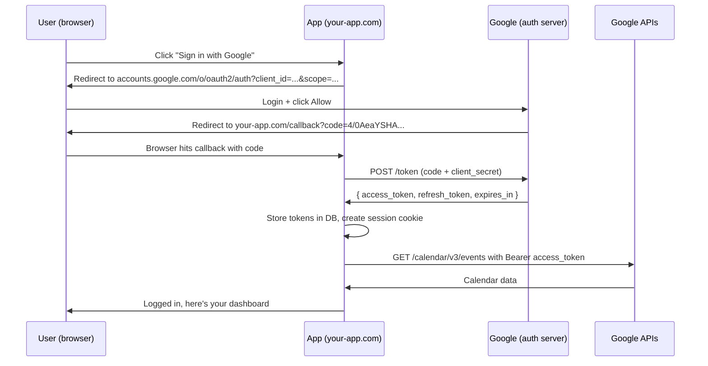

OAuth gets explained in two unhelpful ways: either as an abstract diagram of "resource owners" and "authorization servers," or as a recipe of HTTP calls with no model of what's happening underneath. This post tries the middle path — start with what OAuth is *for*, then trace what actually happens on the first login, on subsequent logins, when access tokens expire, when refresh tokens expire, and when you click "Remove access" in your Google settings.

## What OAuth is for

**OAuth 2.0** is a protocol that lets a user grant a third-party app limited access to their account on another service — *without* sharing their password.

Instead of giving an app your password, you redirect to the service you trust (Google, GitHub, etc.), approve specific permissions, and the app receives a **token** that represents that delegated access.

### The participants

| Role | Who | Example |
|---|---|---|
| Resource owner | You, the user | The person clicking "Sign in" |
| Client | The third-party app | Spotify-Stats-App |
| Authorization server | Issues tokens | `accounts.google.com` |
| Resource server | Holds the data | Gmail API, Drive API |

### Other key concepts

- **Scopes** — the specific permissions granted (e.g. `read:email`, not full account access)
- **Access token** — short-lived (minutes/hours), sent with API calls
- **Refresh token** — long-lived, used to mint new access tokens without re-prompting the user
- **Authorization code** — a one-shot intermediate value exchanged for tokens

## OAuth 2.0 vs OpenID Connect

These two get conflated constantly:

- **OAuth 2.0** is for **authorization** — "can this app read my calendar?"
- **OpenID Connect (OIDC)** is a thin layer on top that adds **authentication** — "who is this user?" via an `id_token` (a JWT).

"Sign in with Google" is OIDC, not raw OAuth. The distinction matters: OAuth alone doesn't tell the app who you are; it just gives the app a key to a door. OIDC adds an ID card.

## The first login: authorization code flow

The standard flow for web/mobile apps is **authorization code with PKCE**. Here's what happens end-to-end.



### Step 1 — get the authorization code

The user clicks "Sign in with Google." The app redirects the browser to Google's auth endpoint with `client_id`, `redirect_uri`, and `scope`. Google asks the user to log in (if not already) and presents a consent screen. On approval, Google redirects back:

```
https://your-app.com/callback?code=4/0AeaYSHA...
```

### Step 2 — exchange code for tokens

The app's backend exchanges the code (plus its `client_secret`) for tokens in **one** call:

```
POST https://oauth2.googleapis.com/token
grant_type=authorization_code
code=4/0AeaYSHA...
client_id=...
client_secret=...
```

Response:

```json
{
  "access_token": "ya29.a0Af...",
  "refresh_token": "1//0gK7v...",
  "expires_in": 3600,
  "token_type": "Bearer",
  "id_token": "eyJhbGciOi..."
}
```

Note: **both tokens come back together**. The refresh token isn't acquired in a separate step.

### Step 3 — call APIs with the access token

```
GET https://www.googleapis.com/calendar/v3/events
Authorization: Bearer ya29.a0Af...
```

## Why two tokens?

| | Access token | Refresh token |
|---|---|---|
| Lifetime | ~1 hour | Months, until revoked |
| Sent to | Resource APIs (Gmail, Drive, etc.) | Only the auth server's `/token` endpoint |
| Risk if leaked | Limited blast radius — expires soon | Bad — attacker can mint access tokens until revoked |
| Format | Often opaque, sometimes JWT | Always opaque |

The split is a **security trade-off**. Access tokens fly around to many API servers (more chances to leak), so they're short-lived. The refresh token only ever talks to one endpoint (the auth server) and never touches resource APIs, so it can safely live longer.

## When the access token expires

After ~1 hour, the access token stops working. The app silently calls Google's token endpoint with the refresh token:

```
POST https://oauth2.googleapis.com/token
grant_type=refresh_token
refresh_token=1//0gK7v...
client_id=...
client_secret=...
```

Response:

```json
{
  "access_token": "ya29.a0Bg...",
  "expires_in": 3600
}
```

Usually **no new refresh token** is returned — the original keeps working. (Some providers do "refresh token rotation" and issue a new one each time; Google generally doesn't.)

The user notices nothing. The dashboard keeps loading.

## Logging in next time: two sessions, not one

Most people picture login as a single state. It isn't — there are **two separate sessions**:

1. **Your session with Google** (the identity provider) — a cookie on `accounts.google.com`
2. **Your session with the app** — a cookie on the app's own domain

Whether OAuth runs again depends on which session expired.

### Scenario A: app session still valid

Close tab, return an hour later.

- Browser sends the app's session cookie.
- Backend looks up the session → already logged in.
- **No OAuth happens at all.** Google isn't involved.

The OAuth tokens sit in the app's database, used only when the app needs to call Google APIs — not for "is this user logged in?"

### Scenario B: app session expired, Google session still valid

Return a week later, app cookie gone.

- App redirects to `accounts.google.com/o/oauth2/auth?...`
- Google sees its own cookie → recognizes you instantly.
- **If you've already consented to these scopes**, Google skips the consent screen and redirects right back with a fresh authorization code.
- App exchanges code for new tokens, creates a new app session.

User experience: one click, you're back in.

### Scenario C: both sessions expired

Same as B, but Google asks for password / 2FA before redirecting back.

### Scenario D: refresh token expired or revoked

The refresh call returns `400 invalid_grant`. The app must restart the **full OAuth flow** — redirect the user to the consent screen again. Common causes:

- User revoked the app in Google account settings
- User changed password (sometimes invalidates refresh tokens)
- Refresh token unused for too long (6 months for Google)
- Admin-level revocation

## Why the app remembers you across re-logins

Even after refresh-token expiry and a full re-OAuth, the app still recognizes you and your data is intact. How?

### The stable identifier

When you first OAuth'd, Google returned a **user ID** along with the tokens. The app stored it linked to your account. On every subsequent OAuth, Google returns the **same ID** — that's how the app recognizes you.

If the app uses OIDC, the `id_token` is a JWT with claims like:

```json
{
  "iss": "https://accounts.google.com",
  "sub": "117428109876543210987",
  "email_verified": true,
  "name": "...",
  "iat": 1714987200,
  "exp": 1714990800
}
```

The `sub` ("subject") claim is the key. It:

- **Never changes**, even if the user changes their Gmail address
- Is **unique per app** — different `client_id` → different `sub` for the same user, by design (prevents apps from correlating users across services)
- Is what the app stores in its `users` table

### What the app's database looks like

```sql
users
─────────────────────────────────────────────
id  | google_sub              | email
1   | 117428109876543210987   | user@example.com
```

When you re-OAuth:

```sql
SELECT * FROM users WHERE google_sub = '117428109876543210987';
```

Found → it's you, attach existing data. Not found → new user, create row.

### Why not match on email?

The app *could*, but `sub` is safer:

- ✅ **Email can change.** If you update your address, `sub` stays the same; matching on email would orphan your account.
- ✅ **Email can be reassigned.** Less common with personal Gmail, but on corporate Workspace, an address might be reassigned to a new employee. Matching on email would hand them the old account.
- ✅ **`email_verified` matters.** With non-Google OIDC providers, an unverified email is forgeable.

**Best practice:** store `sub` as the stable key, store `email` as a mutable attribute.

## "Remove access" in Google settings — what it actually does

This is where most users' mental model breaks. Going to **myaccount.google.com → Security → Third-party apps with account access** and clicking "Remove access" does *not* delete you from the app.

### What it does

1. **Revokes the refresh token** — the app can no longer mint new access tokens
2. **Invalidates outstanding access tokens** — current API calls start failing with `401`
3. **Clears your consent record** — next time you OAuth, you'll see the consent screen again

### What it does *not* do

- ❌ Tell the app to delete your account
- ❌ Change your `sub` for that app
- ❌ Touch the app's database in any way

Google has no way to reach into the app's database and delete rows. The two systems are completely separate.

### So when you re-OAuth after removing access

1. Click "Sign in with Google" again
2. Redirect to Google → consent screen appears (consent was cleared)
3. Click "Allow"
4. Google issues **new** tokens, returns the **same `sub`**
5. App's backend looks up the row by `sub` → found
6. "Welcome back!" — all your history, settings, everything still there

From the app's perspective, nothing meaningful happened. It just got new tokens for an existing user.

### The boundary, made explicit

| Where | What it controls |
|---|---|
| Google account → Remove access | Stops the app from making future API calls on your behalf |
| Inside the app (delete account) | Removes your data from the app's database |

Google's job is to stop the app from accessing *new* data. The app's job is to decide what to do with data it already has. That boundary is intentional — Google shouldn't have privileges to reach into every third-party database.

### Mental model: the contractor

Think of OAuth like giving a contractor a key to your house:

- "Remove access" = changing the locks. Contractor can't get back in.
- But the contractor still has the **photos they took** and the **notes about your furniture** in their notebook back at their office.
- To get those erased, you have to call the contractor directly and ask.

Google holds the keys. The app holds the notebook. Separate.

### Practical recipe for a clean slate

- [ ] **First:** delete your account *inside the app* (wipes their database)
- [ ] **Then:** remove access in Google (stops any lingering tokens from working)

Doing only step 2 creates the "wait, why does it still know me?" moment.

## Common grant types, briefly

| Grant type | When to use |
|---|---|
| Authorization code (with PKCE) | Standard for web/mobile apps |
| Client credentials | Server-to-server, no user involved |
| Device code | TVs, CLIs (you see a code, enter it on your phone) |
| ~~Implicit~~ | Deprecated — replaced by code + PKCE |
| ~~Resource owner password~~ | Deprecated — defeats the point of OAuth |

## What's stored where, summarized

| Where | What | Why |
|---|---|---|
| Browser | App session cookie | Keeps you logged into the app |
| Browser | Google session cookie | Keeps you logged into Google |
| App's DB | Access token, refresh token, `google_sub` | API calls + identity matching |
| Google's side | Consent record, refresh-token validity | Lets you revoke without changing password |

## The core insight

**OAuth is for getting tokens, not for maintaining login state.** After the first dance, the app maintains its own session independently. OAuth re-runs only when the app's session is gone *and* the app needs to re-establish "who is this user."

That's why "Sign in with Google" feels seamless on return visits even though OAuth is technically a multi-step protocol — most of those steps are skipped or invisible when both sides already remember you. And the thing that *truly* makes the app remember you isn't the token at all — it's the stable `sub` identifier sitting in its database, waiting for the next time you knock.
