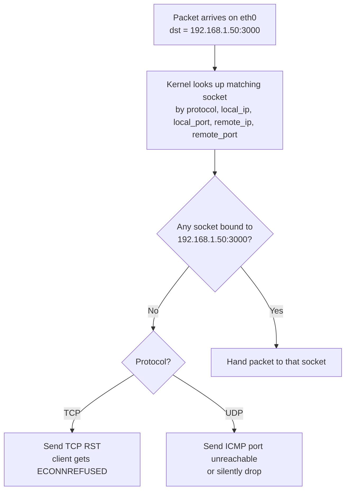

## What loopback is

**Loopback is a virtual network interface** that the OS provides so software can use the same networking API (sockets, IP addresses, ports) to talk to itself as it would to talk to a remote machine.

It looks and behaves like any other network interface — `ip addr show lo` on Linux lists it alongside `eth0`, `wlan0`, etc. — but:

- It has **no physical hardware** behind it. No NIC, no cable, no radio.
- Packets sent to it are **handed straight back** to the local TCP/IP stack instead of being transmitted anywhere.
- It exists purely to let local processes communicate over the standard sockets API.

### Names and addresses

| Thing | Value |
|---|---|
| Interface name (Linux/macOS) | `lo` |
| Interface name (Windows) | `Loopback Pseudo-Interface` |
| IPv4 address | `127.0.0.1` (the whole `127.0.0.0/8` block is reserved) |
| IPv6 address | `::1` |
| Hostname | `localhost` |

`127.0.0.1` is just the **address assigned to that interface**. `localhost` is the **hostname that resolves to it**. The interface itself is the underlying thing.

## What it's used for

- 💻 **Local development** — running a web server on `localhost:3000` so only your machine can reach it.
- 🔌 **Inter-process communication** on the same host (databases, message brokers, etc.).
- 🧪 **Testing network code** without needing a real network.
- ❤️ **Health checks** — a service pinging `127.0.0.1` to confirm its own stack is up.

It works even with no network cable, no Wi-Fi, no DNS — the kernel handles it. And it's fast: no NIC, no driver, no wire — just a memory copy.

## Bind address determines who can connect

When an app calls `listen()`, it binds to a specific **address + port**. The bind address controls who can reach the service:

| Bind address | Who can connect |
|---|---|
| `127.0.0.1` (loopback only) | Same machine only |
| `0.0.0.0` (all IPv4 interfaces) | Anyone who can reach any of the machine's IPs |
| `192.168.1.50` (a specific LAN IP) | Anyone who can reach that LAN IP |

**Common pattern:** databases (Postgres, Redis, MySQL) default to binding `127.0.0.1` so they're only reachable by apps on the same host. To expose them over the network you have to explicitly change the bind address — a safe-by-default choice.

### Why loopback binding is a real security boundary

- Packets from another host **cannot** be routed to `127.0.0.1` on your machine — routers drop `127.0.0.0/8` traffic.
- Even if a forged packet did arrive, the kernel rejects loopback-destined packets coming in on a non-loopback interface (this is **martian packet** filtering, controlled by `net.ipv4.conf.*.rp_filter` / `accept_local` on Linux).

So an attacker on the LAN literally cannot reach a service bound to `127.0.0.1`, no matter what.

### Caveat: not a per-user boundary

"Same machine" includes **all local users and processes**. Loopback is not a per-user boundary — any process on the box can connect to `127.0.0.1:3000`. If you need stricter isolation, use Unix sockets with filesystem permissions, or namespaces/containers.

## What happens when an outside packet hits a loopback-bound port

Suppose your app is bound to `127.0.0.1:3000` and another machine sends a TCP SYN to your LAN IP `192.168.1.50:3000`. What does the kernel do?

The key insight: the kernel never even reaches a "this port is bound to loopback only, reject" rule. Sockets are keyed by `(protocol, local_ip, local_port, remote_ip, remote_port)`. Your app's socket is `(TCP, 127.0.0.1, 3000, *, *)`. The incoming packet has `local_ip = 192.168.1.50`, not `127.0.0.1`. **No socket matches.**

So the rejection happens not because of a special loopback rule, but because **no listening socket is bound to the address the packet was sent to**. From the network's point of view, port 3000 simply isn't open on `192.168.1.50` — it's only open on `127.0.0.1`.

The app never sees the packet. The kernel handles it; your app doesn't need to check anything.

### The separate "martian packet" case

If an attacker forges a packet with `dst = 127.0.0.1` and sends it over the wire, the kernel drops it **even earlier** — before socket lookup — because a loopback address arriving on a non-loopback interface is invalid by definition.

## Summary

- 🧩 Loopback is a **virtual interface** with no hardware behind it.
- 🏷️ `127.0.0.1` / `::1` are its addresses; `localhost` is its hostname.
- 🛡️ Binding a service to `127.0.0.1` is a **genuine security boundary** at the host level — outside packets simply have no matching socket.
- 👥 It is **not** a per-user boundary — use Unix socket permissions or namespaces if you need that.
- ⚡ The rejection of outside traffic is a natural consequence of how socket lookup works, not a special-case rule.
