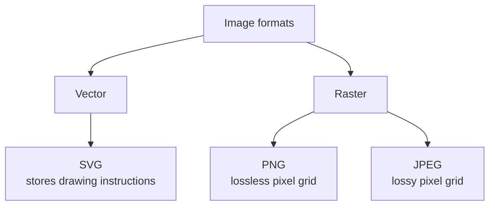

Three image formats dominate the web: SVG, PNG, and JPEG. They look interchangeable in a browser, but they're built on fundamentally different ideas. This note walks through what each one actually is, when to use which, and what metadata they carry.

## The big split: vector vs raster



- **Vector** formats store *instructions* — "draw a circle at (50, 50) with radius 40, fill blue."
- **Raster** formats store a *grid of pixels* — every cell has a color value.

The difference cascades into everything: file size, scalability, what content each is good for, and how they handle metadata.

## SVG: an XML dialect for drawing

SVG (Scalable Vector Graphics) is, at its core, **just an XML file** that follows a specific vocabulary defined by the W3C. The XML gives you the syntax (tags, attributes, nesting); the SVG specification assigns drawing meaning to specific element names like `<circle>`, `<path>`, `<rect>`, `<text>`.

```xml
<svg width="100" height="100" xmlns="http://www.w3.org/2000/svg">
  <circle cx="50" cy="50" r="40" fill="blue" />
</svg>
```

You could rename `logo.svg` to `logo.xml` and it would still be valid XML — it just wouldn't render as an image unless the consuming tool recognized it as SVG (typically via the file extension or the `xmlns="http://www.w3.org/2000/svg"` namespace declaration).

The relationship is the same as:

| General format | Specific dialect |
|---|---|
| XML/SGML | HTML, RSS, SVG |
| Plain text | Markdown |

### Why SVG is special

- ♾️ **Scalable** — zoom infinitely, no pixelation. Perfect for logos, icons, charts.
- 📝 **Text-based** — diffable in git, editable in any text editor, searchable.
- 🎨 **Styleable** — CSS and JavaScript can manipulate elements (change colors, animate, respond to clicks).
- 📦 **Small** for simple graphics; large and slow for complex scenes (millions of paths).

Common uses: icons, logos, diagrams (Mermaid renders to SVG), data visualizations (D3.js), illustrations.

## PNG vs JPEG: same medium, opposite philosophies

Both are raster formats — pixel grids — but they compress those pixels in opposite ways.

### Compression: the core difference

- **PNG** — *lossless*. Every pixel is preserved exactly. Save and re-save 100 times, no degradation.
- **JPEG** — *lossy*. Throws away visual detail the eye is less likely to notice to shrink the file. Each re-save degrades it further.

### How JPEG decides what to throw away

JPEG isn't magic — it's a tradeoff dial designed around human visual perception:

1. **Color subsampling** — humans see brightness detail much better than color detail, so JPEG stores color at half resolution. Usually invisible.
2. **Frequency discarding** — each 8×8 block is converted to frequency components (a Discrete Cosine Transform), and high frequencies are quantized away. Smooth gradients survive; fine detail gets crushed.
3. **Quality setting** — you control how aggressive the discarding is:
   - Quality 95 → loss is genuinely hard to see
   - Quality 75 (typical web default) → mostly fine, slight softness
   - Quality 30 → obvious blocky artifacts, color smearing

### How PNG compresses

PNG uses **DEFLATE** — the same algorithm as zip files. It finds repeating patterns. Flat colors and sharp edges compress beautifully; the noisy randomness of a photograph doesn't, so PNG files of photos get huge.

### Where each one shines

| | PNG | JPEG |
|---|---|---|
| Photographs | Large files | Small files, looks great |
| Screenshots, UI, text | Sharp, clean | Blurry artifacts around edges |
| Solid colors / flat areas | Compresses very well | Wastes bits, may show banding |
| Transparency | ✅ Yes (alpha channel) | ❌ No |
| Animation | ❌ No (APNG exists but rare) | ❌ No |
| Typical photo size | 5–10 MB | 500 KB – 2 MB |

### Why JPEG fails on screenshots

JPEG's compression assumes **photographic content** — smooth gradients, natural textures. The 8×8 block DCT discards high-frequency detail in each block. This is invisible on a beach photo but creates ugly "ringing" halos around the sharp edges of text or UI elements. The discarded high frequencies *are* the important signal for line art.

That's why screenshots, logos, and any image with crisp edges should be PNG.

### Generation loss

- 🔁 **PNG**: open and re-save 1000 times → identical file.
- 🔁 **JPEG**: open and re-save → degrades each time, quantization compounds.

This matters for editing workflows: edit in PNG (or another lossless master), export to JPEG only at the end.

## Rule of thumb

| Use case | Best format |
|---|---|
| Camera photo | JPEG |
| Screenshot, logo, icon, diagram, anything with text | PNG |
| Need transparency | PNG |
| Logo or illustration that must scale | SVG |
| Want the modern best-of-both | WebP or AVIF [^modern] |

## Metadata: what each format can carry

Both PNG and JPEG can embed metadata, but the ecosystems are very different.

### JPEG: rich and universal

JPEG files store metadata in dedicated marker segments, supporting several standards:

- **EXIF** — camera settings (shutter speed, ISO, lens), GPS coordinates, timestamp, camera model. This is what your phone writes automatically.
- **IPTC** — captions, keywords, copyright, photographer name. Used by news agencies and stock photo sites.
- **XMP** — Adobe's XML-based format; can store anything (edit history, ratings, custom fields).
- **ICC color profile** — describes the color space.
- **JFIF** — basic info like pixel density.

This is why a phone photo "knows" where and when it was taken.

### PNG: simpler, but capable

PNG stores metadata in **text chunks**:

- `tEXt` — plain ASCII key/value
- `zTXt` — compressed
- `iTXt` — UTF-8 / internationalized

Standard keys include `Title`, `Author`, `Description`, `Copyright`, `Software`, `Creation Time`. Modern PNGs can also embed EXIF (the `eXIf` chunk, added to the spec in 2017) and XMP — but tooling support is less universal than JPEG's.

### Privacy implication 🔒

Photos shared online often leak GPS coordinates and device info via EXIF. Most social platforms strip metadata on upload, but direct file shares (email, attachments, raw downloads) usually don't.

Tools like `exiftool` let you inspect or strip metadata:

```bash
exiftool photo.jpg              # view all metadata
exiftool -all= photo.jpg        # strip everything
```

If you're sharing photos outside a platform that strips metadata for you, assume the file carries location and device info — and decide whether to clear it first.

### Quick metadata reference

| | JPEG | PNG |
|---|---|---|
| EXIF (camera/GPS) | Native, universal | Supported, less universal |
| Text fields (title, author) | Via XMP/IPTC | Native text chunks |
| Color profile (ICC) | ✅ | ✅ |
| Tooling maturity | Excellent | Good |

## Summary

- **SVG** is an XML file describing how to *draw* something — infinitely scalable, perfect for geometry.
- **PNG** is a lossless pixel grid — perfect for screenshots, UI, logos as raster, anything needing transparency.
- **JPEG** is a lossy pixel grid optimized for *photographic* content — tiny files for camera photos, but it mangles sharp edges and degrades on re-save.
- Both PNG and JPEG can embed metadata; JPEG's EXIF ecosystem is the one to be aware of for privacy.

Pick by content type, not by habit: photo → JPEG, screenshot → PNG, logo or diagram → SVG.

[^modern]: WebP and AVIF do both jobs better than PNG/JPEG (smaller files, lossy + lossless modes, transparency, animation). PNG and JPEG remain universal because every tool on Earth supports them.
