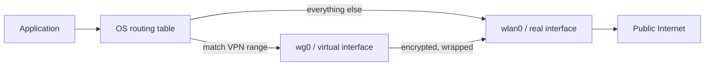
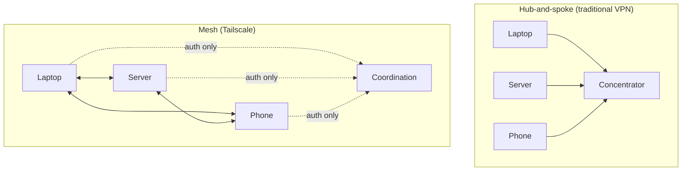
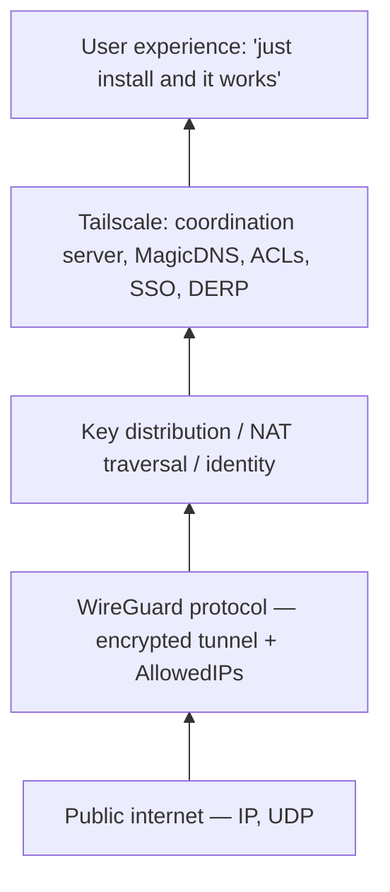

A walkthrough of three layered concepts: what a VPN actually *is* mechanically, why WireGuard is the modern primitive almost everyone builds on, and what Tailscale layers on top to make WireGuard usable at human scale.

## 1. What a VPN actually is

**VPN** = **Virtual Private Network**. The name unpacks the whole idea:

- **Virtual** — no physical cables. The network is simulated in software on top of the regular internet.
- **Private** — traffic inside is isolated, encrypted, and uses non-public addressing.
- **Network** — at the end of the day, just a network. Same IPs, same TCP/UDP, same protocols.

### The core mechanic: tunneling

Think of mailing a locked box through the public postal system. Your letter is inside; only the recipient has the key. The mail carriers see a box, not the contents.

A VPN does the same with packets:

1. Your computer wants to send a packet to a private address (say `10.0.0.5`).
2. VPN software encrypts the entire packet and wraps it in a *new* packet addressed to the VPN peer's *public* IP.
3. The wrapped packet rides the public internet like any other.
4. The peer unwraps, decrypts, and forwards the original packet onto its private network.

That wrapping is **tunneling**.

### The actual core tech: a virtual interface plus routing rules

Strip away the marketing and a VPN is two things:

1. **A virtual network interface** (`tun0`, `wg0`, `utun3`) that the OS treats like any other NIC — except instead of being attached to physical hardware, it's attached to a program that encrypts packets and ships them somewhere.
2. **Routing table entries** that tell the OS: *"For destinations matching pattern X, hand the packet to this interface."*

That's it. The OS does the heavy lifting of "which packet goes where." The VPN just **registers itself as a possible destination, and the OS does the rest**.



### Two faces of the same mechanism

The difference between "corporate VPN" and "consumer privacy VPN" is **literally one line in the routing table**.

| | Routing rule | Effect |
|---|---|---|
| **Corporate / split-tunnel** | `10.0.0.0/8 via wg0` | Only internal traffic tunneled. Netflix, Google, etc. go direct. |
| **Consumer / full-tunnel** | `0.0.0.0/0 via wg0` | *Every* packet tunneled. Netflix appears to come from the VPN exit. |

`0.0.0.0/0` is the **default route** — the catch-all for "if no more specific rule matches, send the packet here." Routing uses **longest prefix match**: more specific rules win. So even with a `0.0.0.0/0` default route, traffic to your local LAN (`192.168.0.0/24`) and to the VPN server itself stays on the real interface — otherwise the tunnel itself would break.

So yes — when you're on a consumer VPN like NordVPN, **even Netflix traffic goes through the tunnel**. That's the entire product.

### Two networks at once: your laptop's view

When connected, your OS literally sees two interfaces:

```
$ ip addr
wlan0:  192.168.0.42/24    ← real LAN (cafe Wi-Fi)
wg0:    10.99.0.1/24       ← virtual LAN (VPN tunnel)
```

A `ping 192.168.0.1` (cafe router) goes out `wlan0`. A `ping 10.99.0.2` (your home server) goes out `wg0`, gets encrypted, gets wrapped in a packet addressed to your home's public IP, and *that* outer packet leaves through `wlan0` like any other internet traffic.

### Private networks, briefly

The "private" in VPN refers to **non-routable address ranges** ([RFC 1918][rfc1918]):

- `10.0.0.0/8`
- `172.16.0.0/12`
- `192.168.0.0/16`

These IPs aren't meaningful on the public internet — routers drop them. Anyone can reuse them inside their own network without collisions, because the addresses never leave. Your home `192.168.1.5` and a coffee shop's `192.168.1.5` are completely unrelated machines.

### IP conflicts: the gotcha

Two real conflict scenarios:

**Different real LANs sharing a range** — *fine*. The cafe's `192.168.1.0/24` and your home `192.168.1.0/24` never see each other directly. NAT handles the public-internet side. This is the normal case.

**Real LAN and the VPN's virtual LAN sharing a range on the same machine** — *broken*. If both `wlan0` and `wg0` claim `192.168.1.0/24`, the OS routing table is ambiguous. `ping 192.168.1.5` could hit the cafe network, the home server, or fail entirely.

This is why VPN admins pick obscure ranges:

- `10.99.0.0/24`
- `100.64.0.0/10` (CGNAT range — Tailscale's default; almost never used by home routers)
- `10.42.0.0/16`

Site-to-site VPNs between two LANs that already share a subnet are genuinely hard — you have to renumber one side or NAT inside the tunnel.

### What a VPN does not give you

- ❌ **End-to-end privacy.** Once traffic exits the VPN endpoint, it's regular internet. The provider sees it. HTTPS still matters.
- ❌ **Anonymity.** A VPN replaces "ISP knows" with "VPN provider knows." Trust shift, not privacy fix.
- ❌ **Security on its own.** Protects in-transit. Doesn't help if the destination is compromised.

## 2. WireGuard — the modern VPN primitive

**WireGuard** is a from-scratch VPN *protocol* (and reference implementation) designed to replace older options like IPsec and OpenVPN.

### Why it exists

OpenVPN (2001) and IPsec (1995) work, but they're old, complex, and slow. IPsec's spec sprawls across dozens of RFCs; OpenVPN runs in userspace over TLS. WireGuard, started by Jason Donenfeld around 2016, has three goals: **simple, fast, secure** — in that order.

### What makes it different

- **Tiny codebase.** ~4,000 lines of C in the kernel module, vs. 100,000+ for OpenVPN/IPsec. Smaller surface, fewer bugs, easier to audit.
- **In the Linux kernel.** Merged into mainline in 5.6 (March 2020). Kernel-space crypto means high throughput and low latency.
- **Opinionated crypto.** No algorithm negotiation. Every connection uses the same fixed suite:

  | Purpose | Primitive |
  |---|---|
  | Key exchange | Curve25519 |
  | AEAD | ChaCha20-Poly1305 |
  | Hashing | BLAKE2s |
  | Key derivation | HKDF |
  | Hash table keys | SipHash24 |

  If a primitive ever breaks, you bump the protocol version rather than negotiate downgrades — which is how IPsec/TLS keep getting compromised.

- **UDP only.** No TCP-over-TCP meltdown. No TLS handshake.
- **Stateless-ish.** Peers don't really "connect." If a peer disappears and returns with a new IP, the tunnel resumes from the next valid packet.
- **Roaming.** A peer's endpoint IP can change mid-session.

### The mental model

Each side is configured with:

1. Its own **private key**.
2. A list of **peers**, each identified by a **public key** + the IP ranges they're allowed to use (`AllowedIPs` — both routing table *and* ACL).
3. Optionally an **endpoint** (IP:port) for peers you want to initiate to.

No usernames, no certs, no CAs, no PKI. Authentication = "do you have the private key matching this public key?" — like SSH key auth.

```ini
[Interface]
PrivateKey = <yours>
Address = 10.0.0.1/24
ListenPort = 51820

[Peer]
PublicKey = <theirs>
AllowedIPs = 10.0.0.2/32
Endpoint = their.host.example:51820
```

### What WireGuard deliberately does NOT give you

- ❌ **Key distribution.** You have to get public keys onto each peer somehow. Fine for two devices. Painful for 500.
- ❌ **NAT traversal.** WireGuard doesn't hole-punch. If both peers are behind NAT, you need a relay or a publicly reachable peer.
- ❌ **Dynamic IPs / DNS.** No tracking peer IP changes from a name.
- ❌ **User identity.** Keys identify *devices*, not people.

These are exactly the gaps Tailscale fills.

### Where you encounter it

- **Directly:** self-hosted on a VPS with `wg-quick up` plus configs on each device.
- **Through a wrapper:** Tailscale, Mullvad, NordLynx, ProtonVPN, Cloudflare WARP — all WireGuard under the hood.

Mental model: WireGuard is **the TCP of modern VPNs** — foundational, dumb on purpose, and almost everything new in this space is built on it.

## 3. Tailscale — WireGuard plus the missing pieces

**Tailscale** is a mesh VPN built on WireGuard. It lets devices you own — laptops, phones, servers, containers — talk to each other directly over an encrypted private network ("your tailnet"), wherever they sit on the internet.

### What problem it solves

Traditional VPNs are *hub-and-spoke*: every device dials a central concentrator, and traffic between two clients is routed through that hub. Slow, bottleneck, single point of failure.

Tailscale is *peer-to-peer*: central servers handle authentication and key exchange only. Actual data flows directly between peers.



### How it works

- **WireGuard** does encryption and tunneling.
- **Coordination server** (run by Tailscale) tracks which devices are online and distributes public keys. It never sees your traffic.
- **NAT traversal** via STUN-style hole punching to establish direct connections. When that fails, falls back to **DERP** relays (encrypted, but slower).
- **Identity** via existing SSO (Google, GitHub, Okta, etc.). No separate user database.
- **MagicDNS** gives each device a stable hostname (`laptop.tailnet-xyz.ts.net`), so you don't deal with IPs.
- **Tailnet IPs** come from `100.64.0.0/10` (CGNAT range) — chosen specifically to avoid colliding with home router ranges.

### Common uses

- ✅ SSH into your home server from anywhere without exposing port 22.
- ✅ Reach a database or internal service bound only to a private network.
- ✅ Replace a corporate VPN concentrator.
- ✅ Share one service with a teammate via Tailscale Serve / Funnel.
- ✅ Site-to-site networking via **subnet routers** (one node advertises a whole LAN).

### Access control

Defined in an **ACL file** (HuJSON) — which users/groups/tags can reach which devices and ports. This is the zero-trust piece: even on the same tailnet, devices can't talk unless ACLs allow it.

### Pricing and self-hosting

Free for personal use (up to 100 devices, 3 users). Paid tiers for teams. The **client is open-source**; the **coordination server is proprietary**, though [Headscale][headscale] is a popular open-source reimplementation if you want to self-host the control plane.

## How the layers stack up



| Layer | What it provides | What it leaves out |
|---|---|---|
| Public internet | IP, UDP, TCP, NAT | Privacy, identity, trust |
| **WireGuard** | Encrypted tunnels, peer-to-peer crypto | Key distribution, NAT traversal, identity |
| **Tailscale** | Coordination, identity, ACLs, MagicDNS, NAT traversal, relay fallback | (the rest is product polish) |

## TL;DR

- A **VPN** is a virtual network interface + a routing rule. The OS does most of the work.
- The split between "corporate VPN" and "privacy VPN" is one line: `10.0.0.0/8 via wg0` (specific) vs. `0.0.0.0/0 via wg0` (default route, all traffic). On a consumer VPN, even Netflix goes through the tunnel.
- IP conflicts happen when the VPN's range overlaps the real LAN's range *on the same machine* — pick obscure ranges, or use Tailscale's `100.64.0.0/10`.
- **WireGuard** is the modern tunnel primitive: tiny, fast, opinionated crypto, in the Linux kernel. It deliberately omits identity, key distribution, and NAT traversal.
- **Tailscale** wraps WireGuard with a coordination server, SSO identity, ACLs, MagicDNS, and NAT traversal — so you get a working mesh VPN with `tailscale up` and an SSO login.

[rfc1918]: https://datatracker.ietf.org/doc/html/rfc1918
[headscale]: https://github.com/juanfont/headscale
