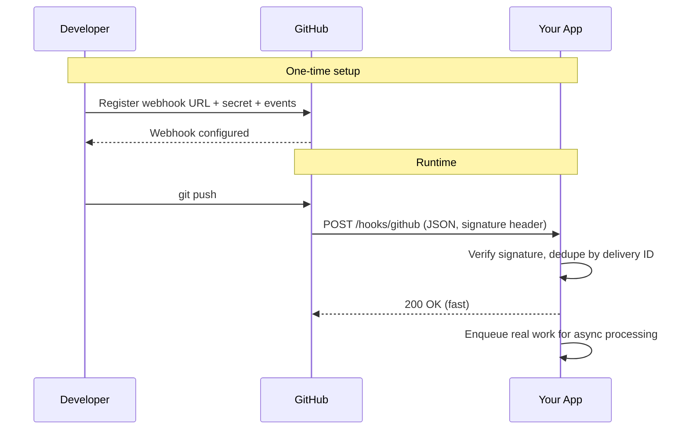

## What a webhook is

A **webhook** is an HTTP callback. One server tells another: *"when X happens, POST to this URL."* Instead of the receiver polling — *"anything new yet? anything new yet?"* — the sender pushes the event the moment it occurs.

Mental model: webhooks are **reverse APIs**. The third-party service is the client; *you* are the server.

### The shape of it

1. You register a URL with a service (GitHub, Stripe, Slack, …).
2. When an event fires (push, payment, message), the service sends an HTTP `POST` to your URL with a JSON payload describing the event.
3. Your endpoint responds `2xx` to acknowledge. Non-2xx usually triggers retries.

```http
POST https://your-app.com/hooks/github
Content-Type: application/json
X-GitHub-Event: push
X-GitHub-Delivery: 7f9c2e4a-...
X-Hub-Signature-256: sha256=...

{ "ref": "refs/heads/main", "commits": [...], "pusher": {...} }
```

## Polling vs webhook

| Approach | Latency | Idle traffic | Who initiates |
|---|---|---|---|
| Polling | = poll interval | High (most polls return nothing) | Receiver, on a timer |
| Webhook | Near-zero | Zero | Sender, on the event |



## Configuring one — the GitHub example

In a repo's *Settings → Webhooks → Add webhook*, you provide:

- **Payload URL** — your endpoint, e.g. `https://your-app.com/hooks/github`
- **Content type** — usually `application/json`
- **Secret** — a shared string used to sign payloads (so you can verify it's really GitHub)
- **Events** — *Just the push event*, or pick from the full list (PRs, issues, releases, …)

### What happens at runtime

1. Someone runs `git push`.
2. GitHub fires an HTTP `POST` to your URL with a JSON body describing the push (`ref`, `commits`, `pusher`, `repo`, `before`/`after` SHAs).
3. Headers tell you what arrived and prove it's from GitHub:
   - `X-GitHub-Event: push` — which event type
   - `X-GitHub-Delivery: <uuid>` — unique per delivery; use for dedupe
   - `X-Hub-Signature-256: sha256=<hmac of body using your secret>` — verify this
4. Your server responds `200`. If you don't, GitHub retries and shows the failure in *Settings → Webhooks → Recent Deliveries* — which also lets you **redeliver**, great for debugging.

### Two subtleties worth flagging

- The webhook is configured **per repo** (or per org / per GitHub App), **not per branch**. Filter by branch yourself by checking `ref == "refs/heads/main"` in the payload.
- A single URL can subscribe to many event types. `X-GitHub-Event` tells you which one arrived.

## Things that bite people

- **Verification** — anyone can `POST` to your URL. Real providers sign the payload (HMAC in a header like `X-Hub-Signature-256`); you must verify it before trusting the body.
- **Retries & idempotency** — providers retry on failure, so the same event can arrive twice. Dedupe on a delivery ID.
- **Public reachability** — your endpoint must be on the internet. For local dev, use a tunnel like `ngrok` or `cloudflared`.
- **Fast ack, async work** — return `200` quickly, then process in a queue. Otherwise the provider times out and retries, and you get duplicate processing.

## Which common services offer webhooks?

Short answer: **most developer-facing platforms do, most pure consumer apps don't.** A webhook is a feature of a *public API* — if a service doesn't expose an API for third-party developers, there's nothing to register a webhook on.

### Has webhooks (well documented)

| Service | Notes |
|---|---|
| **GitHub** | Repo / org / App webhooks. The canonical example. |
| **Slack** | Two flavors — *Events API* (Slack → you) and *Incoming Webhooks* (you → Slack channel). |
| **Notion** | Public webhooks shipped in 2024 — page / db change events. |
| **WhatsApp** | WhatsApp Business Cloud API is **webhook-driven** — incoming messages arrive as POSTs. |
| **TikTok** | TikTok for Developers + TikTok Shop both have event webhooks. |
| **Snapchat** | Snap's *Conversions API* and Ads API have webhook-style callbacks; not a general user-event firehose. |
| **Steam** | Steamworks has callbacks for microtransactions / inventory / Steam Deck verification — narrower than GitHub-style webhooks; most data is polled via the Web API. |

### "Webhook-ish" but not plain HTTP webhooks

- **Gmail** — uses Google Cloud **Pub/Sub** push notifications instead of direct webhooks. Functionally similar (Google POSTs to a URL), but you go through Pub/Sub as the broker.
- **Google Calendar / Drive** — same pattern: a "watch" channel that pushes change notifications to a URL.

### Probably not (no real public API)

- **Temu** — no public developer API for general events. Limited affiliate/partner integrations, but no GitHub-style webhooks.
- Other consumer apps in the same bucket: Instagram (consumer side), TikTok personal account (vs. business/dev), most dating apps, marketplaces like Shein.

### Heuristic to predict it yourself

- [x] Does the service have a **developer portal / public API**? → probably yes.
- [x] Is it B2B or developer-tool shaped (GitHub, Stripe, Slack, Twilio, Shopify, Notion)? → almost certainly yes, and well-documented.
- [ ] Is it a closed consumer app (Temu, Snapchat consumer, BeReal)? → usually no, or only for ad/conversion tracking.
- [ ] Google product? → usually push via **Pub/Sub**, not direct webhooks.

Rule of thumb: if you can find a page titled `developers.<service>.com` or `<service>.com/developers`, search it for *"webhook"* — that tells you in 10 seconds.

## TL;DR

- Webhook = *"call this URL when X happens"* — registered once, delivered as HTTP `POST` with JSON.
- Always **verify the signature**, **dedupe on delivery ID**, **ack fast**, and **process async**.
- Configured per resource (repo / app / account), not per fine-grained filter — do filtering in your handler.
- Developer platforms expose them; closed consumer apps generally don't. Google products tend to push via Pub/Sub instead.
