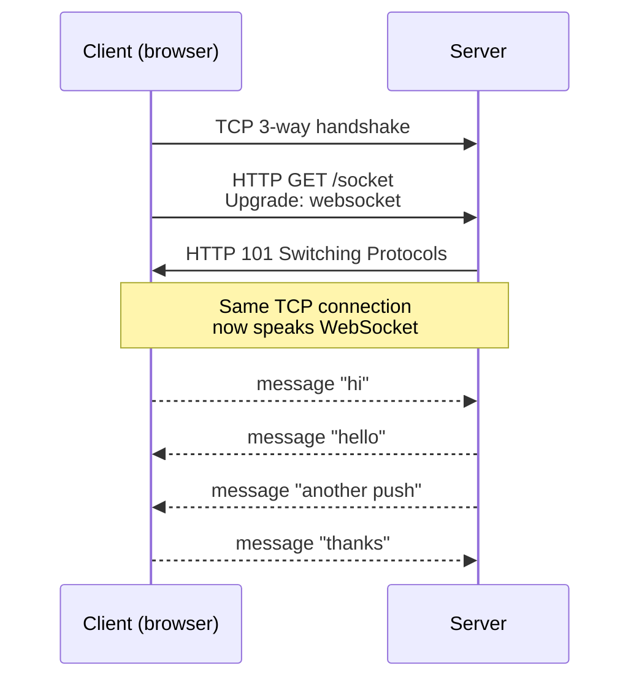

## What WebSocket is

WebSocket is a network protocol that provides a **persistent, two-way (full-duplex) communication channel** between a client (usually a browser) and a server over a single TCP connection.

Once the connection is open, either side can send a message at any time — no polling, no new request/response round trip per message.

## How it differs from HTTP

| | HTTP | WebSocket |
|---|---|---|
| Connection lifetime | One request/response, then effectively done | Stays open until either side closes |
| Direction | Client asks, server answers | Either side can send any time |
| Unit of data | Request + response (with headers each time) | Discrete messages (text or binary) |
| Typical URL scheme | `http://` / `https://` | `ws://` / `wss://` |
| Typical use | Loading pages, REST APIs | Live updates, chat, games, dashboards |

## How a connection starts — the upgrade handshake

WebSocket doesn't get its own port. It piggybacks on HTTP to get through the existing web stack (ports 80/443, proxies, TLS), then upgrades the same TCP connection to a different protocol.

1. Client sends an HTTP request with these headers:
   - `Upgrade: websocket`
   - `Connection: Upgrade`
2. Server responds with `101 Switching Protocols`.
3. From that point on, the same TCP connection speaks the WebSocket framing protocol instead of HTTP.



## How it relates to TCP

A common point of confusion: *WebSocket is bidirectional* — but so is TCP. The two-way property doesn't come from WebSocket; it comes from TCP underneath.

**Plain TCP is already full-duplex.** Once the 3-way handshake establishes a connection, both sides can send bytes at any time, independently.

So what does WebSocket actually add on top of TCP?

1. **A way to start the connection from a browser.** Browsers deliberately don't expose raw TCP to JavaScript. WebSocket starts as an HTTP request, so it works through proxies, firewalls, and TLS the same way the rest of the web does.
2. **Message framing.** TCP gives you a stream of bytes with no boundaries. WebSocket adds discrete *messages* (text or binary), plus control frames for ping/pong and close.
3. **A standard browser API** (`new WebSocket(...)`) that JavaScript can use directly.

```
[Browser JS]   ⇅   WebSocket  (messages, framing, browser API)
                   ── built on ──
               ⇅   TCP        (byte stream, full-duplex)
               ⇅   IP
```

## When you need WebSocket

The clean rule of thumb:

- 🌐 **Browser ↔ server, need two-way push** → WebSocket. The browser can't open raw TCP, and you need the server to push without the client asking.
- 📡 **Browser ↔ server, server-to-client only is enough** → Server-Sent Events (SSE) is simpler. It's plain HTTP, one-way (server → client), with auto-reconnect built in.
- 🖥️ **Server ↔ server, or native app ↔ server** → Raw TCP works, but you'll almost always pick a higher-level protocol on top of it (gRPC/HTTP2, MQTT, AMQP, the Redis or Postgres wire protocols, or even WebSocket itself when you want it to traverse HTTP-only firewalls).

The "raw TCP is enough" cases are real but narrower than they sound. The moment you need messages, auth, reconnection, multiplexing, etc., you end up reinventing what protocols like WebSocket or gRPC already give you.

### Browser alternatives at a glance

| Option | Direction | Transport | Notes |
|---|---|---|---|
| **WebSocket** | Two-way | Upgraded TCP | The default for two-way push |
| **Server-Sent Events** | Server → client only | Plain HTTP | Simpler when one-way is enough; auto-reconnects |
| **Long polling** | Two-way (faked) | Repeated HTTP | Older fallback; less efficient |
| **WebTransport** | Two-way, multi-stream | HTTP/3 (QUIC) | Newer; not universally supported yet |

## A minimal Python hello world

Two tiny scripts using the [`websockets`](https://websockets.readthedocs.io/) library — one server, one client. The shape shows the symmetry: `send` and `recv` look the same on both sides.

**Install:**

```bash
pip install websockets
```

**`ws_server.py`**

```python
"""Minimal WebSocket server: greets each client, then prints their reply."""
import asyncio
import websockets


async def handler(ws):
    await ws.send("Hello, World!")        # server -> client
    reply = await ws.recv()               # client -> server
    print(f"client said: {reply}")


async def main():
    # serve() returns an async context manager that runs the server
    async with websockets.serve(handler, "localhost", 8765):
        print("listening on ws://localhost:8765")
        await asyncio.Future()            # park forever; Ctrl-C to stop


asyncio.run(main())
```

**`ws_client.py`**

```python
"""Minimal WebSocket client: connects, reads greeting, sends a reply."""
import asyncio
import websockets


async def main():
    async with websockets.connect("ws://localhost:8765") as ws:
        greeting = await ws.recv()        # server -> client
        print(f"server said: {greeting}")
        await ws.send("hi from client")   # client -> server


asyncio.run(main())
```

**Run it:**

```bash
# terminal 1
python ws_server.py

# terminal 2
python ws_client.py
```

You should see:

- Server prints `listening on ws://localhost:8765`, then `client said: hi from client`
- Client prints `server said: Hello, World!`

The handler runs once per connection. `await asyncio.Future()` is the standard idiom for "block forever and let the server do its thing."

## A tiny browser-side equivalent

If you replace the Python client with a browser tab, the API looks like this:

```js
const ws = new WebSocket("wss://example.com/socket");
ws.onopen    = () => ws.send("hello");
ws.onmessage = (e) => console.log("got:", e.data);
ws.onclose   = () => console.log("closed");
```

This is the case where WebSocket really earns its keep over raw TCP: the browser literally can't open a raw TCP socket, but it can open this.

## Takeaways ✅

- WebSocket = HTTP-friendly handshake + message framing on top of TCP.
- TCP already gives you full-duplex; WebSocket gives you a way for *browsers* to use it, plus message boundaries.
- Reach for WebSocket when a browser needs two-way push. Reach for SSE if one-way is enough. Between servers, raw TCP works but a higher-level protocol almost always wins.
