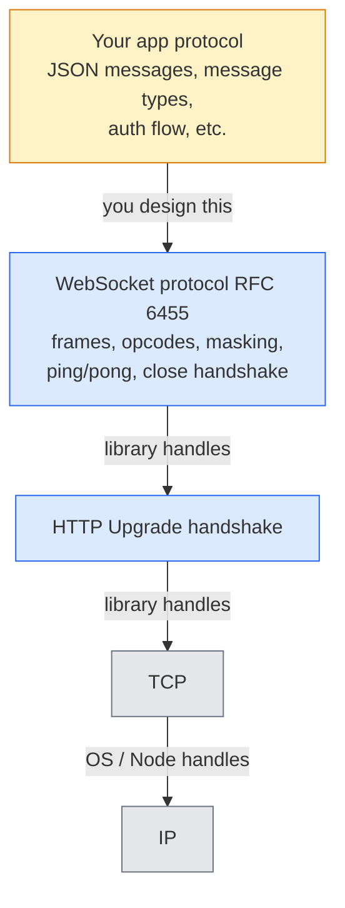

WebSocket gets explained as "real-time bidirectional communication" and that's accurate but unhelpful. The interesting questions are: **what is it actually doing under the hood, what does that mean you have to design yourself, and when do you need to care?** This note works through that mental model from first principles.

## What WebSocket Is For

WebSocket is a protocol for **persistent, bidirectional, low-latency** communication over a single TCP connection. Unlike HTTP's request/response shape, either side can send a message at any time once the connection is established.

### Where it fits

- 💬 **Live chat / messaging** — Slack, Discord, WhatsApp Web
- ✏️ **Real-time collaboration** — Google Docs, Figma, Notion (cursors, live edits)
- 📈 **Live feeds** — stock tickers, sports scores, crypto prices
- 🎮 **Multiplayer games** — player positions, game state sync
- 🔔 **Notifications and presence** — "user is typing…", online/offline status
- 📊 **Live dashboards** — server metrics, IoT sensors, log streams
- 💱 **Trading platforms** — order book updates
- 🤖 **Streaming AI responses** — though Server-Sent Events (SSE) is also common here

### Why not just HTTP polling

| Aspect | Polling | WebSocket |
|---|---|---|
| Latency | high — wait for next poll | low — push immediately |
| Server push | ❌ | ✅ |
| Bandwidth per update | full HTTP headers | small frame headers |
| Direction | client asks | both sides equal peers |

### When NOT to reach for it

- **One-way server → client streaming** → SSE is simpler.
- **Occasional updates** (once a minute) → polling is fine and cacheable.
- **Request/response RPC** → plain HTTP is simpler to scale and debug.
- **Hostile proxies/firewalls** that strip long-lived connections.

## The Layered Stack

When people first see WebSocket, a natural question is: *"Is writing WebSocket code like designing a network protocol on top of TCP?"* The answer is yes — but only at the very top layer.



A WebSocket library (`ws`, `Socket.IO`, browser built-in) hides almost everything below the top layer.

### What the library hides from you

When you write `socket.send('hello')`, the library does all of this:

- Wraps your bytes in a **WebSocket frame** (opcode + payload length + mask + payload)
- Hands it to a **TCP socket**, which splits it into TCP segments, retransmits lost ones, etc.
- On the other side, reassembles TCP bytes, parses frames, hands you a clean message

You never see frames, byte offsets, or packet boundaries — just whole messages in and out. **That's the big win over raw TCP.**

### What you still design

Even though WebSocket gives you reliable message delivery, **what those messages mean is on you**. Real apps invent a small protocol on top:

```json
{ "type": "chat", "room": "general", "text": "hi" }
{ "type": "join", "room": "general" }
{ "type": "error", "code": "rate_limited" }
```

You decide:

- 📦 **Format** — JSON? MessagePack? Protobuf?
- 🏷️ **Message types** — `chat`, `presence`, `ping`, `error`…
- 🔐 **Auth** — token in the URL? first message? cookie?
- 🔁 **Reconnect / resume** — sequence numbers? "since" cursor?
- 🌊 **Backpressure** — what if the server sends faster than the client reads?

So writing WebSocket code feels less like "writing a TCP protocol" and more like **designing a message contract over a reliable message pipe**.

## What WebSocket Guarantees (and What It Doesn't)

A common over-simplification is "WebSocket means messages always arrive intact." Let's tighten that.

### ✅ Guaranteed at the API level

- **Whole messages** — `socket.send('hello world')` arrives as one `'hello world'`. No framing work.
- **Order is preserved** while the connection is up — message 1 arrives before message 2 (inherited from TCP).
- **Text/binary distinction is built in** — the library tells you which kind of frame arrived.

### ❌ NOT guaranteed

- **Delivery if the connection drops** — messages in flight when TCP breaks can be lost silently. WebSocket has **no built-in resume or replay**.
- **Request/response correlation** — if you send `getUser` then `getOrders`, replies come back untagged. You add correlation IDs yourself if you need them.

### Text vs. binary

WebSocket supports **both** and tells you which was sent:

```ts
socket.send('hello');              // text frame (UTF-8 string)
socket.send(Buffer.from([1,2,3])); // binary frame (raw bytes)
```

In the `ws` Node library, the `message` event gives you a `Buffer` and an `isBinary` flag. In the browser, `MessageEvent.data` is a `string` or a `Blob`/`ArrayBuffer`.

So a more accurate one-liner:

> **You exchange whole, typed messages (text or binary) instead of a raw byte stream.**

### Raw TCP vs. WebSocket at a glance

| Concern | Raw TCP | WebSocket |
|---|---|---|
| Unit you send | bytes (stream) | discrete messages |
| You handle framing? | yes — pick a delimiter or length prefix | no, library does it |
| You handle handshake? | no (just connect) | no (library does HTTP Upgrade) |
| Browser-friendly? | ❌ | ✅ built into every browser |
| Text vs. binary distinction? | no, just bytes | yes, built in |

## "Designing a Protocol" Sounds Hard — Is It?

Designing a *real* network protocol (TCP, HTTP, QUIC) is genuinely hard. **That's not what most WebSocket users do.** In practice, people pick from a small menu of easy patterns.

### Reality 1: the "protocol" is usually trivially simple

For 90% of apps the entire protocol is:

```json
{ "type": "chat", "text": "hi" }
{ "type": "join", "room": "general" }
{ "type": "error", "code": "unauthorized" }
```

A JSON object with a `type` field and a payload. New types get added as the app grows. There's no spec, no RFC — just naming events.

### Reality 2: most people use a higher-level library

Real-world WebSocket apps usually reach for a framework that already solved the protocol design:

| Library / framework | What it gives you |
|---|---|
| **Socket.IO** | Named events, rooms, auto-reconnect, fallbacks |
| **tRPC subscriptions** | Type-safe RPC over WebSocket |
| **GraphQL subscriptions** | Live queries via WebSocket |
| **Phoenix Channels** (Elixir) | Topic-based pub/sub |
| **SignalR** (.NET) | Method-call style, groups, reconnect |
| **Pusher / Ably / Supabase Realtime** | Hosted, you just publish/subscribe |

With Socket.IO you write:

```js
socket.emit('chat', { text: 'hi' });
socket.on('chat', (msg) => console.log(msg));
```

— and you've designed nothing. The library decided message format, ack, reconnect, room semantics.

## The Three Practical Complexity Tiers

A useful way to think about WebSocket complexity in real projects:

| Tier | When | What you build | Rough cost |
|---|---|---|---|
| **1. Vibes** | Hobby, MVP, internal tool | `ws` + `{ type, ...payload }` JSON. Reload-on-disconnect. | Hours |
| **2. Framework** | Real product, small team | Socket.IO / Phoenix / SignalR. Auth, rooms, auto-reconnect handed to you. | Days |
| **3. Custom realtime stack** | Collaborative editor, multiplayer game, trading platform | Custom message format, sync algorithm, state reconciliation, often binary. | Months/years, dedicated team |

### Disconnects: a common trap

A natural intuition is that "disconnects are rare, so I can ignore them at tier 1." Disconnects are actually **common**:

- 📱 Phone goes WiFi → cellular
- 💻 Laptop sleeps and wakes
- ☕ Coffee shop WiFi flakes
- 🚀 Server deploy / restart
- ⏱️ Idle proxy times out the connection after 60s

The trick at tier 1 isn't fighting it — it's **accepting it**. Browser detects disconnect → client opens a new connection → user re-fetches state. "Refresh fixes it" is a legitimate strategy for hobby and MVP work.

### Tier 3 is more "domain expertise" than "network expertise"

A common misconception is that big realtime products hire **network engineers**. They don't, really — TCP and WebSocket are solved problems. What they invest in is harder and weirder:

- 🧮 **Sync algorithms**: CRDTs (Figma, Linear), Operational Transform (Google Docs)
- 📉 **State diffing**: send deltas, not snapshots
- ⚖️ **Conflict resolution**: two users edit the same cell — who wins?
- 📴 **Offline → online reconciliation**: replay queued changes when reconnected
- 🗜️ **Binary encoding** for bandwidth (Protobuf, FlatBuffers)

These are hard *application semantics* problems, not protocol-stack problems. A "realtime team" at Figma is more distributed-systems + product engineers than network engineers.

### The 80/20

- 🎯 **Tier 1** covers most personal projects.
- 🎯 **Tier 2** covers most startups and indie products.
- 🎯 **Tier 3** is rare and only when realtime *is* the product (Figma, Discord, trading apps).

**Most engineers never touch tier 3.** A useful rule: don't design a protocol until your app forces you to. Start with `{ type, ...payload }`, add fields as needed, swap to a framework when you outgrow it.

## A Minimal Hello World

For grounding, here's the smallest possible WebSocket exchange in Node with the `ws` library — server greets each client, client sends one message and disconnects.

**Server:**

```ts
import { WebSocketServer } from 'ws';

const PORT = 8080;
const wss = new WebSocketServer({ port: PORT });

wss.on('connection', (socket) => {
  console.log('client connected');
  socket.send('Hello, World!');

  socket.on('message', (data) => {
    console.log('received:', data.toString());
  });
});

console.log(`WebSocket server listening on ws://localhost:${PORT}`);
```

**Client:**

```ts
import WebSocket from 'ws';

const socket = new WebSocket('ws://localhost:8080');

socket.on('open', () => {
  console.log('connected');
  socket.send('hi from client');
});

socket.on('message', (data) => {
  console.log('received:', data.toString());
  socket.close();
});
```

Run them in two terminals — that's it. Notice how this code already sits at **tier 1**: there's no protocol design, no auth, no reconnect logic. For a learning exercise, that's exactly right.

## Key Takeaways

- ✅ WebSocket is **not** raw TCP. The library handles framing, handshake, ordering, and text/binary distinction. You operate on whole messages.
- ✅ You **do** design a small application protocol on top — but for most apps, that's just `{ type, ...payload }` in JSON.
- ✅ Connection drops are **common**, not rare. At tier 1, "browser reconnects + client refetches state" is a fine strategy.
- ✅ At tier 2, libraries like Socket.IO eliminate even the small protocol-design work.
- ✅ Tier 3 (custom realtime stacks) is mostly about **sync algorithms and state reconciliation**, not network protocol design.
- 🎯 Don't over-engineer early. Climb the tiers only when the app forces you to.
