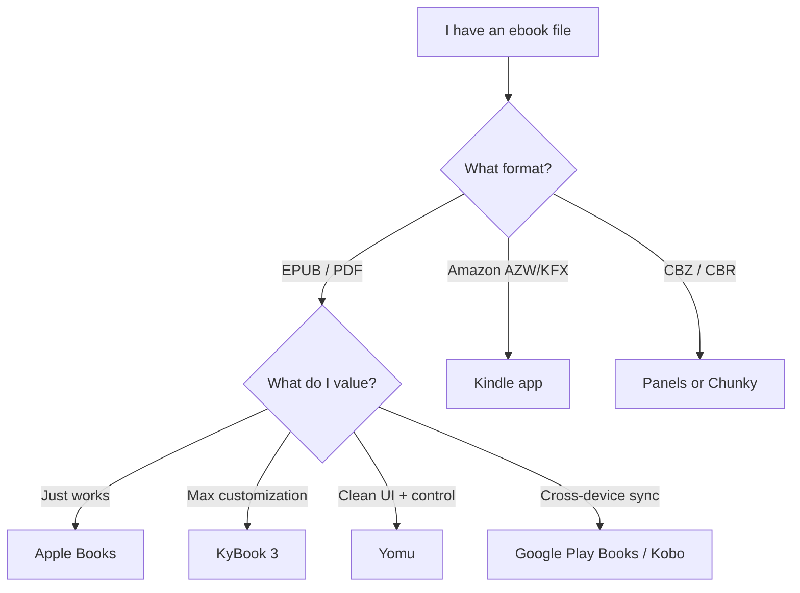

If you want to read ebooks on iOS, two questions come up almost immediately: *what format is the file in*, and *which app should I open it with*. The answers depend on where the file came from and how much you care about tweaking the reading experience.

## Common ebook formats

| Format | Extension | Notes |
|---|---|---|
| **EPUB** | `.epub` | Open standard, reflowable text. The de facto default — supported by almost every reader except Kindle. |
| **MOBI / AZW / AZW3 / KFX** | `.mobi`, `.azw`, `.azw3`, `.kfx` | Amazon's Kindle formats. MOBI is being phased out in favor of AZW3 and KFX. |
| **PDF** | `.pdf` | Fixed layout. Great for textbooks and comics, poor for reflowing on small screens. |
| **CBZ / CBR** | `.cbz`, `.cbr` | Zipped/RAR'd image archives. Used for comics and manga. |
| **TXT / HTML** | `.txt`, `.html` | Plain formats, occasionally used for simple books. |

For most use cases, **EPUB** is the answer. It's also the format you'd convert *to* or *from* with a tool like Calibre.

## Picking an iOS reader

### The shortlist

- **Apple Books** — preinstalled, beautiful typography out of the box, but only a handful of fonts/themes/spacing presets. Pick this if you want *looks great with zero tweaking*.
- **Kindle** — required for Amazon-purchased books and "Send to Kindle" workflow.
- **Kobo** / **Google Play Books** — store-tied apps that also open EPUB; useful if you want sync across devices.
- **KyBook 3** — the power-user pick. Install your own fonts, tweak line spacing, margins, paragraph indent, justification, hyphenation, page-turn animations, themes — even inject custom CSS. Handles many formats beyond EPUB.
- **Yomu** — cleaner UI than KyBook with strong customization (fonts, spacing, margins, themes). A bit less power, much less clutter.
- **Marvin** — was legendary for typography control, but development stalled and it's no longer in the App Store. Skip unless you already own it.
- **Panels** / **Chunky Comic Reader** — for CBZ/CBR comics.

## Recommendation by use case

- **"I just want to open this EPUB and read it."** → Apple Books. Open from Files app, tap Share → Books.
- **"I bought it on Amazon."** → Kindle.
- **"I have a local EPUB collection and want maximum visual control."** → KyBook 3. Fall back to Yomu if its UI feels cluttered.
- **"I read across iPhone, iPad, and laptop and want sync."** → Google Play Books or Kobo.
- **"It's a comic."** → Panels or Chunky.

The decision really collapses to two axes: *how much customization do you want*, and *do you need cross-device sync*. For a local-only EPUB library where visual fidelity matters, KyBook 3 wins on iOS today.
