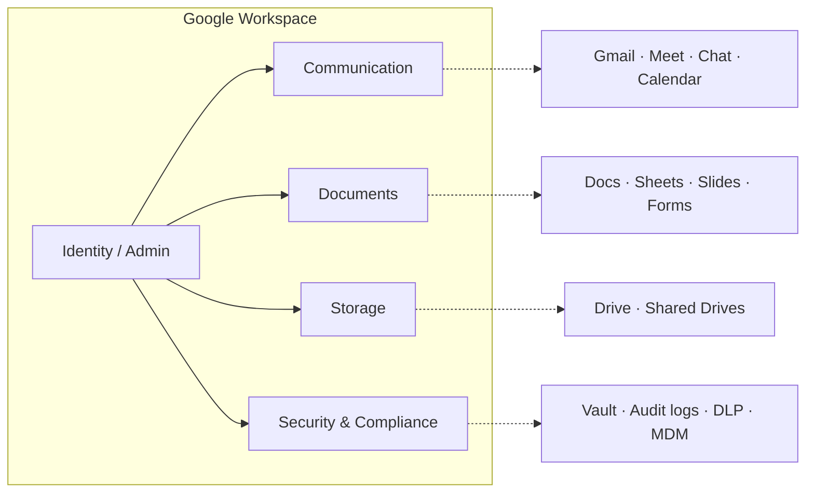

The shortest accurate description of Google Workspace is: **a turnkey IT system for an organization, delivered as SaaS**. It's tempting to read it as "Gmail plus Docs," but that undersells what's happening — when an organization adopts Workspace, it's replacing the work of an entire traditional IT department, not just buying an office suite.

## What it is

Google Workspace is Google's bundle of cloud productivity and collaboration tools for businesses, schools, and individuals. It used to be called **G Suite** (renamed in 2020).

### What's in the bundle

| Category | Apps |
|---|---|
| **Email** | Gmail (with custom domain) |
| **Docs & files** | Docs, Sheets, Slides, Forms, Drive |
| **Communication** | Meet (video), Chat, Calendar |
| **Admin** | Admin console, user management, security policies |
| **Other** | Sites, Keep, Tasks, AppSheet (no-code), Gemini AI |

## Workspace vs. a free Google account

A regular `@gmail.com` account already gives you most of these apps for free. Workspace adds:

- **Custom domain email** — addresses on your own domain instead of `@gmail.com`
- **More storage** — pooled across the org (30 GB → 5 TB+ per user, by tier)
- **Admin controls** — central user management, SSO, 2FA enforcement, device management
- **Security & compliance** — audit logs, DLP, retention policies, eDiscovery (Vault)
- **Business SLAs** — 99.9% uptime guarantee, 24/7 support
- **Shared drives** — files owned by the org, not individuals (so departing employees don't take data)
- **No ads** in Gmail

## The IT-system framing

This is the angle that makes Workspace click. Map traditional on-prem IT to Workspace and the equivalence is striking:

| Traditional on-prem IT | Google Workspace equivalent |
|---|---|
| Microsoft Exchange / mail server | Gmail with custom domain |
| File server / NAS | Drive + Shared Drives |
| Active Directory (user accounts) | Workspace Admin / Cloud Identity |
| VPN + file shares | Browser access, anywhere |
| On-prem Office install | Docs / Sheets / Slides in browser |
| Conference room hardware + Zoom | Google Meet |
| Backup tapes | Google Vault (retention + eDiscovery) |
| MDM tool for laptops/phones | Endpoint management built-in |
| Helpdesk for password resets | Self-service + admin console |

Subscribing to Workspace replaces the rack of servers, the mail admin, and most of the helpdesk in one stroke. The IT role shifts from "running servers" to "managing the admin console and endpoints."

### What an "IT admin" actually does in Workspace

- Create / disable user accounts when people join or leave
- Enforce 2FA, password rules, login restrictions
- Manage groups and email aliases (`sales@`, `support@`)
- Set sharing policies (can people share files outside the org?)
- Enroll laptops and phones, push security policies, remote-wipe lost devices
- Configure SSO so other apps (Slack, Salesforce, etc.) log in via Google
- Review audit logs, investigate incidents
- Assign / reclaim licenses

## Why organizations pick it

- ✅ **No servers to run** — Google handles uptime, patching, scaling
- ✅ **Identity in one place** — one Google account = email, files, calendar, login to other SaaS via SSO
- ✅ **Org-owned data** — when someone leaves, admin reclaims their files and email
- ✅ **Works anywhere** — just a browser, no VPN
- ✅ **Predictable cost** — flat per-user-per-month

## The honest limits

- 🔒 Lock-in — export is possible but painful once everything lives in Google's ecosystem
- 📊 Less powerful than Microsoft 365 for heavy Excel / Word power users
- 🏢 Deep on-prem integration (legacy AD, file shares) is harder
- 🌐 Outages cascade — when Google is down, *everything* is down at once

## Plans (rough)

| Tier | Price/user/month | For |
|---|---|---|
| Business Starter | ~$6 | Small teams, 30 GB storage |
| Business Standard | ~$12 | Most SMBs, 2 TB, recording in Meet |
| Business Plus | ~$18 | + Vault, advanced endpoint mgmt, 5 TB |
| Enterprise | custom | Large orgs, advanced security/compliance |

There's also **Workspace Individual** (~$10/mo) for solo professionals who want premium features without setting up a domain, and **Workspace for Education** which has a free tier for schools.

## Where it sits in the market

Workspace is the direct competitor to **Microsoft 365** — same idea (email + office suite + cloud storage + admin), different ecosystem. Most organizations end up choosing based on:

- Existing tooling (already on Outlook? Already on Gmail?)
- Document format gravity (Excel power users tend to prefer Microsoft)
- Real-time collaboration needs (Workspace was built for this from day one)
- Identity provider preferences (Azure AD vs. Google Cloud Identity)

## TL;DR

Google Workspace is not really "an office suite with email." It's the **outsourced operations of a traditional IT department**, packaged as a per-user subscription. The decision to adopt it is closer to "do we want to run servers" than "do we want Gmail." Once you see it that way, the pricing, the lock-in trade-off, and the admin console design all start to make sense.
