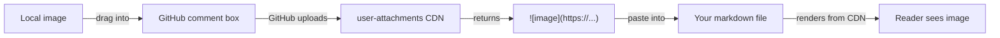

Markdown's image syntax doesn't care whether the source is a local file or a remote URL — `` works either way. That gives you several options when you want to include images without committing the binaries to your repo.

## The four options

| Option | Pros | Cons |
| --- | --- | --- |
| **External URL** | Simplest. Use any image already on the web. | You don't control the host — link rot. |
| **GitHub-hosted upload** | Free, permanent, works with any repo. | Unofficial, public, opaque filenames. |
| **Local + `.gitignore`** | Renders locally; full control of files. | Breaks for everyone else and on GitHub. |
| **Git LFS** | Still in the repo, separate storage. | Doesn't actually solve "not in repo." |

For a personal blog or README, option 2 — the **GitHub-hosted URL trick** — hits the sweet spot. The rest of this post walks through it in detail.

## The GitHub-hosted URL trick

GitHub silently runs a CDN for user-uploaded images. Any time you drag an image into a comment box on GitHub (issues, PRs, discussions, profile READMEs), GitHub uploads it to that CDN and gives you back a permanent URL. You can use that URL anywhere — including markdown files in totally unrelated repos, or even outside GitHub entirely.

### Flow



### Step by step

1. Go to **any** issue or PR on GitHub — your own repo, someone else's, or a draft you never submit. A common pattern is to open a new issue in your own repo and use it as a scratch upload space.
2. Click in the comment textarea.
3. **Drag and drop** the image file into the textarea. Pasting from clipboard works too, as does the *"Attach files"* link at the bottom of the box.
4. GitHub uploads the file and replaces your cursor with markdown like:

   ```markdown
   
   ```

5. **Copy that URL.** Do **not** submit the comment — close the tab if you want. The image stays hosted forever.
6. Paste the URL into your actual markdown file:

   ```markdown
   
   ```

### What the URL looks like

Modern uploads use `github.com/user-attachments/assets/<uuid>`. Older uploads used `user-images.githubusercontent.com/...`. Both still resolve.

## Caveats

- ⚠️ **Unofficial.** GitHub doesn't document this as a feature. They could change it. In practice, URLs from many years ago still work.
- 🔓 **Not private.** Anyone with the URL can view the image, even if you uploaded it via a private repo's issue. Don't use it for anything sensitive.
- 🏷️ **No folder structure or renaming.** You get an opaque UUID URL. If you want organized asset names, this is the wrong tool.
- 🔗 **Hotlink trust.** Since you don't control the host, if GitHub ever purges these you'd have broken images. Fine for a personal blog; risky for archives you really care about — host on your own S3 / Cloudflare R2 / etc. for those.

## When each option is the right tool

- ✅ **Occasional screenshots in a personal blog** → GitHub-hosted URL trick.
- ✅ **README badges and one-off diagrams** → GitHub-hosted URL trick or external CDN.
- ✅ **Hundreds of images managed as files** → keep them in the repo (or a sibling `assets` repo).
- ✅ **Long-term archive you care about** → your own object storage (S3, R2).
- ✅ **Already-public image elsewhere on the web** → just link it directly.

## Summary

Markdown images don't have to live next to your `.md` files. For ad-hoc images in a personal project, dragging into a GitHub comment box is the path of least resistance: zero setup, permanent URL, and your repo stays lean. Just don't rely on it for anything you can't afford to lose.
