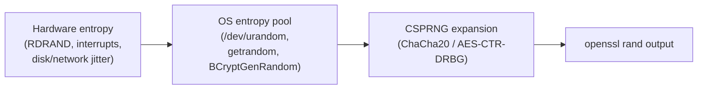

`openssl rand` is the quickest way to get random bytes from the command line. But "random" hides a lot of nuance — is it *really* random? Is it safe for passwords? Bitcoin keys? What does `-hex 16` actually produce?

This note collects the answers in one place.

## TL;DR

```bash
openssl rand -hex 16        # 32 hex chars  (128 bits) — minimum for security
openssl rand -hex 32        # 64 hex chars  (256 bits) — long-lived keys
openssl rand -base64 24     # base64 encoded
```

It uses the OS CSPRNG. **Safe for tokens, API keys, passwords, encryption keys.** Not appropriate for DIY Bitcoin key generation (use a hardware wallet — the RNG isn't the weak link, your OS is).

## Is `openssl rand` "real" random?

It's **cryptographically secure pseudo-random** (CSPRNG), not "true" random in the physics sense — and that's exactly what you want for keys and tokens.



- The OS pool is seeded from physical entropy: hardware RNG (Intel/AMD `RDSEED`), interrupt timings, disk and network jitter, etc.
- That seed is then stretched by a cryptographically secure cipher (ChaCha20 in modern Linux, AES-CTR-DRBG in OpenSSL 3).
- The result is **computationally indistinguishable from true random** — no feasible attack can predict it without breaking the underlying cipher.

| Term | Meaning |
|---|---|
| **True random (TRNG)** | Each bit comes directly from a physical source (radioactive decay, thermal noise, RDSEED). |
| **CSPRNG** | Deterministic algorithm seeded from a TRNG; output is unpredictable to any feasible adversary. |
| **PRNG** (e.g. `Math.random()`, `rand()`) | Deterministic, seeded from time or a small state — predictable, **never** use for secrets. |

The only realistic edge case where the OS RNG is weak: a freshly-booted embedded device with no entropy yet. Irrelevant on any normal machine.

## Is it safe for tokens, keys, passwords?

✅ **Yes.** `openssl rand` uses the same source as:

- Python's `secrets` module
- Node's `crypto.randomBytes`
- Go's `crypto/rand`

All four are cryptographically equivalent.

### Length recommendations

| Use case | Command | Bits |
|---|---|---|
| Session token / API key | `openssl rand -hex 32` | 256 |
| Password reset token | `openssl rand -base64 32` | 256 |
| Random password (human-typed) | `openssl rand -base64 16` | 128 |
| Encryption key (AES-256) | `openssl rand -hex 32` | 256 |
| Nonce / IV (GCM) | `openssl rand -hex 12` | 96 |

### Rules

- ✅ Use **≥ 128 bits** of entropy (16 bytes). 256 bits for long-lived secrets.
- ❌ Never use `$RANDOM`, `date +%s`, `Math.random()`, or `md5(time)`.
- 🔐 Store passwords with bcrypt/argon2; tokens can be SHA-256 hashed if long and random enough.

## Is it safe for a Bitcoin private key?

**Technically yes, practically no — don't do it for real funds.**

A Bitcoin private key is just a random 256-bit integer (must be `< n` of secp256k1; the probability of exceeding `n` is ~2⁻¹²⁸ — negligible). Mathematically, `openssl rand -hex 32` is as secure as what wallets use internally.

But in practice:

| Risk | Why it matters |
|---|---|
| 🖥️ **Your machine is the attack surface** | Malware, swap files, shell history, terminal scrollback, clipboard managers, screen recorders, backups, cloud sync — any of these can leak the key. Hardware wallets keep the key inside a secure element. |
| ⚠️ **No checksum** | BIP-39 seed phrases and WIF have built-in error detection. A raw hex string doesn't — one typo and your funds are gone forever. |
| 🌳 **No HD derivation** | Modern wallets use BIP-32/44 hierarchical keys so one seed backs up many addresses. A raw key is one address, forever. |
| 💀 **Historical disasters** | Weak RNGs, biased dice, brain wallets, reused nonces — the crypto graveyard is full of "I generated my own key" stories. |

**What to actually use:**

- **Real money** → hardware wallet (Ledger, Trezor, Coldcard).
- **Software wallet** → Sparrow, Electrum, BlueWallet (audited, BIP-39).
- **Learning / testnet only** → `openssl rand -hex 32` is fine for experimentation.

The RNG isn't the weak link. Your OS is.

## Understanding the `-hex N` math

This trips a lot of people up. The number after `-hex` is **bytes**, not hex characters.

```
1 byte   = 8 bits
1 nibble = 4 bits = 1 hex char
1 byte   = 2 hex chars
```

### Visualization

```
byte:    [ 0xA3 ][ 0x7F ][ 0x12 ] ...
bits:    10100011 01111111 00010010
nibbles: 1010 0011 | 0111 1111 | 0001 0010
hex:      A    3      7    F      1    2
```

### Reference table

| Command | Bytes | Bits | Hex chars | Verdict |
|---|---|---|---|---|
| `openssl rand -hex 4` | 4 | 32 | 8 | ⚠️ Non-security IDs only |
| `openssl rand -hex 8` | 8 | 64 | 16 | Short-lived, low-value tokens |
| **`openssl rand -hex 16`** | **16** | **128** | **32** | **✅ Minimum for security** |
| `openssl rand -hex 32` | 32 | 256 | 64 | ✅ Long-lived keys |

### Why `-hex 4` is dangerous for secrets

- 32 bits = 2³² ≈ 4.3 billion possibilities
- A modern GPU tries billions of hashes per second → crackable in **seconds to minutes**
- Birthday collision: only ~65,000 values for a 50% chance of collision

Fine for: filename suffixes, request IDs, debug tags, cache busters.
**Not** fine for: anything an attacker would want to guess.

## Encoding raw bytes for human consumption

Raw bytes from `openssl rand 16` will break terminals, files, and JSON. You need to encode them.

### ⚠️ UTF-8 is not a valid choice

You **cannot** "UTF-8 encode" random bytes. UTF-8 has structural rules — continuation bytes must start with `10xxxxxx`, certain byte sequences are invalid, etc. Random bytes will usually be **invalid UTF-8**.

### Real options

| Encoding | Charset | Pros | Command |
|---|---|---|---|
| **hex** | `0-9 a-f` | Simple, copy-paste safe | `openssl rand -hex 16` |
| **base64** | `A-Z a-z 0-9 + / =` | Compact | `openssl rand -base64 16` |
| **base64url** | `A-Z a-z 0-9 - _` | URL/filename safe | `openssl rand 16 \| basenc --base64url` |
| **base32** | `A-Z 2-7` | Case-insensitive, no `0/O/1/I` | `openssl rand 16 \| base32` |
| **base58** | Bitcoin-style | No ambiguous chars | needs library |
| **BIP-39 words** | English wordlist | Easy to transcribe | use `mnemonic` library |

### Choosing

- Machine ↔ machine → `hex` or `base64`
- URL / filename → `base64url` or `hex`
- Human transcription → `base32` or word lists
- Never → raw bytes as text

## Bonus: getting a 0/1 bit sequence

Each byte is 8 independent uniform random bits. Convert bytes to binary:

```bash
# 256 random bits as a string of 0s and 1s
openssl rand 32 | python3 -c "import sys; print(''.join(f'{b:08b}' for b in sys.stdin.buffer.read()))"
```

Or in pure Python:

```python
import secrets
bits = ''.join(f'{b:08b}' for b in secrets.token_bytes(32))
```

Each bit is independent and uniform (50/50), since CSPRNG output is indistinguishable from uniform random bytes.

## Cheat sheet

```bash
# 128-bit secret (minimum for security)
openssl rand -hex 16

# 256-bit secret (long-lived keys)
openssl rand -hex 32

# URL-safe token
openssl rand 16 | basenc --base64url | tr -d '='

# Human-typeable (case-insensitive, no ambiguous chars)
openssl rand 10 | base32 | tr -d '=' | head -c 16

# Random binary sequence
openssl rand 32 | python3 -c "import sys; print(''.join(f'{b:08b}' for b in sys.stdin.buffer.read()))"
```

## Key takeaways

- ✅ `openssl rand` is a CSPRNG seeded by the OS — safe for all real-world cryptographic uses.
- 📏 The number after `-hex N` is **bytes**: `N` bytes → `8N` bits → `2N` hex chars.
- 🎯 Aim for ≥ 128 bits of entropy. Use 256 for long-lived secrets.
- 🚫 Don't try to UTF-8-encode random bytes. Use hex, base64, or base32.
- 🧊 For Bitcoin and similar high-value secrets, use a hardware wallet — the OS, not the RNG, is the weak link.
