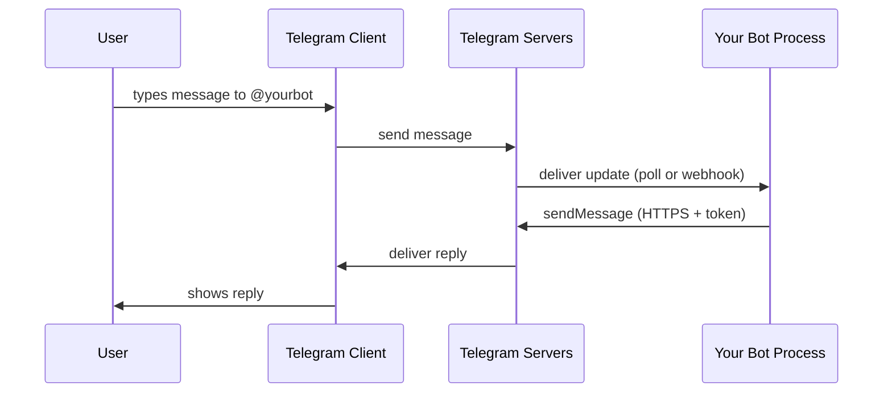

Telegram bots feel deceptively simple — `@BotFather` hands you a token, you write some code, and a chat replies. The mechanics underneath are minimal but worth understanding clearly: the platform imposes almost nothing on your code, and most operational questions reduce to "who holds the token, and how does it talk to `api.telegram.org`?"

## The architecture: Telegram is the middleman

Users never talk to your bot directly. They talk to Telegram; Telegram routes anything addressed to `@yourbot` to whichever process is authenticated with that bot's token.



Two consequences fall out of this:

1. **Your bot never needs an inbound connection in the polling model** — everything is outbound HTTPS to `api.telegram.org`. NAT, firewalls, laptops all work.
2. **You have no direct channel to the user.** All messages go through Telegram, which means rate limits, queueing, and content rules all sit at that boundary.

## The token is the entire auth model

When BotFather creates a bot, it returns a token like:

```
8123456789:AAH...long_random_string
```

That token is a **bearer credential** in the URL path:

```
https://api.telegram.org/bot<TOKEN>/<method>
```

There's no OAuth, no signing, no app manifest. **Anyone with the token *is* the bot.** That's why:

- Leaking the token = full takeover.
- Rotating means asking BotFather to `/revoke`, which invalidates the old one and issues a new one immediately.
- Deleting the bot via BotFather invalidates the token permanently.

## Two delivery models: polling vs webhooks

Telegram needs to get updates *to* your bot. There are exactly two ways.

| Mode | How it works | Needs public host? | Latency | Best for |
|---|---|---|---|---|
| **Long polling** | Bot calls `getUpdates`; Telegram holds the request open up to ~50s, replies when updates arrive | No | Slightly higher | Dev, hobby, behind-NAT |
| **Webhook** | Bot registers an HTTPS URL once via `setWebhook`; Telegram POSTs each update | Yes (HTTPS + valid TLS cert) | Lower | Production, scaled |

### Long polling, in detail

```
loop:
    GET /bot<TOKEN>/getUpdates?offset=<last_id+1>&timeout=50
    process each update
    advance offset
```

It looks like a persistent connection, but it's really a chain of long HTTP requests. The `offset` parameter doubles as the acknowledgement — once you advance it, Telegram drops everything before it.

### Webhooks

`setWebhook` is atomic — Telegram instantly redirects future updates to the new URL. Webhooks and polling are **mutually exclusive** per token.

## The identity/logic split

This is the cleanest mental model for managing bots:

| Lives on Telegram (managed via BotFather) | Lives on your side (managed by you) |
|---|---|
| Username (`t.me/yourbot`) | Message handling code |
| Token | State, storage, business logic |
| Display name, description, "about" text | Hosting, deployment, scaling |
| Profile picture | Anything else |
| Command menu (the `/` autocomplete list) | |

Telegram **never sees, hosts, or audits your code.** A 5-line shell script with `curl` is as legitimate a bot as a Kubernetes deployment. You can rewrite it, redeploy it, swap languages, or move hosts — Telegram's view doesn't change because the token didn't change.

## Lifecycle: closer to a cron job than an app

From an ops standpoint, Telegram imposes almost no lifecycle constraints:

- ✅ **Stop**: just kill the process. Telegram queues incoming updates for ~24 hours.
- ✅ **Start**: run anywhere, anytime. No registration, no warmup.
- ✅ **Modify**: redeploy whenever. Telegram has no idea your code changed.
- ✅ **Move host**: same token works from a new machine the moment the old one stops polling.

### Caveats worth knowing

1. **Update backlog on restart.** After downtime, `getUpdates` returns queued messages in order. Decide deliberately whether to process them or skip with `offset` — replying to a 6-hour-old "hi" can feel weird.

2. **One poller at a time per token.** Two concurrent `getUpdates` callers get `409 Conflict`. Stop the old instance before starting the new one, or use webhooks (atomic swap).

3. **Rate limits, not lifecycle limits.** Roughly:
   - ~30 messages/sec global
   - ~1/sec per chat
   - ~20/min per group

   Bursting past these returns `429 Too Many Requests` with a `retry_after`.

4. **Metadata changes are global and immediate.** Updating the command list or description hits every user instantly — there's no staged rollout.

5. **Scaling means fanout *behind* one ingress.** Because only one process can poll, "scaling a bot" means a single ingress feeding your own queue/worker pool — not multiple pollers.

## Creating a bot (the BotFather flow)

Open a chat with `@BotFather` in any Telegram client.

```
/newbot
```

It asks two things, in order:

### 1. Display name

- Free-form: spaces, emoji, any language.
- Up to 64 characters.
- ✅ Changeable later via `/setname`.

### 2. Username

- The handle. Appears in `t.me/<username>` and in search.
- Strict rules:
  - 5–32 characters
  - Letters, digits, underscores only
  - **Must end in `bot`** (case-insensitive)
  - Must be globally unique
- ❌ **Not changeable.** Wrong username = delete and recreate.

> 💡 Have 2–3 fallback usernames ready. Most short ones are taken; BotFather will reject and re-prompt without restarting the flow.

BotFather then returns the token. **That's the credential — save it.**

## Verify it works without writing code

Open in a browser, replacing `<TOKEN>`:

```
https://api.telegram.org/bot<TOKEN>/getMe
```

A JSON response confirms the token is live. To send your first message:

1. Find your bot in Telegram, tap **Start** (this gives the bot permission to message you).
2. Get your `chat_id`:
   ```bash
   curl "https://api.telegram.org/bot<TOKEN>/getUpdates"
   ```
   Look for `"chat":{"id":...}`.
3. Send:
   ```bash
   curl -X POST "https://api.telegram.org/bot<TOKEN>/sendMessage" \
     -d "chat_id=<YOUR_CHAT_ID>" \
     -d "text=hello from my bot"
   ```

That's the entire surface. Every other feature — buttons, files, payments, inline mode — is just more methods on the same `https://api.telegram.org/bot<TOKEN>/` base.

## Polish via BotFather (optional)

| Command | Purpose |
|---|---|
| `/setdescription` | Text shown on the bot's profile before the user starts |
| `/setabouttext` | Short blurb in the profile |
| `/setuserpic` | Avatar |
| `/setcommands` | Populates the `/` menu in the chat UI |

For `/setcommands`, the format is one command per line:

```
start - begin
help - show help
```

## Managing or deleting old bots

Forgot what bots you own? Tokens lost? Ownership is tied to your Telegram account, not the token.

```
/mybots
```

Lists every bot under your account. From there:

- **`/deletebot`** → pick from list → confirm with the exact phrase `Yes, I am totally sure.` (case-sensitive). Bot is gone, token is dead, username released after a cooldown.
- **`/revoke`** → keeps the bot identity but invalidates the current token. New token issued via `/token`.
- **Just stop running it** → silent bot, queues updates for ~24h then drops them. Zero attack surface beyond the token itself.

### Recommendation for forgotten bots

Forgotten tokens lurking in old configs, screenshots, or git history are the main risk. **`/deletebot` each one you don't need.** Deletion makes any leaked token worthless — the cleanest cleanup.

## Libraries vs raw HTTP

Libraries exist for every language — `python-telegram-bot`, `telegraf` (Node), `go-telegram-bot-api`, and many more. They're useful for handler dispatch, middleware, and conversation state, but they're all thin wrappers over the same HTTPS calls.

You can ship a real, useful bot in pure `curl` or `requests`. The platform genuinely is that simple.

## Summary

- Telegram sits between user and bot; your code never touches the user directly.
- The **token** is bearer auth — guard it like a password.
- Two delivery modes: **long polling** (simple, behind NAT) or **webhooks** (production, public HTTPS).
- **Identity** lives on Telegram (BotFather); **logic** lives entirely with you.
- Lifecycle ops (stop / start / modify / move) are basically unrestricted; the real constraints are rate limits and the one-poller-per-token rule.
- Creating a bot = `/newbot` in BotFather; deleting one = `/deletebot`. Both take seconds.
