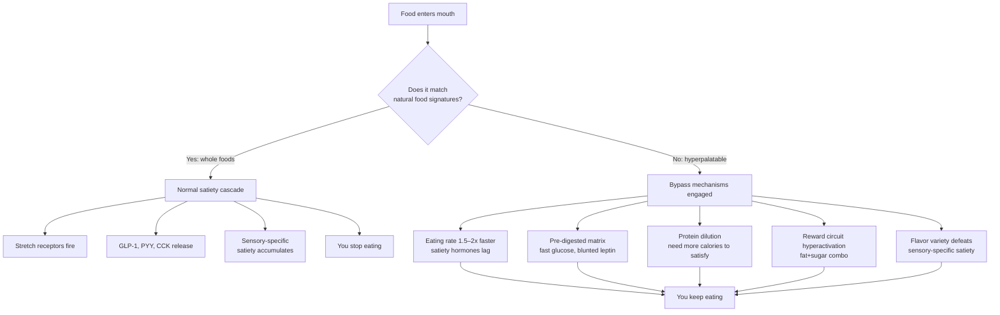

There's a popular narrative that "science has confirmed ultra-processed foods cause obesity." That's half-right — the correlations are robust and the mechanisms are increasingly well-described — but it overstates how settled the question really is. The more interesting framing isn't *whether* UPFs are bad, but *how* certain industrial food formats bypass a regulation system that worked fine for hundreds of thousands of years.

This post walks through what's actually consensus, what's contested, and why everyday observations like "I can eat a whole bag of chips but I gag drinking a spoonful of oil" line up surprisingly well with the published science.

## What the science actually agrees on

A few things are uncontroversial:

- **Obesity is multifactorial, but the recent surge is environmental.** The human gene pool hasn't changed in 50 years, so genetics can explain individual variation but not the population-level rise. Something about the food environment shifted.
- **Energy surplus is the proximate cause.** People who develop obesity ate more than they burned. The interesting question is *why* they were stuck in chronic surplus.
- **UPF intake correlates robustly with weight gain.** Observational studies converge — the effect is stronger in adults than adolescents, and at least one well-controlled clinical trial supports it.

What's *not* consensus is the claim that UPFs are *the* main cause. Several competing models live alongside each other:

| Model | Core claim |
|---|---|
| 🍔 **Energy Balance Model (EBM)** | Cheap, convenient, energy-dense, fat- and sugar-loaded UPFs drive overconsumption. UPFs are the trigger. |
| 🍞 **Carbohydrate-Insulin Model (CIM)** | Highly processed carbs trigger an insulin response that shunts calories into fat storage, leaving metabolic demand unmet → overeating follows. |
| 🌐 **Obesogenic Environment** | UPFs sit alongside sedentary lifestyle, sleep loss, stress, gut microbiome disruption, endocrine disruptors, etc. — all contributing. |

All three camps agree processed carbs are *a* major driver. But "UPFs are the main cause" is not a settled claim.

## Why the NOVA classification gets criticized

The whole "ultra-processed food" concept rests on the **NOVA classification system**, proposed by Brazilian researchers. It groups foods by *degree of processing*, deliberately ignoring nutritional content. That choice is the core of the controversy.

- Plain Greek yogurt and Coca-Cola can land in different NOVA tiers despite the latter being far worse nutritionally — but many "healthy" foods get lumped as UPF, while some clearly unhealthy foods escape.
- The most parsimonious explanation may be that the UPF-disease link is largely driven by a *small subset* of foods (processed meats, sugar-sweetened beverages) rather than processing per se.

In other words: the **"ultra-processed"** label is too coarse. The interesting question isn't whether something was processed but whether the processing was used to *bypass the body's regulation system*.

## The Kevin Hall experiment: the closest thing to causal evidence

The most-cited causal evidence is a 2019 randomized crossover trial run by Kevin Hall at the NIH metabolic ward (*Cell Metabolism*, 2019):

- 20 participants, two weeks on a UPF diet, two weeks on a minimally-processed diet.
- **Calories, fat, sugar, salt, and fiber were all matched between the two diets.**
- Participants ate ad libitum.

Result: on the UPF diet, people spontaneously consumed **~500 kcal more per day** and gained weight. On the unprocessed diet, they lost weight. The macronutrient profile was identical — only the *processing format* differed.

This is the key finding: even when nutrition is matched, processing alone changes how much people eat. That's not willpower failing — that's the regulation system being bypassed.

## How the bypass actually works

Each of those bypass mechanisms is its own piece of literature.

### 1. Hyperpalatability and "passive overconsumption"

The USDA-style operational definition (Fazzino et al., *Obesity*, 2019) flags foods with specific combinations of fat, sugar, carbs, and sodium:

- Fat >25% of calories AND sodium >0.30%, **or**
- Fat >20% AND sugar >20%, **or**
- Carbs >40% AND sugar >10%

These combinations barely exist in nature. Fazzino's reanalysis of US dietary data found hyperpalatable foods' share of calorie intake has risen steadily for 30 years.

### 2. Protein leverage

Simpson and Raubenheimer's protein leverage hypothesis: humans eat to hit a **protein target**. Whole pork belly carries enough protein that you reach satiety quickly — a few bites of plain boiled pork belly feels like enough. Cake's protein is diluted by starch and sugar, so you have to eat far more total calories to reach the same protein floor. UPFs are systematically protein-diluted.

### 3. Food matrix effects

Boiled pork belly's fat is still embedded inside intact muscle cells; digestion is slow. Cake's fat and sugar are emulsified, gelatinized, essentially **pre-digested**. Glucose curves and leptin signals are completely different rhythms.

A clean illustration: a whole apple vs. apple juice from the same apples. People struggle to eat two apples; they finish two apples' worth of juice without thinking. Same calories, same sugars — destroyed matrix.

### 4. Eating rate

Studies have measured it: people eat UPFs at roughly **1.5–2× the rate** of unprocessed foods. Calories per minute roughly double. Satiety hormones (GLP-1, PYY) take ~20 minutes to ramp up — eat fast enough and you're past the brake before it engages.

### 5. Sensory-specific satiety

Plain oatmeal becomes boring after a while; the brain's reward circuit saturates. Chips re-engage the reward signal on every bite because the flavor and texture profile is precisely engineered to defeat that saturation. The food industry calls it the **bliss point** — somewhat overhyped marketing, but the underlying mechanism is real.

### 6. The fat–sugar combo neuroscience

A 2018 Max Planck fMRI study (Small et al., *Cell Metabolism*) showed something genuinely strange: when participants viewed images of pure-fat foods, pure-sugar foods, or fat+sugar combos, the **fat+sugar combo activated reward circuits more than the other two combined**. Not 1+1=2 — closer to 1+1=3.

The proposed explanation: humans have two separate energy-sensing systems — one for fat (long-term storage signal) and one for metabolizable sugar (immediate energy). In nature these signals almost never co-occur strongly. Breast milk is the rare exception; fruit has sugar but almost no fat; meat has fat but almost no sugar; honey is sugar without fat.

**Foods with high concentrations of both fat and sugar are essentially an industrial-era invention** — and our brains don't have an evolved upper bound for them.

## The fat-aversion experiment

Here's an everyday test that maps onto a real research finding. Take three foods you know you can over-eat — say, two slices of cake plus a fried dough stick. Compute the oil content:

- One cake slice ≈ 15–25 g oil
- One fried dough stick ≈ 10–20 g oil
- One chocolate bar (50 g) ≈ 15 g fat

You can comfortably eat the cake-and-fried-stick combo. That's 50–60 mL of oil. Now try drinking 50 mL of plain oil straight. You will gag — possibly vomit. Most people can't get past 30–60 mL.

This isn't a quirk. It's a documented phenomenon called the **fat aversion response**, studied by Mattes in the 1990s. The brain has a "free-fat detector" — direct exposure to pure oil, melted butter, or rendered fat triggers strong nausea, plausibly an evolved defense against rancid animal fat or ketosis-inducing intoxication.

The detector has one fatal flaw: **it depends on texture and flavor cues**. Once fat is emulsified (mayonnaise, cream), wrapped in starch (fried dough, pastry), or masked by sugar (chocolate, cake), the detector goes silent. This is called **fat camouflage**, and it's one of the food industry's core technologies. People reliably underestimate the fat content of disguised foods by enormous margins.

The reason this experiment is rare in formal literature: ethics boards generally won't approve studies that involve having subjects chug oil. Self-experimentation surfaces something that's hard to study under IRB rules.

## What this rules out

The bypass framing is a clean refutation of several popular claims:

- ❌ **"Obesity is a willpower failure."** If consumption were under conscious control, the same grams of oil wouldn't produce wildly different intake depending on disguise. The body has automatic regulation; willpower enters the fight after physiology has already lost.
- ❌ **"Just eat less oil."** Pure oil is hard to overconsume. The problem isn't oil — it's *camouflaged* oil. Nobody got fat on olive oil drizzled over salad; cake and fried snacks are different.
- ❌ **"As long as total calories match, it doesn't matter."** Hall's 2019 trial directly disproved this. Same calories, same macros, ~500 kcal/day difference in spontaneous intake.

## Why "natural foods don't make you fat" is *almost* right

The intuition that "people eating natural foods don't get fat" mostly works, but it needs one qualification: not all natural foods are self-limiting.

Nuts, cheese, olive oil, honey, dried fruit, cured fatty meats — all minimally processed, all very calorie-dense, all easy to overeat in modern abundance. Pre-industrial hunter-gatherers and early agricultural populations rarely became obese in part because **acquiring high-density foods cost real effort** (climbing for honey, hunting), and because variety was limited (variety itself defeats sensory-specific satiety).

A more precise framing: **"foods that weren't designed to defeat your satiety system are hard to overeat."** Not "natural" — "not engineered for bypass."

This also handles a common counterargument: Italians eat enormous amounts of pasta and the Japanese eat enormous amounts of white rice, and traditionally neither population was obese. The difference isn't the carbs — it's that those foods weren't engineered into hyperpalatable formats.

## A useful counterexample to the "industrial" framing

Pre-industrial cultures invented their own hyperpalatable foods. Baklava (Middle Eastern), gulab jamun (Indian), sachima and shortbread cookies (Chinese), croissants (French) — all pre-industrial inventions, all using the same recipe logic: **sugar + fat + refined carb**. In societies where these became affordable to wealthy classes, you can find pre-industrial obesity in those classes.

The takeaway: the issue isn't *industrialization* per se. The issue is **any food format that concentrates sugar, fat, and refined carbs at densities outside the natural distribution**. Humans have been able to invent such foods for centuries; industrialization just made them cheap, ubiquitous, and infinitely varied.

This actually *strengthens* the bypass thesis: the human regulation system evolved against the natural food distribution. Anything that breaks that distribution — whether sachima or Cheetos — drives overconsumption.

## Better frameworks than "UPF"

Several researchers are trying to replace NOVA with something more precise:

- **Hyperpalatable foods** (Fazzino, 2019) — defined by specific fat/sugar/carb/sodium thresholds. Quantifiable; doesn't conflate fermentation or freezing with industrial engineering.
- **Food reward** (Guyenet) — focuses on stimulation of brain reward circuits regardless of "processing level."

Both try to capture the real claim: **the problem is processing used to bypass intake regulation, not processing in general.** Fermentation is processing. Freezing is processing. Grinding is processing. None of them necessarily cause obesity.

## Self-experiments worth running

A few simple at-home tests, all with research analogs:

- ✅ **Sweetness masking.** Two glasses of water — one with 8 g sugar, one with 35 g sugar plus a few drops of lemon juice plus ice. Most people rate the second as *less* sweet. (A regular cola has ~35 g sugar; phosphoric acid and chilling suppress perceived sweetness.)
- ✅ **Matrix destruction.** Eat one whole apple vs. drink the juice of two apples. Most people stop after one fruit but finish the juice easily.
- ✅ **Texture and rate.** Same rice + vegetables, eaten normally vs. blended into a smooth purée. The purée is finished faster, in larger total volume, with shorter satiety — same calories, same nutrients.

Each is a different angle on the same hypothesis: industrial processing bypasses natural regulation.

## A summary worth keeping

> **The body isn't a calorie counter. It's a food-format recognition system.**
>
> The same molecule, in different formats, produces wildly different regulatory responses. A spoonful of pure oil reads as "danger, stop." The same spoonful inside a cake reads as "delicious, continue." This isn't a bug — it's a several-million-year-old mechanism that assumed food formats would match the natural distribution. Industrial food has rewritten that distribution. Your nervous system is still navigating with the old map.

## Further reading

- 📄 Hall et al., "Ultra-processed diets cause excess calorie intake and weight gain" — *Cell Metabolism*, 2019. The metabolic-ward trial.
- 📄 Small et al., on fat–sugar reward synergy — *Cell Metabolism*, 2018. The fMRI bliss-point study.
- 📄 Fazzino, on hyperpalatable food definitions — *Obesity*, 2019.
- 📚 Stephan Guyenet, *The Hungry Brain* — chapters 8–10 are essentially the systematic version of this whole argument.
- 📚 Chris van Tulleken, *Ultra-Processed People* — includes a self-experiment (n=1, one month UPF-only diet, measurable weight gain).
- 📚 Simpson & Raubenheimer, on protein leverage.
