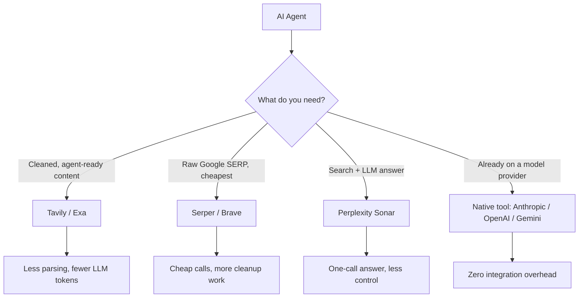

When you're building an AI agent that needs to search the web, the question isn't *whether* to use a search API — it's which one. The market has split into raw SERP wrappers, agent-tuned retrieval services, and native model-provider tools. Each has a different cost shape and a different downstream tax on your LLM bill.

This is a quick comparison, plus a note on testing the option that tends to be the easiest starting point.

## The landscape



### Search APIs designed for LLMs / agents

| Service | Niche |
|---|---|
| **Tavily** | Purpose-built for AI agents; cleaned, deduplicated results; optional synthesized answer |
| **Exa** | Neural / semantic search, good for finding high-quality sources |
| **Brave Search API** | Cheap, no tracking, decent quality |
| **Serper** | Fast Google SERP wrapper, very cheap |
| **SerpAPI** | Mature Google/Bing scraping API, more expensive |
| **You.com API** | Search + RAG-ready snippets |
| **Perplexity Sonar** | Search + LLM answer in one call |

### Built into model providers

- **Anthropic web search tool** — native tool in the Claude API, no extra service if you're already using Claude
- **OpenAI web search tool** — built into the API
- **Google Gemini Grounding** — uses Google Search under the hood

If you're already on a model provider's stack, the native tool is the lowest-friction option by a wide margin.

## Pricing — rough order, cheapest first

Per 1,000 searches, approximate:

| Service | Price | Free tier |
|---|---|---|
| Brave Search API | ~$3 (Data for AI) | 2,000/month free |
| Serper | ~$0.30–$1 | 2,500 on signup |
| Tavily | ~$4–$8 | 1,000/month free |
| Exa | ~$5 | $10 credit |
| SerpAPI | ~$15+ | 100/month free |
| Perplexity Sonar | ~$5 + token costs | pay-as-you-go |

> ⚠️ **The hidden cost.** Raw SERP APIs (Serper, SerpAPI) are cheap *per call*, but you'll burn LLM tokens cleaning the results. Agent-tuned services (Tavily, Exa) cost more per call but return cleaner content, which means fewer downstream tokens. End-to-end, the "expensive" option is often the cheaper one.

## Why Tavily is a defensible default

Tavily isn't the cheapest, but for most agent use cases (research, Q&A, RAG-style lookups) it's the path of least resistance:

- ✅ Returns cleaned, deduplicated content — no HTML junk, ads, or nav menus
- ✅ `search_depth: "advanced"` fetches and extracts page content in a single call
- ✅ `include_answer` returns a synthesized summary
- ✅ Saves a whole pipeline step (fetch → clean → chunk)
- ✅ 1,000/month free tier is enough to build and test

### Where Tavily is *not* the right pick

- **Need raw Google ranking signals** (SEO work, exact SERP positions) → Serper
- **Very high volume, willing to parse** → Serper or Brave
- **Semantic / neural search over high-quality sources** → Exa
- **Agent regularly reads long-form articles** → pair Tavily search with a dedicated reader (Firecrawl, Jina Reader's `r.jina.ai` is free)

A common production pattern is **Tavily for search + Jina Reader or Firecrawl for full-page extraction** when the agent decides it needs the whole article. This keeps search calls cheap and reading calls targeted.

## Testing a Tavily key

The fastest sanity check is a single `curl`:

```bash
curl -X POST https://api.tavily.com/search \
  -H "Content-Type: application/json" \
  -d '{
    "api_key": "YOUR_TAVILY_KEY",
    "query": "what is the latest claude model",
    "search_depth": "basic",
    "max_results": 3
  }'
```

A working key returns JSON with `results`, `query`, and optionally `answer`.

### Same thing in Python with the official SDK

```bash
pip install tavily-python
```

```python
from tavily import TavilyClient

client = TavilyClient(api_key="YOUR_TAVILY_KEY")
resp = client.search(
    query="what is the latest claude model",
    search_depth="basic",
    max_results=3,
    include_answer=True,
)

print(resp["answer"])
for r in resp["results"]:
    print(r["title"], "—", r["url"])
```

### Common errors

| Status | Meaning |
|---|---|
| `401` | Bad or expired key |
| `432` | Out of credits — check usage in the Tavily dashboard |
| `429` | Rate limited (free tier is ~1 req/sec) |

### Useful flags for agent integrations

- `search_depth: "advanced"` — extracted page content (costs 2 credits vs 1)
- `include_answer: true` — synthesized summary, useful for quick agent responses
- `include_raw_content: true` — full page text for RAG
- `include_domains` / `exclude_domains` — filter by source

## Decision checklist

- [ ] Do I already use a model provider with a native search tool? → Use it first.
- [ ] Is my volume tiny (<1k/month)? → Free tiers (Tavily, Brave) cover it.
- [ ] Do I need raw SERPs, not summaries? → Serper.
- [ ] Do I need semantic / "find me high-quality sources" search? → Exa.
- [ ] Am I building a general agent and want to ship today? → Tavily.

## TL;DR

For most AI agents, Tavily is the cheapest end-to-end choice once you account for downstream LLM token costs, even though the per-call price isn't the lowest. Test the key with a `curl` one-liner, then move to the SDK and start tuning `search_depth`, `include_answer`, and domain filters for your use case.
