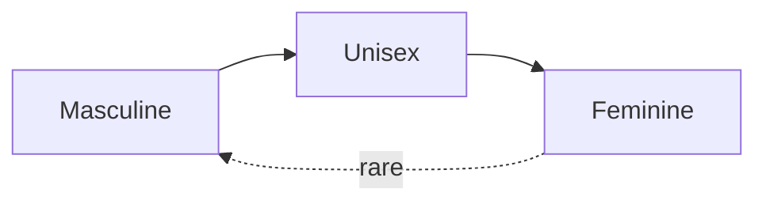

Unisex names — names that work equally well for men and women — sit at an interesting intersection of language, history, and culture. Many started as occupational, place, or surname-based names that had no gender baked in. Others migrated across genders over time, often shifting from boys to girls as decades passed.

This is a quick reference guide to the most common English unisex names, what they mean, where they come from, and how popular they are today.

## At a glance

| Name      | Origin            | Meaning                       | Modern popularity (US) |
| --------- | ----------------- | ----------------------------- | ---------------------- |
| Riley     | Irish             | Courageous, valiant           | ⭐⭐⭐⭐⭐ Very high       |
| Avery     | Old English/French | Elf counsel, wise ruler      | ⭐⭐⭐⭐ High              |
| Charlie   | Germanic          | Free man                      | ⭐⭐⭐⭐ Rising fast       |
| Jordan    | Hebrew            | To flow down, descend         | ⭐⭐⭐ Steady             |
| Cameron   | Scottish Gaelic   | Crooked nose                  | ⭐⭐⭐ Steady             |
| Taylor    | English           | Tailor (occupational)         | ⭐⭐ Past peak           |
| Morgan    | Welsh             | Sea-born, sea circle          | ⭐⭐ Declining           |
| Alex      | Greek             | Defender of the people        | ⭐⭐⭐ Common as nickname |
| Casey     | Irish             | Vigilant, watchful            | ⭐ Less common today    |
| Jamie     | Hebrew            | Supplanter                    | ⭐ Less common today    |
| Sam       | Hebrew            | Heard by God, name of God     | ⭐ Less common today    |
| Robin     | Germanic          | Bright fame                   | ⭐ Dated                |

## Meanings and origins

### Riley
- **Origin:** Irish, from the surname Ó Raghallaigh.
- **Meaning:** Courageous, valiant.
- **Note:** Originally a clan name in County Cavan, Ireland. Crossed over to first-name use in the 20th century and has been the strongest unisex name in the US for the past decade.

### Avery
- **Origin:** Old English / Old French, a variant of Alfred.
- **Meaning:** Elf counsel, or wise ruler.
- **Note:** Began life as a medieval male name, then a surname, and re-emerged in the late 20th century as predominantly female — though it still works for both.

### Charlie
- **Origin:** Germanic, short for Charles or Charlotte.
- **Meaning:** Free man.
- **Note:** Traditionally a boys' nickname; has surged for girls in recent years, making it one of the most balanced unisex names today.

### Jordan
- **Origin:** Hebrew, from the Jordan River.
- **Meaning:** To flow down, to descend.
- **Note:** A name with deep biblical and geographical roots. Has been used steadily for both genders for decades.

### Cameron
- **Origin:** Scottish Gaelic, from *cam sròn*.
- **Meaning:** Crooked nose.
- **Note:** Originally a Highland clan name. The unflattering literal meaning is rarely a concern — like most surname-derived names, the modern association is with the name itself, not its etymology.

### Taylor
- **Origin:** English, occupational surname.
- **Meaning:** Tailor — one who cuts and sews cloth.
- **Note:** Peaked in popularity in the 1990s. Still widely recognized as unisex.

### Morgan
- **Origin:** Welsh.
- **Meaning:** Sea-born, or "sea circle" — from *mor* (sea).
- **Note:** A genuinely ancient Welsh name. Peaked for both genders in the 1990s–2000s and is now declining.

### Alex
- **Origin:** Greek, short for Alexander or Alexandra.
- **Meaning:** Defender of the people.
- **Note:** Extremely common as a nickname, less so as a legal first name. Universally recognized across cultures.

### Casey
- **Origin:** Irish, from the surname Ó Cathasaigh.
- **Meaning:** Vigilant, watchful.
- **Note:** Has a slightly retro feel today but remains gender-neutral.

### Jamie
- **Origin:** Hebrew, short for James.
- **Meaning:** Supplanter — one who follows or replaces.
- **Note:** A diminutive of James that became established as a name in its own right. More common in the UK than the US.

### Sam
- **Origin:** Hebrew, short for Samuel or Samantha.
- **Meaning:** Heard by God, or "name of God."
- **Note:** A short, friendly nickname-name that works equally well as a standalone given name.

### Robin
- **Origin:** Germanic, originally a diminutive of Robert.
- **Meaning:** Bright fame.
- **Note:** Once a male name (think Robin Hood), shifted to predominantly female mid-20th century, and now feels somewhat dated for either gender.

## How unisex names evolve

A common pattern in English naming history: a name starts as masculine, becomes unisex, then shifts toward feminine — and rarely shifts back. Avery, Ashley, Lindsay, and Robin all followed this arc.

The drivers are usually:

1. **Surname-to-given-name migration.** Many "unisex" names started as surnames (Taylor, Riley, Cameron, Avery) and entered first-name use without strong gender association.
2. **Soft-sounding endings.** Names ending in *-y*, *-ie*, *-an* tend to drift female over time in English-speaking countries.
3. **Pop culture.** A famous bearer of one gender can rapidly tilt a name's perceived gender.

## Picking one

Rough heuristics if you're choosing a unisex name:

- **Modern and current:** Riley, Avery, Charlie
- **Timeless and classic:** Jordan, Alex
- **Strong meaning:** Alex (defender), Riley (courageous), Robin (bright fame)
- **Short and friendly:** Sam, Alex, Charlie
- **Distinctly cultural roots:** Morgan (Welsh), Cameron (Scottish), Casey (Irish)

The "best" choice depends less on etymology and more on what feels right when said aloud — and how it pairs with a surname.
