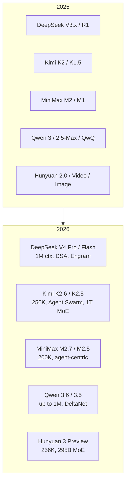

The Chinese LLM scene moved from "trying to catch up with GPT-4" in early 2025 to shipping million-token, agent-native, MoE-by-default flagships by spring 2026. This post is a snapshot of the public model releases from the five vendors that mattered most in that window — **DeepSeek**, **Moonshot AI (Kimi)**, **MiniMax**, **Alibaba (Qwen)**, and **Tencent (Hunyuan)** — followed by the patterns that show up across all of them.

Releases below are in **reverse chronological order** within each vendor, and only cover 2025–2026.

> **Source note.** The underlying data came from a Gemini chat session, so dates and parameter counts should be taken as a useful overview rather than a definitive registry. Vendor blogs and Hugging Face pages remain authoritative.

## At a glance

## DeepSeek

DeepSeek is the lab whose **R1** moment in January 2025 reframed expectations for low-cost reasoning. By 2026 it had pushed to a **1M-token** V4 line built on a new sparse-attention mechanism.

### 2026

| Model | Release | Context | Notes |
|---|---|---:|---|
| **DeepSeek-V4 Pro** (Preview) | 2026-04-24 | **1,000,000** | 1.6T-parameter MoE; introduces **DSA (DeepSeek Sparse Attention)**; coding and agent abilities pitched against top closed-source models. |
| **DeepSeek-V4 Flash** | 2026-04-24 | **1,000,000** | Cost-efficient sibling; integrates the **Engram** memory architecture for low-cost long-context inference. |

### 2025

| Model | Release | Context | Notes |
|---|---|---:|---|
| **DeepSeek-V3.2** | 2025-12-01 | 128K | Final V3 iteration; deeper optimization for complex instruction following and long-text logical consistency. |
| **DeepSeek-V3.1** | 2025-08-21 | 128K | Introduces **Hybrid Think / Non-Think** modes; sharply higher function-calling success rate. |
| **DeepSeek-R1-0528** | 2025-05-28 | 128K | Major upgrade to R1; JSON-mode output and stronger math / competitive-programming scores. |
| **DeepSeek-Prover-V2** | 2025-04-30 | 128K | 671B parameter model specialized for **formal theorem proving**. |
| **DeepSeek-V3-0324** | 2025-03-25 | 128K | V3 update built on R1's RL techniques; stronger frontend code generation. |
| **Janus-Pro** | 2025-01-27 | 128K | **Multimodal**; decoupled image understanding/generation, high-resolution support. |
| **DeepSeek-R1** | 2025-01-20 | 128K | The **breakout open reasoning model**; first public demonstration of pure-RL chain-of-thought at scale. Kicked off the low-cost reasoning era. |

**Key tech.** *DSA* solves the VRAM bottleneck for 1M-token context. *Engram* separates static knowledge retrieval from dynamic reasoning, sharpening V4 Flash on long-document tasks. The entire lineup, including the V4 previews, stays under the **MIT license**.

> V3's original release was 2024-12-26, so it is not on this list.

## Moonshot AI — Kimi

Kimi's story across this window is the pivot from "long-context reader" to "agent operator." K1.5 brought OpenAI-o1-style RL reasoning in January 2025; K2 went open-weights in July; by K2.6 the headline feature was running hundreds of sub-agents in parallel.

### 2026

| Model | Release | Context | Notes |
|---|---|---:|---|
| **Kimi K2.6** | 2026-04-20 | 256K | **Agent flagship**; introduces "Agent Swarm" — 300–1000 sub-agents working in coordination. Top-tier on SWE-Bench Pro–class benchmarks. |
| **Kimi K2.5** | 2026-01-27 | 256K | **Native multimodal 1T MoE**; first deep vision-language fusion at this scale. Adds switchable "Instant" and "Thinking" modes. |

### 2025

| Model | Release | Context | Notes |
|---|---|---:|---|
| **Kimi K2 Think** | 2025-11-06 | 128K | Deep-reasoning variant optimized for long logical chains; ships with a Turbo speed mode. |
| **Kimi Linear (48B)** | 2025-10-31 | 128K | Architecture experiment using **KDA (Kimi Delta Attention)** linear attention — large drop in VRAM/latency on long inputs. |
| **OK Computer** | 2025-09-25 | 1M+ | **Agent module**: generates multi-page sites, editable slide decks, and million-row spreadsheets. |
| **Kimi K2 (Instruct)** | 2025-09-05 | **256K** | Instruction-tuned K2; raises the standard context from 128K to 256K. |
| **Kimi K2 (Open Weights)** | 2025-07-17 | 128K | **1.6T-parameter MoE**, 32B active. Open-weights release, served via the **Mooncake** inference engine; performance positioned against GPT-4-class models. |
| **Kimi-Dev / Researcher** | 2025-06-15 | 128K | Vertical variants: Dev for coding automation, Researcher for long reports and multi-source synthesis. |
| **Kimi-VL** | 2025-04-12 | 128K | 16B-parameter multimodal MoE; high-resolution image and document parsing. |
| **Kimi K1.5** | 2025-01-20 | 128K | New reasoning base trained with o1-style RL; step-change on math/code/logic benchmarks. |

**Caveats worth noting.** The Kimi App and web UI advertise **2M+ context** in production; the API and open-weights models above use the standard 128K/256K windows for inference efficiency. From 2025 onward the entire K line moved to **MoE**: total params measured in trillions, active params kept small to control cost.

## MiniMax

MiniMax's story is rebranding away from `abab` toward the **M series** ("Multimodal / Mechanism"), plus the parallel rise of **Hailuo** video. By 2026 their pitch is agent-centric models with sub-$0.10/M-token economics.

### 2026

| Model | Release | Context | Notes |
|---|---|---:|---|
| **MiniMax-M2.7** | 2026-03-22 | **200K** | Peak of the M2 line; long-text "needle in a haystack" recall sharpened, plus complex instruction following. |
| **Hailuo 2.3** | 2026-03-04 | (video) | **Physics engine pass**: fluid dynamics, smoke, collision response — videos that look like they obey physics, not just visual association. |
| **MiniMax-M2.5 Pro / Lightning** | 2026-02-12 | **200K** | Native multimodal; 3× faster inference and ~1/20 the cost of the prior generation; SWE-bench-tier coding. |

### 2025

| Model | Release | Context | Notes |
|---|---|---:|---|
| **MiniMax-M2.1** | 2025-12-23 | 200K | Multilingual specialist; stronger code refactoring, cross-language translation, and **interleaved tool use**. |
| **MiniMax-M2** | 2025-10-23 | 192K | The **turning point**: drops the `abab` naming, launches the M line with an agent-centric design and native task decomposition. |
| **MiniMax-M1** | 2025-06-17 | 128K | **Fully open 1.6T MoE**; at release one of the strongest open models, first MiniMax model with GPT-4-comparable Chinese semantics. |
| **Speech-02** | 2025-04-17 | (audio) | 30+ languages, up to 200K characters of continuous synthesis, expressive emotion control. |
| **MiniMax-VL-01** | 2025-01-16 | 128K | First VL flagship; document parsing, charts, mobile-agent automation. |
| **MiniMax-Text-01** | 2025-01-09 | 128K | General-purpose flagship that anchored MiniMax-driven enterprise agents through early 2025. |

> The 2024 `abab 7` series (e.g. `abab 7-chat`) is the predecessor to the M series and falls outside this window.

## Alibaba — Qwen

Qwen crossed two generational boundaries in the window: from **2.5** to **3** (April 2025) and from **3** to the **3.5 / 3.6** branch (early 2026). The 2026 lineup leans hard on **hybrid linear/full attention**, MoE with very small active params, and "Thinking" modes.

### 2026

| Model | Release | Context | Notes |
|---|---|---:|---|
| **Qwen 3.6-27B** | 2026-04-22 | **262K** | Flagship dense model; uses **DeltaNet** linear attention for low latency; tuned for frontend dev and library-scale refactors. |
| **Qwen 3.6-35B-A3B** | 2026-04-16 | **262K / 1M** | **Agent-specialized**; ultra-sparse MoE — 35B total / 3B active. Adds "Thinking Preservation" so reasoning chains survive long dialogues. |
| **Qwen 3.5 family** | 2026-02 – 03 | **1,000,000** | Sizes from 0.8B to 397B; native multimodal (early-fusion vision); **Plus / Flash** variants stable at 1M context. |
| **Qwen 3.5-397B-A17B** | 2026-02-16 | 262K | Early-2026 MoE flagship; sweeps math/logic and cross-lingual common-sense benchmarks against GPT-4o-class models. |
| **QwQ-32B** | 2026-01-15 | 128K | **Reasoning specialist** aimed at DeepSeek-R1; Qwen's milestone in RL-driven reasoning. |

### 2025

| Model | Release | Context | Notes |
|---|---|---:|---|
| **Qwen-Image-2512** | 2025-12-31 | (image) | Qwen's first high-resolution image generation/editing model; bilingual zh/en text rendering. |
| **Qwen 3-Next-80B** | 2025-09-11 | 256K | **Architecture preview** introducing hybrid attention — major compute savings on long inputs. |
| **Qwen 3 (Open Suite)** | 2025-04-29 | 128K | The **Qwen 3 launch**; +40% tool-calling success vs. Qwen 2.5, marking the line's shift into "agent era" framing. |
| **Qwen 2.5-Max** | 2025-01-28 | 128K | The cap of Qwen 2.5; ultra-large MoE, >20T pretraining tokens; top tier among Chinese models in early 2025. |

**Themes.** *Agentic workflow* explicitly becomes a design axis from Qwen 3 onward. *Hybrid attention* lets the 3.6 line hold low latency at 1M tokens. *Thinking mode* is native to QwQ and 3.6, exposing the RL-trained reasoning trace as a first-class feature.

## Tencent — Hunyuan

Hunyuan's 2025 was steady MoE iteration; its 2026 was a reset. After reported additions to the team, **Hunyuan 3** ("Hy3") in April 2026 is a base-model rebuild emphasizing fast/slow thinking fusion and agentic reasoning.

### 2026

| Model | Release | Context | Notes |
|---|---|---:|---|
| **Hunyuan 3 Preview (Hy3)** | 2026-04-22 | **256K** | **Rebuilt base**: 295B MoE / 21B active; fused fast-and-slow thinking; ~10× lift in code/agent calling vs. the prior generation; first-token latency cut ~54%. |
| **HY-World 2.0** | 2026-04-16 | (mm / 3D) | "World model": **WorldMirror-2** for 3D reconstruction and **HY-Pano-2** for panorama generation; physical simulation and 3D asset workflows. |
| **HunyuanImage 3.0-Instruct** | 2026-01-26 | (image) | **Native multimodal MoE**, ~80B params; natural-language editing, multi-image fusion, high-fidelity prompt adherence. |

### 2025

| Model | Release | Context | Notes |
|---|---|---:|---|
| **HunyuanVideo 1.5** | 2025-12-24 | (video) | Bigger leap on consistency and motion smoothness; supports longer narrative video. |
| **Hunyuan 2.0 (Think / Instruct)** | 2025-12-05 | **256K** | 2.0 flagship: 406B MoE / 32B active; Think variant tuned for math/science contest-grade reasoning. |
| **Hunyuan-MT 1.5** | 2025-12-29 | 128K | Translation specialist (1.8B and 7B); terminology, literary register, and multi-turn context. |
| **Hunyuan-4B / 7B (Dense)** | 2025-08 – 10 | 128K | Lightweight dense models for edge and small-team deployment. |
| **Hunyuan-A13B** | 2025-07-27 | 128K | Mid-size workhorse; deeply accelerated via NVIDIA TensorRT-LLM; price/performance darling on Tencent Cloud. |
| **HunyuanVideo-I2V** | 2025-03-06 | (video) | Diffusion-based image-to-video with motion-trajectory control. |

**Direction of travel.** Hunyuan 2.0 was the full move to MoE. Hy3 is the agentic/reasoning rebuild. From HunyuanImage 3.0 onward, image work is conversational editing rather than text→image mapping. The Tencent Yuanbao app reportedly runs on Hy3 preview behind the "Deep Thinking" mode.

## Cross-cutting themes

Five patterns repeat across every vendor in this window:

- ✅ **MoE is the default.** Every flagship after mid-2025 is mixture-of-experts. Headline numbers shift from total parameters to **active parameters per token** (Kimi K2: 32B active of 1.6T; Qwen 3.6-35B-A3B: 3B active; Hunyuan 3: 21B active of 295B).
- 🧠 **Reasoning as a switch, not a model.** R1 made chain-of-thought a product feature. By 2026 every vendor exposes a **Thinking vs. Instant** mode on the same checkpoint (Kimi K2.5, Qwen 3.6, Hunyuan 3).
- 🤖 **From chat → agent.** Tool calling becomes a benchmarked first-class capability (Qwen 3 +40%; MiniMax M2 "agent-centric"; Kimi's OK Computer; Kimi K2.6 sub-agent swarms).
- 📏 **Context windows leapfrog.** Standard rises from 128K (early 2025) to 256K (mid-2025) to **1M** (Qwen 3.5, DeepSeek V4) by early 2026. New attention architectures — DSA, DeltaNet, KDA — exist specifically to keep VRAM and latency sane at that length.
- 💸 **Cost collapses.** MiniMax M2.5 Lightning's "$0.10 per 1M tokens" framing and DeepSeek V4 Flash's Engram-backed long-context economics push token prices an order of magnitude below the prior year's GPT-4-class rates.

## Quick-reference: most recent flagship per vendor (as of 2026-05)

| Vendor | Model | Context | Architecture | Distinctive feature |
|---|---|---:|---|---|
| DeepSeek | V4 Pro (Preview) | 1M | 1.6T MoE | DSA sparse attention |
| Moonshot | Kimi K2.6 | 256K | 1T+ MoE | Agent Swarm (300–1000 sub-agents) |
| MiniMax | M2.7 | 200K | M-series MoE | Long-text precision recall |
| Alibaba | Qwen 3.6-27B / 35B-A3B | 262K / 1M | DeltaNet hybrid | Thinking Preservation |
| Tencent | Hunyuan 3 Preview | 256K | 295B MoE / 21B active | Fast-slow fusion, –54% TTFT |

## Takeaways

- The Chinese LLM market in this window is no longer "catching up." It's competing on **MoE depth, agent ergonomics, and long-context economics**, often setting the price floor.
- For anyone choosing a Chinese model in mid-2026: **DeepSeek V4 Flash** for cheap 1M-token text, **Kimi K2.6** for agent workloads, **Qwen 3.6-35B-A3B** for low-active-param agentic inference, **Hunyuan 3** for reasoning, **MiniMax M2.7** for long-document recall.
- Treat the specific numbers as a moving target — refresh from vendor sources before committing to a stack.
