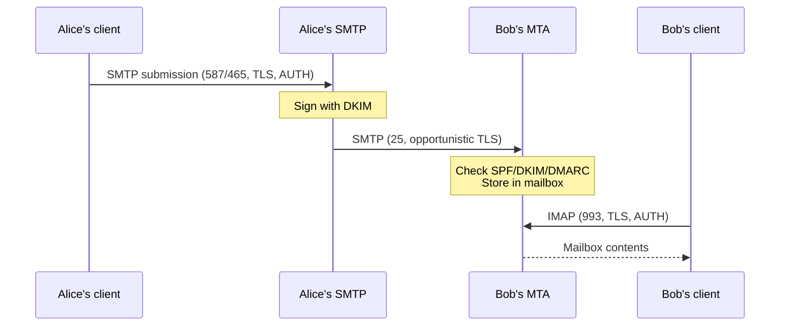

This is a tour through the moving parts of internet email, then a walkthrough of pointing the [Himalaya](https://github.com/pimalaya/himalaya) CLI at a Gmail account. The two halves reinforce each other: every screen of the Himalaya setup wizard maps to a concept from the protocol stack.

## Table of contents

## What Himalaya is

Himalaya is a CLI email client written in Rust, part of the [Pimalaya](https://github.com/pimalaya) project, which factors out reusable mail/calendar/contacts libraries.

- 🦀 **Language**: Rust
- 📥 **Receiving backends**: IMAP, Maildir, Notmuch, JMAP (build-flag dependent)
- 📤 **Sending backends**: SMTP, `sendmail`
- ⚙️ **Config**: TOML at `~/.config/himalaya/config.toml`
- 👥 **Multi-account**: yes
- 🔐 **PGP**: optional, via GPG or native pgp-rs
- 🖥️ **Ecosystem**: Vim/Neovim plugin, Emacs package, separate TUI binary

Its design goal is to expose the standards (IMAP/SMTP/JMAP/MIME) cleanly and ignore provider-specific UI gloss. That makes it portable across providers but means some Gmail-only features are simply absent.

## Installation

The official install script is the fastest path:

```bash
curl -sSL https://raw.githubusercontent.com/pimalaya/himalaya/master/install.sh | sh
```

Package-manager options:

```bash
cargo install himalaya            # Rust toolchain
brew install himalaya             # Homebrew (macOS/Linux)
pacman -S himalaya                # Arch (community)
nix-env -i himalaya               # Nix
scoop install himalaya            # Windows
```

Verify with:

```bash
himalaya --version
```

If you get `command not found`, the binary isn't on `$PATH`. Check `/usr/local/bin/`, `~/.local/bin/`, and the current directory — the install script's drop location varies by version.

## The protocol stack underneath

Before touching the wizard, it helps to know what Himalaya is actually going to do.

### Transport vs access



Email splits into two roles that use **different servers and different protocols**:

| Direction | Protocol | Job |
|---|---|---|
| Send | SMTP | Push a message *out* — your client hands it to a server that figures out delivery |
| Receive | IMAP or POP3 | Pull mail *in* — your client reads from a mailbox the server has been collecting |

Even within one provider, these are separate hosts:

- `smtp.gmail.com` — outgoing relay (port 465 or 587)
- `imap.gmail.com` — mailbox access (port 993)

This is why Himalaya's config has two distinct sections per account — one for IMAP, one for SMTP — using the same credentials but different endpoints.

### The full protocol map

| Layer | Protocol / Standard | Role |
|---|---|---|
| Transport | **SMTP** (port 25) | MTA → MTA delivery |
| Submission | **SMTP submission** (587, STARTTLS) / **SMTPS** (465, implicit TLS) | Client → outgoing server |
| Access | **POP3** (995) | Download-and-go, single folder |
| Access | **IMAP** (993) | Server-resident mailbox with folders, flags, search |
| Access | **JMAP** (443, HTTPS) | Modern JSON/HTTP replacement for IMAP |
| Format | **RFC 5322** | Headers and body structure |
| Format | **MIME** (RFC 2045–2049) | Multipart bodies, attachments, encodings |
| Auth (sender domain) | **SPF**, **DKIM**, **DMARC**, **ARC**, **BIMI** | Anti-spoofing, accountability |
| Auth (client → server) | **SASL** with PLAIN / LOGIN / SCRAM / XOAUTH2 | Login mechanism |
| Encryption (transport) | **STARTTLS**, implicit TLS | Wire-level secrecy |
| Encryption (end-to-end) | **PGP** (RFC 4880), **S/MIME** (RFC 8551) | Server never sees plaintext |

POP3 is "one device, offline-first." IMAP is "multi-device, server-of-record." JMAP is "I wish IMAP had been designed in 2018."

### SASL PLAIN — what the wire actually looks like

When Himalaya authenticates, it uses **SASL PLAIN** (RFC 4616). The client builds three fields joined by NUL bytes:

```
authzid \0 authcid \0 password
```

- `authzid` — "act as" identity, usually empty
- `authcid` — who you are (your full email address)
- `password` — your secret

That blob is base64-encoded and shipped inside the TLS tunnel.

For Gmail with an App Password:

```
\0you@gmail.com\0abcdefghijklmnop
```

base64 →

```
AHlvdUBnbWFpbC5jb20AYWJjZGVmZ2hpamtsbW5vcA==
```

Over IMAP:

```
C: A001 AUTHENTICATE PLAIN
S: +
C: AHlvdUBnbWFpbC5jb20AYWJjZGVmZ2hpamtsbW5vcA==
S: A001 OK Authenticated
```

Over SMTP submission:

```
C: EHLO mylaptop
S: 250-AUTH LOGIN PLAIN XOAUTH2
C: AUTH PLAIN AHlvdUBnbWFpbC5jb20AYWJjZGVmZ2hpamtsbW5vcA==
S: 235 2.7.0 Accepted
```

> ⚠️ **Base64 is encoding, not encryption.** TLS is what protects the password — Gmail refuses PLAIN over an unencrypted connection.

## Google App Passwords

### What they are

A **Google App Password** is a 16-character secret that Google generates for a specific app, used in place of your real Google password when an app can't do the modern OAuth2 flow (no browser, legacy IMAP/SMTP, etc.).

Properties:

- 🔒 Requires **2-Step Verification** enabled on the account
- 🪧 Per-app **label** for your reference (e.g. `himalaya-laptop`)
- 🚫 **Bypasses 2FA** for that one app — the app password *is* the second factor
- ♻️ **Revocable independently** of your main password
- 🌐 **Full-scope** — same permissions as your account password (not granular like OAuth scopes)
- ⏳ **Doesn't expire** unless revoked

### Critical limitation — what they do *not* unlock

This is a common misconception worth being explicit about. App Passwords only work with **legacy username+password protocols**. They do **not** work with Google's REST APIs.

| Protocol / API | Works with App Password? |
|---|---|
| IMAP / POP3 (Gmail read) | ✅ |
| SMTP (Gmail send) | ✅ |
| CalDAV (Calendar) | ✅ |
| CardDAV (Contacts) | ✅ |
| Gmail **API** (REST) | ❌ |
| Drive **API** (REST) | ❌ |
| Docs / Sheets / Slides **API** | ❌ |
| Calendar **API** (REST) | ❌ |

Google's REST APIs (`*.googleapis.com`) only accept:

```
Authorization: Bearer <oauth2-access-token>
```

They reject Basic auth entirely. There is no endpoint where you POST `email + app_password` and get JSON back. App Passwords exist solely as an escape hatch for **old protocols Google can't retrofit OAuth2 into easily** (1990s-era IMAP/SMTP). REST APIs were designed around OAuth2 from day one.

**Mental model**: App Passwords are "a way to keep your old IMAP client working," not "a personal API key."

For Drive/Docs/Sheets scripting, you need either:

1. **OAuth2 with a refresh token** — register a desktop app in Google Cloud Console, run the consent flow once, save the refresh token.
2. **Service Account** — for server-to-server use, no human user.

## Standard email features vs Gmail extras

Some of what you see in gmail.com is standardized, some is Gmail-only.

### Standard IMAP flags (RFC 9051)

Every IMAP server supports these per-message booleans:

| Flag | Meaning | Gmail UI calls it |
|---|---|---|
| `\Seen` | Read | Read/unread |
| `\Answered` | You replied | ↩ icon |
| `\Flagged` | User-flagged | **Starred** |
| `\Deleted` | Marked for deletion | (Gmail moves to Trash instead) |
| `\Draft` | Draft | Drafts folder |

### Standard folder roles (RFC 6154 SPECIAL-USE)

Folder *names* aren't standardized — `\Sent` might be `[Gmail]/Sent Mail` on Gmail, `Sent Items` on Outlook, `Sent` on Fastmail. RFC 6154 gives folders **role attributes** (`\Sent`, `\Trash`, `\Junk`, `\Drafts`, `\Archive`, `\All`) so clients can find them regardless of name.

### Standardized at the message level (RFC 5322)

- Threading uses `In-Reply-To` and `References` headers — Gmail's conversation view is just one rendering of that universal data.

### Gmail-only features (invisible to a standard IMAP client)

| Feature | Standard? |
|---|---|
| Labels (many per message) | ❌ Gmail-only, via `X-GM-LABELS` extension |
| Categories (Primary/Social/Promotions/…) | ❌ |
| Snooze / Mute / Send later / Confidential mode | ❌ |
| Important auto-marker | ❌ |
| Smart Reply / Smart Compose | ❌ |

### The "labels vs folders" twist

In standard IMAP, a message lives in exactly one folder. Gmail's data model is the opposite: every message is stored once in `[Gmail]/All Mail`, and **labels** are tags applied to it. The Inbox is just the `Inbox` label.

When you connect over IMAP, Gmail **emulates folders by lying**: each label appears as a folder, and a message with two labels shows up in both. Moving a message between IMAP folders actually adds/removes labels under the hood.

This is why Gmail's IMAP feels slightly off compared to other providers — the model underneath isn't really IMAP.

## Himalaya's "account" abstraction

Himalaya's central organizing unit is the **account**: one email identity with all the settings to read and send for it.

An account contains:

- **Identity**: display name, address, signature
- **Receiving backend**: IMAP / Maildir / Notmuch / JMAP
- **Sending backend**: SMTP / sendmail
- **Folder aliases**, **PGP settings**, **default folder**, etc.

In config:

```toml
[accounts.personal]
default = true
email = "you@example.com"
display-name = "Your Name"

[accounts.personal.folder.alias]
inbox = "INBOX"
sent  = "[Gmail]/Sent Mail"
trash = "[Gmail]/Trash"

[accounts.personal.backend]
type = "imap"
host = "imap.gmail.com"
port = 993
encryption = "tls"
login = "you@example.com"
auth.type = "password"
auth.raw = "abcdefghijklmnop"

[accounts.personal.message.send.backend]
type = "smtp"
host = "smtp.gmail.com"
port = 465
encryption = "tls"
login = "you@example.com"
auth.type = "password"
auth.raw = "abcdefghijklmnop"
```

On the CLI:

```bash
himalaya account list                  # show all configured accounts
himalaya envelope list                 # uses the default account
himalaya -a work envelope list         # pick a specific account
```

Exactly one account should be marked `default = true`.

## Setup wizard — Gmail walkthrough

Running `himalaya` with no config triggers the wizard. Here's what to pick and why for Gmail.

### Prerequisites

1. **Enable 2-Step Verification** at `myaccount.google.com/security`.
2. **Generate an App Password** at `myaccount.google.com/apppasswords`.
   - Give it a descriptive name (e.g. `himalaya-laptop`) so future-you can revoke it cleanly.
   - Google shows the 16-char password **once**. Keep it visible until you've pasted it into the wizard.

### Wizard choices

| Prompt | Pick | Why |
|---|---|---|
| Email address | `you@gmail.com` | Full address, not just local part |
| Account name | `gmail` | A short label you'll type as `-a gmail` |
| Default backend | **IMAP** | Talk to Gmail directly. Maildir is for local-synced storage; None is send-only. |
| IMAP hostname | `imap.gmail.com` | |
| IMAP encryption | **SSL/TLS** | Implicit TLS from byte 0 |
| IMAP port | `993` | Standard IMAPS port, matches SSL/TLS |
| IMAP login | `you@gmail.com` | Must be the full address |
| IMAP auth strategy | **plaintext** *or* **shell command** | Plaintext for first-try simplicity; shell command (e.g. `pass show gmail`) for daily use |
| IMAP password | *paste the App Password* | Not your real Google password |
| Sending backend | **SMTP** | Direct to Gmail's outgoing server |
| SMTP hostname | `smtp.gmail.com` | |
| SMTP encryption | **SSL/TLS** | Port 465 always means implicit TLS |
| SMTP port | `465` | |
| SMTP login | `you@gmail.com` | Same as IMAP |
| SMTP auth | same as IMAP | Same credential to the same identity |
| SMTP password | *same App Password* | |

### Password storage — your real choice

The wizard offers two strategies:

1. **Shell command** (recommended for daily use). You give it a command that prints the password to stdout. Common backends:

   ```bash
   pass show email/gmail              # GPG-backed password manager
   secret-tool lookup service mail    # GNOME keyring / KDE wallet
   bw get password gmail              # Bitwarden CLI
   ```

2. **Plaintext** (simple but readable in the config file).

   - Himalaya creates the config with mode `600` (only your user can read it).
   - On a single-user laptop the risk is comparable to your SSH private key.
   - Trivial to set up; switch later if you stick with the tool.

There's no benefit to mixing strategies between IMAP and SMTP — they authenticate to the same identity with the same credential.

## Using Himalaya — first 5 minutes

### Sanity check

```bash
himalaya folder list
```

Expected output:

```
INBOX
[Gmail]/All Mail
[Gmail]/Drafts
[Gmail]/Sent Mail
[Gmail]/Spam
[Gmail]/Starred
[Gmail]/Trash
```

If this prints, your IMAP auth and connection are working. If it fails, the credential or hostname is wrong.

### Read mail

```bash
himalaya envelope list                                 # recent in INBOX
himalaya envelope list --folder "[Gmail]/Sent Mail"
himalaya envelope list --page 2
himalaya message read 1234                             # open by ID
```

The ID is the leftmost number in `envelope list`. All later commands take it.

### Reply / forward / compose

```bash
himalaya message reply 1234
himalaya message reply 1234 --all
himalaya message forward 1234
himalaya message send                                  # blank template
```

Each opens `$EDITOR` with pre-filled headers. Save and quit to send.

### Flags

```bash
himalaya flag add seen 1234
himalaya flag remove seen 1234
himalaya flag add flagged 1234              # = Gmail star
```

Available flags: `seen`, `answered`, `flagged`, `deleted`, `draft`.

### Move / copy / delete

```bash
himalaya message move 1234 "[Gmail]/Trash"
himalaya message copy 1234 "[Gmail]/All Mail"
himalaya message delete 1234                # Gmail interprets as "move to Trash"
```

### Attachments

```bash
himalaya attachment download 1234

echo "see attached" | himalaya message send \
  --to friend@example.com \
  --subject "photo" \
  --attachment ~/Pictures/cat.jpg
```

(Flag names vary by version — check `himalaya message send --help`.)

### Search

```bash
himalaya envelope list --query 'from gmail.com'
himalaya envelope list --query 'subject invoice'
himalaya envelope list --query 'since 1-May-2026'
himalaya envelope list --query 'unseen'
```

This goes through standard IMAP `SEARCH` — same operators across providers.

### Folder aliases for muscle memory

```toml
[accounts.gmail.folder.alias]
inbox  = "INBOX"
sent   = "[Gmail]/Sent Mail"
trash  = "[Gmail]/Trash"
drafts = "[Gmail]/Drafts"
spam   = "[Gmail]/Spam"
all    = "[Gmail]/All Mail"
```

Then:

```bash
himalaya envelope list --folder sent
himalaya envelope list --folder trash
```

If you later add a Fastmail or Outlook account with the same aliases, the same commands work against any of them.

## How portable is Himalaya across providers?

Mostly very. Some seams to know about.

### What Himalaya does

- Speaks standard IMAP / SMTP / JMAP / Maildir / Notmuch via the Pimalaya backend libraries.
- Exposes standard concepts only: folders, flags, MIME parts, RFC 5322 headers.
- CLI surface is identical regardless of provider.

### What it deliberately ignores

- Gmail labels (as labels), categories, snooze, mute, important, confidential, smart compose
- Outlook categories, focused inbox, rules, mentions
- Fastmail masked email aliases
- Provider-specific search syntax (`from:`, `has:attachment`)

This is a feature, not a gap — the tool stays small and portable.

### Where the abstraction still leaks

| Quirk | What you see |
|---|---|
| Gmail labels-as-folders | One message in `INBOX` *and* `[Gmail]/All Mail` simultaneously |
| Folder names | `[Gmail]/Sent Mail` is quoted, hierarchical, easy to mistype |
| `\Deleted` on Gmail | Doesn't actually delete — you must move to Trash |
| All Mail = archive | "Archive" means "remove Inbox label," not "move file" |
| `SPECIAL-USE` advertisement | Inconsistent across providers — sometimes you alias manually |

### Mental model

> Himalaya is to email what `git` is to source control: it speaks the standard protocols, abstracts the common verbs, and largely ignores provider-specific UI gloss. You get consistency across providers at the cost of vendor-only features.

For Gmail-exclusive features (snooze, smart reply, confidential mode), gmail.com is still where they live. Himalaya gives you a clean, scriptable, portable subset that works the same against any IMAP/SMTP-capable server.

## Bringing it together

Every screen in the Himalaya wizard now has a meaning beyond "fill in form":

- ✅ Two backend blocks because email **sends** and **receives** via different servers (SMTP vs IMAP).
- ✅ Both pointing at `*.gmail.com` because Gmail runs both server types under one identity.
- ✅ Port `993` and `465` because **implicit TLS** is the SSL/TLS variant of each protocol.
- ✅ Login = full email address because **SASL PLAIN's `authcid`** wants the canonical identity.
- ✅ Password = 16-char App Password because Gmail's IMAP/SMTP servers accept that string in place of your real password (and refuse your real password since 2022).
- ✅ Plaintext-or-command for storage because Himalaya passes that string to **SASL PLAIN** at auth time, and only cares that you produce it somehow.

That's the whole pipeline: standards-based protocols, an account abstraction that maps to one identity, and a small Rust binary that drives it.
