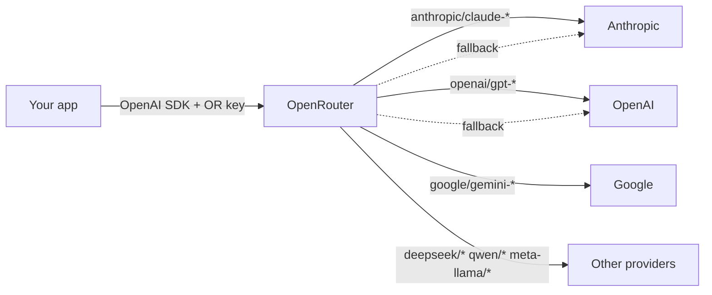

[OpenRouter](https://openrouter.ai) is a unified API gateway in front of many LLM providers. One key, one OpenAI-compatible endpoint, one balance — and you can swap between Anthropic, OpenAI, Google, Meta, Mistral, DeepSeek, Qwen, and a long tail of open-source and niche models by changing a string.

This post collects what's useful to know about OpenRouter's model catalog: the architecture in one diagram, the `/models` API contract (from the live docs, not vibes), and a quick look at the current ~365-model lineup.

## What OpenRouter is



Highlights:

- **OpenAI-SDK compatible.** Point the OpenAI client at `https://openrouter.ai/api/v1` with an OpenRouter key — same `chat.completions` shape.
- **Pay-as-you-go credits.** One balance covers every provider; pricing is passed through with a small margin.
- **Routing and fallbacks.** Provider preferences, automatic fallbacks, and a `:free` tier on some models.
- **Useful for**: model comparison, avoiding many provider accounts, and building apps that need to swap models without rewiring.

## Listing models: `GET /api/v1/models`

This is the canonical "what's available right now" endpoint. It returns the **full** catalog in one response — no pagination, currently a few hundred entries.

```bash
curl https://openrouter.ai/api/v1/models
```

### Query parameters

From the live API reference:

| Parameter | Type | Notes |
|---|---|---|
| `category` | string | One of: `programming`, `roleplay`, `marketing`, `marketing/seo`, `technology`, `science`, `translation`, `legal`, `finance`, `health`, `trivia`, `academia` |
| `supported_parameters` | string | Comma-separated, e.g. `tools,reasoning,structured_outputs` |
| `output_modalities` | string | `text` (default), `image`, `audio`, `embeddings`, or `all` |
| `use_rss` | flag | Return results as an RSS feed |
| `use_rss_chat_links` | flag | Use chat links in RSS items |

For richer filtering (by provider, price, context length, free tier) the practical pattern is to fetch once and filter client-side with `jq`:

```bash
# Only Anthropic models
curl -s https://openrouter.ai/api/v1/models \
  | jq '.data[] | select(.id | startswith("anthropic/")) | .id'

# Free-tier variants
curl -s https://openrouter.ai/api/v1/models \
  | jq '.data[] | select(.id | endswith(":free")) | .id'

# Context >= 200k
curl -s https://openrouter.ai/api/v1/models \
  | jq '.data[] | select(.context_length >= 200000) | .id'
```

### Authentication

The docs list `Authorization: Bearer <key>` as required. In practice this endpoint has historically also worked unauthenticated; with a key the response is **filtered by your provider preferences, privacy settings, and guardrails** — that's what the related `/models/user` endpoint exists for.

### Response schema

Each entry is a model object. The fields worth knowing:

**Identity & metadata**

- `id` — e.g. `anthropic/claude-opus-4.7`
- `canonical_slug` — URL-friendly identifier
- `name`, `description`
- `created` — Unix timestamp
- `knowledge_cutoff` — ISO 8601 (nullable)
- `expiration_date` — ISO 8601 removal date (nullable)
- `hugging_face_id` — HF identifier (nullable)

**Architecture**

- `architecture.input_modalities` — array (`text`, `image`, `file`, `audio`, `video`)
- `architecture.output_modalities` — array (`text`, `image`, `embeddings`, `audio`, `video`, `rerank`, `speech`, `transcription`)
- `architecture.instruct_type` — `chatml`, `claude`, `llama3`, etc.
- `architecture.tokenizer` — `GPT`, `Claude`, `Gemini`, `Llama3`, …

**Limits**

- `context_length`
- `per_request_limits.prompt_tokens` / `completion_tokens`

**Parameters**

- `supported_parameters` — array (`temperature`, `tools`, `reasoning`, `response_format`, `web_search_options`, …)
- `default_parameters` — provider defaults

**Pricing** (strings, per-token USD)

- `prompt`, `completion`
- `image`, `audio`, `image_output`, `audio_output`
- `input_cache_read`, `input_cache_write`, `input_audio_cache`
- `request`, `web_search_options`, `internal_reasoning`
- `discount` — percentage off

**Provider**

- `top_provider.context_length`, `max_completion_tokens`, `is_moderated`

**Other**

- `links.details` — per-model API URL
- `supported_voices` — voice IDs for TTS models

### What is NOT in the response

This trips people up:

- ❌ Your account's token usage
- ❌ Global popularity, request counts, or trending rank
- ❌ Rate-limit remaining

It's purely **static configuration + pricing**. For usage data, use the related endpoints below. Popularity rankings exist on the OpenRouter website but aren't exposed through this API.

## Related endpoints

| Endpoint | Purpose |
|---|---|
| `GET /api/v1/models/count` | Just the total number of models |
| `GET /api/v1/models/user` | Catalog filtered by your provider preferences and privacy settings (auth-filtered variant) |
| `GET /api/v1/models/{id}/endpoints` | Per-provider options for a single model (useful when one model is served by multiple providers) |
| `GET /api/v1/credits` | Your remaining credit balance |
| `GET /api/v1/generation?id=...` | Token counts and cost for a specific generation you made |
| `GET /api/v1/key` | Info about the API key being used |

## Snapshot of the catalog

At time of writing the API returned **365 models** across ~50+ provider prefixes. The shape of the catalog:

| Provider prefix | Count |
|---|---:|
| `openai/` | 65 |
| `qwen/` | 51 |
| `google/` | 27 |
| `mistralai/` | 24 |
| `meta-llama/` | 14 |
| `z-ai/` | 13 |
| `deepseek/` | 13 |
| `anthropic/` | 12 |
| `x-ai/` | 11 |
| `nvidia/` | 9 |
| `minimax/` | 8 |
| (50+ smaller providers) | … |

A few patterns worth noting:

- **`:free` suffix** marks free-tier variants (e.g. `meta-llama/llama-3.3-70b-instruct:free`). They're listed as separate entries from their paid siblings.
- **`~` prefix** marks "latest" aliases (e.g. `~anthropic/claude-opus-latest`) that always resolve to the current flagship of a line.
- **`openrouter/auto`** lets OpenRouter pick a model for you based on your prompt and preferences.

## Example: comparing a hand-picked set

Prices below are converted to **per 1M tokens** for readability.

| Model | ID | Context | Input $/1M | Output $/1M | Modalities |
|---|---|---:|---:|---:|---|
| Kimi K2.6 | `moonshotai/kimi-k2.6` | 262,144 | $0.75 | $3.50 | text+image → text |
| Claude Sonnet 4.6 | `anthropic/claude-sonnet-4.6` | 1,000,000 | $3.00 | $15.00 | text+image → text |
| Claude Opus 4.7 | `anthropic/claude-opus-4.7` | 1,000,000 | $5.00 | $25.00 | text+image → text |
| DeepSeek V4 Flash | `deepseek/deepseek-v4-flash` | 1,048,576 | $0.14 | $0.28 | text → text |
| Gemini 3 Flash Preview | `google/gemini-3-flash-preview` | 1,048,576 | $0.50 | $3.00 | text+image+file+audio+video → text |
| DeepSeek V3.2 | `deepseek/deepseek-v3.2` | 131,072 | $0.252 | $0.378 | text → text |
| Hy3 preview | `tencent/hy3-preview` | 262,144 | $0.066 | $0.26 | text → text |
| DeepSeek V4 Pro | `deepseek/deepseek-v4-pro` | 1,048,576 | $0.435 | $0.87 | text → text |
| MiniMax M2.7 | `minimax/minimax-m2.7` | 196,608 | $0.299 | $1.20 | text → text |

A few quick reads:

- **Multimodality.** Gemini 3 Flash Preview is the most omnivorous on inputs (text + image + file + audio + video). Claude and Kimi take text + image. The DeepSeek and Tencent entries are text-only.
- **Cost spread.** Tencent Hy3 preview comes in roughly **75× cheaper on input** than Claude Opus 4.7. The DeepSeek V4 line is the obvious "huge-context, low-cost" choice if text-only is fine.
- **Context.** Several models now ship 1M-token windows; even the "small" Hy3 preview is at 256K.

## Takeaways

- One endpoint (`/api/v1/models`) gives you the whole catalog as static JSON — fetch once, filter client-side, done.
- Server-side filters are limited to `category`, `supported_parameters`, `output_modalities`, and RSS toggles.
- Don't expect usage or popularity data from this endpoint — that's a separate set of endpoints (and partly only on the website).
- The catalog moves fast. A model snapshot is useful for posts and dashboards, but production code should refetch and re-filter rather than hardcoding IDs.

## References

- [OpenRouter docs index](https://openrouter.ai/docs)
- [List models endpoint](https://openrouter.ai/docs/api/api-reference/models/get-models.mdx)
- [OpenAPI spec (JSON)](https://openrouter.ai/openapi.json)
