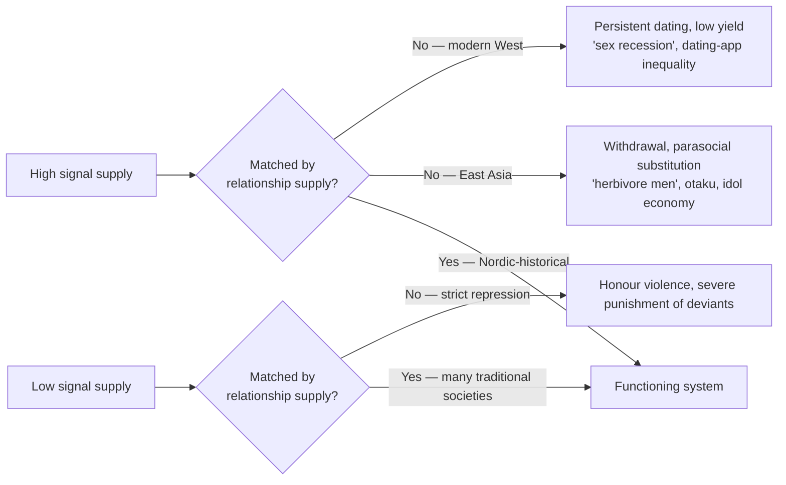

This is a record of an attempt to sharpen a single intuition into something defensible: that the modern environment exposes humans to a historically novel volume of sexual signals that almost never connect to actual sexual contact, and that this asymmetry deserves to be named, studied, and treated as its own analytical category — neither moralised nor dismissed.

The path runs through the existing research literature, through Japan and the Nordics, through the wanting/liking split in the brain, through the politics of why nobody talks about it this way, into the pollution analogy, and finally into the diagnostic value of memes that turn out to be false.

## 1. Where the research actually stands

The first thing to clear away is the impression that "porn addiction" is a settled scientific category. It is not.

The DSM-5 declined to include sex or pornography addiction in 2013 on the grounds that the evidence base was insufficient. The WHO's ICD-11 (2018) introduced **Compulsive Sexual Behaviour Disorder (CSBD)** but explicitly classified it as an impulse-control disorder, not an addiction.

Joshua Grubbs's **moral incongruence** model is central here: a large share of self-described "porn addicts" do not use pornography at unusually high frequencies, but their use conflicts with religious or moral self-image, generating subjective distress that gets relabeled as addiction. Nicole Prause's electrophysiology work likewise found that high-frequency users do not show the brain-response signature characteristic of substance addiction.

On the other side, Valerie Voon's fMRI studies at Cambridge found activation patterns in compulsive users overlapping with those of substance addicts when cued. Gary Wilson's popular *Your Brain on Porn* synthesis is widely read but has been heavily criticised on methodological and causal grounds.

The cleanest summary of the field:

| Question | Empirical state |
|---|---|
| Is "porn addiction" a recognised diagnosis? | No (DSM-5); CSBD exists in ICD-11 as impulse-control, not addiction |
| Does heavy use harm relationship satisfaction? | Mixed, small effect sizes, varies by gender and motivation |
| Does it cause erectile dysfunction (PIED)? | Reported clinically; large samples (Prause & Pfaus 2015) find no negative association |
| Does adolescent exposure affect attitudes? | Correlational evidence (Peter & Valkenburg) — causal direction unresolved |
| Are mainstream contents more aggressive than people expect? | Yes (Bridges et al.), with significant content variation |

The honest read: most of the literature is cross-sectional, mostly self-reported, mostly on university students, and frequently conflates *use* with *problematic use*. Single-study conclusions in either direction should be treated with caution.

## 2. The intuition: one category, not many

Once the research is bracketed, a different question becomes visible.

Pornography is one thing. Algorithmic short-video platforms that surface attractive bodies in non-explicit but suggestive form are another. Advertising imagery is a third. Fashion modelling and "commercial street" displays of attractive people are a fourth. Idol industries and parasocial fandom are a fifth.

The intuition: **these may all belong to a single category**. They are all engineered, amplified, market-selected signals of sexual attractiveness, delivered at densities and intensities that no human society before the industrial-mass-media era could produce, and almost none of which terminate in actual sexual contact.

This is the intuition the rest of the post is trying to defend and refine.

## 3. What already exists in the literature

The framing is not entirely without precedent. It just hasn't been pulled together.

- **Pornographication / sexualisation of culture** — Brian McNair's *Striptease Culture* (2002) and Feona Attwood's *Mainstreaming Sex* (2009) argue that the visual language of pornography has migrated into fashion, advertising, music video, and social media, eroding the porn/non-porn distinction.
- **Supernormal stimuli** — Niko Tinbergen's ethological concept (gulls preferring fake eggs more vivid than real ones), extended by Deirdre Barrett in *Supernormal Stimuli* (2010) to fast food, social media, and pornography as a class of industrially amplified signals.
- **Wanting vs. liking** — Kent Berridge and Terry Robinson's incentive-salience theory distinguishes the dopaminergic *wanting* system from the opioidergic *liking* system, and shows the two can decouple — chronic stimulation can sensitise *wanting* while *liking* flattens.
- **Sexual economics / cheap sex** — Roy Baumeister's sexual-economics theory and Mark Regnerus's *Cheap Sex* argue that low-cost substitutes (porn, dating apps) distort the relationship market.
- **Cold intimacies** — Eva Illouz's *Why Love Hurts* and *The End of Love* analyse how market logic and excess choice produce "negative selection" as the dominant mode of modern romance.
- **The agony of Eros** — Byung-Chul Han argues that universal pornographication dissolves Eros, which depends on distance, otherness, and negativity.

Each of these touches a face of the same object. None of them assembles the whole.

## 4. The supply / consummation mismatch

The first refinement: **the relevant variable is not how much stimulation, but the gap between stimulation supply and consummation supply.**

This handles the Nordic counter-objection. High-erotic-content societies like Scandinavia or, historically, the Trobriand Islanders, do not show the expected dysfunctions of "too much stimulation" — but they also do not have a *gap*. Stimulation and contact track each other.

The interesting cases are mismatches:

### 4a. Japan: high signal, narrow channel

The data on Japan are not folklore. The National Institute of Population and Social Security Research's lifetime-unmarried-rate series shows that by 2020, ~28% of men and ~18% of women remained unmarried at 50. JASE and the same institute's basic surveys put the "no sexual experience" rate among unmarried 30-somethings around 25% for years. Sexless marriages (セックスレス) are extensively documented. Simultaneously, Japan has perhaps the world's most developed pornography, 2D adult content, idol economy, and *fūzoku* industries.

Anne Allison's *Precarious Japan* situates this in post-bubble economic stagnation, employment precarity, and social atomisation. Patrick Galbraith's work on *moe* and otaku culture treats 2D affective objects as institutional **substitutes** for relationships the market has priced out — almost a textbook case of "stimulation without connection." Masahiro Yamada's *konkatsu* research and Maki Fukasawa's "herbivore men" concept point the same way: rising relationship costs drive young men out of the market while sexual desire is redirected into mediated substitutes. South Korea is the same structure intensified — conservative substrate, hyperdeveloped idol and beauty industries, the 4B movement, the lowest fertility rate on record, the "N-give-up generation."

### 4b. The West: modern attitudes, market distortion

Kate Julian's 2018 *Atlantic* piece, "Why Are Young People Having So Little Sex," brought this into the mainstream. Jean Twenge's generational data show declining sexual frequency among American 18–29 year-olds and rising rates of sexual inactivity — and this is happening in the most sexually permissive decades on record, with the easiest content access in history.

Regnerus's *Cheap Sex* argues that pornography and dating apps lower the marginal cost of sexual satisfaction for men, reducing their motivation to enter committed relationships, while women face declining bargaining power in this market. Eva Illouz argues from sociology that market logic and excess choice produce *negative selection* — non-choosing rather than choosing.

The published dating-app data (Hinge, Tinder, the early OkCupid posts) show extremely right-skewed attention distributions: a small fraction of top-percentile men receive the bulk of female interest, while most others receive almost none. The result is a peculiar market: most participants have their *stimulation* persistently amplified (seeing signals of attractiveness) while their *connection* is persistently blocked.

### 4c. A complication

It would be too neat to attribute East Asian and Western patterns entirely to the stimulation–consummation gap. Japan's situation entangles with post-bubble male income relative to women, the erosion of lifetime employment, women's rising education and labour participation against a workplace that punishes mothers (the M-curve), housing costs, and long working hours. The Western "sex recession" entangles with smartphones and sleep deprivation (Twenge's emphasis), delayed independence, the mental-health crisis, declining alcohol consumption, and falling social trust.

The Nordic picture is also drifting. Osmo Kontula's FINSEX longitudinal data show Finnish sexual frequency declining since the 2000s, satisfaction declining, and reported difficulty finding partners rising. If even Finland is moving toward the gap pattern, then the underlying driver may be global — a common technological-economic structure — and the regional patterns are just different starting points refracting the same trend.

## 5. The ratio model and its repair

A natural next move is to ask whether there is some *ratio* between stimulation and consummation that constitutes a healthy operating range — traditional societies suppressed the numerator, modern societies inflated it, and the right zone is in between.

The intuition is structurally serious — it has a long lineage from Freud's libidinal economy to Reich's orgastic potency — but the literal version does not survive.

Reasons a fixed ratio cannot be right:

- **Massive interpersonal variance.** Laumann's NHSLS data show the top decile of sexual frequency is dozens of times the bottom decile. A universal ratio cannot accommodate that distribution.
- **Cultural construction of the signal.** In Victorian England, an exposed ankle was stimulus; in some hunter-gatherer societies, near-nudity is not. The numerator slides by orders of magnitude depending on the decoding frame.
- **Plasticity.** The system recalibrates over weeks to months. The "reset" phenomena reported by NoFap communities are not well-documented scientifically but reflect a real underlying truth: removing high-intensity input gradually raises sensitivity to lower-intensity input. No hard-coded ratio.

A more defensible version drops the literal ratio and keeps the structural claim:

> The human sexual-motivation system evolved in an environment where stimulus density was naturally bounded and most attention either resolved (into pairing, social interaction, or natural extinction) or stayed within a small known social network. It is not well-suited to two modern conditions: (a) very large volumes of supernormal, permanently inaccessible visual signals; (b) signals that look accessible but are blocked by market-selection filters (apps, idol culture).

The predicted cost is not "pent-up energy" but **chronic activation of the dopaminergic wanting system decoupled from the satisfaction system**: motivational atrophy (real pursuit costs more than substitutes pay), elevated satiation thresholds (real contact underwhelms expectations), and reduced attraction to ordinary partners (supernormal forms have raised the bar).

This holds whether the imbalance comes from stimulus excess (modern) or extreme suppression with occasional rebound (some traditional regimes). The damage is to the calibration of the system, not to its hydraulics.

## 6. The political homelessness of the category

A real question is why nobody has assembled the four pieces above — unified category, evolutionary mismatch, consumption-without-connection, historically unprecedented scale — into a single named research object.

The honest answer seems to be that the category is **politically homeless**, and political homelessness is a strong selection pressure against intellectual assembly:

- **Conservatives** would adopt the conclusion but in moral-spiritual language ("decay," "vice"), which costs the concept secular-scientific legitimacy.
- **Liberal-secular and feminist scholars** are the natural authors of "environmental harm" categories (they invented "hostile environment," "systemic harassment"), but cannot adopt this one without it being read as ammunition for censorship, dress codes, or repression of sexual minorities.
- **Catharine MacKinnon and Andrea Dworkin** came closest in the 1980s with their Minneapolis and Indianapolis civil-rights ordinances framing pornography as group-level environmental harm — the ordinances were struck down and the theory was later marginalised by sex-positive feminism.
- **Economic gravity.** The opposing interests — advertising, fashion, entertainment, social media platforms, pornography, dating apps — collectively constitute the central engine of the modern consumer economy. Light pollution had a small concentrated advocate (astronomers) against diffuse opponents. This category has diffuse advocates against the strongest concentrated incumbents in the economy.
- **Methodological individualism.** "It's a private choice" is the default frame for sexual consumption in Western public discourse. The category requires a population-level / environmental framing.
- **No clear "harmed organ."** Air pollution has the lung. Light pollution acquired melatonin and circadian rhythm. This category would need an anchor — most plausibly the pair-bonding and fertility system, since fertility decline is the one quantifiable indicator governments already track.
- **The consumer is the victim.** Air pollution has clean separation between cause and casualty. Here the consumer voluntarily seeks exposure. Making the harm legible requires arguing a short-term-preference / long-term-welfare gap, structurally similar to addictive-substances regulation — and politically harder.
- **The attention-economy framing crowded out the adjacent space.** Tristan Harris and the humane-tech movement took the conceptual oxygen for "algorithmic harm" while *deliberately avoiding* the sexual dimension as too radioactive.

The category does not exist not because the observation is hard, but because **saying it costs too much**, and no political coalition will subsidise the cost.

## 7. Pollution as the right analogy

The most useful frame is the parallel with **light pollution**, which had to be argued into existence over decades.

Before the 1970s, "light pollution" was not a concept. Light was good. Each individual lamp had a legitimate reason. The harms were diffuse and the "victim" was ambiguous (astronomers? nocturnal animals? sleepers?). Measurement was hard.

The conceptual breakthrough was not "light is bad." It was: **a thing that is harmless at the unit level can produce systemic effects at densities exceeding the evolutionary or ecological range**. Once that abstract structure was accepted, "light" could be naturalised as a pollution category.

The structure transfers cleanly:

| Variable | Light pollution | Hypothesised stimulation pollution |
|---|---|---|
| Unit-level signal | A lamp | A piece of erotic media / model / advertisement |
| Unit-level harm | None | None |
| Producer rationality | Legitimate | Legitimate |
| Victim | Astronomers, wildlife, sleepers | Motivation system, pair-bonding market, mental health |
| Measurement | Lux, sky brightness | "Mean daily exposure to high-salience sexual signal"? |
| Mechanism of recognition | Aggregate exceeds evolutionary range | Aggregate exceeds evolutionary range |

What the analogy yields is a research programme, not a moral conclusion: it suggests a **population-scale environmental parameter** — the signal-to-contact ratio at the species level — should be studied like other ecological variables, the way evolutionary nutrition science treats sugar-and-fat density.

## 8. Memes as cultural data

A widely circulated viral story claims that a remote Amazonian tribe received Starlink internet, the young men became addicted to Pornhub and refused to support families, the young women became fixated on K-pop boy bands, and the tribe's fertility collapsed.

The factual record is more boring. The Marubo people in Brazil's Javari Valley did get Starlink in 2022, and a *New York Times* article by Jack Nicas in June 2024 reported concerns within the community about social-media saturation, scams, violent content, and minors accessing pornography. The story was then heavily distorted by TMZ, Yahoo, and over 100 outlets into a "porn-addiction" narrative; the *NYT* published a follow-up correcting this; the Marubo filed a $180M defamation suit in Los Angeles in May 2025. The reporter's stay was under 48 hours, not the implied week. **The K-pop and fertility-collapse claims appear in no actual source.** The Marubo population has in fact been growing.

This is where the meme becomes more interesting than the truth. The story acquired exactly three specific additions on its way through the meme ecosystem:

1. **"Addiction"** — strengthens the narrative
2. **A symmetric female counterpart (K-pop)** — supplies the missing gender symmetry
3. **Fertility collapse** — supplies the missing consequence

Each one fills a slot that would be needed to convert the original (mild, complex) story into a *parable* about the stimulation-without-consummation hypothesis. The collective unconscious performed the editing automatically.

This is consistent with a long tradition in cultural analysis — Mary Douglas in *Purity and Danger*, Jan Brunvand on urban legends, modern rumour-analysis work — finding that rumours are filtered not by accuracy but by **narrative fit**. A rumour spreads to the extent that it articulates something the audience already half-feels. The Marubo story spreads because it gives shape to a widespread, normally unsayable anxiety. By contrast, "someone parted the Red Sea" does not spread, because it maps to no contemporary anxiety.

So although the story is mostly false, **its spread is data**: it indicates the prior existence of the perception it confirms.

## 9. Well-poisoning: a stronger version of the rumour argument

A natural counter: medieval Europe spread the rumour that Jews poisoned wells. That was false, and it was also widely believed and broadly transmitted. By "rumour-spread implies real underlying phenomenon," we would have to credit it.

But this actually strengthens the argument when handled carefully. Medieval well-poisoning rumours circulated against the backdrop of **real waterborne disease**, especially during plague outbreaks. Without germ theory, people had no language for invisible water-borne pathogens. Their **phenomenal observation** — water source ⇒ illness ⇒ external contamination — was correct. Their **attribution** — Jews — was catastrophically wrong.

The general pattern: *correct phenomenal observation + wrong attribution = rumour*. Critique should target the attribution without dismissing the phenomenon.

The lesson for the present argument is double-edged:

- *Strengthens it:* the modern flood of "tech-and-sex is ruining the young" stories may, like well-poisoning rumours, mis-attribute (to Pornhub specifically, to algorithms specifically, to women specifically, to men specifically) while correctly tracking a real environmental change.
- *Limits it:* rumour-spread alone cannot distinguish *real underlying phenomenon* (water-poisoning rumours ↔ waterborne disease) from *pure moral panic* (witches flying ↔ nothing). Both spread the same way.

So the rumour argument is **Bayesian-weak**: it shifts the prior toward "there is something real," but it does not establish it. Independent evidence has to do the rest.

For this category, independent evidence happens to exist:

- **Demographic:** declining young-adult sexual frequency across the US (GSS), UK (Natsal), Finland (FINSEX), Japan (JASE).
- **Behavioural-economic:** highly skewed dating-app match distributions.
- **Neuroscientific:** experimental evidence for supernormal-stimulus habituation and wanting/liking decoupling.
- **Cross-national:** Japan, South Korea, Southern Europe show the predicted statistical pattern.

The rumour signal *plus* the independent signals make the case look more like the well-poisoning case (real phenomenon, wrong attribution) than the witches case (no phenomenon).

## 10. Don't get high on your own supply

The diagnostic test that runs through all "high-externality industry" cases is **revealed preference among insiders**: what do the people building the product do for their own children?

The tech case is dense with evidence. *The Information* reported that Silicon Valley children spend far less screen time than the national average. Steve Jobs told *The New York Times* he limited his children's iPad and iPhone use. Snap's Evan Spiegel restricts his children to 90 minutes of screen time per week. Former Facebook executive Athena Chavarria has said "I am convinced the devil lives in our phones" and did not give her children smartphones until high school. Chamath Palihapitiya, in a Stanford GSB talk, expressed "tremendous guilt" about the platforms he helped build — "the tools we have created are ripping apart the social fabric of how society works" — and said his children "aren't allowed to use that shit." Silicon Valley nannies sign no-screen contracts. The Waldorf schools, which ban screens, are full of children of Google, Apple, Yahoo, HP, and eBay employees. Journalists have explicitly compared the pattern to the 1990s tobacco executives who would not let their own children smoke.

The pornography / sexual-media industry is structurally different, and the difference is itself informative.

There is almost no public information about the family life of leadership in the adult-content industry. Reporting on MindGeek (Pornhub's parent) noted that "little is known" about the personal lives of its former CEO and COO — a single line that carries weight. Compare to tech: Zuckerberg's children's media diet, Pichai's parenting choices, Cook's habits are all on the public record. MindGeek leadership maintains a near-total visibility blackout.

This **asymmetry of visibility is itself a data point**. The industry has a strong incentive not to make leadership personal practices public — because if it became known that pornography executives forbade their own children from using their products, it would be a catastrophic public-relations event for the entire industry. Silence is the optimal strategy.

The proxy evidence that does exist points the same way:

- **Internal Pornhub documents** released in federal litigation in 2025 (analysed by Nicholas Kristof) show executives debating which troubling tags to remove. They removed "kiddy" and "infant" but kept "brutal," "childhood," "force," "snuffs," "unwilling," "minor," and "wasted." Kristof's reading: management was conflicted, but the tags were enormous traffic drivers. This is incompatible with "insiders genuinely believe the product is harmless"; it is the signature pattern of **knowingly continuing a high-externality product**, the same pattern documented in tobacco-industry memos.
- **Performers and producers:** ex-performers, current OnlyFans creators, Instagram sexual-content creators repeatedly answer "no" when asked whether they want their daughters in the industry or their sons consuming this content. Emily Ratajkowski's *My Body* makes the case at length. This is the revealed preference of producer-side insiders against their own product.

The diagnostic has a boundary: insiders restricting their own children's use proves they do not believe the product is universally harmless across all doses, not that they believe it is universally harmful. Tobacco executives believed cigarettes were dangerous, but the dose mattered. The same dose-dependence applies here.

But the more interesting observation is that the adult-content industry is currently in an **early-stage invisibility phase** of recognition — pre-whistleblower, pre-Congressional hearing, pre-public-health framing. Tobacco was there. Sugar was there. Social media was there until Frances Haugen. If this category is going to be named, the trajectory probably looks like a 10–20-year slow concept drift, ending in mass leaks of internal memos and a "tobacco moment" for sexual-content industries.

## 11. Synthesis

Pulling the threads together, here is the strongest version of the position that survives all the refinements:

- [x] Pornography, short-video platforms, advertising imagery, fashion, idol economies, and the parasocial-romance industries form a **single analytical category**: industrially amplified signals of sexual attractiveness, delivered at densities far above the ancestral range, with consummation rates near zero.
- [x] The relevant variable is the **gap** between stimulation supply and relationship supply, not the absolute amount of either.
- [x] Plausible mechanism: **chronic activation of dopaminergic wanting decoupled from opioidergic liking**, producing motivational atrophy, satiation-threshold drift, and reduced attraction to ordinary partners.
- [x] The category applies symmetrically across genders, on different channels — visual-bodily for men, emotional-relational / status-narrative for women (idol culture, romance fiction, parasocial fandom). The political asymmetry of which channel gets criticised is itself diagnostic.
- [x] The "pollution" framing is the right one: harmless at the unit level, systemic effects at population density, requires a new measurement vocabulary.
- [x] The category is **politically homeless** — neither secular-liberal nor religious-conservative coalitions can adopt it without contamination — which explains why it has not been assembled, even though every piece exists.
- [x] **Viral memes** (the Marubo tribe story, etc.) function as cultural-diagnostic evidence: their spread does not prove the underlying phenomenon, but it does establish that the perception is widespread, pre-existing, and lacks a legitimate vocabulary.
- [x] **Insider revealed preference** — tech executives restricting their own children, leaked Pornhub memos showing conflicted internal debate, performers refusing the industry for their daughters — is consistent with the standard high-externality-industry pattern.

The position deliberately does **not** include:

- [ ] That traditional regimes of sex segregation were the right solution.
- [ ] That "any exposure is harmful."
- [ ] That the consensus mechanism is the addiction model.
- [ ] That this fully explains fertility decline or the sex recession (both are over-determined).

The category is worth naming. The naming has high political cost. The cost is why it has not happened. The independent evidence is sufficient that someone, eventually, will pay that cost.

---

[^1]: The core conceptual borrowings: Tinbergen on supernormal stimuli, Berridge on wanting vs. liking, Henrich on cultural-evolution mismatch, Baumeister and Regnerus on sexual economics, Illouz on cold intimacies, Han on the agony of Eros, McNair and Attwood on pornographication, Barrett's *Supernormal Stimuli*, Mary Douglas on the cultural function of rumour, Brunvand on urban legends, MacKinnon and Dworkin on pornography as environmental civil-rights harm.
