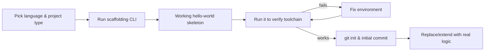

## What is scaffolding?

In software development, **scaffolding** means auto-generating the skeletal structure of code or a project so you don't have to write boilerplate by hand. The metaphor borrows from construction: external structure put up to make building easier, then filled in or removed.

There are two common senses of the term.

### 1. Project / code generation (the most common sense)

A tool emits a starter set of files, folders, and boilerplate for you to fill in. Examples:

- `rails generate scaffold Post title:string body:text` → creates model, migration, controller, views, routes, and tests for a `Post` resource.
- `npm create vite@latest` → generates a working frontend project.
- `cargo new`, `dotnet new`, `django-admin startproject`, Yeoman generators, `nest g resource`, and more.

The output is meant as a **starting point**, not the final code — you edit and extend it.

### 2. Temporary support code

Throwaway code that supports development but isn't part of the final product:

- **Test scaffolding** — setup/teardown, fixtures, mock harnesses around the code under test.
- **Stub implementations** that let you build the rest of the system before the real piece exists.

## Why structure matters before logic

Every language and framework has expected conventions: file layout, config files, manifests. Tooling (build, test, dependency resolution, IDE support) expects these — so getting the layout right matters before you write any logic.

| Ecosystem | Required structural pieces |
| --- | --- |
| Python | `pyproject.toml` (or `setup.py`), package directory, often `requirements.txt`, `.gitignore`, `README.md` |
| Node.js | `package.json`, `node_modules/` (gitignored), `src/`, `tsconfig.json` for TypeScript |
| Rust | `Cargo.toml`, `src/main.rs` or `src/lib.rs` |
| Go | `go.mod`, package directories |
| Java / Maven | `pom.xml`, `src/main/java/...`, `src/test/java/...` |

You almost never set this up manually. Use a scaffolding tool instead:

```bash
cargo new myproj
npm create vite@latest
django-admin startproject myproj
dotnet new console
uv init        # or: poetry new
```

One command generates the correct structure. **Then** you start writing logic.

## The standard modern workflow

The mainstream pattern is three steps: **scaffold → verify → build**.



### Step 1 — Scaffold

CLI generates the project skeleton:

```bash
cargo new myapp
npm create vite@latest myapp
django-admin startproject myapp
```

### Step 2 — Verify it runs

The generated code is usually already a working "hello world":

```bash
cargo run                    # prints "Hello, world!"
npm run dev                  # serves the starter page
python manage.py runserver   # starts the dev server
```

This confirms your toolchain — compiler, interpreter, dependencies, paths — is set up correctly **before** you've written any of your own code. If "hello world" doesn't run, you fix the environment now, not later when it's tangled with your logic.

### Step 3 — Write real logic

Incrementally replace or extend the scaffolded code.

## Why this order matters

- **Separates environment problems from code problems.** If your code breaks after step 3, you know it's your logic, not a misconfigured toolchain.
- **Gives you a known-good baseline** to `git commit` before you start changing things.
- **Inherits good defaults.** Most scaffolds also set up testing, linting, and build config — so you don't reinvent them.

## Caveats

- ✅ For a tiny throwaway script (one `.py` file), you can skip scaffolding entirely.
- ⚠️ Some ecosystems have multiple scaffolding tools with different opinions. For React alone: Vite, Next.js, Create React App. Picking one is a real decision.
- 🗑️ Scaffolds can include things you don't need — it's fine to delete files you won't use.

## Takeaway

Yes, structure-first — but let the tooling create the structure. Don't hand-craft it. The three-step pattern (scaffold → verify → build) is the right mental model for starting any new project.
