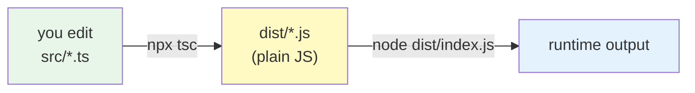
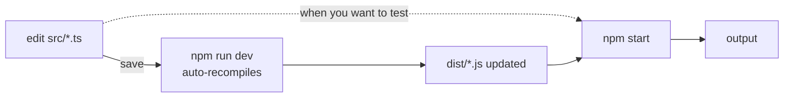
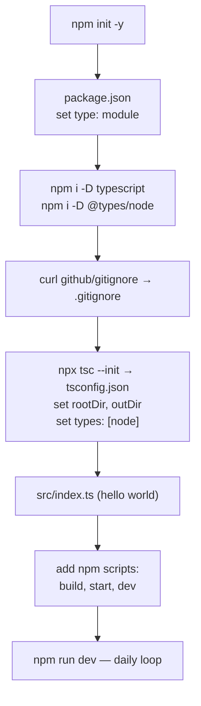

A walkthrough of setting up a TypeScript-on-Node project the traditional way (explicit `tsc` compile step, no clever runners), with conceptual side-trips at each tool so the moving parts stop being magic.

## Target setup

By the end we'll have:

```
my-app/
├── .gitignore
├── package.json
├── package-lock.json
├── tsconfig.json
├── node_modules/        (gitignored)
├── dist/                (gitignored, compiled JS)
└── src/
    └── index.ts
```

And three commands:

```bash
npm run build    # tsc: src/*.ts → dist/*.js
npm start        # node dist/index.js
npm run dev      # tsc --watch (incremental rebuild on save)
```

## Step 1 — `npm init -y`

```bash
npm init -y
```

Creates `package.json` with default values, skipping the interactive prompts (`-y` = `--yes`).

A fresh `package.json` from npm 11.x looks roughly like this:

```json
{
  "name": "my-app",
  "version": "1.0.0",
  "main": "index.js",
  "scripts": {
    "test": "echo \"Error: no test specified\" && exit 1"
  },
  "license": "ISC",
  "type": "commonjs"
}
```

A couple of fields worth understanding before we move on.

### The `main` field

`main` tells Node (and bundlers) **which file to load when someone imports your package by name**. If another project does `require("my-app")`, Node resolves to whatever `main` points at.

It does **not** matter when you run your own code with `node app.js` — that ignores `main` entirely. For a CLI or application, `main` is harmless but unused. It only matters when your project is a library that other projects import.

(Modern packages often use the `exports` field instead, which supports multiple entry points and conditional ESM/CJS exports. If both exist, `exports` wins.)

### Does `node some-file.js` read `package.json`?

Yes — but **not to find the entry point**. Node reads it to figure out **how to parse your file**:

| Field | Used by `node file.js` for | |
|---|---|---|
| `type` | Deciding ESM vs CommonJS parsing | ✅ |
| `imports` | Resolving `#alias` subpath imports | ✅ |
| `main` | Only matters when *another* package does `require("my-app")` | ❌ |
| `exports` | Only matters when *another* package imports yours | ❌ |
| `scripts` | Only `npm run` cares | ❌ |

Node walks up the directory tree from your file until it finds a `package.json` (or hits the filesystem root). The nearest one wins.

## Step 2 — Pick a module system: ESM or CommonJS

The `"type"` field decides how `.js` files in this package are parsed. There are two module systems and they're incompatible:

| | CommonJS (CJS) | ES Modules (ESM) |
|---|---|---|
| Import | `const fs = require("fs")` | `import fs from "fs"` |
| Export | `module.exports = ...` | `export default ...` |
| Loading | synchronous | asynchronous |
| Top-level await | ❌ | ✅ |
| Age | original Node format (2009) | standardized 2015, Node ~2019 |

The `"type"` field decides what `.js` means:

| `type` value | `.js` parsed as | `.cjs` | `.mjs` |
|---|---|---|---|
| `"commonjs"` (or missing) | CommonJS | CommonJS | ESM |
| `"module"` | ESM | CommonJS | ESM |

`.cjs` and `.mjs` are always unambiguous — they override `"type"`. `"type"` only resolves what `.js` means.

For a new project in 2026, choose ESM:

```json
{ "type": "module" }
```

With `"type": "module"`:

- No `require` — use `import` (or `import()` for dynamic loading).
- No `__dirname` / `__filename` — use `import.meta.url`:
  ```js
  import { fileURLToPath } from "node:url";
  import { dirname } from "node:path";
  const __dirname = dirname(fileURLToPath(import.meta.url));
  ```
- Import paths need extensions: `import "./util.js"`, not `import "./util"`.
- Top-level `await` works.
- Use the `node:` prefix for built-ins: `import fs from "node:fs"`.

## Step 3 — Install TypeScript

```bash
npm install --save-dev typescript
```

### "TypeScript" is overloaded — three things, one package

| Thing | What it is |
|---|---|
| The language | The syntax and type system (`let x: string = "hi"`) |
| The compiler | A program named `tsc` that reads `.ts` and emits `.js` |
| The npm package | `typescript` — published by Microsoft, ships both of the above |

When you install the npm package, you get:

- `tsc` — the compiler binary at `node_modules/.bin/tsc`
- `tsserver` — a language server your editor talks to for autocomplete, type hints, and red squigglies
- The compiler API — for tools that programmatically use TS's parser and type-checker

### Why `--save-dev`?

The flag (short: `-D`) saves it to `devDependencies` rather than `dependencies`. The categories:

| | `dependencies` | `devDependencies` |
|---|---|---|
| Flag | (default) or `-S` | `-D` |
| Needed at | **runtime** (production) | **development** only |
| Examples | `express`, `react` | `typescript`, `eslint`, `jest` |
| In production install | installed | skipped with `npm install --production` |

TypeScript is dev-only: you only need `tsc` to *compile* `.ts` → `.js`. The compiled JavaScript that production runs has no idea TypeScript was ever involved.

**Rule of thumb:** if removing it would break your app at runtime → `dependencies`. If it would only break your build, tests, or developer experience → `devDependencies`.

### Per-project vs global

Two install styles:

1. **Per-project (recommended)** — `npm i -D typescript` adds it as a devDependency of *this* repo. Everyone who clones gets the same version via `npm install`. Reproducible.
2. **Global** — `npm i -g typescript` puts `tsc` on your PATH everywhere. Convenient for one-off experiments, but versions drift across projects → "works on my machine" pain.

Per-project is the standard.

## Step 4 — Install `@types/node`

```bash
npm install --save-dev @types/node
```

### The problem this solves

Node's built-in modules (`fs`, `path`, `http`, `crypto`, etc.) are implemented in **C++ inside the Node binary**. They have no TypeScript source. TS has no way to look at them and figure out their shape.

Without help, this would error:

```ts
import fs from "node:fs";
// → Cannot find module 'node:fs' or its corresponding type declarations.
```

### What `@types/node` contains — two parts

This distinction matters later. `@types/node` ships:

**Part 1 — Module declarations** (for things you `import`):

```ts
declare module "node:fs" {
  export function readFileSync(path: string, encoding: "utf8" | ...): string;
}
```

**Part 2 — Ambient global declarations** (for things that just exist):

```ts
declare var __dirname: string;
declare var __filename: string;
declare var process: NodeJS.Process;
declare var Buffer: BufferConstructor;
declare function setTimeout(...): ...;
```

Part 1 is consulted by **module resolution** when you write `import`. Part 2 describes Node's **globals** — variables you use without importing.

### DefinitelyTyped

`@types/node` is part of [DefinitelyTyped][dt] — a community repo of type declarations for JS packages that don't ship their own:

| Package | Types package |
|---|---|
| `node` (built-ins) | `@types/node` |
| `express` | `@types/express` |
| `lodash` | `@types/lodash` |
| `react` | `@types/react` |

**Rule of thumb:** if a JS package was written before TypeScript was popular (or in plain JS), you likely need `@types/<name>`. Modern libraries written in TS ship their own types — no `@types/*` needed.

Always a devDependency: type declarations are stripped during `tsc` emit, so production never sees them.

## Step 5 — `.gitignore`

GitHub maintains a canonical collection of `.gitignore` templates at [`github/gitignore`][ghi]. The "add `.gitignore` template" dropdown in GitHub's "new repo" UI pulls from it.

There's no standalone `TypeScript.gitignore`. The template for TS-on-Node projects is `Node.gitignore` — it already includes TS-specific patterns (`*.tsbuildinfo`, `typings/`) alongside the standard Node ignores.

```bash
curl -fsSL https://raw.githubusercontent.com/github/gitignore/main/Node.gitignore -o .gitignore
```

The key entries for our setup:

| Pattern | Why it matters |
|---|---|
| `node_modules/` | Installed packages — huge, reinstallable from `package.json` |
| `*.tsbuildinfo` | TS's incremental compile cache |
| `dist` | Default output folder for compiled JS |
| `.env`, `.env.*` (but `!.env.example` kept) | Secrets out, but example templates can be committed |

The template covers many other ecosystems too (Next.js, Gatsby, Yarn v3, etc.). Most people leave it as-is for portability; some trim. Either is fine.

## Step 6 — `tsconfig.json`

```bash
npx tsc --init
```

### What `npx` actually does

`npx` ships with `npm` and solves: **how to run a binary that's installed locally to your project, not globally**. Resolution order:

1. Look in `./node_modules/.bin/` (this project)
2. Look up the directory tree in any parent `node_modules/.bin/`
3. If still missing → download from npm temporarily, run once, delete

For us, step 1 hits immediately because we installed `typescript` already.

### The traditional TypeScript workflow

Before we look at the config, the mental model:



Three pieces:

1. **TypeScript** — the language. Adds types on top of JS.
2. **`tsc`** — the compiler. Reads `.ts`, type-checks, emits plain `.js`.
3. **`tsconfig.json`** — tells `tsc` how to behave: which files to compile, what JS version to target, where to put output, how strict to be.

Once compiled, the `.js` in `dist/` is regular JavaScript. Node has no idea TypeScript was ever involved.

### Does `"type"` still matter when writing TypeScript? Yes — more so.

TypeScript doesn't run in Node. It compiles to JavaScript, and that **emitted JS** is what Node loads. So two configs now have to agree:

| Where | Field | Controls |
|---|---|---|
| `tsconfig.json` | `"module"` | What kind of JS `tsc` emits (ESM or CJS) |
| `package.json` | `"type"` | How Node parses the emitted `.js` |

If `tsconfig` says "emit ESM" but `package.json` says "treat `.js` as CommonJS", Node sees `import` keywords in a file it parses as CJS → `SyntaxError`. The two must match.

**In TS source you always write `import`/`export`** regardless of emit target. That's standard ESM syntax (a JavaScript feature, not a TS one). `tsc` decides whether to keep it as `import`/`export` or rewrite it to `require`/`module.exports` based on `"module"` in `tsconfig`.

**Recommended setting:**

```json
{ "module": "nodenext", "moduleResolution": "nodenext" }
```

`nodenext` is special: it reads `package.json`'s `"type"` field and emits accordingly. If you ever flip `"type"` back to `"commonjs"`, `tsc` follows along automatically. No drift.

### What `tsc --init` writes in 2026

Modern `tsc --init` (TS 6.x) emits a curated config, not the legacy wall of commented options:

```json
{
  "compilerOptions": {
    "module": "nodenext",
    "target": "esnext",
    "types": [],
    "sourceMap": true,
    "declaration": true,
    "declarationMap": true,
    "noUncheckedIndexedAccess": true,
    "exactOptionalPropertyTypes": true,
    "strict": true,
    "jsx": "react-jsx",
    "verbatimModuleSyntax": true,
    "isolatedModules": true,
    "noUncheckedSideEffectImports": true,
    "moduleDetection": "force",
    "skipLibCheck": true
  }
}
```

Most of it is good. Two essential changes follow.

### Change 1: enable `rootDir` and `outDir`

```diff
- // "rootDir": "./src",
- // "outDir": "./dist",
+ "rootDir": "./src",
+ "outDir": "./dist",
```

Without these, `tsc` puts compiled `.js` next to the `.ts` files (`src/index.ts` → `src/index.js`). Setting them gives the clean `src/` → `dist/` split.

### Change 2: set `"types": ["node"]`

This is subtle. The default `"types": []` means "load **no** `@types/*` packages globally" — so even though we installed `@types/node`, TS would ignore its globals.

#### What `"types"` actually controls

Recall `@types/node`'s two parts. The `"types"` field controls **only Part 2** (ambient globals):

| `tsconfig` | Imports (Part 1) | Globals (Part 2) |
|---|---|---|
| `"types"` not set | ✓ Works | ✓ All visible `@types/*` globals auto-included |
| `"types": []` | ✓ Works | ✗ No globals included |
| `"types": ["node"]` | ✓ Works | ✓ Only `@types/node` globals included |

So with `"types": []`, this is the actual breakage:

```ts
import fs from "node:fs";        // ✓ works — import resolution finds it
const data = fs.readFileSync(...) // ✓ works — types come through the import

process.env.NODE_ENV              // ❌ Cannot find name 'process'
__dirname                         // ❌ Cannot find name '__dirname'
setTimeout(() => {}, 100)         // ❌ Cannot find name 'setTimeout'
```

Imports work; globals break.

#### Why the template ships `"types": []`

It's a deliberate "opt-in to globals" choice. When `"types"` is unset, TS includes ambient globals from **every** `@types/*` package in `node_modules`. That can leak.

**Realistic scenario:** months from now you add Jest:

```bash
npm install --save-dev jest @types/jest
```

`@types/jest` declares `describe`, `it`, `expect`, `beforeEach` as **globals**. That's correct for test files — Jest injects them at runtime when tests run.

But TS doesn't know which file is a test. With `"types"` unset, `describe` is global in **every** file. In `src/index.ts` (production code):

```ts
describe("startup", () => {   // accidentally typed
  startServer();
});
```

| Step | Result |
|---|---|
| Editor | Autocompletes `describe(...)` — no warning |
| `tsc` type-check | ✓ Passes — `describe` exists globally as far as TS knows |
| Node in production | 💥 `ReferenceError: describe is not defined` |

The type from a tool meant for one context (Jest tests) seeped into another (production code), and TS lost the ability to catch the mismatch.

`"types": ["node"]` blocks this. For test files you'd add a separate `tsconfig.test.json` with `"types": ["node", "jest"]` scoped to `tests/**/*.ts`. Jest globals exist where you want them and nowhere else.

The modern template ships `"types": []` defensively. The trade is: you have to explicitly opt in to `["node"]` now to prepay for safety later.

### Other notable defaults

| Setting | What it does |
|---|---|
| `strict: true` | All strict type-checking flags on |
| `noUncheckedIndexedAccess: true` | `arr[0]` is typed as `T \| undefined` — catches out-of-bounds bugs |
| `exactOptionalPropertyTypes: true` | `{x?: number}` rejects `{x: undefined}` — pedantic but precise |
| `verbatimModuleSyntax: true` | Forces `import type` for type-only imports (clean ESM emit) |
| `isolatedModules: true` | Disallows TS features that break single-file transpilation |
| `skipLibCheck: true` | Skip type-checking inside `.d.ts` in `node_modules` — much faster |
| `sourceMap: true` | Emit `.js.map` for debuggers |
| `declaration: true` | Emit `.d.ts` for downstream library consumers |

The strict flags can feel noisy when learning. `noUncheckedIndexedAccess` catches real bugs and the discipline is worthwhile; `exactOptionalPropertyTypes` is niche enough that turning it off until needed is reasonable.

## Step 7 — Hello world

```ts
// src/index.ts
const greet = (name: string): string => `Hello, ${name}!`;
console.log(greet("world"));
```

Compile and run:

```bash
$ npx tsc
$ node dist/index.js
Hello, world!
```

### What `tsc` emitted

```js
// dist/index.js
const greet = (name) => `Hello, ${name}!`;
console.log(greet("world"));
export {};
```

Three things worth noticing:

- **The types are gone.** No `: string` anywhere. TypeScript is a *type-erasure* language — types are used at compile time for checking, then deleted.
- **The structure is identical** otherwise. Arrow function, template literal, `console.log` — all standard JS.
- **`export {};`** was added because of `moduleDetection: "force"` — it marks the file as an ES module even with no real imports/exports.

### The `dist/` side products

| File | Purpose |
|---|---|
| `index.js` | The compiled JavaScript Node runs |
| `index.js.map` | Source map — debuggers map runtime errors back to your `.ts` |
| `index.d.ts` | Type-only declaration file (useful for library consumers) |
| `index.d.ts.map` | Maps the `.d.ts` back to your `.ts` for "Go to definition" |

For an application (not a library), you can turn `declaration` and `declarationMap` off later for a cleaner `dist/`.

## Step 8 — npm scripts

Re-typing the commands gets old fast. Add to `package.json`:

```json
"scripts": {
  "build": "tsc",
  "start": "node dist/index.js",
  "dev": "tsc --watch"
}
```

Use:

```bash
npm run build    # compile
npm start        # run compiled output
npm run dev      # watch mode (in a separate terminal)
```

### `npm start` is special

A few scripts have shortcuts — npm runs them without `run`:

| Shortcut | Script name |
|---|---|
| `npm start` | `start` |
| `npm test` | `test` |
| `npm stop` | `stop` |
| `npm restart` | `restart` |
| `npm install` | `install` |

For anything you define yourself (`build`, `dev`), you need `npm run <name>`.

### Why scripts don't need `npx`

When npm runs a script, it automatically prepends `node_modules/.bin/` to `PATH`. So `"build": "tsc"` resolves `tsc` to the local install without the `npx` prefix. `npx` is only needed at a raw shell prompt.

### The daily loop



Open `npm run dev` in one terminal and leave it running. Edit in your editor. Run `npm start` in another terminal whenever you want to see output.

## Summary



The whole thing is six commands plus three small file edits:

```bash
npm init -y
# edit package.json: "type": "module"
npm install --save-dev typescript @types/node
curl -fsSL https://raw.githubusercontent.com/github/gitignore/main/Node.gitignore -o .gitignore
npx tsc --init
# edit tsconfig.json: enable rootDir/outDir, set types: ["node"]
# write src/index.ts
# add build/start/dev to scripts
```

[dt]: https://github.com/DefinitelyTyped/DefinitelyTyped
[ghi]: https://github.com/github/gitignore
