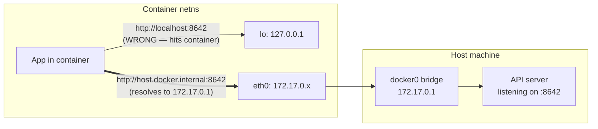

A flag you see all over Open WebUI / Ollama / LLM-server tutorials:

```bash
--add-host=host.docker.internal:host-gateway
```

It looks like a hostname-to-IP mapping, but `host-gateway` isn't an IP — it's a Docker-recognized token. This note unpacks what the flag does, why it exists, and the gotchas around it.

## The two pieces

### `--add-host=NAME:IP`

A generic Docker flag. At container start, Docker injects a static entry into the container's `/etc/hosts` file mapping `NAME` to `IP`. From inside the container, anything resolving `NAME` gets `IP` — no DNS server involved. The hosts-file lookup wins before DNS.

### `host-gateway`

A **magic string**, not a literal address. When Docker sees `host-gateway` in the IP slot, it substitutes the IP of the host machine *as seen from the container's network namespace*. On a default bridge network, that's typically `172.17.0.1` — the `docker0` bridge interface on the host.

Added in Docker 20.10 specifically to give Linux users a portable way to reach the host without hardcoding `172.17.0.1`, which can vary across networks, custom bridges, or daemon configs.

You can override what `host-gateway` resolves to with the daemon's `host-gateway-ip` setting in `/etc/docker/daemon.json`, but the default is the bridge gateway.

## Why this specific hostname?

`host.docker.internal` is a convention **Docker Desktop** (Mac/Windows) introduced years ago. On those platforms, the container automatically resolves it to the host VM. A huge amount of tutorial code and config files assume the name exists.

But on **Linux Docker Engine**, the hostname is *not* provided automatically. A container running code that says "connect to `host.docker.internal`" will fail with a DNS error on Linux unless you add it yourself.

`--add-host=host.docker.internal:host-gateway` is the standard workaround: it makes Linux behave like Docker Desktop for that one name. On Docker Desktop itself, the flag is redundant but harmless — the built-in entry already exists.

## Why a container can't just use `localhost`

A container has its own network namespace. From inside, `localhost` / `127.0.0.1` means the **container itself**, not the host.

If a service runs on the host at `:8642` and the container tries `http://localhost:8642`, it hits nothing — the container's loopback has no such service.

To reach the host, the container needs an address that routes out of its network namespace and back to the host's network stack. On a bridge network, that's the bridge gateway IP.



`host.docker.internal` → `host-gateway` simply gives you a friendly, portable name for that bridge gateway IP.

## What it looks like at runtime

After the container starts:

```bash
docker exec -it open-webui cat /etc/hosts
```

```
127.0.0.1       localhost
...
172.17.0.1      host.docker.internal
172.17.0.3      <container-id>
```

That `172.17.0.1` is your host. A request to `http://host.docker.internal:8642/v1` becomes a TCP connection to `172.17.0.1:8642`, landing on whatever is listening on the host at port `8642`.

## Alternatives

| Option | What it does | Trade-off |
|---|---|---|
| `--add-host=host.docker.internal:host-gateway` | Adds a hosts-file entry pointing to the bridge gateway | Container stays isolated; works on Linux and Docker Desktop |
| `--network=host` | Container shares the host's network namespace entirely | No port publishing, less isolation; behaves differently on Docker Desktop |
| Hardcode `172.17.0.1` | Use the literal bridge IP | Brittle — breaks on custom bridges or different daemon configs |

The `add-host` approach is usually the right default: keeps the container isolated, works the same on every platform, and survives bridge IP changes.

## Gotchas

- **The host service must bind to a reachable interface.** If the API server on the host is bound to `127.0.0.1:8642`, the container *cannot* reach it — `127.0.0.1` on the host is only reachable from the host itself. Bind to `0.0.0.0:8642` (or at least the docker bridge IP) for the container to connect.
- **Host firewall.** `ufw` / `iptables` rules on the host can block traffic from `172.17.0.0/16`. If the container can't connect, check this.
- **Custom bridge networks.** A user-defined bridge has a different gateway IP (e.g. `172.18.0.1`). `host-gateway` handles this automatically — that's the whole point of using the token instead of hardcoding.
- **Rootless Docker.** `host-gateway` works, but the host service must be reachable from the rootless network namespace. It's sometimes simpler there to use `--network=host`.
- **`:main` and other moving tags.** Unrelated to networking, but worth noting in the same breath: container images tagged `:main` or `:latest` change under you. Pin to a version tag for reproducibility.

## TL;DR

- `--add-host=NAME:IP` writes a line to the container's `/etc/hosts`.
- `host-gateway` is a Docker token resolving to "the host's IP as seen from this container."
- Together, the flag makes `host.docker.internal` work on Linux the same way it does on Docker Desktop.
- It exists because `localhost` inside a container means the container, not the host — and Linux Docker Engine doesn't provide the `host.docker.internal` name out of the box.
