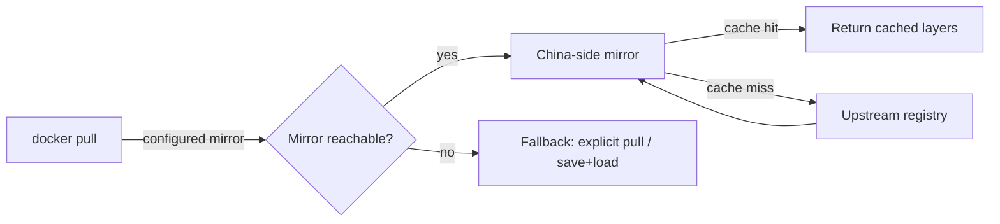
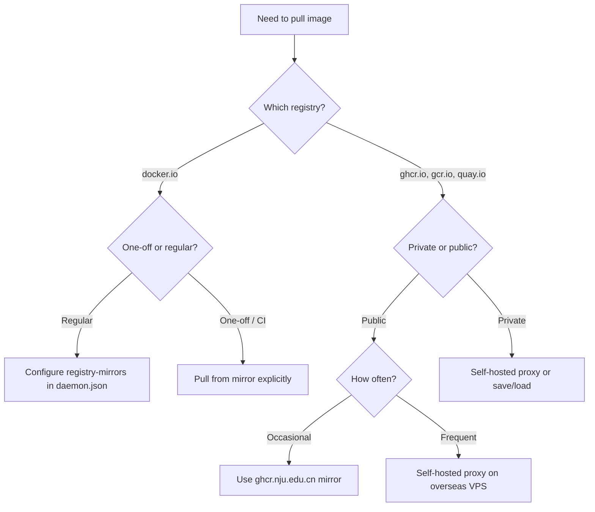

From inside China mainland, `registry-1.docker.io` and `ghcr.io` are
often slow, intermittent, or fully blocked. The fix is almost always
the same shape: route pulls through a **registry mirror** — a
China-reachable host that proxies (and caches) the upstream registry.

The mechanics differ slightly by source registry, though, and the
public mirror landscape shifts constantly. This note collects the
options that actually work in 2026, in rough order of convenience.

## Mental model



The key insight: the Docker client doesn't have to know it's using
a mirror. Either you tell the daemon globally (`registry-mirrors`),
or you encode the mirror into the image reference itself
(`mirror.example.com/library/nginx`).

## Docker Hub (`docker.io`)

This is the easy case — most Chinese mirrors exist specifically to
proxy Docker Hub.

### Option 1: Configure a registry mirror globally

Edit `/etc/docker/daemon.json`:

```json
{
  "registry-mirrors": [
    "https://docker.1ms.run",
    "https://docker.xuanyuan.me",
    "https://hub.rat.dev",
    "https://docker.m.daocloud.io"
  ]
}
```

Reload and restart:

```bash
sudo systemctl daemon-reload
sudo systemctl restart docker
```

After this, `docker pull nginx` transparently fetches via the first
reachable mirror. Verify with `docker info` — the mirrors should be
listed under **Registry Mirrors**.

> ⚠️ Public mirrors come and go. Aliyun, Tencent Cloud, and NetEase
> all tightened or shut down their free anonymous mirrors during
> 2024. Always test-pull a known image after configuring, and keep
> two or three mirrors in the list as fallbacks.

### Option 2: Pull from a mirror explicitly

When you can't edit `daemon.json` (shared CI runner, hardened host),
encode the mirror into the image reference:

```bash
docker pull docker.1ms.run/library/nginx:latest
docker tag  docker.1ms.run/library/nginx:latest nginx:latest
```

The `library/` prefix is required — official Docker Hub images live
under that namespace internally.

### Option 3: Cloud vendor personal accelerator

If you have an Aliyun or Tencent Cloud account, their consoles
offer a **personal accelerator URL** under
*Container Registry → Image Accelerator*. It looks like
`https://<your-id>.mirror.aliyuncs.com` and is generally faster and
more stable than public mirrors because rate limits are per-account.

Drop it into `registry-mirrors` the same way as Option 1.

## GitHub Container Registry (`ghcr.io`)

`ghcr.io` is trickier because most Chinese mirrors only proxy
`docker.io`. There are fewer working options, and they're less
stable.

### Option 1: Use a mirror that proxies ghcr.io

As of 2026, these public mirrors do support `ghcr.io`:

| Mirror                              | Notes                                |
| ----------------------------------- | ------------------------------------ |
| `ghcr.nju.edu.cn/OWNER/IMAGE:TAG`   | Run by Nanjing University, reliable  |
| `docker.1ms.run/ghcr.io/OWNER/...`  | Same host as Docker Hub mirror       |
| `ghcr.dockerproxy.com/OWNER/...`    | Intermittent — keep as a fallback    |

```bash
docker pull ghcr.nju.edu.cn/owner/image:tag
docker tag  ghcr.nju.edu.cn/owner/image:tag ghcr.io/owner/image:tag
```

The `nju.edu.cn` mirror is the most reliable — university-operated,
rarely goes down.

### Option 2: Self-host a pull-through proxy

If you pull from `ghcr.io` regularly, the long-term answer is to
run your own caching proxy on a small VPS outside China — Hong Kong,
Singapore, or Japan all work well.

```bash
# On the overseas VPS
docker run -d -p 5000:5000 \
  -e REGISTRY_PROXY_REMOTEURL=https://ghcr.io \
  --name ghcr-proxy \
  registry:2
```

From inside China:

```bash
docker pull your-vps.example.com:5000/owner/image:tag
```

If you don't put TLS in front of the proxy, add the host to
`insecure-registries` in `daemon.json`. This is what most teams
settle on long-term: public mirrors come and go; your own proxy
doesn't.

For **private** ghcr.io images, set
`REGISTRY_PROXY_USERNAME` / `REGISTRY_PROXY_PASSWORD` on the proxy
container (use a GitHub PAT with `read:packages`).

### Option 3: Cloudflare Workers proxy

A popular community trick: deploy a small Cloudflare Worker that
forwards requests to `ghcr.io`. Search GitHub for
`cloudflare-docker-proxy` — several maintained forks exist.

Configure `daemon.json` to use `your-worker.workers.dev` as a
registry mirror. The free tier is enough for personal use, but
Cloudflare Workers can be flaky from inside China on some ISPs
(notably China Mobile), so verify on your actual network before
relying on it.

### Option 4: Pull elsewhere, save, transfer

Universal fallback — works for any registry, no infrastructure
needed, but tedious for frequent pulls.

```bash
# On a machine with ghcr.io access
docker pull ghcr.io/owner/image:tag
docker save ghcr.io/owner/image:tag | gzip > image.tar.gz

# Transfer the tarball however you like, then:
gunzip -c image.tar.gz | docker load
```

Useful for one-off images, air-gapped servers, or private images
when you don't want to expose credentials to a proxy.

## Choosing between options



Rules of thumb:

- ✅ **Docker Hub, regular use** → global mirror config
- ✅ **Docker Hub, restricted host** → explicit mirror in image ref
- ✅ **ghcr.io, occasional public images** → `ghcr.nju.edu.cn`
- ✅ **ghcr.io, frequent use or private images** → self-hosted proxy
- ✅ **One-off, any registry** → `docker save` + transfer

## Gotchas worth knowing

- **Auth doesn't proxy through public mirrors.** Any private image
  needs Option 2 (your own proxy with credentials) or Option 4
  (offline transfer). Public mirrors can only serve public images.
- **`docker login` targets a specific registry.** When you retag
  from a mirror to `ghcr.io/...`, the credentials you used to pull
  are not attached to the new tag.
- **Manifest lists / multi-arch images** work through mirrors, but
  some proxies cache the manifest and serve a stale digest for a
  few minutes after upstream updates. If `:latest` looks wrong,
  re-pull after a delay or pin to a digest.
- **`docker info`** is the quickest sanity check — it shows which
  mirrors the daemon actually picked up after a config reload.

## Summary

| Scenario                              | Best option                                |
| ------------------------------------- | ------------------------------------------ |
| Docker Hub, daily dev                 | `registry-mirrors` in `daemon.json`        |
| Docker Hub, CI / locked-down host     | Explicit mirror in image reference         |
| ghcr.io, public, occasional           | `ghcr.nju.edu.cn` mirror                   |
| ghcr.io, frequent or private          | Self-hosted `registry:2` pull-through proxy|
| Any registry, one-off / air-gapped    | `docker save` + `docker load`              |

The whole space is volatile — mirrors get shut down, new ones
appear, and which ones the Great Firewall lets through changes.
The only durable answer is **your own proxy on a small overseas
VPS**. Everything else is a convenience layer on top.
