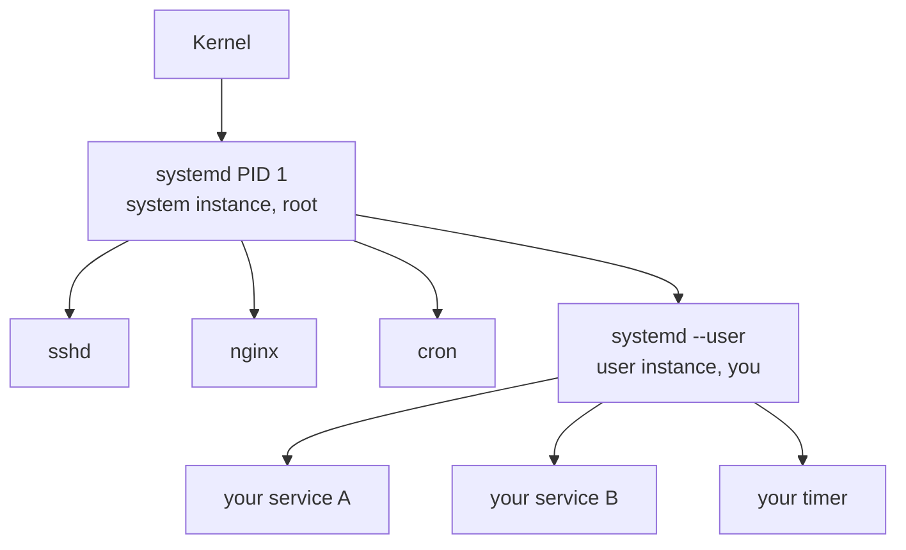

Most Linux users know `systemctl start nginx`. Fewer know there is a **second systemd** running under their own user account, with its own units, its own logs, and its own quirks. This note walks through what that user instance is, why it exists, and the one piece of config — *lingering* — that you almost always want on a server.

## Two systemds, not one

When a Linux box boots, PID 1 is a `systemd` process running as **root**. That's the *system instance*. It manages everything global: networking, sshd, cron, mounts, the login manager.

When you log in, systemd spawns a **second** systemd process — running as *you*. That's your *user instance*. You can spot it:

```bash
ps -ef | grep 'systemd --user'
# you  1234  1  0 09:00 ?  00:00:00 /lib/systemd/systemd --user
```

It speaks the same protocol as the root systemd, but it's scoped entirely to your account.



### Side-by-side

|                       | System instance                                     | User instance                                           |
| --------------------- | --------------------------------------------------- | ------------------------------------------------------- |
| Command               | `systemctl ...`                                     | `systemctl --user ...`                                  |
| Runs as               | root (PID 1)                                        | your user (one per logged-in user)                      |
| Started               | at boot                                             | at login (or boot, if lingering)                        |
| Manages               | system-wide services (nginx, sshd, cron)            | personal services (chat app, sync daemon, music player) |
| Unit files            | `/etc/systemd/system/`, `/usr/lib/systemd/system/`  | `~/.config/systemd/user/`, `/usr/lib/systemd/user/`     |
| Logs                  | `journalctl -u foo`                                 | `journalctl --user -u foo`                              |
| Needs sudo?           | yes                                                 | no                                                      |

## Why the user instance exists

Before user instances, "start this thing on boot and restart it if it crashes" had two bad answers:

1. Write a root-owned system service (needs sudo, pollutes `/etc`, runs as root unless you carefully add `User=`).
2. Hack something with `cron @reboot`, `nohup`, `screen`, or a desktop autostart file.

User instances give you the **full power of systemd** — `Restart=on-failure`, dependencies, timers, structured logging — without root, without touching `/etc`. Drop a unit file in `~/.config/systemd/user/`, run `systemctl --user enable --now foo`, done.

### A minimal user unit

```ini
# ~/.config/systemd/user/open-webui.service
[Unit]
Description=Open WebUI

[Service]
ExecStart=/home/you/.local/bin/open-webui serve
Restart=on-failure

[Install]
WantedBy=default.target
```

```bash
systemctl --user enable --now open-webui
systemctl --user status open-webui
journalctl --user -u open-webui -f
```

No sudo anywhere. Your user instance babysits the process; if it crashes, systemd restarts it.

## The headless-SSH problem

There's a catch. The user instance starts **when you have a real login session**. Desktop logins always have one. Bare SSH logins often **don't** behave the way you want:

- The user instance starts when you SSH in. ✅
- It **shuts down when you log out**, killing every user service. ❌

So your "auto-restart on failure" service dies the moment you close the terminal. Not great for a server.

This is exactly why installer scripts often warn about it. Concretely, a setup script that registers a user service may include an escape hatch:

```bash
# Skip service installation on a headless box without a working
# `systemd --user` session:
ENABLE_SERVICE=false bash scripts/setup.sh
```

Translation: "If your box can't keep a user instance alive, don't even try — just install the binary; you'll start it manually."

But there's a better fix than skipping: turn on lingering.

## Lingering

**Lingering** tells systemd: *"Keep this user's user-instance alive even when they aren't logged in."*

With lingering enabled, systemd will:

1. Start the user instance **at boot**, before anyone logs in.
2. Keep it running **after logout**.

Any services that user has enabled (`systemctl --user enable foo`) auto-start at boot and survive logout — just like system services, but without root and without polluting `/etc/systemd/system/`.

Under the hood, lingering is just an empty marker file at `/var/lib/systemd/linger/<username>`.

### Enable it

```bash
sudo loginctl enable-linger $USER
```

Check it:

```bash
loginctl show-user $USER | grep Linger
# Linger=yes
```

Disable it later:

```bash
sudo loginctl disable-linger $USER
```

### Gotcha after enabling

You still need a working **D-Bus session** in your current shell for `systemctl --user` to talk to the user instance. If you just turned on linger and `systemctl --user` still complains about *"Failed to connect to bus,"* log out and SSH back in — fresh session, working bus.

## Workflow on a fresh server

A reliable recipe for running a long-lived user service on a headless Linux box:

- [x] SSH in as your non-root user.
- [x] `sudo loginctl enable-linger $USER`
- [x] Log out, log back in.
- [x] Drop a unit file in `~/.config/systemd/user/` (or let an installer do it).
- [x] `systemctl --user enable --now foo`
- [x] Verify with `systemctl --user status foo` and `journalctl --user -u foo`.
- [x] Reboot once to confirm it really starts on boot.

That last step is worth doing — it's the easiest way to catch a unit that *looks* fine in a logged-in session but never starts cleanly from cold boot.

## Cheat sheet

```bash
# inspect
systemctl --user status              # overall state of your user instance
systemctl --user list-units          # what's running under you
systemctl --user list-unit-files     # all unit files visible to your instance

# lifecycle
systemctl --user start foo
systemctl --user stop foo
systemctl --user restart foo
systemctl --user enable --now foo    # start now + start on (next) login/boot
systemctl --user disable --now foo

# config changes
systemctl --user daemon-reload       # after editing a unit file

# logs
journalctl --user -u foo             # logs for one service
journalctl --user -f                 # tail all your user-service logs

# lingering
sudo loginctl enable-linger $USER
sudo loginctl disable-linger $USER
loginctl show-user $USER | grep Linger
```

## Mental model

Two sentences to keep in your head:

1. **`systemctl --user` is systemd for your account** — same machinery as the root systemd, no sudo, your unit files live under `~/.config/systemd/user/`.
2. **Lingering keeps your user-systemd alive between logins** — without it, "auto-restart on failure" stops mattering the moment you close the SSH session.
