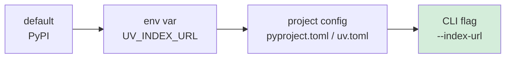

`uv` is a fast Python package manager from Astral. Out of the box it pulls from PyPI — the same index `pip` uses. From mainland China, or anywhere with a slow link to PyPI, swapping in a regional mirror like Tsinghua's TUNA can cut install times dramatically.

This note walks through where `uv` fetches from, how to override the index, and the gotchas that bite people.

## Default sources

`uv` actually downloads two different kinds of artifacts, from two different places:

| Artifact | Default source | Override env var |
| --- | --- | --- |
| Python packages (wheels, sdists) | PyPI — `https://pypi.org/simple` | `UV_INDEX_URL`, `UV_EXTRA_INDEX_URL` |
| Python interpreters | `python-build-standalone` GitHub releases | `UV_PYTHON_INSTALL_MIRROR` |

Switching the package index does **not** affect interpreter downloads. If `uv python install 3.12` is also slow, that's a separate mirror to configure.

## Ways to override the package index

There are four places you can set the index, in increasing precedence:



### 1. Environment variable

```bash
export UV_INDEX_URL=https://pypi.tuna.tsinghua.edu.cn/simple
```

`UV_EXTRA_INDEX_URL` adds additional indexes that are consulted alongside the primary one.

### 2. Project config (`pyproject.toml`)

```toml
[[tool.uv.index]]
url = "https://pypi.tuna.tsinghua.edu.cn/simple"
default = true
```

A project that declares its own index overrides whatever env var you have set globally. This is usually what you want — pinning the mirror per project keeps builds reproducible.

### 3. CLI flag

```bash
uv pip install --index-url https://pypi.tuna.tsinghua.edu.cn/simple requests
```

Wins over both env var and project config for that one command.

## Common mirrors

A few popular indexes that mirror PyPI:

- **Tsinghua TUNA** — `https://pypi.tuna.tsinghua.edu.cn/simple` (mainland China)
- **Alibaba Cloud** — `https://mirrors.aliyun.com/pypi/simple`
- **USTC** — `https://pypi.mirrors.ustc.edu.cn/simple`
- **Douban (legacy)** — historically popular but less reliable now

## Setting it persistently in bash

To make every new shell pick up the Tsinghua mirror, append the export to `~/.bashrc`:

```bash
echo 'export UV_INDEX_URL=https://pypi.tuna.tsinghua.edu.cn/simple' >> ~/.bashrc && source ~/.bashrc
```

Verify:

```bash
echo $UV_INDEX_URL
# https://pypi.tuna.tsinghua.edu.cn/simple
```

## Gotchas

A handful of things to keep in mind:

- ⚠️ **Already-running shells don't inherit the change.** A new export in `~/.bashrc` only applies to shells started after the edit. Re-source the file or open a new terminal.
- ⚠️ **Project config beats env var.** If a repo's `pyproject.toml` declares `[[tool.uv.index]]`, the env var is ignored for that project. This is by design — it keeps CI and local installs in sync.
- ⚠️ **CLI flags beat everything.** `--index-url` on the command line overrides both.
- ⏱️ **Mirrors lag PyPI slightly.** Tsinghua and friends usually sync every few minutes. A package released seconds ago may briefly 404 on the mirror.
- 🐍 **Interpreter downloads are separate.** Set `UV_PYTHON_INSTALL_MIRROR` if `uv python install` is also slow.

## Quick reference

```bash
# Set globally for your shell
export UV_INDEX_URL=https://pypi.tuna.tsinghua.edu.cn/simple

# One-off override
uv pip install --index-url https://pypi.tuna.tsinghua.edu.cn/simple <pkg>

# Per-project (in pyproject.toml)
[[tool.uv.index]]
url = "https://pypi.tuna.tsinghua.edu.cn/simple"
default = true

# Also mirror Python interpreter downloads
export UV_PYTHON_INSTALL_MIRROR=https://...
```

Pick the layer that matches your scope — a shell export for personal convenience, project config for reproducibility, CLI flag for the rare one-off.
