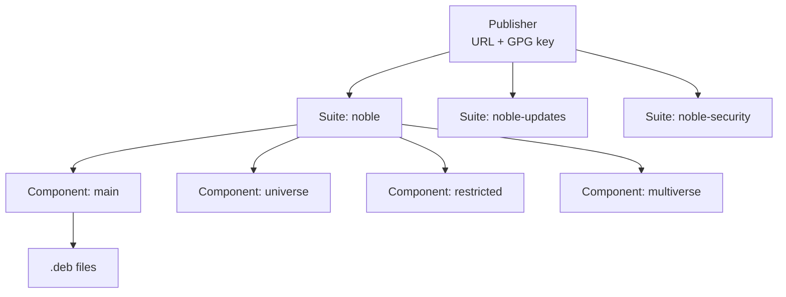

`apt` looks simple on the surface — `apt install foo` and you get foo — but the moment you want to add a third-party repo, swap to a faster mirror, or audit what's trusted on your machine, the model underneath becomes important. This post walks through the conceptual structure of apt repositories, where they live on disk, and how to switch a default Ubuntu install to a China-mainland mirror.

## Where apt puts things

When you run `apt install`, the `.deb` files get downloaded to:

| Path | What's there |
|---|---|
| `/var/cache/apt/archives/` | completed `.deb` downloads (kept until `apt clean`) |
| `/var/cache/apt/archives/partial/` | in-progress downloads |
| `/var/lib/apt/lists/` | package index / metadata fetched from each repo |
| `/etc/apt/sources.list` & `/etc/apt/sources.list.d/` | where apt downloads **from** |

`apt clean` wipes the archives cache; `apt autoclean` only drops `.deb`s that the repos no longer offer.

## The three-level repo model

An apt repository isn't one flat thing — it's a hierarchy:



### Publisher

The entity hosting and signing the repo. Identified by a **URL** (where to download from) and a **GPG key** (what apt trusts to verify packages).

Examples: Canonical (`archive.ubuntu.com`), Docker Inc. (`download.docker.com`), Google (`dl.google.com`). Adding a new publisher means adding a sources file *and* installing their public key.

### Suite

A named release/channel within the publisher's archive. Sometimes called a "distribution" — it corresponds to the `dists/<suite>/` directory in the repo layout on disk.

For Ubuntu:

- `noble` — Ubuntu 24.04 packages frozen at release time
- `noble-updates` — bug fixes added after release
- `noble-security` — security patches
- `noble-backports` — newer software backported from later Ubuntu releases

For Debian: `bookworm`, `bookworm-updates`, `bookworm-security`, plus rolling names like `stable`, `testing`, `unstable`.

### Component

A subdivision within a suite, usually by license or support status. Each component has its own `Packages` index.

| Component | License | Supported by |
|---|---|---|
| `main` | Free | Canonical |
| `restricted` | Proprietary | Canonical |
| `universe` | Free | Community |
| `multiverse` | Proprietary | Community |

Docker's repo uses `stable`, `test`, `nightly` as components — different release qualities of the same packages.

### Putting it together

A line like

```
deb http://archive.ubuntu.com/ubuntu/ noble main universe
```

reads: from publisher `archive.ubuntu.com/ubuntu/`, suite `noble`, enable components `main` and `universe`. apt fetches `dists/noble/main/binary-amd64/Packages` and `dists/noble/universe/binary-amd64/Packages` and merges them into its known-packages list.

## Anyone can run an apt repo

There is no central authority. An apt repository is just a directory tree with specific files served over HTTP(S) (or even `file://`). The minimal layout:

```
myrepo/
├── dists/
│   └── stable/
│       ├── Release         # metadata: components, architectures, hashes
│       ├── Release.gpg     # detached signature, OR
│       ├── InRelease       # signed Release (inline signature)
│       └── main/
│           └── binary-amd64/
│               ├── Packages   # index of all .deb files + hashes
│               └── Packages.gz
└── pool/
    └── main/
        └── h/hello/
            └── hello_1.0_amd64.deb
```

Tools that build this for you: `reprepro` (simple), `aptly` (snapshots + mirroring), `dpkg-scanpackages` (minimal). nginx serving static files works fine.

**The security model is: apt trusts whatever GPG keys you install.** Ubuntu's repo is just *the* well-known one — technically it's the same format as a one-person hobby PPA. Adding a third-party repo = trusting that publisher with root during install.

## The two source file formats

apt reads these locations on every `apt update`:

- `/etc/apt/sources.list` (legacy, single file)
- `/etc/apt/sources.list.d/*.list` (legacy format)
- `/etc/apt/sources.list.d/*.sources` (modern deb822 format)

### Legacy `.list` — one entry per line

```
deb [signed-by=/etc/apt/keyrings/docker.gpg] https://download.docker.com/linux/ubuntu noble stable
```

### Modern `.sources` (deb822) — paragraph per entry, multi-value fields

```
Types: deb
URIs: http://archive.ubuntu.com/ubuntu/
Suites: noble noble-updates noble-backports
Components: main restricted universe multiverse
Signed-By: /usr/share/keyrings/ubuntu-archive-keyring.gpg
```

One paragraph collapses what would be `3 suites × 4 components = 12 legacy lines` into a single block. Ubuntu 24.04 ships with this format by default.

By convention, one file holds one publisher (`docker.sources`, `google-chrome.list`), but apt doesn't care — it reads every entry across every file as a flat list.

## Auditing what's configured

A single command snapshot of every active repo:

```bash
ls /etc/apt/sources.list.d/
cat /etc/apt/sources.list
cat /etc/apt/sources.list.d/*.sources
cat /etc/apt/sources.list.d/*.list
```

On a default Ubuntu 24.04, you'll see `/etc/apt/sources.list` is just a comment pointing at `/etc/apt/sources.list.d/ubuntu.sources`. That file holds **two paragraphs**:

1. `archive.ubuntu.com` (or a country mirror like `ua.archive.ubuntu.com`) — suites `noble`, `noble-updates`, `noble-backports`
2. `security.ubuntu.com` — suite `noble-security`

Both signed by `ubuntu-archive-keyring.gpg`. Same publisher (Canonical), different infrastructure — security is kept on its own servers so patches ship fast even if main mirrors lag.

Anything else you install — Docker, Chrome, a Launchpad PPA — drops its own file in `sources.list.d/`. A neovim PPA file, for instance, uses the deb822 format and can even inline the public key directly into the `Signed-By:` field instead of pointing at a keyring path.

You might also see `*.curtin.orig` files — these are backups left by Ubuntu's autoinstaller. Not active, since apt only reads `.list` and `.sources`.

## Mirrors vs third-party repos

These are categorically different, and it's worth keeping them straight:

| | Mirror | Third-party repo |
|---|---|---|
| Content | Byte-for-byte copy of upstream | Independent packages |
| Signature | Same upstream GPG key | Publisher's own key |
| Purpose | Speed / locality | New software |
| Examples | `mirrors.tuna.tsinghua.edu.cn/ubuntu/` | Docker, Chrome, PPAs |

Switching to a mirror doesn't change what gets installed — apt still verifies every package against Canonical's signature. A malicious mirror can't slip in a tampered `.deb` because the signature wouldn't match.

## China-mainland mirrors

The well-known ones, all carrying full Ubuntu archive:

| Mirror | URL | Operator |
|---|---|---|
| Tsinghua TUNA | `https://mirrors.tuna.tsinghua.edu.cn/ubuntu/` | Tsinghua University |
| USTC | `https://mirrors.ustc.edu.cn/ubuntu/` | Univ. of Sci. & Tech. of China |
| Aliyun | `https://mirrors.aliyun.com/ubuntu/` | Alibaba Cloud |
| Tencent Cloud | `https://mirrors.tencent.com/ubuntu/` | Tencent |
| Huawei Cloud | `https://mirrors.huaweicloud.com/repository/ubuntu/` | Huawei |
| NetEase (163) | `https://mirrors.163.com/ubuntu/` | NetEase |
| SJTU | `https://mirror.sjtu.edu.cn/ubuntu/` | Shanghai Jiao Tong University |

Cloud mirrors (Aliyun / Tencent / Huawei) win on intra-cloud bandwidth. Tsinghua / USTC are the usual picks on regular ISPs.

## Switching to Tsinghua — concrete plan

Two policy choices to make first:

1. **Main archive** — switch to Tsinghua. ✅
2. **Security archive** — two options:
   - **A. Leave upstream** at `security.ubuntu.com` — patches arrive instantly from Canonical, but `apt update` may lag if upstream is slow from your network.
   - **B. Also point to Tsinghua** — faster, but Tsinghua syncs roughly hourly, so security patches lag minutes to hours.

For most users, A is fine; the security archive is small and usually responsive enough.

### Step 1 — back up the current sources file

```bash
sudo cp /etc/apt/sources.list.d/ubuntu.sources \
        /etc/apt/sources.list.d/ubuntu.sources.bak
```

### Step 2 — switch only the main archive URL

```bash
sudo sed -i 's|http://archive.ubuntu.com/ubuntu/|https://mirrors.tuna.tsinghua.edu.cn/ubuntu/|' \
  /etc/apt/sources.list.d/ubuntu.sources
```

Adjust the source URL in the `sed` pattern if your default isn't the canonical one — e.g. some installs use a country mirror like `ua.archive.ubuntu.com` out of the box.

### Step 3 — verify

```bash
cat /etc/apt/sources.list.d/ubuntu.sources
```

The first entry's `URIs:` should now read `https://mirrors.tuna.tsinghua.edu.cn/ubuntu/`, and the second entry (security) should still read `http://security.ubuntu.com/ubuntu/`.

### Step 4 — refresh package indexes

```bash
sudo apt update
```

Should fetch from Tsinghua without GPG errors. Same Canonical key signs the metadata, so trust is unchanged.

### Rollback

```bash
sudo mv /etc/apt/sources.list.d/ubuntu.sources.bak \
        /etc/apt/sources.list.d/ubuntu.sources
sudo apt update
```

## Notes on related repos

- **Third-party repos have their own mirrors.** Docker, for example, is mirrored at `https://mirrors.tuna.tsinghua.edu.cn/docker-ce/linux/ubuntu` — same idea, separate config in `docker.sources`.
- **Launchpad PPAs are not mirrored** by university mirrors. They stay on `ppa.launchpadcontent.net` regardless.
- **HTTPS vs HTTP for mirrors**: HTTPS hides *which* package filenames you're fetching from network observers; cryptographic integrity of the packages themselves is the same either way (GPG signatures are verified after download).

## Mental model summary

- A repo entry is a `(publisher URL, suite, components, signing key)` tuple.
- Files in `/etc/apt/sources.list.d/` organize entries for humans; apt treats them as flat.
- Switching mirrors changes only the `URL` — same key, same packages, same trust.
- Adding a third-party repo means adding a new publisher: new URL **and** new GPG key.
