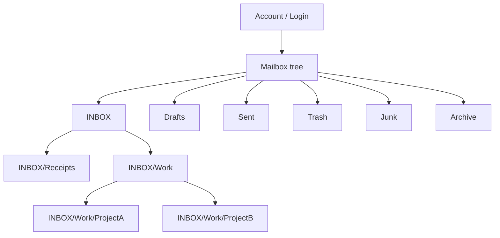

An IMAP account is a login. Once you authenticate, the server presents a **tree of mailboxes**, and every message lives inside one of them. This post sketches the shape of that tree, the few rules IMAP actually enforces, and the conventions that fill in the rest.

## The core mental model

- **Account = credentials.** One username + password (or OAuth token) gets you into one account.
- **Mailbox = folder.** "Mailbox" is the IMAP term; "folder" is the user-facing word. Same thing.
- **One message, one mailbox.** A message belongs to exactly one mailbox (Gmail is the exception — see below).
- **`INBOX` always exists at the top.** RFC 3501 mandates it. The name is reserved and case-insensitive.
- **Everything else is convention,** created by either the provider or the user/client.



## What a typical tree looks like

Two common layouts. Some servers nest the special folders under `INBOX`:

```
INBOX
INBOX/Drafts
INBOX/Sent
INBOX/Trash
INBOX/Junk
INBOX/Archive
```

Others place them as **siblings** of `INBOX`:

```
INBOX
Drafts
Sent
Trash
Junk
Archive
```

User-created folders can sit anywhere and nest arbitrarily deep, using the server's hierarchy delimiter (`/` or `.`):

```
INBOX
INBOX/Receipts
INBOX/Work
INBOX/Work/ProjectA
INBOX/Work/ProjectB
INBOX/Family
```

## Special-use flags (RFC 6154)

Folder *names* like "Sent" are just convention — there is nothing magical about the string. What clients actually look at is the **SPECIAL-USE** flag the server attaches to each mailbox, so a client can find the right folder regardless of language or naming:

| Flag        | Purpose                              |
| ----------- | ------------------------------------ |
| `\Inbox`    | The primary inbox                    |
| `\Drafts`   | Unsent messages being composed       |
| `\Sent`     | Copies of sent messages              |
| `\Trash`    | Deleted messages awaiting purge      |
| `\Junk`     | Spam                                 |
| `\Archive`  | Long-term storage                    |
| `\All`      | Every message (Gmail's "All Mail")   |
| `\Flagged`  | Starred / flagged virtual view       |

A `LIST` response surfacing these flags:

```
* LIST (\HasNoChildren \Sent) "/" "Sent"
* LIST (\HasNoChildren \Drafts) "/" "Drafts"
* LIST (\HasChildren) "/" "INBOX"
* LIST (\HasNoChildren) "/" "INBOX/Receipts"
```

## Where folders come from

There are two sources, with a fuzzy line between them:

- **Provider-created (server-side defaults).** `Sent`, `Drafts`, `Trash`, `Junk`, `Archive` — created by the mail provider and tagged with the SPECIAL-USE flags above.
- **User-created (everything else).** Anything you make in your mail client. Under the hood the client issues a `CREATE` command.

The nuance: **the client sometimes creates folders too.** If you compose a draft in Thunderbird and the server has no `Drafts` folder yet, Thunderbird will `CREATE` one. So the real split is "server-side defaults" vs. "everything else (user or client)."

## Working with mailboxes over IMAP

A few protocol facts that shape what clients can do:

- **One mailbox is *selected* at a time per connection.** You `SELECT INBOX`, then fetch/search/store messages there. To work in another folder, you either `SELECT` it (replacing the current selection) or open a second connection.
- **Folders nest** arbitrarily, using the server's hierarchy delimiter.
- **Subscriptions** (`SUBSCRIBE` / `LSUB`) mark which mailboxes the user cares about. Many clients hide unsubscribed ones so you don't see every system folder.
- **Moving a message** is a real operation — `MOVE`, or historically `COPY` + setting the `\Deleted` flag + `EXPUNGE`. Moving changes which mailbox owns the message.

## The Gmail exception

Gmail breaks the "one message, one mailbox" rule because Gmail's native model is **labels**, not folders.

- A single message can carry multiple labels and therefore appears in multiple IMAP mailboxes simultaneously.
- Special folders are exposed under a flat `[Gmail]/` namespace: `[Gmail]/Sent Mail`, `[Gmail]/All Mail`, `[Gmail]/Trash`, `[Gmail]/Drafts`, `[Gmail]/Spam`, `[Gmail]/Starred`.
- Every message also lives in `[Gmail]/All Mail` — it's the canonical store; the other mailboxes are views over it.

If you're writing IMAP code that needs to handle Gmail correctly, treat the label-as-mailbox model as a special case rather than the default.

## Summary

- **Account** is the identity.
- **Mailboxes** are the containers inside it, arranged as a tree.
- **`INBOX`** is the only mailbox the protocol guarantees; the rest is convention plus SPECIAL-USE flags.
- **Folders are created** by the provider (defaults) or by the user/client (`CREATE`).
- **Gmail is the odd one out** — labels mean a message can appear in several mailboxes at once.
