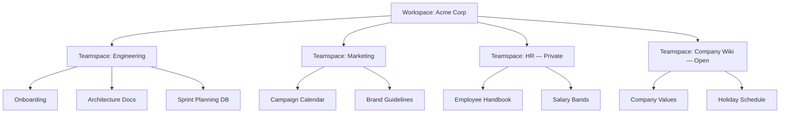

Notion gets called an "all-in-one workspace" so often that the words stop meaning anything. What actually helps when you start using it is a clear picture of how content is organized — and how that picture changes when you go from a solo journal to a 500-person company wiki. This post walks through that hierarchy and ends with where the paywall actually kicks in.

## The Core Hierarchy

For personal use, the model is simple:

```
Account → Workspace → Pages → Blocks
```

- **Account** — your Notion login. One login can belong to multiple workspaces.
- **Workspace** — an isolated environment with its own members, settings, billing, and content. Switching workspaces is like switching to a different Notion universe.
- **Page** — the main content unit. Pages nest infinitely: a page inside a page inside a page is normal.
- **Block** — everything *inside* a page is a block: a paragraph, a heading, an image, a toggle, even a sub-page or an embedded database.

Two things are worth flagging early:

1. **A database is just a special kind of page** — each row is itself a page with custom properties.
2. **Sharing and permissions are set per-page** and inherited by sub-pages by default.

## What Changes on Team/Business Plans

Once you're on a team plan, a layer slots in between the workspace and the pages: the **teamspace**.

```
Account → Workspace → Teamspaces → Pages → Blocks
```

A teamspace is a dedicated section within a workspace for a specific team or group. Think of it as a "sub-workspace" with its own members, permissions, and sidebar section.

### Teamspace Permission Modes

| Mode    | Visibility                              | Joinability                     |
| ------- | --------------------------------------- | ------------------------------- |
| Open    | All workspace members can see it        | Anyone can join                 |
| Closed  | All members see it exists               | Others must request to join     |
| Private | Hidden from non-members entirely        | Invite-only                     |

### The Mental Mapping

The cleanest way to think about it:

> **Company = Workspace · Department = Teamspace · Documents = Pages**

A concrete example for an imaginary "Acme Corp" workspace:



### Nuances Worth Knowing

- **Membership is many-to-many** — one person can belong to multiple teamspaces (e.g. an engineer who's also on the hiring committee).
- **Pages still nest** — a teamspace is just the top-level container. Inside it, pages can go as deep as you want.
- **Default teamspace** — admins can designate one teamspace (often "Company Wiki" or "General") that every new member joins automatically.
- **Cross-teamspace sharing** — you can share a specific page from one teamspace with someone outside it without granting them access to the whole teamspace.
- **Private section still exists** — every member has a personal "Private" sidebar that no one else sees, even inside a team workspace.

## Pricing — Where the Paywall Actually Is

This is approximate; always check [notion.so/pricing](https://www.notion.so/pricing) for current rates.

| Plan       | Price             | Best for           | Notable limits / features                                                                |
| ---------- | ----------------- | ------------------ | ---------------------------------------------------------------------------------------- |
| Free       | $0                | Personal use       | Unlimited pages & blocks, up to 10 guest collaborators, 7-day page history               |
| Plus       | ~$10/user/mo      | Small teams        | Unlimited file uploads, 30-day history, unlimited guests, custom domains                 |
| Business   | ~$15–18/user/mo   | Companies          | Private teamspaces, SAML SSO, 90-day history, bulk PDF export, page analytics            |
| Enterprise | Custom            | Large orgs         | Audit logs, SCIM provisioning, unlimited history, customer-managed encryption keys       |

A few side notes:

- **Notion AI** is a separate add-on (~$8–10/user/month) and works on any plan.
- **Education plan** — Notion Plus is free for students and educators with a verified `.edu` email.
- **Monthly billing** is slightly more expensive than annual.

### Quick Decision Guide

- ✅ **Solo notes, journals, side projects?** Free plan covers it indefinitely.
- ✅ **Small team that needs unlimited file uploads & guests?** Plus.
- ✅ **Company with departments and sensitive content?** Business — that's where private teamspaces unlock.
- ✅ **Regulated/large enterprise?** Enterprise for audit + provisioning.

## The Takeaway

If you remember nothing else: Notion's structure is **a tree of pages**, and everything else is a feature *on top* of that tree.

- For one person, the tree lives directly under a workspace.
- For a company, the tree gets a department-level branching layer called **teamspaces**, which exist mainly to scope **permissions** and **visibility**.
- Pricing follows the same logic: you pay when the *permission and admin needs* of a team kick in, not for the content itself.

Free is genuinely enough for personal use — you won't accidentally bump into a paywall while taking notes.
