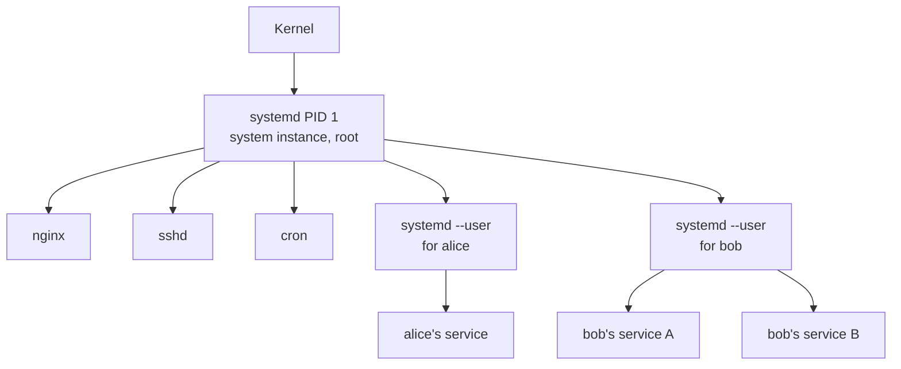

"Should I enable linger?" is one of those questions where the right answer depends on whether you have anything that would benefit from it. This note builds up the mental model needed to decide, then gives you the commands to check your own box and act on the answer.

## The two-level model

systemd isn't a single supervisor — it runs at two levels:

- **System instance** — `systemd` as PID 1, started directly by the kernel as the very first userspace process. Always root. One per machine. Manages everything global: mounts, networking, sshd, cron, nginx.
- **User instance** — `systemd --user`, one per *logged-in user*, running as that user. Manages personal services. Spawned by `systemd-logind` on first login.

It's the same `/lib/systemd/systemd` binary in both cases — the `--user` flag just tells it "run scoped to this UID, read units from `~/.config/systemd/user/`, no privileges."

So a box with three SSH users logged in has **four systemds** running: one root + three user instances.



## Default user-instance lifecycle

`systemd-logind` is the broker that ties user instances to login sessions:

1. You log in (SSH, console, desktop).
2. logind sees a new session for your UID.
3. If no `systemd --user` is already running for you, it **spawns one**.
4. The instance reads your unit files and starts anything `enable`d under `default.target`.
5. When your **last** session ends, logind **stops** the user instance and everything it was supervising.

Two subtleties worth pinning down:

- **"Last session" matters.** Two open SSH sessions, close one, the user instance keeps going. Only the *final* logout tears it down.
- **`enable` vs `start`.** A service only auto-starts at login if you ran `systemctl --user enable foo` — that's what creates the symlink under `default.target`. Without `enable`, it only runs when you explicitly `start` it.

So the default contract is *session-scoped*: your user services live exactly as long as you have at least one active login.

## What lingering changes

**Lingering** is a per-user opt-in that promotes the user instance to *boot-scoped*:

- Starts at **boot**, before anyone logs in.
- Survives **logout** — even the last one.

Mechanism: an empty marker file at `/var/lib/systemd/linger/<username>`. At boot, logind enumerates that directory and spawns a user instance for each user in it. Nobody else gets one until they actually log in.

| | Default (no linger) | With linger |
| --- | --- | --- |
| Starts at boot | ❌ | ✅ |
| Starts on login | ✅ (if not already running) | already running |
| Survives logout | ❌ (last session kills it) | ✅ |
| Per-user opt-in | n/a | ✅ |
| Needs root to toggle | n/a | ✅ (`sudo loginctl ...`) |

## "Why not just use the system instance?"

A fair pushback: if you want a process to "always run," the system instance already does that. Why bother with user-instance + linger?

You absolutely *can* put personal services under the system instance. The reasons not to:

1. **Requires root** for every create/edit/enable/reload.
2. **Pollutes `/etc/systemd/system/`**, which is the machine's admin-facing contract. Personal stuff mixed in makes "what is this server for" harder to read.
3. **Runs as root by default.** Forget `User=you` and your chat client gets root — a real security regression.
4. **Wrong environment.** No `$HOME`, no `$XDG_RUNTIME_DIR`, no user D-Bus, no SSH agent, no keyring. Tools that "just work" interactively break in subtle ways.
5. **File ownership traps.** A root-run service writing into `/home/you/...` produces root-owned files you can't edit without sudo later.
6. **Loses the `--user` ecosystem.** `systemctl --user`, `journalctl --user`, user timers, user sockets — none of it applies.

The mental split that resolves it:

- **System instance** = "this belongs to the *machine*." Survives user deletion. Admin owns it. Examples: nginx, postgres, sshd.
- **User instance + linger** = "this belongs to *me*." Gone when my account is gone. I own it. Examples: my chat bot, my sync daemon, my self-hosted web UI.

Linger isn't a workaround for a missing feature — it's the bridge that lets "belongs to me" services have the same uptime guarantees as "belongs to the machine" services, without forcing everything personal into root-owned territory.

## Check your current state

Before deciding, find out what's actually there. Four commands:

```bash
# 1. Your own unit files — the only place handwritten user services live
ls -la ~/.config/systemd/user/

# 2. Everything visible to your user instance (yours + OS-shipped)
systemctl --user list-unit-files --state=enabled

# 3. What's currently running
systemctl --user list-units --type=service

# 4. Your linger status
loginctl show-user $USER | grep Linger
```

What the output usually means:

- **`~/.config/systemd/user/` doesn't exist or is empty** → you've never created a user service. Anything listed in (2) is OS-shipped defaults (e.g., `gpg-agent.socket`, `dirmngr.socket`) from `/usr/lib/systemd/user/`.
- **(3) shows only `dbus.service`** → that's the user-instance message bus, required infrastructure, not something you set up.
- **`Linger=no`** → user instance is session-scoped right now.

If all three match, **lingering is irrelevant to you today** — turning it on would just keep an idle `systemd --user` and `dbus.service` running 24/7 for no benefit.

## Decision tree

- [ ] Do you have, or plan to install, anything that says "use `systemctl --user enable ...` to start on boot"?
- [ ] Is it a headless box where you SSH in and out rather than staying logged in?
- [ ] Do you want the service to keep running after you close your SSH session?

**All three yes** → enable linger.
**Any no** → leave it off; revisit when (1) becomes true.

Typical "yes" scenarios: self-hosted chat bots, sync daemons (Syncthing, etc.), personal web UIs, long-running scripts that should auto-restart.

## How to enable

One command:

```bash
sudo loginctl enable-linger $USER
```

Verify:

```bash
loginctl show-user $USER | grep Linger
# Linger=yes
```

No reboot needed for the linger setting itself.

### Gotcha right after enabling

In the *same* SSH session, `systemctl --user ...` may complain *"Failed to connect to bus."* The current shell still references the old session's D-Bus. Fix: log out, log back in.

```bash
exit
ssh ...
```

### Recommended install order

For something like a chat bot you're about to set up:

1. `sudo loginctl enable-linger $USER`
2. Log out, log back in.
3. Run the installer (or drop your own unit in `~/.config/systemd/user/`).
4. `systemctl --user enable --now <service>`
5. `systemctl --user status <service>` and `journalctl --user -u <service> -f` to confirm health.
6. **Reboot once** to confirm cold-boot startup actually works — cheapest way to catch a unit that's fine after login but never starts on its own.

Disable later if you change your mind:

```bash
sudo loginctl disable-linger $USER
```

## Mental model to keep

Three sentences:

1. **The system instance is for the machine; the user instance is for you.** Same binary, different scope.
2. **By default, your user instance lives only as long as you have at least one session open.**
3. **Lingering decouples the user instance from session lifecycle**, promoting it to boot-scoped — match it to whether you have any service that actually needs that.

If you don't have services that need it, leave it off. The instant you install something that does, turn it on as the first step.
