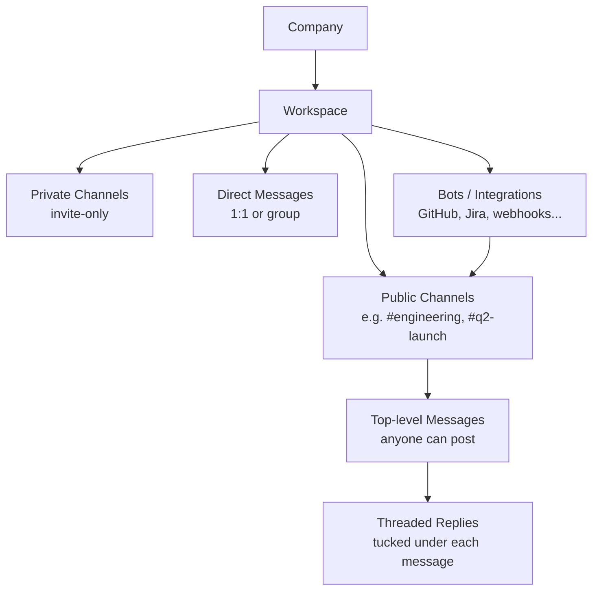

If you already use WhatsApp or Telegram, Slack is easy to grasp: same core mechanics (messages, DMs, file sharing), but built around companies and teams instead of personal contacts. The interesting differences are in how conversations are *organized* and how Slack hooks into the rest of a company's toolchain.

## One-line summary

Slack is a **workplace chat app with a strong bot/integration ecosystem** that lets it act as a hub where notifications from other tools land and people react to them.

## Hierarchy at a glance



| Slack concept | Maps to                          | Notes                                                                 |
| ------------- | -------------------------------- | --------------------------------------------------------------------- |
| Workspace     | A company                        | Joined via work email. Large orgs may have several, linked via Enterprise Grid. |
| Channel       | A department or a topic          | Can be team-based (`#engineering`) or topic-based (`#q2-launch`).     |
| Thread        | Follow-up discussion to a message | Keeps the main channel feed clean.                                    |
| DM            | A 1:1 or group chat              | Same idea as WhatsApp/Telegram DMs.                                   |
| App / Bot     | Integration with external tools  | GitHub, Jira, CI, custom scripts, etc.                                |

## Channels: feed + threads

A channel looks like a **feed** of messages:

- ✅ **Everyone in the channel can post top-level messages** — unlike Telegram channels, where only admins post and others can only react/comment.
- ✅ Anyone can **reply in a thread** under any message. The reply lives in a side panel attached to that message, not in the main feed.
- ✅ The main feed therefore stays readable; you click "X replies" to expand a thread.

> 🧵 **Nuance**: when replying in a thread, there's an **"Also send to channel"** checkbox. Tick it when the reply is important enough that everyone should see it without having to open the thread.

### Public vs private channels

- **Public**: anyone in the workspace can find, join, and read history.
- **Private**: invite-only; hidden from search for non-members.

### Channel organization patterns

Most workspaces mix two styles:

- **By team / department** — `#engineering`, `#sales`, `#design`
- **By topic / project** — `#q2-launch`, `#incident-2026-05`, `#book-club`

Topic channels are how people from *different* departments collaborate around the same thing without having to share a generic group chat.

## Direct messages

Just like consumer chat apps:

- 1:1 DM with a coworker
- Group DM with several people (ad-hoc, no channel needed)

DMs are the right place for quick personal questions; channels are the right place for anything others might benefit from seeing or searching later.

## Integrations and bots

This is where Slack diverges most from consumer chat. A Slack workspace is typically wired into the company's other tools, so events from those tools surface as messages.

| Mechanism            | What it does                                                                                  | Typical use                                              |
| -------------------- | --------------------------------------------------------------------------------------------- | -------------------------------------------------------- |
| **Official apps**    | Install from the App Directory, connect accounts, route events into channels.                 | GitHub PRs, Jira issues, PagerDuty alerts, Zoom calls.   |
| **Incoming webhooks**| POST JSON to a URL → a message appears in a channel.                                          | Easiest way to push notifications from CI or scripts.    |
| **Slash commands**   | `/deploy staging` → your bot receives the command and responds.                               | Triggering actions from inside chat.                     |
| **Bots (Bolt SDK)**  | Two-way apps: read messages, reply, post buttons/menus (Block Kit), open modals.              | Custom workflows, internal tools, ChatOps.               |
| **Workflow Builder** | No-code automation inside Slack.                                                              | Forms, scheduled messages, simple approvals.             |

### Example: GitHub integration

The official GitHub app lets you, inside a channel, run:

```text
/github subscribe owner/repo
```

…and pick which events post to that channel:

- [x] Pull requests opened / merged
- [x] Issues opened / assigned
- [x] Reviews requested
- [x] Commits to the default branch
- [ ] (Anything you don't want noise from)

You can even reply to a GitHub notification *from Slack* and have the reply post as a comment on the PR or issue.

## How Slack compares

| App                | Primary audience       | Channels                                     | Threads                          | Integrations          |
| ------------------ | ---------------------- | -------------------------------------------- | -------------------------------- | --------------------- |
| **Slack**          | Workplaces             | Public/private, anyone can post              | First-class, attached to message | Extensive             |
| **Microsoft Teams**| Workplaces (MS shops)  | Similar; tied to Microsoft 365               | Yes                              | Strong, MS-centric    |
| **Discord**        | Originally gaming      | Servers + channels, anyone can post          | Yes (newer feature)              | Bots, less enterprise |
| **Telegram channels** | Broadcast / community | Only admins post, others comment             | Limited                          | Bot API               |
| **WhatsApp**       | Personal               | No channels in the work sense (Communities exist) | No real thread model         | Minimal               |

## TL;DR mental model

1. **Workspace = company.** You join via work email.
2. **Channel = department or topic.** Public or private. Everyone can post.
3. **Thread = clean follow-up.** Replies sit under the original message instead of cluttering the feed.
4. **DMs = the WhatsApp-style part** for 1:1 or small group chats.
5. **Bots & integrations = the superpower** — GitHub, Jira, CI, custom scripts can all post into channels, and people can act on those notifications without leaving Slack.
