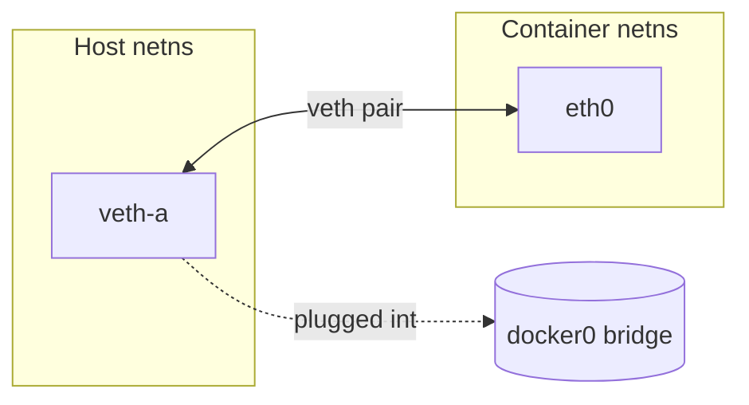

Docker networking can feel like a stack of abstractions, but underneath it's just a few Linux kernel primitives wired together: **network namespaces**, **veth pairs**, **bridges**, and **iptables**. Once you see the pieces, the whole picture clicks.

This note builds up from the bottom — kernel primitives first, then how Docker assembles them into the default bridge network.

## Table of contents

## The kernel primitive: network namespace

A **network namespace** (netns) is a Linux kernel feature that gives a process its own private, isolated network stack. The kernel keeps multiple parallel copies of "the networking subsystem" and lets different processes see different ones.

When you create a new netns, the process inside it gets its own:

- **Interfaces** — its own `lo`, its own `eth0`, etc. The host's interfaces are invisible.
- **IP addresses** — assigned to interfaces in this namespace only.
- **Routing table** — `ip route` shows different routes per namespace.
- **ARP table** — its own neighbor cache.
- **iptables / nftables rules** — firewall rules are per-namespace.
- **Sockets** — a socket lives in exactly one namespace.
- **Port numbers** — port 80 in namespace A is unrelated to port 80 in namespace B. Two containers can both bind to port 80 without conflict.
- **/proc/net** — contents reflect this namespace's state.

A fresh namespace starts with **only a loopback interface, which is down**. No connectivity at all until you add something.

### Why this matters for containers

A container is, at its core, **a regular Linux process running in a set of namespaces** (network, mount, PID, user, UTS, IPC, cgroup). There's no "container kernel" — it's the same kernel as the host, just showing the process a restricted view.

Without netns, every container would share the host's interfaces, routes, and ports — which is exactly what `--network=host` does. With its own netns, the container thinks it has the whole network to itself.

### Playing with namespaces directly

Namespaces aren't a Docker thing — they're a kernel feature. You can create one by hand:

```bash
sudo ip netns add demo                       # create namespace "demo"
sudo ip netns exec demo ip a                 # show interfaces inside it
                                             # → only "lo", and it's DOWN
sudo ip netns exec demo ip link set lo up    # bring loopback up
sudo ip netns exec demo ping 127.0.0.1       # works
sudo ip netns exec demo ping 8.8.8.8         # fails — no route, no NIC
```

To give it real connectivity you'd create a veth pair, move one end into `demo`, assign IPs, set routes, and either bridge it or NAT it on the host side. That's literally what Docker does for you under the hood.

### Mental model

- **Namespace = a view of the network stack.**
- A process always belongs to exactly one network namespace.
- Multiple processes can share one (that's how all processes in the same container see each other's localhost).
- Namespaces are first-class kernel objects — they exist independently of any container runtime. Docker, Podman, Kubernetes, systemd-nspawn, raw `ip netns` — all lean on the same primitive.

## What `eth0` actually is

`eth0` is just a **name** for a network interface — the first Ethernet interface the kernel sees. The "eth" is historical (Ethernet), the "0" is an index. It's not special; it's a label.

### What an "interface" actually is

A network interface is a kernel object representing one endpoint of a network connection. It has:

- A name (`eth0`, `lo`, `wlan0`, `veth1a2b3c`...)
- A MAC address (L2)
- Zero or more IP addresses (L3)
- A state (up/down)
- Statistics, an MTU, queues, etc.

It can be backed by **real hardware** (a physical NIC) or be **purely virtual** (created by software). The kernel doesn't care — packets go in, packets come out.

### The two `eth0`s in a Docker setup

This is the part that confuses people: there are *multiple* `eth0`s, and they're unrelated.

| `eth0` | Backed by | Lives in | Example IP |
| --- | --- | --- | --- |
| Host's `eth0` | Physical NIC (or VM's virtual NIC) | Host's root netns | `192.168.1.50` |
| Container's `eth0` | One end of a veth pair | Container's netns | `172.17.0.2` |

The container's `eth0` is purely virtual. From the container's point of view it looks exactly like a normal NIC — you can `ip a` and see it, ping through it, bind to it — but on the host side, the other end of that virtual cable plugs into `docker0`.

Each network namespace has its own naming scope, so you can have a hundred containers, each with an interface called `eth0`, and they don't collide.

### Naming conventions you'll see

| Name pattern | Meaning |
| --- | --- |
| `lo` | Loopback. Every namespace has one (`127.0.0.1`). |
| `eth0`, `eth1`, ... | Traditional Ethernet naming. |
| `enp0s3`, `eno1`, ... | Modern "predictable" names on the host based on bus location (systemd's scheme). |
| `wlan0` | Wireless. |
| `docker0`, `br-xxxx` | Linux bridges. |
| `veth9f3a...` | Host side of a veth pair (Docker generates a random suffix). |

## Connecting the namespace: veth pairs

A network namespace is an island. To give it connectivity, you need a **veth pair**: two virtual interfaces that act as the two ends of a virtual ethernet cable. You create the pair, then move one end into the namespace. Packets sent into one end pop out the other.



The container *names* its end `eth0` because it's the only Ethernet-looking interface visible inside that namespace — but it's just a virtual cable end.

## Putting it together: the default `bridge` driver

Now we can assemble the picture. The default Docker network driver is `bridge`. Here's what happens when the Docker daemon starts and you run a container:

1. Docker creates a virtual switch `docker0` on the host — a **Linux bridge**, which is a software L2 switch.
2. For each container, Docker creates a new **network namespace** and a **veth pair**.
3. One end of the veth pair stays in the host's namespace and gets plugged into `docker0`.
4. The other end moves into the container's namespace and is renamed `eth0`.
5. Docker assigns the container's `eth0` a private IP from a subnet (e.g. `172.17.0.0/16`).
6. Docker writes **iptables** rules to:
   - **MASQUERADE** outbound traffic, so it appears to come from the host's IP.
   - **DNAT** inbound traffic for any **published ports** (`-p 8080:80`).
7. Docker runs a small **embedded DNS server** inside each container's netns at `127.0.0.11` so containers on user-defined networks can resolve each other by name.

### The full picture

```
                          HOST MACHINE
  ┌──────────────────────────────────────────────────────────────┐
  │                                                              │
  │   eth0 (192.168.1.50)  ◄──── physical NIC, talks to LAN      │
  │      ▲                                                       │
  │      │  iptables: MASQUERADE (SNAT) outbound                 │
  │      │            DNAT inbound for -p published ports        │
  │      ▼                                                       │
  │   ┌─────────────────────────────────────────────────┐        │
  │   │  docker0  (bridge, 172.17.0.1/16)               │        │
  │   │  ── virtual L2 switch in the host namespace ──  │        │
  │   └──┬──────────────┬──────────────┬────────────────┘        │
  │      │ veth-a (host)│ veth-b (host)│ veth-c (host)           │
  │      │              │              │                         │
  │      │  veth pair = virtual ethernet cable between           │
  │      │  the host namespace and a container namespace         │
  │      │              │              │                         │
  │  ┌───┴────────┐ ┌───┴────────┐ ┌───┴────────┐                │
  │  │ container1 │ │ container2 │ │ container3 │                │
  │  │ netns      │ │ netns      │ │ netns      │                │
  │  │            │ │            │ │            │                │
  │  │ eth0       │ │ eth0       │ │ eth0       │                │
  │  │172.17.0.2  │ │172.17.0.3  │ │172.17.0.4  │                │
  │  │            │ │            │ │            │                │
  │  │ DNS →      │ │ DNS →      │ │ DNS →      │                │
  │  │127.0.0.11  │ │127.0.0.11  │ │127.0.0.11  │                │
  │  └────────────┘ └────────────┘ └────────────┘                │
  │                                                              │
  └──────────────────────────────────────────────────────────────┘
```

### Traffic flows

**Container ↔ container (same host)**

```
container1 → container2 :
    eth0 → veth-a → docker0 → veth-b → eth0
    (pure L2 switching inside the host)
```

**Container → internet**

```
container1 → internet :
    eth0 → veth-a → docker0 → iptables
    MASQUERADE rewrites src to 192.168.1.50
    → host eth0 → LAN
```

**LAN client → container (published port)**

```
LAN client → container1 :
    packet hits host:8080
    iptables DNAT rewrites dst to 172.17.0.2:80
    → docker0 → veth-a → container1:eth0
    (only when started with -p 8080:80)
```

### Port publishing flow in detail

`-p 8080:80` triggers two things:

1. **iptables DNAT** on the host: `host:8080` → `container_ip:80`.
2. **`docker-proxy`** userspace process as a fallback for cases where iptables can't handle it (e.g. localhost connections on some setups).

## Default bridge vs. user-defined bridges

`docker network create mynet` gives you a few things the default `docker0` doesn't:

| Feature | Default `docker0` | User-defined bridge |
| --- | --- | --- |
| Embedded DNS by container name | ❌ (needs deprecated `--link`) | ✅ |
| Network isolation between bridges | Shared | ✅ Isolated |
| Attachable at runtime | Limited | ✅ `docker network connect` |
| Recommended for new work | ❌ | ✅ |

This is why `docker compose` auto-creates a project-scoped bridge — service names become hostnames.

## The other network drivers, in one line each

| Driver | What it does | When to use |
| --- | --- | --- |
| `bridge` (default) | Per-container netns on a host-local L2 switch with NAT | Single-host containers, the common case |
| `host` | Container shares the host's netns directly — no isolation, no NAT, no port mapping | Maximum throughput, accepting the loss of isolation |
| `none` | Only loopback. No connectivity. | Batch jobs that don't need network |
| `overlay` | VXLAN-encapsulated L2 segment spanning multiple Docker hosts | Swarm, multi-host clusters |
| `macvlan` / `ipvlan` | Container gets its own MAC/IP on the physical LAN, bypassing the bridge | When you want the container to look like a real device on the LAN |

## Quick mental model

A container is **a process in a network namespace, plugged into a virtual switch via a virtual cable (veth)**. Everything else — DNS, NAT, port mapping — is iptables rules and a small DNS server Docker runs at `127.0.0.11` inside each container.

## Useful inspection commands

```bash
# On the host
docker network ls                # list networks
docker network inspect bridge    # see subnet, containers, options
ip a                             # see docker0 and all veth* interfaces
ip link                          # link-level view
iptables -t nat -L -n            # NAT rules Docker installed
sudo ip netns list               # only shows named netns
                                 # (Docker's are unnamed by default)

# Inside a container
ip a                             # see eth0 and its IP
ip route                         # see the default route via 172.17.0.1
cat /etc/resolv.conf             # see 127.0.0.11 nameserver
```

## Summary

- A **network namespace** is a kernel-level isolated copy of the networking stack.
- An **interface** like `eth0` is just a labeled endpoint — it can be hardware or pure software.
- A **veth pair** is a virtual cable connecting two namespaces (or a namespace to a bridge).
- A **Linux bridge** like `docker0` is a software L2 switch.
- **iptables** does the NAT — both outbound MASQUERADE and inbound DNAT for published ports.
- Docker wires all of this together so you can type `docker run` and get networking that just works.

None of this is Docker-specific magic. It's all built from kernel features that exist regardless of whether you have a container runtime installed.
