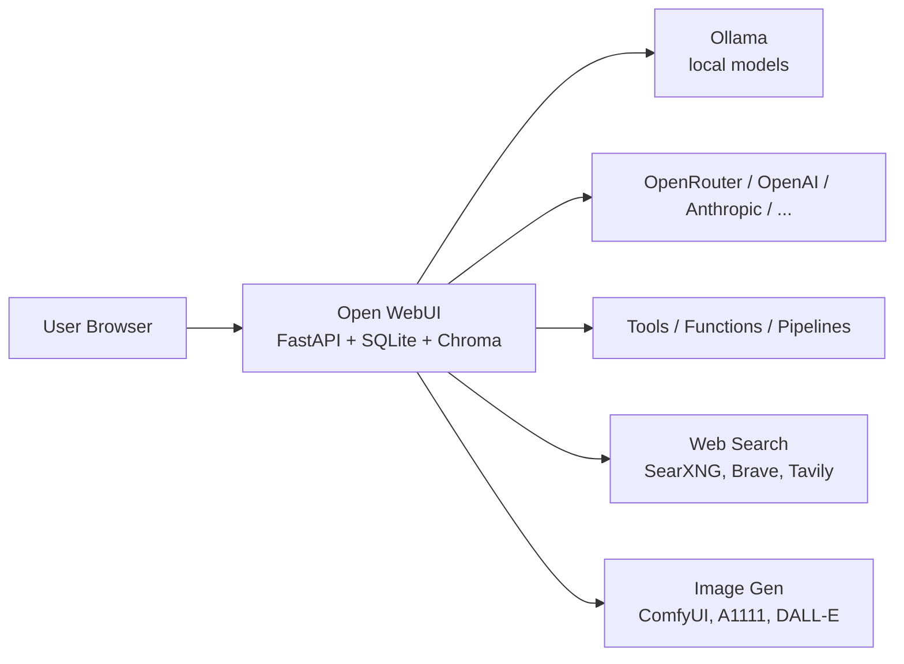

A practical note on a recurring problem: modern open source projects — especially AI/LLM ones — advertise long feature lists, but only a fraction of those features are reliable enough for daily use. Open WebUI is a useful concrete example.

## What Open WebUI Actually Is

Open WebUI is not "just a frontend." It's a full self-hosted web app for chatting with LLMs.

- **Frontend**: ChatGPT-style chat UI — conversations, markdown, code blocks.
- **Backend**: FastAPI (Python) server handling auth, chat history, RAG, tools, etc.
- **Database**: SQLite by default at `/app/backend/data/webui.db`; PostgreSQL via `DATABASE_URL` for production.
- **Vector store**: ChromaDB by default; can swap to Qdrant, Milvus, PGVector, OpenSearch, etc.
- **File storage**: local filesystem or S3-compatible.

The LLM inference itself is external — typically Ollama (a "Docker for LLMs" tool that wraps `llama.cpp` and exposes an OpenAI-compatible API on `localhost:11434`) or any other OpenAI-compatible endpoint such as OpenRouter.

Because the backend is stateful, the `open-webui` container needs a mounted volume at `/app/backend/data` or all chats, users, and settings vanish on restart.

## The Advertised Feature Surface

Open WebUI lists a lot of capabilities. Roughly grouped:

| Area | Features |
| --- | --- |
| Chat core | Conversations, history, markdown, code rendering, model switching, multi-model side-by-side, branching, regeneration |
| RAG / Knowledge | Doc upload, chunking + embeddings, "Knowledge" collections, web search, URL scraping, YouTube transcripts |
| Tools & Functions | Function-calling tools, Pipe/Filter/Action functions, separate Pipelines service for heavier plugins |
| Multimodal | Image input to vision models, image gen via DALL·E/ComfyUI/A1111, STT (Whisper), TTS, real-time voice/video |
| Workflow | Workspace "custom models," prompt presets / slash commands, code interpreter, memory, Slack-like channels, notes |
| Admin | RBAC, user groups, OAuth/OIDC, LDAP, per-model permissions, usage tracking, API key banks |

On paper, this is "ChatGPT + Claude Projects + a plugin platform, self-hosted."

## What Works Well vs. What Doesn't

In practice, features split into tiers:

- ✅ **Core loop (well-tested):** chat, model switch, conversation history. Used daily by everyone, so bugs surface and get fixed fast.
- ✅ **Adjacent features (usually OK):** RAG on your own docs, prompt presets, basic file upload, Workspace "custom models." Often genuinely better than ChatGPT's equivalents.
- ⚠️ **Showcase features (hit-or-miss):** voice mode, agents, code interpreter, pipelines, image gen. Demoed often, rarely battle-tested.
- ❌ **"We support X too!" integrations:** frequently broken; added once and abandoned.

A rough estimate that holds up across many AI OSS projects: **of every ~10 advertised features, 2 are solid, the rest are partial.**

## Open WebUI + OpenRouter vs. chatgpt.com

A common setup is Open WebUI pointed at OpenRouter to get many models behind one UI. How close does this get to the chatgpt.com experience?

**Comparable or better:**
- Chat UI, history, markdown/code
- Model variety (GPT-4o, Claude, Gemini, DeepSeek, Llama, etc.)
- RAG over your own documents
- File/image upload, vision models
- Voice in/out, image gen, web search — *if* you wire them up

**Worse or missing:**
- ChatGPT's first-party tools (browsing, code interpreter, image gen, file analysis) are tightly integrated — they "just work." In Open WebUI each one is a separate integration with its own quirks.
- OpenRouter provider quirks: vision, function calling, structured outputs, prompt caching, and system prompts aren't uniformly supported across upstream providers.
- No equivalents for Advanced Voice Mode, Sora, Operator, Deep Research, Canvas, Tasks, shared-memory Projects.
- Extra latency hop: you → Open WebUI → OpenRouter → provider.
- Pay-per-token vs. ChatGPT's flat fee — heavy users can pay more.
- You're the sysadmin: updates, backups, broken integrations are on you.

For *text chat + RAG + multi-model access*, the experience is comparable or better. For *polished agentic features*, ChatGPT is still ahead.

## The Bigger Pattern: Why Feature Lists Mislead

Open WebUI is not unusual. The same shape shows up across new AI OSS (n8n, Langchain, Dify, AnythingLLM, Flowise, ...). A few forces push projects in this direction:

1. **Feature count as marketing.** GitHub stars and HN posts reward "look what we support!" lists. Depth doesn't fit in a bullet point.
2. **AI hype cycle.** Every project races to add agents, RAG, tools, voice, multimodal before competitors. Shipping fast beats shipping polished.
3. **Developer-driven scope.** No PM saying "no, polish what we have first." Maintainers add what they find cool.
4. **No churn signal.** Unlike paid SaaS, OSS has no churn metric. Half-working features stay in the README forever.
5. **Docs lag features.** By the time docs catch up, the feature has changed or broken — so you read confident docs about something flaky.

## Old-School vs. New-School Open Source

There's a real cultural split between the "old" stable projects and many "new" ones:

| Dimension | Old (Emacs, GCC, Postgres, SQLite, Linux, Vim) | New (many JS / AI projects) |
| --- | --- | --- |
| Release cadence | Slow, deliberate | Weekly, breaking changes normalized |
| Scope discipline | Maintainers say "no" | Maintainers say "yes" for momentum |
| Core value | Stability, backwards compatibility | Growth, novelty |
| Docs | Dense, ugly, but accurate | Beautiful, sometimes ahead of reality |
| Bugs | Embarrassing; regressions unacceptable | "Fix in v2"; move-fast culture |
| Reputation timescale | Decades | Months |
| Funding | Institutions, companies, volunteers | VC, open-core companies, hire-bait |
| Website aesthetic | Looks like 1998 | Animated landing page, dark mode toggle |

A useful (rough) heuristic: **inverse correlation between marketing polish and software reliability in young projects.** Not always true, but a useful prior. Postgres and SQLite have ugly sites and rock-solid software. Many shiny new AI projects have gorgeous landing pages and binaries that segfault on Tuesday.

## A Practical Evaluation Checklist

When considering a feature in a new AI OSS project, before investing time:

- [ ] **Ignore the feature list.** Start from your actual workflow — what do you do today? Replicate just that.
- [ ] **Search GitHub Issues, not docs.** `is:issue [feature name]` tells the truth. Many open bugs = flaky. Closed quickly = mature.
- [ ] **Check commit frequency on the specific feature.** Active = either improving or churning. Stale = abandoned.
- [ ] **Read Reddit / Discord, not the README.** Real users describe what actually works.
- [ ] **Trust boring features over exciting ones.** An unsexy feature with 3 years of commits beats a shiny one from last month.
- [ ] **Time-box experiments.** Give a feature 30 minutes. If it's fighting you, it's not ready — move on.
- [ ] **Ask: will this still be maintained in 3 years, without breaking my setup on upgrade?**

## Takeaways

- Open WebUI is a capable, full-stack self-hosted chat platform with a real backend and DB — not just a UI.
- Paired with OpenRouter, it covers the "chat + many models + my docs" use case very well.
- The long tail of features exists but is uneven; expect bugs and setup friction.
- Most users spend ~90% of their time on chat + model switch + occasional RAG. Optimize for those three; treat the rest as bonus.
- The pattern generalizes: in young AI OSS, feature lists are closer to advertising than capability inventories. Read past them.

Skepticism here is a feature, not a bug.
