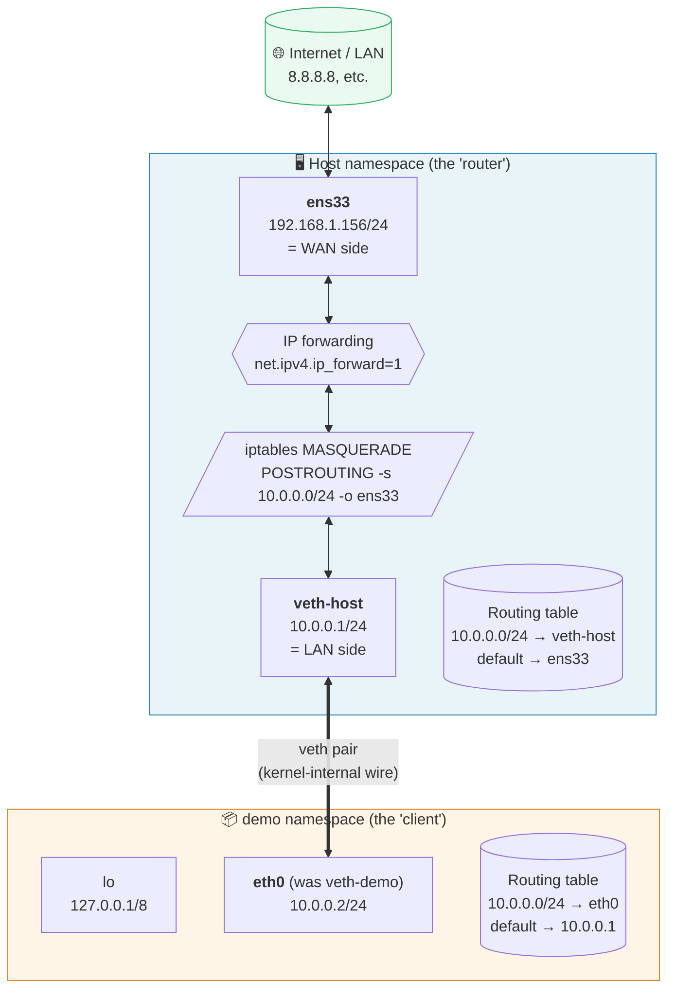
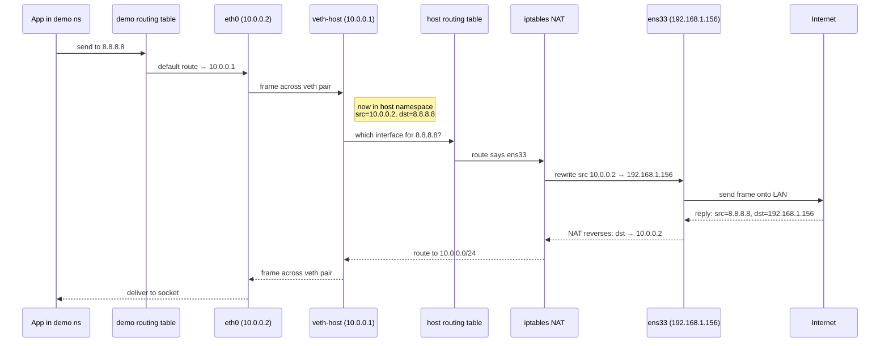
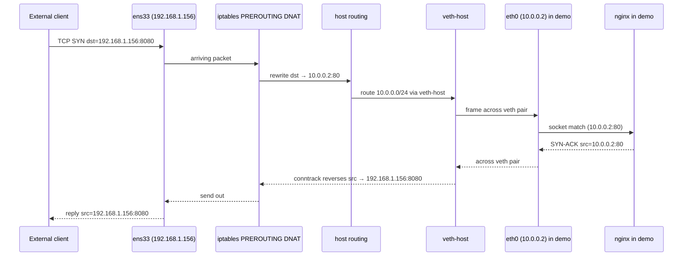

A **network namespace** is a Linux kernel feature that gives a process its own private copy of the network stack — its own interfaces, routing table, ARP cache, iptables rules, socket table, and port space. A fresh namespace has only `lo` (and it's down) — useless until you wire it up to somewhere with actual connectivity.

This note walks through **Pattern 1**: the simplest possible wiring, connecting one new namespace to the host via a single veth pair, with NAT on the host so packets reach the outside world. It's container networking stripped to its smallest possible shape.

## The mental model: host as a home router

Pattern 1 maps almost component-for-component onto a home Wi-Fi router serving one client.

| Home network | Pattern 1 |
|---|---|
| ISP cable plugged into router's WAN port | `ens33` (or whatever physical NIC) connected to the LAN |
| The router itself | The **host namespace** |
| Router's LAN-side interface | `veth-host` with `10.0.0.1/24` |
| Router's LAN IP (e.g. `192.168.1.1`) | `10.0.0.1` — the namespace's default gateway |
| Connected device (iPhone, MacBook) | The **demo namespace** with `eth0` = `10.0.0.2` |
| Device's private IP from DHCP | `10.0.0.2` (manually assigned in this demo) |
| Router's NAT | `iptables MASQUERADE` |
| "Share internet" toggle | `sysctl net.ipv4.ip_forward=1` |
| Default gateway on the device | `ip route add default via 10.0.0.1` |

Pattern 1 is *"host machine acting as a NAT router for one connected client."* Add a bridge in the middle (Pattern 2) and you've reinvented `docker0`. 🐳

## Structure



Same picture in ASCII for terminal viewing:

```
                          ┌──────────────────────────┐
                          │   🌐 LAN / Internet       │
                          └────────────┬─────────────┘
                                       │
                                       │ physical
                                       ▼
   ┌───────────────────────────────────────────────────────────────┐
   │ Host namespace                                                │
   │                                                               │
   │   ┌────────────────┐                                          │
   │   │ ens33          │  192.168.1.156/24                        │
   │   │ (real NIC)     │                                          │
   │   └───────┬────────┘                                          │
   │           │                                                   │
   │           │  ┌──────────────────────────┐                     │
   │           ├──┤ iptables MASQUERADE      │                     │
   │           │  │ (rewrite src IP)         │                     │
   │           │  └──────────────────────────┘                     │
   │           │                                                   │
   │           │  ┌──────────────────────────┐                     │
   │           ├──┤ IP forwarding enabled    │                     │
   │           │  └──────────────────────────┘                     │
   │           │                                                   │
   │   ┌───────▼────────┐                                          │
   │   │ veth-host      │  10.0.0.1/24                             │
   │   └───────┬────────┘                                          │
   │           │                                                   │
   └───────────┼───────────────────────────────────────────────────┘
               │
               │  veth pair = virtual ethernet cable
               │  (one end here, the other in 'demo')
               │
   ┌───────────┼───────────────────────────────────────────────────┐
   │ demo namespace                                                │
   │   ┌───────▼────────┐                                          │
   │   │ eth0           │  10.0.0.2/24                             │
   │   │ (was veth-demo)│  default route → 10.0.0.1                │
   │   └────────────────┘                                          │
   │                                                               │
   │   ┌────────────────┐                                          │
   │   │ lo             │  127.0.0.1/8                             │
   │   └────────────────┘                                          │
   │                                                               │
   │   [ your process here — sees only this namespace's stack ]    │
   └───────────────────────────────────────────────────────────────┘
```

## The seven commands

```bash
# 1. Create the namespace
sudo ip netns add demo

# 2. Create the veth pair (both ends start in the host namespace)
sudo ip link add veth-host type veth peer name veth-demo

# 3. Move one end INTO the namespace
sudo ip link set veth-demo netns demo

# 4. Configure the host side
sudo ip addr add 10.0.0.1/24 dev veth-host
sudo ip link set veth-host up

# 5. Configure the namespace side
sudo ip netns exec demo ip addr add 10.0.0.2/24 dev veth-demo
sudo ip netns exec demo ip link set veth-demo up
sudo ip netns exec demo ip link set lo up

# 6. Give the namespace a default route via the host side
sudo ip netns exec demo ip route add default via 10.0.0.1

# 7. Enable forwarding + NAT on the host so packets reach the internet
sudo sysctl -w net.ipv4.ip_forward=1
sudo iptables -t nat -A POSTROUTING -s 10.0.0.0/24 -o ens33 -j MASQUERADE
```

Verify:

```bash
sudo ip netns exec demo ping 8.8.8.8
```

## Inside the namespace: it really is a machine on a subnet

From within `demo`, the kernel makes the illusion exact. Run:

```bash
sudo ip netns exec demo ip addr
sudo ip netns exec demo ip route
sudo ip netns exec demo ip neigh
```

…and you see what you'd see on a fresh laptop plugged into a `10.0.0.0/24` LAN:

```
eth0: 10.0.0.2/24
lo:   127.0.0.1/8

default via 10.0.0.1 dev eth0
10.0.0.0/24 dev eth0 proto kernel scope link src 10.0.0.2

10.0.0.1 dev eth0 lladdr <veth-host's MAC> REACHABLE
```

The namespace cannot tell — and has no way to discover — that:

- The "subnet" has only two members (itself and `veth-host`).
- The "gateway" is the same kernel it's running on.
- The cable to the gateway is a kernel memory copy.

| Real LAN concept | In Pattern 1 |
|---|---|
| The subnet (e.g. `10.0.0.0/24`) | The `/24` configured on both veth ends |
| The machine on the subnet | The `demo` namespace |
| The machine's IP | `10.0.0.2` on `eth0` |
| The machine's MAC | Auto-assigned MAC on the veth end inside `demo` |
| The router/gateway on the subnet | `veth-host` (`10.0.0.1`) in the host namespace |
| The gateway's WAN side | `ens33` on the host |
| The Ethernet cable to the switch | The veth pair itself |
| ARP "who has 10.0.0.1?" | Real ARP, exchanged across the veth pair |
| ARP cache (`ip neigh`) | Populated normally |

The fidelity is exact at L2 and L3. The namespace really sends ARP requests, really caches neighbors, really computes checksums — none of it is mocked. The only thing that's "virtual" is the physical medium underneath the veth, and even that is transparent to every layer above. That's why this is a **kernel feature** rather than a userspace simulator: it's a real, independent instance of the network stack.

Anything that works on a real machine works inside the namespace — `dhclient`, `traceroute`, listening servers, iptables rules — all of it, all unmodified.

## Packet flow: ping 8.8.8.8 from inside demo



## After Pattern 1, the host wears two hats

Before the namespace existed, the host was just an **endpoint** — packets in and out of `ens33` were for its own processes. After Pattern 1, the same kernel now plays **two roles** on the same `ens33`:

| Role | Who is served |
|---|---|
| **Endpoint** | The host's own apps (sshd, browser, etc.) |
| **NAT router** | The `demo` namespace |

From outside, nothing changes. The LAN still sees one MAC and one IP. The namespace's existence is invisible — that's the whole point of NAT.

```mermaid
flowchart TB
    LAN[("🌐 LAN<br/>sees only 192.168.1.156")]

    subgraph host["🖥️ Host machine (one box from outside)"]
        ENS["ens33<br/>192.168.1.156"]

        subgraph default["Default namespace"]
            HOSTAPP["host's apps<br/>(sshd, browser…)"]
            VH["veth-host<br/>10.0.0.1"]
            NAT[/"NAT + forwarding<br/>(router role)"/]
        end

        subgraph demo["demo namespace"]
            NSAPP["namespace's app<br/>10.0.0.2"]
        end

        ENS --- HOSTAPP
        ENS --- NAT
        NAT --- VH
        VH <-->|veth pair| NSAPP
    end

    LAN <--> ENS

    style default fill:#e8f4f8,stroke:#2980b9
    style demo fill:#fef5e7,stroke:#e67e22
```

When a frame arrives on `ens33`, the host's IP layer looks at the **destination address** in the packet and decides which hat to wear:

| dst IP in arriving packet | Role | Outcome |
|---|---|---|
| `192.168.1.156` (host's own IP) | **endpoint** | delivered to host's local socket table |
| Anything else (and forwarding is on) | **router** | forwarded — possibly DNAT'd into the namespace |
| `10.0.0.2` directly | (can't happen) | LAN doesn't route `10.0.0.0/24`; the packet never reaches `ens33` |

That third row is the load-bearing fact: **the outside world cannot address the namespace directly.** Unsolicited inbound traffic for the namespace can only arrive *addressed to the host's IP*, and the host has to rewrite the destination before forwarding. That's **DNAT** — the inverse of the outbound MASQUERADE.

## Inbound traffic: replies vs unsolicited

### Reply traffic — automatic, free of charge

If the namespace **initiated** the connection (the `ping 8.8.8.8` case above), the kernel's **conntrack** subsystem already recorded the NAT mapping:

```
10.0.0.2:54321  ↔  (MASQUERADE)  ↔  192.168.1.156:54321  ↔  8.8.8.8:80
```

When `8.8.8.8` replies to `192.168.1.156:54321`, conntrack reverses the rewrite automatically:

- Incoming: `src=8.8.8.8, dst=192.168.1.156:54321`
- Rewritten: `src=8.8.8.8, dst=10.0.0.2:54321`
- Forwarded across the veth into `demo`.

You don't write any extra rule for this — MASQUERADE + conntrack handles both directions. ✅

### Unsolicited inbound — needs an explicit DNAT rule

To let someone *outside* reach a server bound to `10.0.0.2:80` inside `demo`, the host needs a port-forward rule: *"packets arriving on `ens33` for me on port 8080 — rewrite to `10.0.0.2:80` and forward."*

```bash
sudo iptables -t nat -A PREROUTING \
    -i ens33 -p tcp --dport 8080 \
    -j DNAT --to-destination 10.0.0.2:80
```

This is **exactly the "port forwarding" page on a home router**:

| Home router | Pattern 1 |
|---|---|
| "Open port 8080, forward to 192.168.1.50:80" | the iptables DNAT rule above |
| Router's WAN IP | `192.168.1.156` |
| Internal device IP | `10.0.0.2` |



The client never sees `10.0.0.2`. From its perspective, the response came straight from `192.168.1.156:8080` — exactly like a server behind a home router answering on the router's public IP. 🎭

### The complete inbound dispatch table

After Pattern 1, the host's inbound dispatch on `ens33` looks like:

```
dst=192.168.1.156:22       → host's sshd                  (endpoint role)
dst=192.168.1.156:8080     → DNAT → 10.0.0.2:80           (router role, unsolicited)
dst=192.168.1.156:54321    → conntrack → 10.0.0.2:54321   (router role, reply)
dst=anything else          → drop (or forward if routed)
```

So: **from outside it's still one machine. From inside, the host is now wearing two hats — a normal endpoint for its own processes, and a NAT router for the namespace.** Outbound traffic from the namespace gets source-rewritten; inbound traffic addressed to the host's IP either flows to local apps, or — if a DNAT rule matches — gets destination-rewritten and forwarded into the namespace.

## The three responsibilities the host has to take on

Pattern 1 only works because the host is playing **three roles** simultaneously. Strip any one and the connection breaks:

| Role | What it does | Provided by |
|---|---|---|
| **Routing** | "Packets to 10.0.0.0/24 go via veth-host; everything else via ens33" | host's routing table (auto-populated when IPs are added) |
| **IP forwarding** | Allows packets received on one interface to be sent out another | `net.ipv4.ip_forward=1` |
| **NAT (MASQUERADE)** | Rewrites the source IP from `10.0.0.2` to `192.168.1.156` so replies come back to the host | `iptables -t nat ... MASQUERADE` |

The **demo namespace** also needs:

| Need | Provided by |
|---|---|
| A path out | the veth pair |
| Knowing where to send | a default route via `10.0.0.1` |
| A working `lo` | `ip link set lo up` |
| DNS | a `/etc/resolv.conf` inside the namespace (file namespaces are separate — see [below](#dns-and-other-not-network-namespaces)) |

## What breaks if you skip something

| Removed | Symptom |
|---|---|
| `ip route add default via 10.0.0.1` in demo | App in `demo` gets *"Network is unreachable"* — routing table doesn't know where to send the packet |
| `net.ipv4.ip_forward=1` | Packet reaches the host's veth-host, but the host drops it instead of forwarding to `ens33` |
| `iptables MASQUERADE` | Outbound packet leaves with src=`10.0.0.2`; replies are addressed to `10.0.0.2`, which the LAN router doesn't know about; packets vanish |
| `ip link set lo up` in demo | App calling `127.0.0.1` inside demo fails — loopback is down |

## Where Pattern 1 vs a home router differs

The analogy is tight, but a few honest gaps are worth knowing:

1. **veth is point-to-point, Wi-Fi is shared.** A veth pair connects exactly **two** namespaces — more like one Ethernet cable than a Wi-Fi access point. To support many "clients," you need a bridge in the middle (Pattern 2) — that's the "router with built-in switch + Wi-Fi" shape.
2. **No DHCP / DNS by default.** A real router auto-leases IPs and runs a DNS forwarder. In netns Pattern 1 you do all that by hand.
3. **Same kernel.** A home router is a separate machine. The host namespace and the demo namespace share **one kernel** — they're just two views of the same stack. The "wire" between them is a kernel memory copy, not a real signal.
4. **No physical layer.** No radio, no encryption, no signal strength. Packets pop instantly from one end to the other.

## DNS and other "not network" namespaces

A subtle gotcha: **network namespaces only isolate the network stack.** They do *not* isolate the filesystem. So `/etc/resolv.conf` inside `demo` is **the same file** as outside, unless you also enter a different mount namespace.

Docker handles this by bind-mounting a per-container `resolv.conf` inside the container's mount namespace. For raw `ip netns`, the convention is to put a per-namespace resolv.conf at `/etc/netns/demo/resolv.conf`, which `ip netns exec` will bind-mount over `/etc/resolv.conf` automatically:

```bash
sudo mkdir -p /etc/netns/demo
echo 'nameserver 8.8.8.8' | sudo tee /etc/netns/demo/resolv.conf
sudo ip netns exec demo curl https://example.com   # DNS now resolves
```

## Cleanup

```bash
sudo iptables -t nat -D POSTROUTING -s 10.0.0.0/24 -o ens33 -j MASQUERADE
# also drop the DNAT rule if you added one:
# sudo iptables -t nat -D PREROUTING -i ens33 -p tcp --dport 8080 \
#     -j DNAT --to-destination 10.0.0.2:80
sudo ip link del veth-host           # also removes the peer
sudo ip netns del demo
```

## One-line summary

> Pattern 1 turns the host into a tiny NAT router with one client. From inside the namespace, it looks like a normal machine on a `10.0.0.0/24` subnet with `10.0.0.1` as its gateway. From outside, the machine is unchanged — but the kernel now wears two hats: an endpoint for its own apps, and a NAT router that MASQUERADEs the namespace's outbound traffic and (optionally) DNATs unsolicited inbound traffic into it. Add a bridge in the middle and you have Docker. ⚙️
