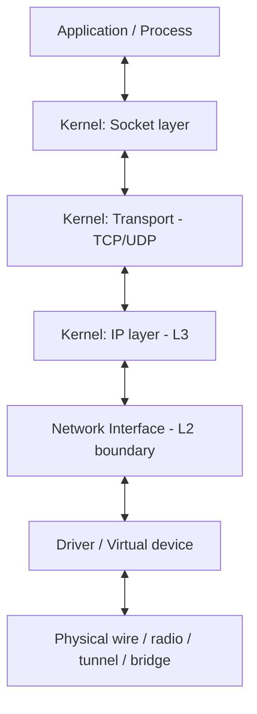

A **network interface** is the point where a computer connects to a network. It can be physical (an Ethernet port, a Wi-Fi card) or virtual (loopback, Docker bridge, VPN tunnel) — but from the OS's point of view, both look the same: a named endpoint with attributes and a queue for packets.

This note builds up a mental model of the interface, then traces how a byte travels from a process all the way to the wire and back.

## What an interface looks like to the OS

Each interface has:

- A **name** — `eth0`, `enp3s0`, `wlan0`, `wlp2s0`, `lo`, `docker0`, `veth*`, `tun0`, `tap0`.
- A **MAC address** (link layer).
- One or more **IP addresses** bound to it (an interface can have several).
- An **MTU**, a **state** (up/down), and **flags** (broadcast, multicast, loopback).
- A **packet queue** in both directions.

You can list them with:

```bash
ip addr        # interfaces and their IPs
ip link        # link-layer info (MAC, state)
ip -s link     # with traffic statistics
```

The older `ifconfig` is deprecated on most Linux distros today.

## An object-oriented view

A nice way to think about interfaces is as a **class with polymorphic backings**:

```python
class NetworkInterface:
    # identity / attributes
    name        # "eth0", "docker0", "lo"
    mac_addr    # link-layer address
    ip_addrs    # list — an interface can have multiple IPs
    mtu         # max packet size
    state       # up / down
    flags       # broadcast, multicast, loopback, ...

    # methods (conceptually)
    send(frame)        # hand a frame out
    receive() -> frame # pull a frame in
```

Each **instance** is a real interface, and the instance hides what's behind it — Wi-Fi radio, copper cable, VMware vNIC, Docker veth, WireGuard tunnel. The kernel calls `send()`/`receive()` the same way regardless. That's exactly how the Linux kernel models it internally (`struct net_device`).

## Which layer does it live on?

Slightly more precise than "the IP layer": an interface sits **between layers 2 and 3**.



- **Layer 2 (link)**: MAC addresses, frames — the interface's native job.
- **Layer 3 (IP)**: IP addresses are *assigned to* interfaces, but the IP *logic* (routing, TTL, fragmentation) happens above, in the kernel's IP stack.

So the interface **carries** an IP address as a property, but it doesn't reason about IP. It only knows:

- "Is this incoming frame addressed to me at L2?"
- "What MAC do I put on this outgoing frame?" (resolved via ARP)

Everything else — *should I accept this packet? where should I forward it? which socket does it belong to?* — is the kernel's job.

## The two sides of the boundary

### Receive path (wire → process)

```
       wire
        │
        ▼
   ┌─────────────────────────────┐
   │ network interface (L2)      │  frame for my MAC? → strip Ethernet header
   ├─────────────────────────────┤
   │ kernel: IP layer            │  dst IP is mine? → strip IP header,
   │                             │  read "protocol" field (TCP=6, UDP=17)
   ├─────────────────────────────┤
   │ kernel: transport (TCP/UDP) │  strip TCP/UDP header,
   │                             │  look up (src_ip, src_port,
   │                             │           dst_ip, dst_port) in socket table
   ├─────────────────────────────┤
   │ kernel: socket layer        │  found socket → which process owns it?
   └─────────────────────────────┘
        │
        ▼
   process: read(socket) gets the data
```

1. A frame arrives. The interface checks: *is this for my MAC?* (or broadcast/multicast, or am I in promiscuous mode?)
2. Strip the Ethernet header, hand the IP packet up. The interface does **not** look at the IP header.
3. The IP layer checks `dst IP`, decides accept / forward / drop, reads the protocol field, hands the payload to TCP or UDP.
4. The transport layer uses the 4-tuple `(src_ip, src_port, dst_ip, dst_port)` plus protocol to look up the socket.
5. Data lands in that socket's receive buffer; the owning process gets it on its next `read()`.

### Send path (process → wire)

```
   process: write(socket, data)
        │
        ▼
   ┌─────────────────────────────┐
   │ kernel: socket layer        │  knows which process / which socket
   ├─────────────────────────────┤
   │ kernel: transport (TCP/UDP) │  adds TCP/UDP header (src/dst port)
   ├─────────────────────────────┤
   │ kernel: IP layer            │  adds IP header (src/dst IP),
   │                             │  consults routing table → picks interface
   ├─────────────────────────────┤
   │ network interface (L2)      │  ARP → adds Ethernet header → sends frame
   └─────────────────────────────┘
        │
        ▼
       wire
```

A subtle point: a process doesn't really "generate a transport-layer packet." It just writes **raw bytes** to a socket via `write()`/`send()`. The kernel adds the TCP or UDP header; the process never sees it. (The exception is raw sockets, used by tools like `ping` and `tcpdump`.)

## The two tables that make it work

The kernel is the smart middle layer, and almost all of its routing intelligence boils down to **two tables**:

| Direction | Table | Key | Decision |
|---|---|---|---|
| Outgoing | Routing table | destination IP / prefix | Which interface (and next-hop) to send through |
| Incoming | Socket table | `(proto, src_ip, src_port, dst_ip, dst_port)` | Which socket — and therefore which process — gets the data |

That's really the whole TCP/IP stack from the OS's point of view:

- Processes speak in **bytes + socket**.
- Interfaces speak in **frames**.
- The kernel translates by wrapping/unwrapping IP and transport headers, using the routing table on the way out and the socket table on the way in.

## Why this separation matters

Because the interface is deliberately dumb about IP, the **same kernel code** works whether the interface is Ethernet, Wi-Fi, a VPN tunnel, a Docker veth, or a VM's vNIC. Each backing only has to implement "move a frame in / move a frame out" — the kernel handles all higher-level logic above it.

That's also why container networking, VPNs, and virtual machines can all be built on the same primitives: create a virtual interface, plug it into the kernel's interface list, and the rest of the stack just works.

## One-line summary

> A network interface is a polymorphic L2 endpoint that exposes `send`/`receive` for frames, carries a MAC, and *has* one or more IPs bound to it so the L3 stack above can use it as an exit/entry point. Two kernel tables — routing and socket — do the rest. ⚙️
