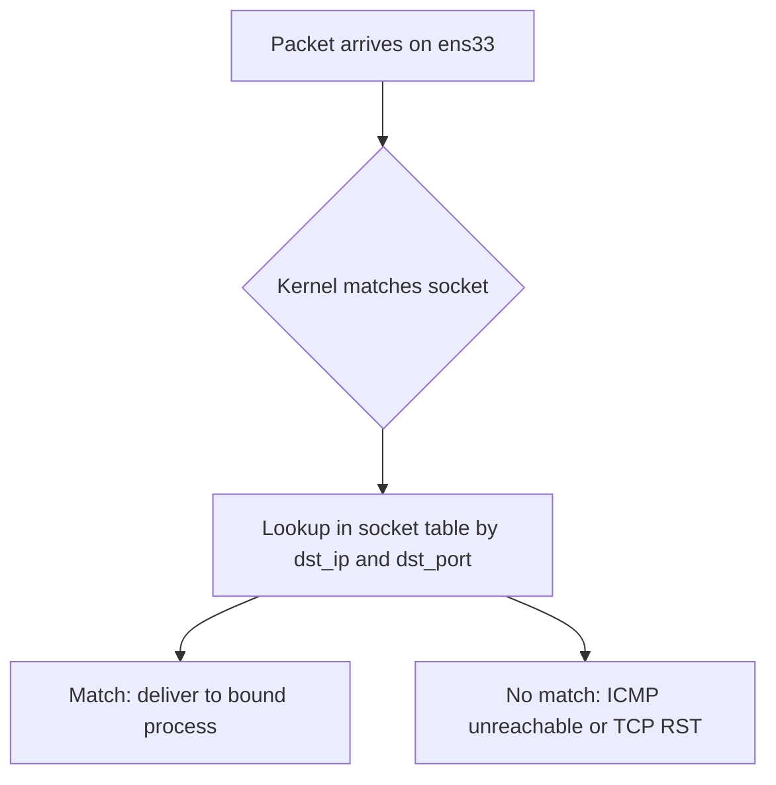

When someone says *"this server is bound to the eth0 interface"* or *"port 3000 is taken,"* they're using shorthand that hides what the kernel is actually doing. This note unpacks two related but distinct ideas:

1. What `bind()` actually associates a socket with.
2. Why the port space is **per-IP**, not per-machine.

Both are governed by the same structure: the kernel's **socket table**.

## What `bind()` actually does

A socket is keyed in the kernel by a tuple:

```
(protocol, local_ip, local_port, remote_ip, remote_port)
```

`bind()` writes the **local** half. When a listening server calls `bind(("0.0.0.0", 8080))`, the socket table gains an entry:

```
(TCP, 0.0.0.0, 8080, *, *) → this socket → owning process
```

Incoming SYNs are matched against this table. So `bind()` is, mechanically, a **filter on which incoming packets get delivered here**.

## "Bind to an interface" — two different mechanisms

### 1. The common case: bind to an IP

```python
sock.bind(("0.0.0.0", 8080))         # all interfaces
sock.bind(("127.0.0.1", 8080))       # loopback only
sock.bind(("192.168.1.156", 8080))   # only the ens33 interface's IP
```

The process binds to an **(IP, port)** pair, not to an interface name. But since each IP is assigned to an interface, choosing a specific IP *implicitly* selects an interface.

| Bind address | Accepts packets arriving on… |
|---|---|
| `0.0.0.0` (or `::`) | **any** interface — kernel doesn't filter by destination IP |
| `127.0.0.1` | only loopback — packets from other machines never match |
| `192.168.1.156` | only frames whose IP header has that dst IP |

This is what people almost always mean by *"bound to eth0"*: the listening socket's bound IP happens to live on eth0. The kernel doesn't actually track "this socket belongs to eth0" — it tracks "this socket wants packets with destination IP X."

### 2. The strict case: bind to a device (`SO_BINDTODEVICE`)

If you really want *"only this interface, regardless of IP,"* Linux has a separate mechanism:

```c
setsockopt(sock, SOL_SOCKET, SO_BINDTODEVICE, "eth0", 5);
```

This:

- **Requires root** (`CAP_NET_RAW`).
- Pins the socket to a device — even if routing would pick a different interface.
- Is how **DHCP clients** work — they need to send packets *before* having an IP, so they can't bind to one; they bind to the device.
- Is also used for VRF / policy routing where traffic must stay on a specific NIC.

Tool-level equivalents:

```bash
ping -I eth0 8.8.8.8
curl --interface eth0 https://example.com
```

### The distinction in one diagram



- **Binding to an IP** filters on the *destination IP in the packet*.
- **Binding to a device** filters on *which interface the packet rode in or goes out through*.

Usually they overlap (each IP lives on one interface), but they diverge when:

- An interface has **multiple IPs** — binding to one IP doesn't restrict the device.
- An IP appears on **multiple interfaces** (some virtual setups, anycast).
- You have **no IP yet** (DHCP, link-local discovery).
- A packet comes in on the "wrong" interface — by default Linux accepts it; device binding rejects it.

## Is the port space shared across interfaces?

This is the question that trips most people up. Intuition says: *"Port 3000 is taken — no one else can use it."* The reality:

> The kernel enforces uniqueness on `(protocol, local_ip, local_port)`, **not** on `(protocol, local_port)` alone.

So these **coexist fine**:

```python
proc A: bind(("127.0.0.1",      3000))   # loopback
proc B: bind(("192.168.1.156",  3000))   # ens33
```

Two separate entries in the socket table, two separate processes, same port number, no conflict. When a SYN arrives, the kernel routes it based on the destination IP in the IP header:

```bash
curl 127.0.0.1:3000        # hits proc A
curl 192.168.1.156:3000    # hits proc B
```

### The wildcard conflict

The conflict appears when one side is `0.0.0.0`:

```python
proc A: bind(("0.0.0.0",        3000))   # all interfaces
proc B: bind(("192.168.1.156",  3000))   # fails: EADDRINUSE
```

`0.0.0.0:3000` claims port 3000 on **every** interface, so it overlaps with any specific bind on the same port.

### Full coexistence matrix

For port 3000 on a machine with `127.0.0.1` and `192.168.1.156`:

| Bind A | Bind B | Coexist? |
|---|---|---|
| `127.0.0.1:3000` | `192.168.1.156:3000` | ✅ different IPs |
| `127.0.0.1:3000` | `127.0.0.1:3000` | ❌ identical |
| `0.0.0.0:3000` | `127.0.0.1:3000` | ❌ wildcard overlaps |
| `0.0.0.0:3000` | `0.0.0.0:3000` | ❌ identical wildcards |
| `0.0.0.0:3000` (TCP) | `0.0.0.0:3000` (UDP) | ✅ different protocols |

The wildcard conflicts can be relaxed with `SO_REUSEADDR` and `SO_REUSEPORT` (the latter even load-balances across processes), but those are explicit opt-ins.

## Why people *think* the port space is global

Two reasons:

1. **`0.0.0.0` is the default for most server frameworks.** Express, nginx, Python's `http.server`, Go's `net/http`, FastAPI — all listen on the wildcard unless told otherwise. So the first server to bind port 3000 claims it everywhere, and the second one fails. The conflict *looks* global only because everyone uses the wildcard.

2. **Outgoing connections share a global ephemeral port pool.** When `connect()`-ing, the kernel picks a source port from a shared range (typically 32768–60999). That pool isn't per-interface. But this is a different mechanism from `bind()`.

## Running two servers on the same port

Bind each to a specific IP rather than the wildcard:

```python
# server A — only on loopback
sockA.bind(("127.0.0.1", 3000))

# server B — only on the LAN interface's IP
sockB.bind(("192.168.1.156", 3000))
```

Same port, two processes, zero conflict. Verify with:

```bash
ss -tlnp                            # all listening sockets, process, bind address
ss -tlnp '( sport = :3000 )'        # only port 3000
```

You'll see two distinct `Local Address:Port` entries.

## Summary

- `bind()` writes `(proto, local_ip, local_port)` into the kernel's socket table.
- "Bind to an interface" almost always means "bind to an IP that happens to be on that interface."
- True device binding (`SO_BINDTODEVICE`) is separate, root-only, and uncommon outside DHCP/VPN/multi-homed routing.
- **The port space is per-IP, not per-machine** — two processes can hold port 3000 simultaneously as long as their bound IPs differ.
- The illusion of a global port space comes from `0.0.0.0` being the default in most server frameworks. ⚙️
