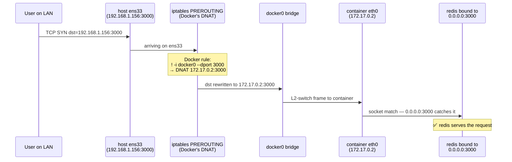

This note assembles a complete mental model of Docker's default bridge networking: the IPs Docker picks and why, what addresses look like from inside the container, how `-p` port mapping plumbs traffic into containers, and the classic "I bound to `127.0.0.1` and now nothing reaches me" gotcha.

It builds on the [Pattern 2 network namespace post][pattern2] — `docker0` is exactly that pattern, just productionized.

[pattern2]: /posts/2026-05-15-netns-pattern-1-direct-veth/

## docker0 is a Linux bridge

Every running Docker container with default networking has its own network namespace, with its own `eth0` (one end of a veth pair). The other end of the veth lives in the host namespace and is plugged into a bridge called `docker0`.

```
ip addr  # (on the host)

docker0           UP    172.17.0.1/16            ← the default bridge
veth6dc8241@if2   UP    no IPv4                  ← veth host-end, plugged into docker0
vethd03f2fa@if2   UP    no IPv4                  ← another container's veth host-end
```

That's container networking on Linux in one snapshot:

- `docker0` is a virtual L2 switch with the gateway IP `172.17.0.1`.
- Each `veth*@if2` is a host-side patch cable into the bridge — no IP of its own.
- Each container sees its veth-other-end renamed to `eth0` inside its namespace, with its own IP (`172.17.0.2`, `172.17.0.3`, …).

The bridge plays **two roles simultaneously**:

1. **L2 switch** — when frames arrive with destination MAC = another veth's MAC, the bridge switches them. Container-to-container traffic stays at L2, never touches the host's routing table or NAT.
2. **L3 gateway** — when frames arrive with destination MAC = the bridge's own MAC (because containers point their default route at `172.17.0.1`), the bridge hands them up to the host's IP layer, which routes & NATs them out via `ens33`.

Same dual nature as `br-lan` in a home Wi-Fi router — Wi-Fi clients on the same SSID L2-switch directly through `br-lan`, and the same `br-lan` is also the gateway IP for traffic heading to the internet. 🌉

## Why Docker uses 172.17.0.1 (and not 192.168.0.1)

[RFC 1918][rfc1918] reserves three private IP ranges that the public internet promises never to route:

[rfc1918]: https://datatracker.ietf.org/doc/html/rfc1918

| Range | Typical user |
|---|---|
| `10.0.0.0/8` | Large enterprises, cloud VPCs (AWS/GCP default), corporate networks |
| `172.16.0.0/12` (covers `172.16.0.0` – `172.31.255.255`) | **Docker** |
| `192.168.0.0/16` | Home routers (almost universally) |

Docker picked `172.16.0.0/12` for **collision avoidance**:

- If Docker defaulted to `192.168.x.x`, it would clash with every home router. Running Docker on a home laptop would break the browser's path to the real router.
- If Docker defaulted to `10.x.x.x`, it would clash with corporate VPNs, AWS VPCs, and big internal LANs.
- `172.16.0.0/12` is in the wild much less often — the safest default.

Inside that range, Docker reserves `172.16.0.0/16` for "user discretion" and gives the **default bridge** the next /16: `172.17.0.0/16`. That's where `docker0 = 172.17.0.1` comes from.

User-defined networks (created by `docker network create` or `docker compose`) grab the next available /16:

| Network | Default subnet | Gateway IP |
|---|---|---|
| `docker0` (default bridge) | `172.17.0.0/16` | `172.17.0.1` |
| First user-defined bridge | `172.18.0.0/16` | `172.18.0.1` |
| Second user-defined bridge | `172.19.0.0/16` | `172.19.0.1` |
| … | up through `172.31.0.0/16` | |

That matches what you typically see: `docker0` at `172.17.0.1/16`, and `br-04bd5d92ed85` at `172.18.0.1/16` for the first user-defined network. The hash-named bridges are Docker-managed; their names are stable per-network.

You can override the defaults in `/etc/docker/daemon.json` if you actually live on `172.17.x.x`:

```json
{
  "bip": "10.200.0.1/24",
  "default-address-pools": [
    { "base": "10.201.0.0/16", "size": 24 }
  ]
}
```

## What addresses look like from inside the container

Each container has its own network namespace with its own loopback, its own ARP cache, its own socket table. The address-to-meaning mapping inside the container is:

| IP a process sees from inside the container | What it actually refers to | Whose stack handles it |
|---|---|---|
| `127.0.0.1` (or `localhost`) | The **container's** loopback (`lo` inside its netns) | Container only — never reaches the host |
| `172.17.0.2` (container's own `eth0` IP) | The container itself, via `eth0` | Container only |
| **`172.17.0.1`** (the gateway) | The **host's** `docker0` bridge interface | Host's kernel |
| `192.168.1.156` (host's LAN IP) | The host's `ens33` interface | Host's kernel |
| `0.0.0.0` when binding | All of the *container's* interfaces (`lo` + `eth0`) | Container only — does NOT include the host |

```
 ┌─── inside container netns ────┐    ┌─── host netns ──────────────┐
 │                               │    │                             │
 │   127.0.0.1 ── container's lo │    │   127.0.0.1 ── host's lo    │
 │                               │    │   192.168.1.156 ── ens33    │
 │   172.17.0.2 ── eth0 (mine)   │    │                             │
 │                               │◄───┤   172.17.0.1 ── docker0     │
 │   default gateway: 172.17.0.1 │    │                             │
 └───────────────────────────────┘    └─────────────────────────────┘
                ↑                                  ↑
                │                                  │
        container processes              host processes
        see only the left side           see only the right side
```

The key insight: **`127.0.0.1` in the container and `127.0.0.1` on the host are two completely separate `lo` devices**, with two separate socket tables. They share nothing. The only address that "crosses" the boundary is the gateway: `172.17.0.1` exists in the host's stack, and the container reaches it as its default-route next hop.

### The classic gotcha

> Run a host service bound to `127.0.0.1:8080`. From inside a container, `curl 172.17.0.1:8080` fails with "connection refused." Why?

Because the host server is bound to `127.0.0.1` — only the **host's** `lo`. The container's traffic arrives at the host through `docker0` (dst IP `172.17.0.1`), and the kernel won't deliver it to a socket bound to `127.0.0.1`. The fix is to bind the host service to either `0.0.0.0:8080` (exposed to everything) or `172.17.0.1:8080` (exposed only to containers).

This is the same *"port space is per-IP"* rule that we've been chasing across every layer. ⚙️

## `-p` port mapping: the full chain

When you run `docker run -p 3000:3000 redis`, three independent layers cooperate to make the port reachable from outside.



The three pieces:

1. **Docker's `-p` flag installs an iptables DNAT rule** on the host that rewrites traffic from `host:3000` to `container_ip:3000`. This is the inbound NAT side of [Pattern 2][pattern2].
2. **`docker0` routes the rewritten packet** to the right container via L2 switching on the bridge.
3. **The process inside the container is bound to `0.0.0.0:3000`** so it actually catches the packet arriving on `eth0`.

You can see the rule Docker added:

```bash
sudo iptables -t nat -L DOCKER -n -v
```

```
Chain DOCKER
target     prot opt in       source       destination
RETURN     all  --  docker0  anywhere     anywhere
DNAT       tcp  -- !docker0  anywhere     anywhere   tcp dpt:3000 to:172.17.0.2:3000
```

The `! docker0` filter means *"apply this DNAT to traffic arriving on any interface **other than** `docker0`"* — i.e., from the LAN, not from other containers. That's how inter-container traffic stays clean of port-mapping rewrites.

## Why `0.0.0.0` (not `127.0.0.1`) is load-bearing

The DNAT rule rewrites the destination to the container's **`eth0` IP** (`172.17.0.2`), not to `127.0.0.1`. So the packet arrives inside the container with:

```
src = 192.168.1.50    (original client)
dst = 172.17.0.2:3000
```

- If the app is bound to `0.0.0.0:3000` — socket match — served. ✅
- If the app is bound to `127.0.0.1:3000` — no socket match — RST sent. ❌

This is why official Docker images for daemons that default to `127.0.0.1` are pre-configured to bind to `0.0.0.0`:

| Image | What it does |
|---|---|
| `redis` (official) | Sets `bind 0.0.0.0` (Redis's default is `127.0.0.1`) |
| `postgres` (official) | Sets `listen_addresses = '*'` (PG's default is `localhost`) |
| `mysql` (official) | Sets `bind-address = 0.0.0.0` (MySQL 8's default is `127.0.0.1`) |
| `nginx` (official) | Default config already binds to `0.0.0.0` |
| `httpd` / `apache` | Default config already binds to `*` |

Verify on a running container:

```bash
docker exec my-redis ss -tlnp
# LISTEN 0  511   *:6379  *:*  users:(("redis-server",...))
#                 ^^^^^^^ 0.0.0.0 — all interfaces inside the container
```

## `-p` variants — who can reach the mapping

The `HOST_IP` part of `-p HOST_IP:HOST_PORT:CONTAINER_PORT` adds a `-d HOST_IP` filter to the DNAT rule, narrowing which incoming packets match.

| Flag | LAN can reach | Host can reach |
|---|---|---|
| `-p 3000:3000` | ✅ | ✅ |
| `-p 127.0.0.1:3000:3000` | ❌ | ✅ |
| `-p 192.168.1.156:3000:3000` | ✅ | ✅ |
| `-p 3000:3000/udp` | ✅ (UDP only) | ✅ |
| (no `-p`) | ❌ | only from other containers on the same Docker network |

A couple of important subtleties:

### The host can always reach its own mappings

Even with `-p 192.168.1.156:3000:3000`, the host itself can `curl 192.168.1.156:3000`. The reason is that Docker hooks DNAT rules into **two** iptables chains, not just one:

```bash
sudo iptables -t nat -L OUTPUT -n -v
```

```
Chain OUTPUT (policy ACCEPT)
target     prot opt source       destination
DOCKER     all  --  anywhere     anywhere   ADDRTYPE match dst-type LOCAL
```

- `PREROUTING` handles packets arriving from outside (the LAN).
- `OUTPUT` handles packets generated **locally by the host** that target one of the host's own IPs.

So when a process on the host runs `curl 192.168.1.156:3000`, the OUTPUT chain catches it, DNATs to the container's IP, and the packet flows in via `docker0`. There's also a userspace fallback called `docker-proxy` that listens on the host's mapped IP:port and forwards to the container for the rare cases where iptables can't fire — but `OUTPUT` chain DNAT handles the common case.

The `-p HOST_IP:` filter scopes *external* reachability; the host always has at least one path to its own mappings.

### Container bound to `127.0.0.1` breaks every variant

If the process inside the container is bound to `127.0.0.1:3000`, **every `-p` form fails**, regardless of host-IP filter:

```
[Container's network namespace]

    eth0:  172.17.0.2     ←─ DNAT'd packets arrive HERE
    lo:    127.0.0.1      ←─ process is listening HERE

    socket table:
        (TCP, 127.0.0.1, 3000)  →  redis
        (no entry for 172.17.0.2:3000)
```

The DNAT'd destination is `172.17.0.2:3000`, not `127.0.0.1:3000`. No socket match → RST → connection refused. The only escape is `--network=host`, which removes the namespace boundary entirely (and removes all isolation along with it).

## Useful pieces around the edges

A grab-bag of related things that come up often.

### `host.docker.internal`

A friendly DNS alias for "the host" provided by Docker:

```bash
docker run --add-host=host.docker.internal:host-gateway ubuntu \
    ping host.docker.internal
```

On Linux it resolves to `172.17.0.1` (the gateway). On Docker Desktop (Mac/Windows) it resolves to a VM-internal IP. Either way it's just a name for the gateway. 🎭

### `--network=host`

Skips the netns entirely — the container runs directly in the host's network namespace.

| Effect | Consequence |
|---|---|
| `127.0.0.1` in container = host's `127.0.0.1` | A container bound to `127.0.0.1` is now reachable from other host processes |
| No `eth0` from `docker0` | No bridge involvement, no DNAT needed |
| Container can bind to host IPs | And conflict with host services that already use those ports |
| No isolation | Goodbye separate socket table, separate iptables rules, separate ARP cache |

### `docker network ls` to match the names

Each user-defined network has a stable bridge interface and a Docker-managed name:

```bash
docker network ls
docker network inspect <id>      # shows subnet, gateway, containers attached
```

The `br-XXXXXXXX` bridges you see in `ip addr` correspond one-to-one with `docker network ls` entries.

## The complete mental model in one sentence

> Docker default networking = **Pattern 2** with `172.17.0.1` as the bridge IP. `-p` adds an iptables DNAT rule on the host that rewrites incoming traffic to the container's `eth0` IP. For that to actually reach a process, the process must bind to `0.0.0.0` (or to `eth0`'s IP) inside the container — `127.0.0.1` inside the container is a separate, isolated loopback that the DNAT'd packet never touches. Choose the `-p HOST_IP:` prefix to scope *external* reachability; the host can always reach its own mappings via the iptables `OUTPUT` chain. ⚙️
