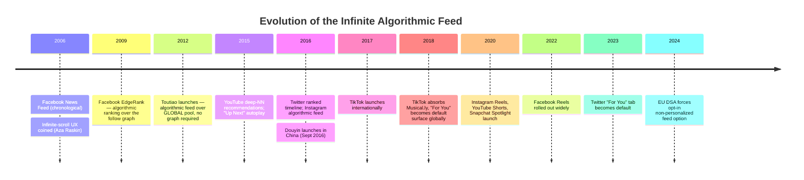

"Infinite feed" and "recommendation algorithm" get used almost interchangeably in 2026, but they're two distinct ideas that happen to be glued together in the dominant social product pattern. Pulling them apart makes the modern feed make much more sense — and reveals that the inventor of the combination isn't who most Western writeups credit.

## Two orthogonal ideas

**Infinite feed** is a UX/pagination pattern. When the user nears the bottom of the screen, fetch the next page and append it. That's the entire mechanism. It says nothing about *how* items are ordered or *where* they come from.

**Recommendation algorithm** is a ranking/selection mechanism. Given a candidate pool of items and signals about a user, score and order the items. It says nothing about *how* the resulting list is rendered.

You can mix and match the two freely:

| Ranking        | Pagination       | Example                              |
| -------------- | ---------------- | ------------------------------------ |
| Chronological  | Pages (next/prev) | Old blog archives                   |
| Chronological  | Infinite scroll  | Early Twitter, early Instagram       |
| Algorithmic    | Pages            | Search results                       |
| Algorithmic    | Infinite scroll  | TikTok FYP, modern IG, modern Twitter |

The modern "social feed" is just the bottom-right cell — but it took fifteen years of separate evolution before anyone combined them as a whole-product experience.

## The natural floor of a chronological feed

Classic infinite feeds were chronological lists of posts from accounts you followed. They had a property modern feeds deliberately destroyed: **a natural stopping cue**.

Posts from N follows over time T is a finite set. Scroll far enough and you hit content you've already seen. The UX is infinite-scroll, but the *content* is finite. Instagram even made this explicit in 2018 with the "You're all caught up" marker.

So the original infinite feed was **infinite UX over finite content**.

## Early recommendation was bounded

In parallel, recommendation systems were maturing — but as *modules*, not feeds:

- Amazon's "Customers who bought this also bought" — a strip of ~10 items, late 1990s, classic collaborative filtering.
- Netflix DVD-era "Because you watched X" rows.
- YouTube's "Related videos" sidebar.
- Last.fm / Pandora "you might also like."

The shared properties:

- **Bounded set** (5, 10, 20 items — not endless)
- **Context-anchored** (tied to a product, video, or song you're already viewing)
- **Supplementary** (a feature on the page, not the page itself)
- **Often explainable** ("because you watched Y")

Amazon still does it this way today, because the business model (intent-to-purchase) rewards converting your specific search into a checkout, not endless browsing.

## The combination — and who invented it

The transformative move was combining the two into a single primary surface: an algorithmically ranked, infinitely scrolling feed drawn from a candidate pool **larger than your follow graph**. Most Western histories credit TikTok. The real first mover is earlier and elsewhere.

### 2006–2009: Facebook combines algorithm + infinite feed, but still graph-bounded

Facebook News Feed launched chronological in 2006, switched to algorithmic ranking (EdgeRank) around 2009–2011. This is the first mass-scale algorithmic feed as a primary surface — but the candidate pool is still your friends. It's "infinite UX over finite content" with smarter ordering.

### 2012: Toutiao — the actual invention

ByteDance launches **Toutiao** (今日头条), a news app, in August 2012. This is the breakthrough:

- No follow graph required.
- Candidate pool = the **entire content corpus**.
- Algorithmic recommendation is the *only* surface.
- Built around an aggressive ML personalization loop from day one.

Toutiao is the first product where *infinite feed + global-pool recommendation + no social graph* is the entire product, not a feature. Zhang Yiming explicitly founded ByteDance around this thesis.

### 2015–2016: the legacy platforms give up on chronological

- YouTube publishes its deep neural network recommendation paper (2016); the homepage and "Up Next" sidebar become heavily ML-driven.
- Twitter introduces a ranked timeline (2016).
- Instagram switches to algorithmic feed (2016).

These are still *graph-bounded* — algorithmic ordering over your follows, not over the global pool.

### 2016: Douyin applies the Toutiao recipe to short video

ByteDance launches Douyin in September 2016. Full-screen swipe-up feed, global candidate pool, no follow requirement, aggressive engagement-signal collection (watch time, replays, skips). The form factor that becomes culturally dominant.

### 2017–2018: TikTok globalizes the pattern

- TikTok launches internationally in 2017.
- ByteDance acquires Musical.ly (November 2017) and merges it into TikTok in August 2018, inheriting Musical.ly's Western user base.
- The "For You Page" becomes the default landing surface globally.

This is when the pattern becomes a Western mainstream consumer experience.

### 2020–2023: everyone copies TikTok

A wave of explicit clones, all converging on the same pattern:

- **Instagram Reels** — Aug 2020
- **YouTube Shorts** — Sept 2020
- **Snapchat Spotlight** — Nov 2020
- **Facebook Reels** — 2022 (wide rollout)
- **Twitter "For You" tab** as default — 2023
- **LinkedIn** progressively de-emphasizes chronological

By 2023, every major social platform either has a TikTok-style FYP or has restructured its main feed around the same three principles: global candidate pool, algorithmic ranking, infinite scroll.

### 2024–today: pushback and escape hatches

- The EU Digital Services Act requires platforms to offer a non-personalized feed option (2024).
- Instagram lets users switch back to chronological.
- These are opt-in escape hatches, not new defaults.
- The "follow graph" is now a *signal* into the recommender, not the source of candidates.

## The one-line history

> 2006 Facebook News Feed (algorithm + infinite, over follow graph) → 2012 **Toutiao** invents the modern pattern (algorithm + infinite, over global pool, no graph) → 2016 Douyin applies it to short video → 2018 TikTok globalizes it → 2020+ everyone copies.

Toutiao is the real first. TikTok is just the version the Western internet noticed.

## Why the distinction matters

Conflating the two ideas obscures three substantive design choices that any feed product has to make:

1. **Pagination model.** Infinite scroll vs. discrete pages vs. session-bounded ("here are 20, come back tomorrow"). This is purely UX.
2. **Candidate pool.** Follow graph only, follow graph + recommendations, or purely global. This is the most consequential lever — it determines whether the feed has a natural floor.
3. **Ranking signal.** Chronological, social-graph affinity, predicted engagement, value-model optimization. This determines what experience the feed actually optimizes for.

The reason classic chronological feeds felt different from TikTok isn't infinite scroll — both use it. It's that **classic feeds had a finite candidate pool (your follows) and a stopping cue (catching up to seen content)**, and the modern feed has neither. The candidate pool is unbounded, the ranker always has something to show, and the "end" never arrives.

Whether that's good product design or behavioral exploitation depends on your perspective. Aza Raskin, who coined "infinite scroll," has publicly regretted it. The EU has legislated escape hatches. Most users haven't switched them on.

## Takeaway mental model

When you look at any feed product, ask three separate questions, not one:

- ⚙️ **How is the list paginated?** (UX layer)
- 🎯 **Where do the candidates come from?** (pool layer)
- 📊 **How are candidates ranked?** (ranking layer)

A chronological Twitter timeline circa 2010 and TikTok's FYP in 2026 differ on all three layers, not just on whether "the algorithm" is involved. Treating "infinite feed" and "recommendation" as separate variables — instead of one undifferentiated blob — makes feed design legible, and makes the historical arc obvious.
