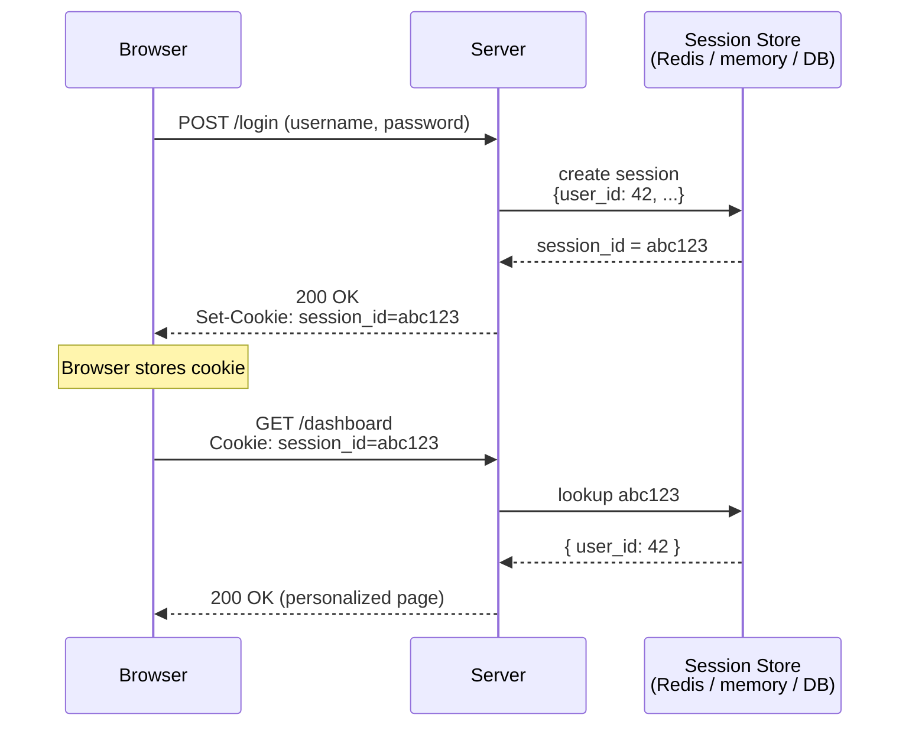
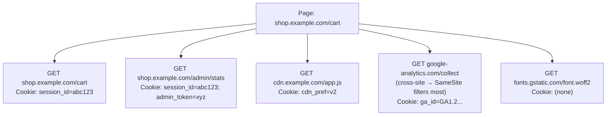

HTTP is stateless: each request is independent, and the server has no built-in way to know that two requests came from the same user. Cookies and sessions are the patch on top of that — they let a server recognize "this is the same logged-in person who clicked Login a minute ago."

This note untangles the two concepts (they're related but not the same thing), shows the exact wire format of the relevant headers, and ends with practical recipes for grabbing cookies out of Chrome.

## Cookie vs. Session — different things

**Cookie** — a small piece of data the server tells your browser to store. The browser automatically attaches it to every subsequent request to that site. It's a **transport / storage mechanism**.

**Session** — a server-side concept: "this series of requests belongs to the same user." It's an **idea about state**, not a specific data format.

They're often discussed together because the most common implementation of "session" uses a cookie to carry the session ID. But you can have:

- 🍪 **Cookies without sessions** — e.g., a `theme=dark` preference, no login involved.
- 🆔 **Sessions without traditional cookies** — e.g., a JWT in an `Authorization: Bearer …` header.

## The classic flow: how they work together



Key point: the cookie carries only an **opaque ID**. The actual session data (who you are, what you can do) lives on the server. The browser never sees `user_id: 42`.

## Headers: which goes which direction

| Header | Direction | Sent by | Purpose |
|---|---|---|---|
| `Set-Cookie` | Response | Server | "Browser, please store this." |
| `Cookie` | Request | Browser | "Here are the cookies you told me to store." |

A subtle asymmetry: the server sends rich metadata (`HttpOnly`, `Max-Age`, `Path`, `SameSite`, …) via `Set-Cookie`, but the browser sends back only the bare `name=value` pairs. **The attributes live in the browser's cookie jar and govern *when* to send the cookie — they're never transmitted back.**

## `Set-Cookie` — the response-header format

```
Set-Cookie: <name>=<value>; Attr1; Attr2=val; Attr3; ...
```

The first `name=value` is the cookie itself. Everything after each `;` is an **attribute** controlling the cookie's behavior. Attributes are case-insensitive and order doesn't matter.

A realistic example:

```
Set-Cookie: session_id=abc123; Domain=example.com; Path=/; Expires=Wed, 21 Oct 2026 07:28:00 GMT; Max-Age=3600; Secure; HttpOnly; SameSite=Lax
```

### Attributes

| Attribute | Value | Purpose |
|---|---|---|
| `Expires` | HTTP-date | Absolute expiry time (GMT). |
| `Max-Age` | seconds | Relative expiry (preferred over `Expires`; wins if both are set). |
| `Domain` | hostname | Which hosts get the cookie. Omitted → only the exact origin host. `Domain=example.com` → also sent to subdomains. |
| `Path` | URL path prefix | Only sent if the request path starts with this. Default `/`. |
| `Secure` | (no value) | Only sent over HTTPS. |
| `HttpOnly` | (no value) | JavaScript (`document.cookie`) can't read it. |
| `SameSite` | `Strict` / `Lax` / `None` | Whether to send on cross-site requests. `None` requires `Secure`. |
| `Partitioned` | (no value) | Newer (CHIPS): scope cookie to top-level site for anti-tracking. |

### Rules for name/value

- **Name**: ASCII letters, digits, most symbols — but **no** spaces, `=`, `;`, `,`, or control chars.
- **Value**: same restrictions; URL-encode special chars (`%20`) or wrap in double quotes.
- **Size**: no formal max, but browsers typically cap each cookie at ~4 KB.

### One cookie per header

To set multiple cookies, send multiple `Set-Cookie` headers — you cannot pack them into one:

```
Set-Cookie: session_id=abc123; HttpOnly; Secure
Set-Cookie: theme=dark; Max-Age=31536000
Set-Cookie: lang=en; Path=/; Max-Age=31536000
```

### Deleting a cookie

There's no "delete" command — you overwrite with an already-expired one:

```
Set-Cookie: session_id=; Max-Age=0; Path=/
```

The browser sees an expired cookie and removes it. ✅ The `Path` (and `Domain`, if you used one) must match the original — otherwise you create a *different* cookie instead of deleting the existing one.

## `Cookie` — the request-header format

```
Cookie: <name1>=<value1>; <name2>=<value2>; <name3>=<value3>
```

Just bare `name=value` pairs, separated by `; ` (semicolon + space). **One** `Cookie` header per request, containing all applicable cookies.

```
GET /dashboard HTTP/1.1
Host: example.com
Cookie: session_id=abc123; theme=dark; lang=en
```

### What's *not* there

No attributes. None of `Domain`, `Path`, `Expires`, `Secure`, `HttpOnly`, `SameSite` ever appear in the `Cookie` header — those are browser-side rules that decided *whether* to send the cookie, not data to transmit. The server only sees names and values.

### The same-name footgun

If you set two cookies with the same name but different `Path` or `Domain`, the browser may send **both**:

```
Cookie: id=outer; id=inner
```

Order is roughly "more specific path first," but the spec is loose — don't rely on it. Just avoid same-name collisions.

### Which cookies get included

For each request, the browser walks its cookie jar and includes each cookie where:

- ✅ `Domain` matches the request host (exact, or parent if `Domain=` was set)
- ✅ `Path` is a prefix of the request path
- ✅ `Secure` cookies only on HTTPS requests
- ✅ `SameSite` rules permit it (same-site vs. cross-site, navigation vs. subresource)
- ✅ The cookie hasn't expired

### Size limits

Browsers typically cap:

- Total `Cookie` header at ~4 KB
- ~50 cookies per domain

Exceed that and older cookies get evicted **silently** — a real footgun for apps that stuff too much into cookies.

### Server-side parsing

Split on `;`, trim whitespace, split each piece on the first `=`. Most web frameworks expose it as a dict/map (`req.cookies["session_id"]`) so you rarely parse by hand.

## Why cookies differ across requests on the same page

A modern page load fires dozens of requests — HTML, JS, CSS, fonts, images, XHR/fetch, analytics, ads, CDN. Look at the `Cookie:` header on each and you'll notice they're **not identical**. That's not a bug; the browser computes the header **per request** by re-running the filters from the previous section against this request's URL and context.

### Concrete scenario

Imagine you're on `https://shop.example.com/cart` with these cookies stored:

```
session_id=abc123    Domain=example.com      Path=/        HttpOnly  Secure  SameSite=Lax
admin_token=xyz      Domain=example.com      Path=/admin   HttpOnly  Secure  SameSite=Strict
cdn_pref=v2          Domain=cdn.example.com  Path=/                          SameSite=None  Secure
ga_id=GA1.2...       Domain=google-analytics.com  ...
```

The page triggers five requests:



Five requests, five different `Cookie:` headers — all correct.

### The common reasons

1. 🌐 **Different host** — `cdn.example.com`, `api.example.com`, analytics, fonts.gstatic.com all hit different cookie jars. Domain mismatch is the #1 reason.
2. 📁 **Different path** — `Path=/admin` cookies ride along on `/admin/*` but not `/cart`.
3. 🔀 **Cross-site vs. same-site context** — fetch to a third party loses any `SameSite=Lax/Strict` cookies for that third party. `SameSite=None; Secure` is required to ride along on cross-site requests.
4. 🔒 **HTTP vs. HTTPS** — `Secure` cookies dropped on plain-HTTP requests.
5. 🧭 **Top-level navigation vs. subresource** — `SameSite=Lax` cookies are sent on top-level navigations (clicking a link) but **not** on cross-site subresource fetches/images/iframes. The most confusing one.
6. ⏰ **Mid-page changes** — if a response includes a `Set-Cookie` partway through page load, later requests see the new cookie; earlier ones don't.
7. 🗑️ **Server cleared a cookie** — a `Set-Cookie: foo=; Max-Age=0` removes it from the jar for all subsequent requests.
8. 📦 **Per-request size cap** — if total cookies for a domain exceed ~4 KB, the browser drops some silently.

### Verifying in DevTools

When you see "this request has different cookies than that one," DevTools shows you why: **Network → click the request → Cookies sub-tab**. Each cookie has columns for `Path`, `Domain`, `SameSite`, etc., and filtered-out cookies show an info icon with the reason on hover ("not sent because SameSite=Lax", "domain mismatch", etc.).

## Security attributes that matter

These three are the difference between "session cookie" and "session cookie that gets stolen":

- **`HttpOnly`** — JavaScript can't read it. Defends against XSS stealing the session.
- **`Secure`** — only sent over HTTPS. Defends against network eavesdropping.
- **`SameSite=Lax`** (or `Strict`) — not sent on cross-site requests. Defends against CSRF.

For a session cookie, you almost always want all three.

## Inspecting cookies in Chrome

Three primary tools in DevTools (`F12` or `Ctrl+Shift+I`), each suited to a different question.

### 1. Application tab — "what cookies does this site have?"

`Application` → `Storage` → `Cookies` → click the site's origin.

You get a table with every cookie: Name, Value, Domain, Path, Expires, Size, `HttpOnly`, `Secure`, `SameSite`. You can double-click cells to edit, or right-click → Delete.

### 2. Network tab — "what cookies were sent/received on *this* request?"

`Network` → reload the page → click a request → look at:

- **Request Headers** → `Cookie:` (what the browser sent)
- **Response Headers** → `Set-Cookie:` (what the server set)

Or click the **Cookies** sub-tab (next to Headers) for a parsed view of the same data. This is the right tool when debugging "why isn't my cookie being sent on this request?"

### 3. Console — `document.cookie`

```js
document.cookie
// → "theme=dark; lang=en"
```

Quick and easy, but **`HttpOnly` cookies are deliberately hidden** from JavaScript and won't appear here. Most session cookies are `HttpOnly`, so this often misses what you actually want. Use the Application or Network tabs instead for sensitive cookies.

## Getting cookies as a plain text string

For replaying authenticated requests with `curl`, Postman, or scripts:

### Option 1 — Copy the `Cookie:` header value directly

Network tab → click any request → Headers → Request Headers → find `Cookie:` → right-click the value → **Copy value**.

You get the exact wire format:

```
session_id=abc123; theme=dark; lang=en
```

Drop straight into curl:

```bash
curl -H "Cookie: session_id=abc123; theme=dark; lang=en" https://example.com/api
```

### Option 2 — Copy as cURL (easiest in practice) ⭐

Network tab → right-click any request → **Copy → Copy as cURL**.

You get a full curl command with cookies, headers, body, and method already filled in. Paste into a terminal and it runs. This is what most devs actually use for replay.

### Option 3 — `document.cookie` in the Console

```js
document.cookie
```

Returns the string directly, ready to paste — but again, no `HttpOnly` cookies. Fine for non-sensitive testing, not enough for session replay.

### Option 4 — Build your own from the Application table

Read Name/Value columns and assemble manually:

```
name1=value1; name2=value2
```

That's literally the `Cookie:` header format — semicolon + space between pairs, no attributes.

## Real-world case: extracting cookies for video downloads

A common practical motivation for grabbing cookies is downloading videos from sites like Bilibili, Douyin, or YouTube — your own uploads, member-only content you've subscribed to, region-locked content for accounts where you're a paid user, and similar. Tools like [`yt-dlp`][ytdlp] officially support cookie input for this.

The painful part: modern sites set 20+ cookies across multiple subdomains, and only a small subset actually proves "this user is logged in." Picking the right ones by hand is a trap.

**The honest answer: don't try to identify the minimal set. Hand the downloader the full cookie jar for the site.**

### Why it's hard to pinpoint the "right" cookie

Auth on a modern site is usually spread across several cookies:

- A session ID (`SESSDATA`, `sessdata`, `__Secure-3PSID`)
- A CSRF token (`bili_jct`, `csrf`)
- A user ID (`DedeUserID`, `LOGIN_INFO`, `SAPISID`)
- Various signing / anti-bot cookies (`__ac_nonce`, `ttwid`, `s_v_web_id` on Douyin)
- Region or A/B-test cookies that aren't auth but the server may require

Strip the wrong one and you get cryptic errors: "not logged in," "permission denied," "video unavailable," or a silent fallback to low resolution.

### Workflow with `yt-dlp`

#### Option A — `--cookies-from-browser` (easiest) ⭐

```bash
yt-dlp --cookies-from-browser chrome "https://www.bilibili.com/video/BV..."
yt-dlp --cookies-from-browser firefox "https://www.youtube.com/watch?v=..."
```

`yt-dlp` reads Chrome/Firefox's cookie database directly. **No extraction step needed.** Works for Douyin, Bilibili, YouTube, and most other sites.

Gotchas:

- Chrome must be **closed** (or at least not holding a lock on the cookie DB) on Windows/macOS — Linux is usually fine.
- On newer Chrome, cookies are encrypted with the OS keychain. `yt-dlp` knows how to decrypt, but on Linux the keyring may need to be unlocked.
- Multiple profiles: `--cookies-from-browser chrome:ProfileName`.

This solves the problem ~90% of the time — you never pick cookies at all.

#### Option B — `--cookies cookies.txt`

When option A fails (different machine, headless server, no browser installed), export to Netscape `cookies.txt` format.

**Use a browser extension** — on Chrome, either [Get cookies.txt LOCALLY][ext-getcookies-local] (recommended in the `yt-dlp` community — open source, data stays on your device) or [cookies.txt][ext-cookiestxt]; on Firefox, "cookies.txt". Browse to the site while logged in, click the extension, save the file:

```bash
yt-dlp --cookies cookies.txt "https://..."
```

The extension grabs every cookie scoped to the current site, including `HttpOnly` ones that JavaScript can't see — important, because the real auth cookies are almost always `HttpOnly`, so `document.cookie` in the Console will silently miss them.

### If you really need the minimal set

Sometimes you want it — auditing what an auth flow needs, sharing a config without leaking tracking IDs, baking cookies into a script.

1. Start from a working `cookies.txt`.
2. **Find the actual auth request.** DevTools → Network → reload → find the request that returns user-specific data (your username, library, watch history). For example:
   - YouTube: requests to `/youtubei/v1/...` carrying account info
   - Bilibili: `api.bilibili.com/x/web-interface/nav` (returns logged-in user info)
   - Douyin: `aweme/v1/web/user/profile/self/` or similar
3. Look at that request's `Cookie:` header — the site itself uses these for auth. Everything else is probably irrelevant.
4. **Binary search.** Remove half the cookies, retry. Works → remove half of the remaining. Breaks → the removed half contained a critical one. 4–5 iterations gets you the minimal set.

Well-known critical cookies (treat as starting points; they rot fast as sites update):

| Site | Critical cookies |
|---|---|
| Bilibili | `SESSDATA`, `bili_jct`, `DedeUserID` |
| YouTube | `__Secure-3PSID`, `__Secure-3PAPISID`, `SAPISID`, `HSID`, `SSID`, `APISID`, `SID` |
| Douyin | `sessionid`, `sessionid_ss`, `sid_tt`, `ttwid` (anti-bot ones rotate) |

### Warnings

- 🔒 **`cookies.txt` is your login.** Anyone with the file is logged in as you. Don't commit it, don't paste it in chat, don't share it. Use locally and delete.
- ♻️ **Cookies expire and rotate.** A `cookies.txt` from last week may already be dead — re-export when downloads suddenly stop.
- 🤖 **Anti-bot signatures change.** Especially on Douyin — some cookies are computed by client-side JS and tied to a browser fingerprint. `yt-dlp` handles most of it, but breakage from site updates is normal; `pip install -U yt-dlp` fixes it more often than fiddling with cookies.
- 🌍 **Region locks aren't a cookie problem.** If a video is region-locked, no cookie helps — you need a proxy in the right region.

### TL;DR

```bash
# Try this first — no cookie hunting required
yt-dlp --cookies-from-browser chrome "<video URL>"

# Fallback — export with a browser extension, then:
yt-dlp --cookies cookies.txt "<video URL>"
```

The "which cookie is the login cookie?" question disappears when you hand the downloader the whole jar.

[ytdlp]: https://github.com/yt-dlp/yt-dlp
[ext-getcookies-local]: https://chromewebstore.google.com/detail/get-cookiestxt-locally/cclelndahbckbenkjhflpdbgdldlbecc
[ext-cookiestxt]: https://chromewebstore.google.com/detail/cookiestxt/hokhagejalmnclpgldcefjckgmhpogdd

## Mental model recap

- 🌐 **HTTP is stateless** — each request is independent.
- 🍪 **Cookies** are a browser-storage + auto-attach mechanism. Server sets them via `Set-Cookie` (response); browser sends them back via `Cookie` (request).
- 🆔 **Sessions** are the server-side concept of "remember this user across requests." Usually implemented by sticking a session ID in a cookie.
- 📥 `Set-Cookie` carries metadata (`Expires`, `HttpOnly`, …). 📤 `Cookie` carries only `name=value`.
- 🛡️ For session cookies, always set `HttpOnly`, `Secure`, and `SameSite=Lax`.
- 🔍 For debugging: **Application tab** to browse, **Network tab** to trace, **Console** for non-sensitive cookies, **Copy as cURL** for replay.
- 🎲 **Cookies are filtered per request** — same page, many requests, different `Cookie:` headers. Domain, path, `SameSite`, and `Secure` all decide what travels with each request.
- 📥 For video downloaders (`yt-dlp` etc.), **don't pick cookies by hand** — use `--cookies-from-browser` or a cookies.txt extension and pass the whole jar.
