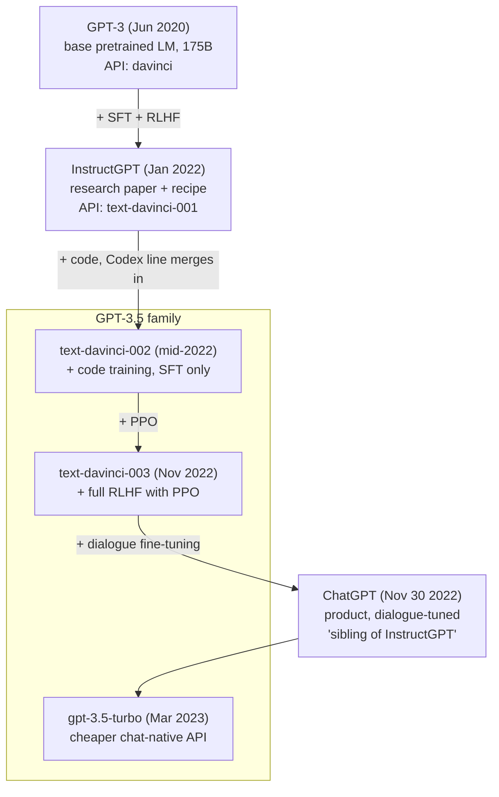

The names **GPT-3**, **InstructGPT**, **GPT-3.5**, and **ChatGPT** get used interchangeably, but they're four different categories of thing: a **base model**, a **research project**, a **model family**, and a **product**.

This post sorts out what each one actually refers to and how they connect.

## Table of contents

## The lineage at a glance

The whole "GPT-3.5" family sits as a band in the middle of this chart — it's a label, not a single model.

## What each name actually means

### GPT-3 — a base model

A pure next-token predictor trained on web text. 175B parameters, released June 2020. Useful but rough: it **completes** text rather than answering questions, and follows whatever pattern the prompt sets up.

Released as the `davinci` API endpoint.

### InstructGPT — a research project (and a recipe)

The January 2022 paper *Training language models to follow instructions with human feedback* introduced the now-standard three-stage alignment recipe:

1. **Supervised fine-tuning (SFT)** on human-written instruction/response demonstrations.
2. **Reward model** trained on human rankings of model outputs.
3. **PPO** (reinforcement learning) optimizing the LM against the reward model.

InstructGPT wasn't one model — it was a **technique applied to GPT-3**. The first deliverable was `text-davinci-001`.

### GPT-3.5 — a model family name

A label OpenAI applied (somewhat retroactively) to a generation of models that:

- Started from a GPT-3-scale base
- Were trained on **code** as well as text — the Codex lineage merges in here
- Went through InstructGPT-style alignment

| API name              | Released  | What's new                                       |
| --------------------- | --------- | ------------------------------------------------ |
| `code-davinci-002`    | mid-2022  | Code-heavy training, basis for everything below  |
| `text-davinci-002`    | mid-2022  | SFT on instruction data (no PPO yet)             |
| `text-davinci-003`    | Nov 2022  | Full RLHF (SFT + reward model + PPO)             |
| `gpt-3.5-turbo`       | Mar 2023  | Chat-native, ~10× cheaper                        |

### ChatGPT — a product

ChatGPT (Nov 30, 2022) is the **interface**, not the model. OpenAI described its first version as a **"sibling model to InstructGPT"** — same training method, additionally fine-tuned for **dialogue** (multi-turn conversation, system prompts, refusal behavior).

## Three common confusions, resolved

> **Is ChatGPT GPT-3.5?**
> ChatGPT *runs on* a GPT-3.5 model. ChatGPT is the product/UI; GPT-3.5 is the model family.

> **Is GPT-3.5 just InstructGPT?**
> GPT-3.5 *applies* the InstructGPT recipe, but also adds code training and iterates further (PPO landed in `text-davinci-003`).

> **Is InstructGPT a model or a method?**
> Both. The paper proposed the method; the deliverable was a specific aligned GPT-3 variant.

## Why this matters

You can think of the progression in three layers:

- **GPT-3** = the raw **capability** (scale + pretraining).
- **InstructGPT** = the **alignment recipe** that makes that capability follow instructions.
- **GPT-3.5** = the **productionized family** combining capability + alignment + code training.
- **ChatGPT** = the **interface** (chat) that made it usable to hundreds of millions of people.

The same base model, three layers of work on top, and one UI decision — that's the difference between an interesting API and a cultural moment.

## A quick note on what changed technically

For context, here's what actually moved from GPT-1 to GPT-3.5:

| Dimension           | GPT-1 (2018) | GPT-2 (2019) | GPT-3 (2020) | GPT-3.5 (2022)              |
| ------------------- | ------------ | ------------ | ------------ | --------------------------- |
| Parameters          | 117M         | 1.5B         | 175B         | ~175B (same base)           |
| Context length      | 512          | 1024         | 2048         | 4096                        |
| Training paradigm   | pretrain + supervised fine-tune per task | zero-shot prompting | few-shot in-context learning | + SFT + RLHF + code         |
| Data                | BookCorpus (~5GB) | WebText (~40GB) | filtered CommonCrawl + books + Wikipedia (~570GB) | + code, + instruction data  |

Architecturally, surprisingly little changed. The Transformer decoder is essentially the same — a couple of normalization tweaks (pre-norm in GPT-2) and sparse attention patterns in GPT-3, but no new fundamental block. **The architecture didn't get smarter; the data, scale, and alignment did.**

## TL;DR

- **GPT-3** = base model (2020)
- **InstructGPT** = recipe for aligning a base model with humans (Jan 2022)
- **GPT-3.5** = OpenAI's family name for code-trained, instruction-aligned GPT-3 descendants
- **ChatGPT** = the dialogue product built on a GPT-3.5 model

When someone says "ChatGPT," they almost always mean the product. When they say "GPT-3.5," they usually mean "whatever model is powering ChatGPT today." When they say "InstructGPT," they're talking about the alignment technique. And "GPT-3" is the original, unaligned base.

Four words, four categories. Keep them straight and the rest of the LLM ecosystem stops sounding like alphabet soup.
