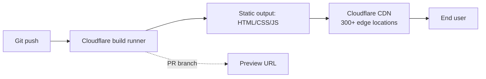

## What is Cloudflare Pages?

At its core, **Cloudflare Pages is a static site hosting service** — it serves pre-built HTML/CSS/JS files from Cloudflare's global CDN. Everything else built around it (Git integration, build pipeline, preview deploys, Pages Functions) is convenience layered on top of that core.

Conceptually it sits in the same category as GitHub Pages, Netlify, and Vercel.

## How it works

Key capabilities:

- 🌍 **Static hosting on edge** — files served from 300+ edge locations worldwide.
- 🔁 **Git-based deploys** — connect a GitHub or GitLab repo; every push triggers a build.
- 🔍 **Preview deploys** — every PR gets a unique URL for review.
- 🆓 **Free tier** — unlimited bandwidth and requests, 500 builds/month, custom domains with free HTTPS.
- ⚙️ **Framework support** — auto-detects React, Vue, Next.js, Astro, Hugo, Jekyll, and more.
- λ **Pages Functions** — optional serverless functions (running on Cloudflare Workers) for API routes, form handlers, auth, etc. This blurs the line slightly with "pure" static hosting, but the foundation is still static delivery.

## Cloudflare Pages vs GitHub Pages

|                          | **GitHub Pages**                                      | **Cloudflare Pages**                                                       |
| ------------------------ | ----------------------------------------------------- | -------------------------------------------------------------------------- |
| **Core**                 | Static hosting                                        | Static hosting                                                             |
| **Cost**                 | Free                                                  | Free tier (generous)                                                       |
| **CDN**                  | Fastly, decent global reach                           | 300+ edge locations, generally faster outside US                           |
| **Build system**         | Jekyll only (built-in); other frameworks via Actions  | Auto-detects most frameworks (Next.js, Astro, Hugo, Vue, React, Jekyll, …) |
| **Git integration**      | GitHub only                                           | GitHub + GitLab                                                            |
| **Preview deploys**      | ❌ (only main branch)                                  | ✅ every PR gets a unique URL                                               |
| **Custom domain + HTTPS**| ✅ free                                                | ✅ free                                                                     |
| **Bandwidth limit**      | Soft 100 GB/month                                     | Unlimited                                                                  |
| **Build minutes**        | 10 min/build via Actions                              | 500 builds/month, 20 min each                                              |
| **Serverless functions** | ❌                                                     | ✅ Pages Functions on Workers                                               |
| **Analytics**            | Basic                                                 | Built-in Web Analytics (free, privacy-friendly)                            |
| **Setup**                | Push to `gh-pages` or `main`                          | Connect repo in dashboard                                                  |

## When each one fits

**GitHub Pages is enough when:**

- [x] You have a simple Jekyll blog or static site.
- [x] You're already in GitHub and don't want another service in the loop.
- [x] Traffic is low and you don't need PR previews.

**Cloudflare Pages wins when:**

- [x] You're using a non-Jekyll framework (React, Astro, Hugo, …) and don't want to maintain GitHub Actions for it.
- [x] You want preview URLs for every PR.
- [x] You have a global audience, especially users outside the US.
- [x] You might want serverless functions later without standing up a separate backend.

## TL;DR

Cloudflare Pages = static hosting + a friendlier build pipeline + a faster global CDN + optional serverless. GitHub Pages = static hosting that's tightly integrated with GitHub and great for Jekyll, but more limited everywhere else.

If your site is already a Jekyll project on GitHub, GitHub Pages is the path of least resistance. Cloudflare Pages mainly buys you **faster non-US performance**, **PR previews**, and a **build system that handles non-Jekyll frameworks out of the box**.
