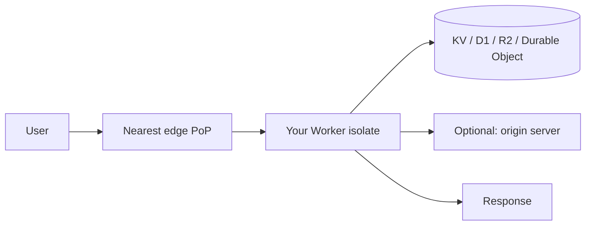

## Why this post

Edge compute and managed databases have together changed what a "backend" looks like. A small team can now ship a globally-distributed app with no servers to operate and no DBA on staff — but only if they understand which primitives to reach for. This post walks from **Cloudflare Workers** as a representative edge runtime, into the question that always follows ("if it's stateless, why isn't this just client code?"), and ends with a **cheat sheet of cloud databases** organized by use case.

---

## Part 1 — What is Cloudflare Workers?

**Cloudflare Workers** is a serverless compute platform that runs your code on Cloudflare's global edge network — in 300+ cities worldwide, close to your users.

### Key characteristics

- **Runs at the edge** — code executes in the data center nearest the user, not in a single region.
- **V8 isolates, not containers** — each Worker runs in a lightweight V8 isolate (the same sandbox Chrome uses for tabs). Cold starts are ~5 ms, vs. hundreds of ms for container-based platforms.
- **Request-driven** — a Worker is a function that takes a `Request` and returns a `Response`, similar to a `fetch` handler in the browser.

### Minimal example

```js
export default {
  async fetch(request, env, ctx) {
    return new Response("Hello from the edge!");
  },
};
```

### The deployment flow

1. Write a stateless JS (or TS, Rust-via-WASM, Python preview) function.
2. Deploy via `wrangler deploy` or the dashboard.
3. Cloudflare replicates the code to all edge locations.
4. Each incoming request triggers the function in the location nearest the user.



### How it compares

| | Cloudflare Workers | AWS Lambda | Vercel Functions |
|---|---|---|---|
| Runtime | V8 isolate | Container | Node / Edge runtime |
| Cold start | ~5 ms | 100 ms – 1 s+ | Varies |
| Where it runs | 300+ edge locations | Single region | Edge or regional |
| Free tier | 100k req/day | 1M req/month | 100k req/month |

---

## Part 2 — If it's "stateless," why isn't this just client-side code?

A reasonable instinct: if the function holds no state, why not run it in the browser?

### Server-side execution still wins, even for stateless logic

| Reason | Example |
|---|---|
| **Secrets** | API keys and DB credentials can't ship to the browser. |
| **Trust** | Client code can be tampered with; server code cannot. |
| **CORS / origin** | Calling third-party APIs that block browsers. |
| **Bundle size** | Heavy logic (image processing, parsing) shouldn't bloat the client. |
| **SEO / first paint** | HTML must exist before JS runs. |
| **Cross-client consistency** | Web, mobile, and CLI hit the same endpoint. |
| **Aggregation** | Combining 5 API calls into 1 response saves client bandwidth. |

A Worker that just adds `Authorization: Bearer <secret>` and forwards the request is "stateless" — but it **cannot** run client-side. The secret would leak.

### The honest nuance: stateless function, stateful system

The *function* holds no memory between requests, no local files, no long-lived variables. But the *system* you build can absolutely be stateful — by talking to bindings:

- **KV** — eventually-consistent key-value store, edge-replicated.
- **D1** — SQLite database (currently single-region, read replicas coming).
- **R2** — S3-compatible object storage with no egress fees.
- **Durable Objects** — strongly-consistent stateful objects, one instance per key, sharded by key across the network.

So "stateless functions + a toolbox of state primitives" is the more honest framing.

---

## Part 3 — Isn't the database always the bottleneck?

Yes. Compute scales trivially; **state is the hard problem**. Cloudflare's stack is interesting because it deliberately moves state to the edge too — but only as far as physics allows.

```
Traditional:  [User] -> [Edge CDN] -> [Single-region DB]   <- bottleneck
                                            ^
                                  every request crosses oceans

Edge model:   [User] -> [Worker + D1/KV/DO at edge]        <- state lives near users
```

### How each Cloudflare storage primitive handles the bottleneck

- **KV** — writes are slow (~60 s to propagate globally), reads are ~10 ms from cache. Good for config, feature flags, rarely-changing data.
- **D1** — SQLite, single-region today, read replicas on the way. Good for low-write apps.
- **R2** — object storage, no egress fees. Good for files and blobs.
- **Durable Objects** — one instance per key, lives in one location, but you can have millions of instances. A chatroom DO for room `abc` lives in one place; room `xyz` lives elsewhere. State is **sharded by key**, not centralized.

### The honest answer to "is the DB a bottleneck?"

For **high-write, strongly-consistent, globally-shared state** (a bank ledger, a global inventory counter), the DB is still a bottleneck — on Cloudflare or anywhere else. Physics: you can't have strong consistency across continents without paying latency.

Workers wins when you can:

1. **Cache reads** at the edge (most apps are read-heavy).
2. **Shard writes** by key (Durable Objects).
3. **Accept eventual consistency** (KV).

When you can't do those things, you'd bottleneck on a central DB just as you would on any traditional setup.

### The mental shift

- **Old model**: compute is expensive, move it close to data.
- **Edge model**: data is the hard part, shard it so compute can stay close to users.

---

## Part 4 — The industry shift: from operating databases to choosing them

A 2015 startup needed someone who could:

- Configure MySQL master-slave replication
- Tune `innodb_buffer_pool_size`
- Set up Redis Sentinel for failover
- Write backup scripts and test restores
- Plan capacity, do rolling upgrades

A 2026 startup clicks "Create RDS instance" or `wrangler d1 create mydb` and ships. Managed services (RDS, Aurora, DynamoDB, Spanner, PlanetScale, Neon, Supabase, D1, MongoDB Atlas, Upstash, …) absorb most of that operational work.

### How hiring expectations shifted

| Then (~2015) | Now (~2026) |
|---|---|
| "Set up a 3-node Redis cluster." | "Pick the right managed cache for this workload." |
| "Tune Postgres for our workload." | "Pick the right index; understand query plans." |
| "Design our backup strategy." | "Verify the managed backup meets our RPO." |
| Deep ops knowledge. | Deep **modeling** knowledge. |

The skill shifted from **operating** databases to **choosing and modeling** with them.

### But the problem didn't disappear — it moved

Managed services hide *operational* complexity. They do not hide:

1. **Schema and query design** — a bad schema on Aurora is just as slow as on self-hosted MySQL.
2. **Cost** — $40/month VM vs. $400/month managed equivalent at scale. At very large scale, the bill becomes the bottleneck (37signals famously moved *off* AWS to save millions).
3. **Distributed-systems reality** — DynamoDB still has eventual consistency. Spanner still has commit latency. CAP didn't get repealed.
4. **Vendor lock-in** — DynamoDB ≠ Postgres. Migration is a rewrite, not a config change.
5. **Opaque debugging** — when the managed DB is slow at 3 a.m., you file a ticket. You can't `strace` it.
6. **Scale cliffs** — managed services work great until you hit a limit (connection count, IOPS, partition size); then the abstraction turns leaky.

### Where deep DB ops skills still matter

- **Big tech** (Google, Meta, Stripe) — runs infra at a scale where managed services don't exist or aren't affordable.
- **Regulated industries** (banks, healthcare) — often can't put data in someone else's cloud.
- **High-scale startups past Series B** — cost and performance push them to in-source.
- **Database companies themselves** — someone has to build PlanetScale, Neon, etc.

---

## Part 5 — Cloud database cheat sheet

### 5.1 Relational (SQL) — the default starting point

| Service | Provider | Engine | Best for |
|---|---|---|---|
| **RDS** | AWS | Postgres, MySQL, MariaDB | Traditional managed SQL |
| **Aurora** | AWS | Postgres/MySQL-compatible | High-perf, auto-scaling storage |
| **Cloud SQL** | GCP | Postgres, MySQL, SQL Server | GCP-native apps |
| **Azure SQL** | Azure | SQL Server | .NET / enterprise shops |
| **Spanner** | GCP | SQL + global distribution | Global strong consistency (rare need) |
| **CockroachDB** | Self/Cloud | Postgres wire-compatible | Multi-region SQL |
| **PlanetScale** | Independent | MySQL (Vitess) | Branch-based schema workflows |
| **Neon** | Independent | Postgres | Serverless Postgres, branching |
| **Supabase** | Independent | Postgres + auth + realtime | Fast MVP, Firebase alternative |
| **D1** | Cloudflare | SQLite | Edge apps, low-write workloads |

- **Use when**: structured data, joins, transactions, known schema.
- **Avoid when**: schema changes daily, >100k writes/sec on a single shard.

### 5.2 Key-Value — fast lookups, cache, sessions

| Service | Provider | Notes |
|---|---|---|
| **DynamoDB** | AWS | Serverless, single-digit ms, pay-per-request |
| **ElastiCache (Redis/Memcached)** | AWS | Managed Redis cluster |
| **MemoryDB** | AWS | Redis-compatible, durable |
| **Upstash Redis** | Independent | Serverless Redis, per-request pricing |
| **Cloudflare KV** | Cloudflare | Eventually consistent, edge-replicated |
| **Cloud Bigtable** | GCP | Wide-column, HBase-compatible, huge scale |
| **Workers KV / Durable Objects** | Cloudflare | Edge state primitives |

- **Use when**: sessions, caching, rate limiting, feature flags, key lookups.
- **Avoid when**: ad-hoc queries, joins, or many secondary indexes.

### 5.3 Document / NoSQL — flexible schemas

| Service | Provider | Notes |
|---|---|---|
| **MongoDB Atlas** | Independent | The reference document DB |
| **DocumentDB** | AWS | Mongo-compatible (mostly) |
| **Firestore** | GCP | Realtime sync, mobile-friendly |
| **Cosmos DB** | Azure | Multi-model, multi-region |
| **DynamoDB** | AWS | Also doubles as a document store |

- **Use when**: nested or varying data, rapid prototyping, mobile sync.
- **Avoid when**: cross-document transactions or heavy joins.

### 5.4 Search — full-text and relevance

| Service | Provider | Notes |
|---|---|---|
| **OpenSearch** | AWS | Elasticsearch fork |
| **Elastic Cloud** | Independent | Original Elasticsearch |
| **Algolia** | Independent | Hosted search-as-a-service, great DX |
| **Typesense Cloud** | Independent | Open-source alternative to Algolia |
| **Meilisearch Cloud** | Independent | Lightweight, fast typo-tolerance |

- **Use when**: full-text, faceted filtering, autocomplete.
- **Avoid when**: as a source of truth — these are indexes, not databases.

### 5.5 Analytical / OLAP — big aggregations

| Service | Provider | Notes |
|---|---|---|
| **BigQuery** | GCP | Serverless, pay-per-query |
| **Redshift** | AWS | Cluster-based warehouse |
| **Snowflake** | Independent | Multi-cloud, decoupled compute/storage |
| **Databricks SQL** | Independent | Lakehouse on top of S3/ADLS |
| **ClickHouse Cloud** | Independent | Columnar, very fast |
| **MotherDuck** | Independent | DuckDB in the cloud |

- **Use when**: dashboards, reporting, scanning billions of rows, batch ETL.
- **Avoid when**: transactional reads/writes, low-latency apps.

### 5.6 Time-Series — metrics, IoT, logs

| Service | Provider | Notes |
|---|---|---|
| **Timestream** | AWS | Serverless time-series |
| **InfluxDB Cloud** | Independent | Reference time-series DB |
| **TimescaleDB Cloud** | Independent | Postgres extension, SQL-friendly |
| **QuestDB Cloud** | Independent | High-throughput ingestion |

- **Use when**: sensor data, metrics, append-heavy timestamped data.
- **Avoid when**: general-purpose CRUD.

### 5.7 Vector — AI / embeddings

| Service | Provider | Notes |
|---|---|---|
| **Pinecone** | Independent | First-mover managed vector DB |
| **Weaviate Cloud** | Independent | Open-source, hybrid search |
| **Qdrant Cloud** | Independent | Rust-based, fast |
| **pgvector on Neon/Supabase** | Independent | Postgres extension — often enough |
| **Vertex AI Vector Search** | GCP | Google-scale ANN |
| **OpenSearch k-NN** | AWS | Vector + text search |

- **Use when**: semantic search, RAG, recommendation.
- **Avoid when**: exact-match lookups (use KV) or <10k vectors (use pgvector).

### 5.8 Object Storage — files, blobs, backups

| Service | Provider | Notes |
|---|---|---|
| **S3** | AWS | The standard; most others are S3-compatible. |
| **R2** | Cloudflare | No egress fees — big deal at scale. |
| **GCS** | GCP | Tight GCP integration |
| **Azure Blob** | Azure | Tiered storage classes |
| **B2** | Backblaze | Cheapest, S3-compatible |

- **Use when**: images, videos, backups, data lakes, static assets.
- **Avoid when**: low-latency random access (it's HTTP, not a filesystem).

### 5.9 Queues / Streams — async + event-driven

| Service | Provider | Notes |
|---|---|---|
| **SQS** | AWS | Simple queue, at-least-once |
| **Kinesis** | AWS | Streaming, replayable |
| **MSK** | AWS | Managed Kafka |
| **Confluent Cloud** | Independent | Managed Kafka, polished DX |
| **Pub/Sub** | GCP | Global, serverless messaging |
| **Cloudflare Queues** | Cloudflare | Edge-native queues |
| **Upstash Kafka / QStash** | Independent | Serverless messaging |

- **Use when**: decoupling services, background jobs, event sourcing.
- **Avoid when**: request/response that needs an answer now.

---

## Part 6 — Decision flow

```
Need joins + transactions?         -> Postgres (Neon, Supabase, RDS, Aurora)
Need single-key lookups, fast?     -> Redis (Upstash, ElastiCache)
Need schemaless JSON?              -> MongoDB Atlas / DynamoDB
Need full-text search?             -> Meilisearch / Algolia / OpenSearch
Need dashboards over big data?     -> BigQuery / ClickHouse / Snowflake
Need timestamped metrics?          -> Timescale / Influx
Need semantic / embedding search?  -> pgvector first, Pinecone if huge
Need files/blobs?                  -> R2 (cheap egress) / S3 (default)
Need async jobs?                   -> SQS / Cloudflare Queues / Kafka
```

---

## Part 7 — Cost gotchas (the stuff that bites)

- **Egress fees** — moving data *out* of AWS is expensive. R2 and Backblaze don't charge it.
- **DynamoDB hot partitions** — uneven keys cause throttling, not auto-scale.
- **Aurora I/O** — I/O-optimized vs. standard tier matters a lot at scale.
- **BigQuery scans** — query cost = bytes scanned. Always partition + cluster.
- **Snowflake credits** — idle warehouses bill until they auto-suspend.
- **Pinecone pods** — paid per pod hour, not per query. Small index = wasted money.

---

## Rules of thumb

1. **Start with Postgres.** It does 90% of jobs adequately. Add specialized DBs only when you measure a real bottleneck.
2. **One source of truth.** Other DBs (search, cache, vector) should be derivable from it.
3. **Pick by access pattern, not hype.** Vector DBs are cool; you may not need one.
4. **Read the pricing page before the docs.** Many "serverless" DBs become expensive at modest scale.
5. **Test failover before production.** Managed ≠ infallible.

---

## TL;DR

- **Cloudflare Workers** = stateless JS functions running in V8 isolates at the edge.
- "Stateless" is honest about the *function* — the *system* you build can hold state via KV, D1, R2, or Durable Objects.
- The DB is still the bottleneck whenever you need globally-consistent writes — physics doesn't bend for marketing copy.
- Managed cloud DBs have shifted the backend role from **operator** to **architect**: less `pg_hba.conf`, more "pick the right primitive for this access pattern."
- For most apps: start with Postgres + object storage + a cache, and only specialize when you can point to the bottleneck.
