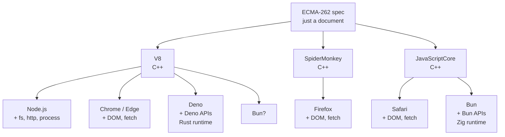
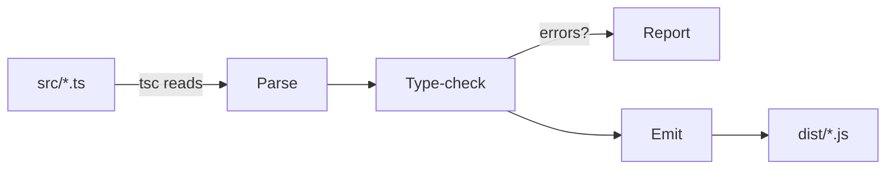
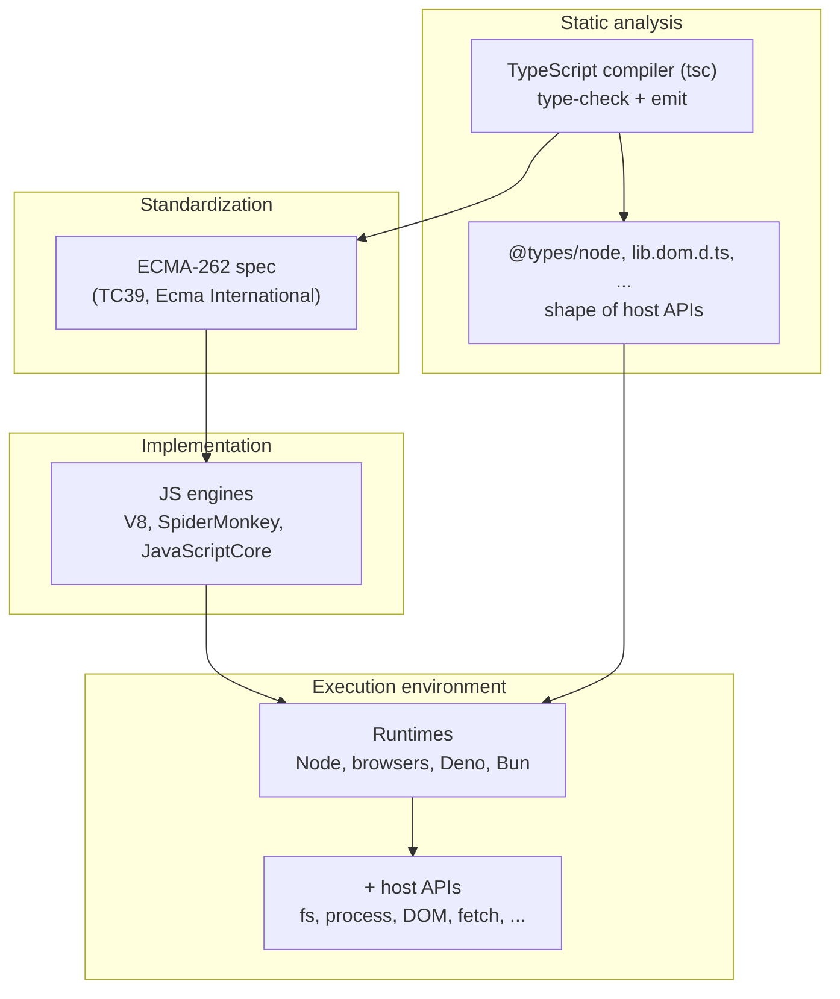

A guided tour of how the JavaScript ecosystem fits together — from the
ECMAScript specification at the bottom, through the engines and runtimes
that implement it, up to TypeScript and the role of each `tsconfig.json`
option. Written as concept notes rather than a tutorial; the goal is a
durable mental model.

## Table of contents

## ECMAScript: the specification

**ECMAScript** is a *specification* — a long, formal document that
describes a programming language. It defines:

- the grammar (how to parse source text)
- the semantics (what each construct does at runtime)
- the built-in objects and methods (`Array`, `Promise`, `JSON`, `Math`,
  ...)

It is officially called **ECMA-262**. The latest editions ship under
year names — ES2024 at the time of writing, ES2015 (a.k.a. ES6) is the
inflection point where modern JavaScript began.

The spec itself contains **no code**. It is prose plus pseudocode plus
algorithms. Anyone implementing the spec — browser vendors, Node, Deno,
Bun — turns that prose into a runnable engine on their own.

### Who maintains it

**Ecma International** is a Swiss non-profit standards organization
(once "European Computer Manufacturers Association"; now just "Ecma").
Inside Ecma, the working group that edits the JavaScript specification
is **TC39** (Technical Committee 39). Members are representatives from
Google, Microsoft, Apple, Mozilla, Igalia — basically anyone who ships
a JS engine, plus other invested parties.

TC39 runs a **five-stage proposal process** (Stage 0 → Stage 4). A
feature only becomes part of ECMA-262 when it reaches Stage 4. Phrases
like "Stage 3 feature" mean "nearly standard, likely to ship."

### "ECMAScript" vs "JavaScript" — the naming

Short version: **in practice they are synonyms**. The trademark history:

- **JavaScript** is a trademark (originally Sun Microsystems, now
  Oracle).
- When Netscape and Microsoft brought the language to Ecma in 1996 to
  standardize it, they could not legally call the standard "JavaScript"
  because of the trademark. So they coined **ECMAScript**.

That is the entire reason the spec has a different name. Brendan Eich
(the creator of the language) has described the name as "an unwanted
trade name that sounds like a skin disease."

Some pedants distinguish:

- **ECMAScript** = the pure language (syntax, built-ins, runtime
  semantics)
- **JavaScript** = ECMAScript **+** host APIs (DOM in the browser,
  `fs`/`process` in Node)

In everyday usage they are interchangeable.

### Versions through the years

| Edition | Year | Notable additions |
| --- | --- | --- |
| ES3 | 1999 | The "classic" JS that defined the 2000s |
| ES5 | 2009 | Strict mode, `Array.forEach/map/filter`, `JSON`, getters/setters |
| **ES6 / ES2015** | 2015 | `let`/`const`, arrow functions, classes, `Promise`, modules, template literals, destructuring, `Map`/`Set` |
| ES2016 | 2016 | `**`, `Array.includes` |
| ES2017 | 2017 | `async`/`await`, `Object.entries`/`values` |
| ES2018 | 2018 | Object rest/spread, async iterators |
| ES2019 | 2019 | `Array.flat`, `Object.fromEntries`, optional `catch` binding |
| ES2020 | 2020 | Optional chaining `?.`, nullish coalescing `??`, `BigInt`, `import()` |
| ES2021 | 2021 | `String.replaceAll`, logical assignment, `Promise.any` |
| ES2022 | 2022 | Class fields, top-level `await`, `Array.at` |
| ES2023 | 2023 | `Array.findLast`, `toSorted`/`toReversed` |
| ES2024 | 2024 | Object grouping, `Promise.withResolvers` |

After ES6, naming switched to year-based (`ES2015` instead of `ES6`),
and TC39 ships annually.

## Engines vs runtimes

A common confusion: "Node," "V8," and "JavaScript" are *not* the same
layer. Once the distinction clicks, much of the surrounding ecosystem
makes more sense.



### The engine layer

A **JavaScript engine** is a program that takes JS source, parses it,
and executes it. Engines are written in low-level languages (usually
C++) and implement the ECMA-262 spec plus optimizations like JIT
compilation, garbage collection, and inline caches.

The major engines:

| Engine | Language | Used by |
| --- | --- | --- |
| **V8** | C++ | Chrome, Edge, Node.js, Deno, Electron |
| **SpiderMonkey** | C++ | Firefox |
| **JavaScriptCore** | C++ | Safari, Bun |
| Hermes | C++ | React Native |
| QuickJS | C | Embedded use |

An engine, on its own, only knows the standard library defined in
ECMA-262 — `Array`, `Promise`, `JSON`, `Map`, regex, and so on. It
does not know what `document`, `fs`, or `process` are. Those come
from the layer above.

### The runtime layer

A **runtime** embeds an engine and adds **host APIs** — functionality
specific to the environment the JS code runs in.

| Runtime | Engine | Host APIs (examples) |
| --- | --- | --- |
| **Browsers** | varies | `document`, `window`, `localStorage`, `fetch`, `setTimeout` |
| **Node.js** | V8 | `fs`, `http`, `process`, `Buffer`, `__dirname`, `setImmediate` |
| **Deno** | V8 | `Deno.readFile`, `Deno.serve`, web-standard `fetch` |
| **Bun** | JavaScriptCore | `Bun.serve`, `Bun.file`, plus most Node APIs for compat |

When code calls `fs.readFileSync('./hello.txt')` in Node:

1. JS code calls a function exposed on `fs`.
2. That function is a JS wrapper around a C++ binding (sometimes via
   `process.binding('fs').open`).
3. C++ calls **libuv** (a C library) to do the actual disk read.
4. The bytes come back up the stack as a JS `Buffer` or string.

So the runtime presents a JS-shaped *interface*, but the implementation
underneath is native. Some Node modules (`events`, `stream`) are mostly
JS, but the lowest layer is always native code.

### Why this distinction matters for TypeScript

TypeScript, by default, knows only the ECMA-262 standard library. It
does **not** know `process`, `__dirname`, `document`, or `fs`. The
gap between "what the language defines" and "what the runtime
provides" is exactly the gap that type-definition packages like
`@types/node` and TS's built-in `lib.dom.d.ts` fill.

## TypeScript: language, checker, transpiler

A common mental model squashes TypeScript into one thing. It is more
useful to treat it as three:

1. **A language** — JavaScript syntax plus type-annotation syntax
2. **A static type checker** — a program that reads `.ts` source and
   reports type errors without running it
3. **A transpiler** — a program that erases the type annotations and
   outputs runnable JavaScript

Steps (2) and (3) ship as the same binary: **`tsc`**.



You can ask `tsc` to skip emit or skip checking:

```bash
tsc              # parse, type-check, AND emit (default)
tsc --noEmit     # only type-check (good for CI)
tsc --noCheck    # only emit, skip type-checking (rare)
```

### TS is a *syntactic* superset

TypeScript adds syntax that does not exist in JavaScript at all:

- type annotations: `x: string`
- interfaces and type aliases
- generics: `Array<T>`
- type assertions: `x as User`
- a few runtime extras: `enum`, `namespace`, parameter properties

A file like:

```ts
interface User { name: string }
function greet(u: User): string {
  return `hi, ${u.name}`;
}
```

is not valid JS. The compiler does two jobs at once: type-checks it,
then strips the type syntax to emit:

```js
function greet(u) {
  return `hi, ${u.name}`;
}
```

### TypeScript is not standardized like JS

| | JavaScript | TypeScript |
| --- | --- | --- |
| Specification | ECMA-262 (formal document) | Effectively the compiler source |
| Standards body | TC39 / Ecma International | None — Microsoft owns and ships it |
| Process for changes | TC39 stages 0→4, cross-vendor consensus | Microsoft team decides + community input |
| Multiple implementations | Many engines | `tsc` is the source of truth |

There was a 2014 "TypeScript Language Specification" PDF, but it has
not been maintained. The compiler is the spec.

TS deliberately tracks JS: when TC39 adds a new feature, TS adopts it
so TS source stays a syntactic superset of JS.

### @types/node: a dictionary, not a runtime

Because TS only knows ECMA-262, it has no idea what `process`, `fs`,
or `__dirname` are. Try to compile this without help:

```ts
import { readFileSync } from 'fs';
const text = readFileSync('./hello.txt', 'utf8');
console.log(process.version);
console.log(__dirname);
```

Errors:

```
error TS2307: Cannot find module 'fs' or its corresponding type declarations.
error TS2304: Cannot find name 'process'.
error TS2304: Cannot find name '__dirname'.
```

`@types/node` is an ordinary npm package containing only `.d.ts`
(declaration) files describing Node's API shapes. Snippets:

```ts
// node_modules/@types/node/fs.d.ts (simplified)
declare module 'fs' {
  export function readFileSync(
    path: string,
    options: { encoding: 'utf8' }
  ): string;
  export function readFileSync(path: string): Buffer;
}

// node_modules/@types/node/globals.d.ts (simplified)
declare var process: NodeJS.Process;
declare var __dirname: string;
declare var Buffer: BufferConstructor;
```

There is no runtime code in this package — at execution time, Node
itself provides the implementations. `@types/node` only teaches `tsc`
the *shape* of those APIs.

The `@types/` scope is managed by **DefinitelyTyped**, a community
GitHub repo where type definitions are contributed for libraries that
do not ship their own. The only thing TS does specially for this scope
is that `tsconfig.json`'s default `typeRoots` is
`["./node_modules/@types"]`, so packages under it are picked up
automatically without an explicit import.

## tsconfig.json options

`tsconfig.json` is how a project tells `tsc` what to do. The mere
presence of the file marks the directory as a TypeScript project; an
empty `{}` is valid and uses every default.

A reasonable end-state for a modern Node ESM project:

```json
{
  "compilerOptions": {
    "target": "ES2023",
    "module": "NodeNext",
    "moduleResolution": "NodeNext",
    "lib": ["ES2023"],

    "strict": true,
    "esModuleInterop": true,
    "skipLibCheck": true,
    "resolveJsonModule": true,
    "sourceMap": true,

    "rootDir": "src",
    "outDir": "dist"
  }
}
```

The rest of this section walks through each option.

### `target` — emitted syntax level

`target` tells `tsc`: *"When you emit JavaScript, the output may use
language features up to this edition. Anything newer must be
down-leveled."*

Source:

```ts
const user = { name: "ada" };
const name = user?.name ?? "unknown";
```

With `"target": "ES2020"` (supports `?.` and `??`):

```js
const user = { name: "ada" };
const name = user?.name ?? "unknown";
```

With `"target": "ES5"` (no optional chaining, no nullish coalescing,
no `const`):

```js
var user = { name: "ada" };
var name = (user === null || user === void 0 ? void 0 : user.name) !== null
    && (user === null || user === void 0 ? void 0 : user.name) !== void 0
    ? (user === null || user === void 0 ? void 0 : user.name)
    : "unknown";
```

That mess is `tsc` faithfully reproducing modern semantics with only
ES5 syntax.

> ⚠️ **Default trap**: with `target` unset, TS uses `ES3` (1999). Almost
> certainly not what you want. The first thing most projects do is
> override it.

Pick `target` based on the oldest runtime you need to support. For
modern Node (20+), `ES2022` or `ES2023` is appropriate.

### `module` — emit syntax for imports/exports

`module` controls what the import/export statements in the *emitted*
JavaScript look like.

Same source:

```ts
import { foo } from './bar.js';
export const x = 1;
```

With `"module": "CommonJS"`:

```js
"use strict";
Object.defineProperty(exports, "__esModule", { value: true });
exports.x = void 0;
const bar_js_1 = require("./bar.js");
exports.x = 1;
```

With `"module": "NodeNext"`:

```js
import { foo } from './bar.js';
export const x = 1;
```

The choice depends on the target runtime:

| Runtime / target | Recommended `module` |
| --- | --- |
| Node with `"type": "module"` in package.json | `NodeNext` |
| Node without `"type": "module"` (legacy CJS) | `CommonJS` |
| Code consumed by a bundler (Vite, esbuild, webpack) | `ESNext` |

### `moduleResolution` — path-to-file lookup

`moduleResolution` controls *how* TS resolves an import string to an
actual file on disk. This is independent of how the import will be
written in the output.

When source says:

```ts
import { foo } from './bar.js';
import express from 'express';
```

…there are two questions:

1. **Compile time**: which file does `./bar.js` or `'express'` refer
   to? → `moduleResolution`
2. **Emit time**: what does the import statement look like in the
   compiled `.js`? → `module`

Options:

| Value | Notes |
| --- | --- |
| `Node` / `Node10` | Old CommonJS-era algorithm. Extensions optional. Legacy projects only. |
| `Node16` | Honors Node 16+ rules: ESM/CJS distinction by `package.json` type, strict extensions in ESM. |
| **`NodeNext`** | Like `Node16` but evolves as Node evolves. Use for modern Node. |
| `Bundler` | Relaxed: lets you write `import './bar'` without extension. Use with Vite/Next/etc. |
| `Classic` | Pre-Node era. Don't use. |

> 💡 **The `.js` extension quirk**: with `moduleResolution: NodeNext`
> in an ESM project, relative imports must include `.js`, even when
> the source file is `.ts`:
>
> ```ts
> import { foo } from './bar';      // ❌ missing extension
> import { foo } from './bar.ts';   // ❌ don't use .ts
> import { foo } from './bar.js';   // ✅ correct
> ```
>
> Why `.js`? Because the *emitted* code at runtime will use `.js`. TS
> does not rewrite the string for you.

`module` and `moduleResolution` must form a coherent pair. Match them:
`NodeNext` + `NodeNext`, or `CommonJS` + `Node`, or `ESNext` +
`Bundler`. Mixing them gets an error.

### `rootDir` and `outDir` — source vs output

The dominant convention in modern Node/TS projects:

```
project/
├── src/                  ← TypeScript source (committed)
│   ├── index.ts
│   └── ...
├── dist/                 ← compiled JavaScript (gitignored)
│   ├── index.js
│   ├── index.d.ts        ← if "declaration": true
│   └── ...
├── package.json
├── tsconfig.json
└── .gitignore
```

`rootDir` says *"look here for source"*; `outDir` says *"write
compiled output here"*. With both set, the directory structure under
`src/` is mirrored under `dist/`:

- `src/index.ts` → `dist/index.js`
- `src/utils/format.ts` → `dist/utils/format.js`

Why bother with this layout:

1. Hard separation of truth (source) and disposable output (`dist/`).
2. `dist/` is gitignored cleanly with a single line.
3. `rm -rf dist` wipes every build artifact without touching source.
4. Build tooling and CI all assume "the build goes in `dist/`."
5. When publishing a library, `package.json` `main`/`exports` point
   into `dist/`; `src/` is not shipped.

Alternative names sometimes seen: `lib/`, `build/`, `out/`. They are
conventions, not standards — `tsc` does not care.

### `strict` — the single most important option

`strict: true` is not one flag; it is a master switch that enables
roughly eight individual strict checks at once:

```text
"strict": true   ≡   "noImplicitAny": true,
                     "strictNullChecks": true,
                     "strictFunctionTypes": true,
                     "strictBindCallApply": true,
                     "strictPropertyInitialization": true,
                     "alwaysStrict": true,
                     "noImplicitThis": true,
                     "useUnknownInCatchVariables": true
                     (plus newer ones)
```

The two that matter most:

#### `strictNullChecks` — the big one

Without it, every type silently includes `null` and `undefined`:

```ts
function greet(name: string) {
  return name.toUpperCase();
}

greet(null);      // ✅ compiles, 💥 crashes at runtime
```

With it, `null` and `undefined` are separate types that must be
handled explicitly:

```ts
greet(null);      // ❌ Argument of type 'null' is not assignable to 'string'
```

To accept null, opt in:

```ts
function greet(name: string | null) {
  if (name === null) return "hello, stranger";
  return name.toUpperCase();
}
```

This single flag eliminates a huge class of runtime errors.

#### `noImplicitAny` — second-biggest

Without it, parameters that can't be inferred silently become `any`:

```ts
function add(a, b) {       // ✅ compiles, a and b are silently `any`
  return a + b;
}
```

With it:

```ts
function add(a, b) {       // ❌ Parameter 'a' implicitly has an 'any' type
  return a + b;
}
```

Forces annotation, which is what allows TS to type-check the function
body and call sites.

#### The other six

| Flag | Catches |
| --- | --- |
| `strictFunctionTypes` | Subtle function-parameter variance issues. |
| `strictBindCallApply` | Wrong argument types in `fn.bind`/`call`/`apply`. |
| `strictPropertyInitialization` | Class properties declared but never initialized. |
| `alwaysStrict` | Forces files into strict mode, emits `"use strict"`. |
| `noImplicitThis` | A function uses `this` and TS can't determine what it refers to. |
| `useUnknownInCatchVariables` | `catch (e)` binds `e` as `unknown` instead of `any`. |

`strict` is dramatically easier to start with than to add later:

| Project age | Effort to flip `strict` |
| --- | --- |
| Fresh (1 file) | 0 minutes |
| 100 files | Hours of fixing |
| 10,000 files | Weeks; often phased flag-by-flag |

### `esModuleInterop` — sane default imports of CommonJS

Without it, importing an old CJS-only package like `express` gets
awkward:

```ts
import * as express from 'express';   // wrong shape, doesn't behave like a callable
```

With it:

```ts
import express from 'express';        // works as expected
```

Practically every TS project enables this. Mismatch with CJS packages
is one of the most common "why doesn't this import work" frustrations.

### `skipLibCheck` — don't type-check node_modules

Tells `tsc` to skip type-checking the `.d.ts` files inside
`node_modules`. Your own code is still fully checked; the libraries
are trusted. Typical benefits:

- 5–10× faster builds
- Sidesteps situations where two `@types/*` packages disagree
  internally

Trade-off: if `@types/foo` has internal type errors, you won't see
them — but those aren't your problem to fix anyway.

### `lib` — runtime API surface

`lib` controls which built-in API declarations are loaded.

- `target` defaults `lib` to a sensible match. With `target: "ES2023"`,
  the default lib is `["ES2023", "DOM"]`.
- That default **includes `DOM`**, which adds `window`, `document`,
  `localStorage`, browser `fetch`, etc.

For a **Node-only project**, this default is wrong: code that uses
`document` or `localStorage` will type-check successfully and crash at
runtime. Explicitly setting `lib` removes that risk:

```json
"lib": ["ES2023"]
```

`target` and `lib` are related but separate:

| Option | Controls |
| --- | --- |
| `target` | The syntax level that may appear in emitted JS |
| `lib` | Which built-in *types* are visible to your TS code at compile time |

### `sourceMap` — debugger-friendly stack traces

Emits `.js.map` files next to each `.js`. When the compiled code
throws, the runtime stack trace points at the original `.ts` source
line numbers instead of the compiled `.js` lines. A clear win for
debugging.

### `resolveJsonModule` — typed JSON imports

Lets you import JSON directly, with the type inferred from the file's
actual shape:

```ts
import config from './config.json';
// config has the exact type matching the JSON contents
```

Without this flag, the import errors.

### Options deliberately deferred

These exist and matter — but only situationally. Add when a concrete
need appears:

| Option | When you'd want it |
| --- | --- |
| `declaration` / `declarationMap` | Publishing as a library — emits `.d.ts` for consumers |
| `noUncheckedIndexedAccess` | Extra strictness: `arr[i]` returns `T \| undefined`. Some find it noisy. |
| `forceConsistentCasingInFileNames` | Default-on since TS 5.0; catches case mismatch in imports |
| `verbatimModuleSyntax` | Stricter type-only-import rules; opinionated |
| `isolatedModules` | Required by some bundlers (esbuild, Babel) |
| `paths` / `baseUrl` | Custom path aliases (`@/utils` etc.) |
| `incremental` / `composite` | Faster rebuilds, project references in monorepos |
| `jsx` | React or other JSX projects |
| `experimentalDecorators` | Legacy decorators (TypeORM, older NestJS) |

## Putting it all together

A summary of which layer each piece lives at:



- The **spec** is documentation.
- An **engine** is a program that runs JS source.
- A **runtime** embeds an engine and adds host APIs.
- **TypeScript** is a language plus compiler that knows the spec and,
  via type-definition packages, the host APIs of whichever runtime
  your code is going to run in.
- **`tsconfig.json`** is how a project tells the compiler which
  runtime it's targeting (`module`, `moduleResolution`, `lib`), how
  permissive to be (`strict`, `noUncheckedIndexedAccess`), how to
  reduce the code (`target`), and where source and output live
  (`rootDir`, `outDir`).

The complexity is unavoidable: it reflects the fact that JavaScript
runs in many different environments, that TypeScript has to describe
every one of them, and that the language has been evolving annually
for a decade. Once each layer has a name and a job, the configuration
options stop feeling arbitrary.
