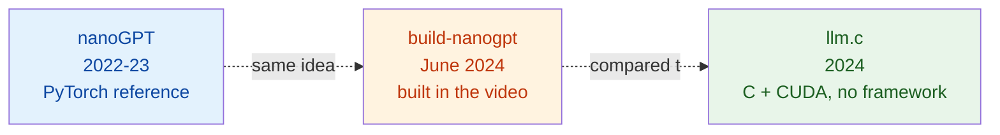
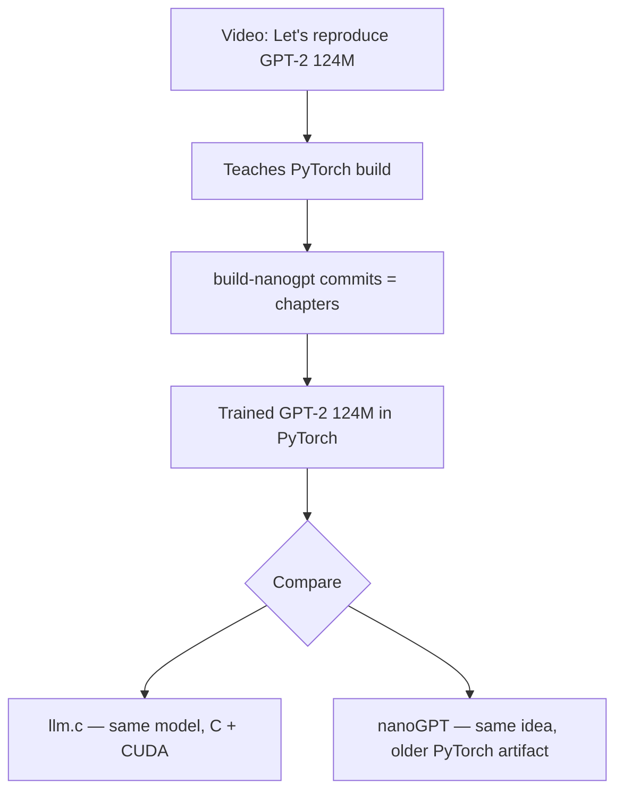

Andrej Karpathy's June 2024 video **"Let's reproduce GPT-2 (124M)"** is a ~4-hour live build of GPT-2 from scratch in PyTorch, trained on FineWeb-EDU until it matches/exceeds the original 124M model on HellaSwag. Around the video sit three closely related GitHub repos that confuse newcomers: `nanoGPT`, `build-nanogpt`, and `llm.c`. They look similar from a distance but play different roles.

This note untangles them.

## The three repos at a glance

| Repo            | What it is                                         | Language       | Role in the video                |
| --------------- | -------------------------------------------------- | -------------- | -------------------------------- |
| `nanoGPT`       | Minimal GPT-2 trainer (the reference artifact)     | Python/PyTorch | Pre-existing target              |
| `build-nanogpt` | The video's companion repo, built live on camera   | Python/PyTorch | The thing being built            |
| `llm.c`         | GPT-2 trainer with no framework, hand-written CUDA | C + CUDA       | Speed benchmark / yardstick      |

## nanoGPT — the reference

`nanoGPT` predates the video (2022–2023). It is a deliberately minimal training/inference codebase **using** PyTorch — not a wrapper *on top of* PyTorch.

The distinction matters:

- A wrapper (HuggingFace `transformers`, PyTorch Lightning) sits above PyTorch and abstracts it away — you call their API, they call PyTorch.
- nanoGPT does the opposite: it stays thin so you read raw `torch.nn.Module` code directly.

The whole thing is essentially two short files:

- **`model.py`** (~300 lines) — the GPT model as a plain `nn.Module`:
  - token + position embeddings
  - a stack of transformer blocks (LayerNorm → causal self-attention → MLP)
  - final LM head with weight tying
- **`train.py`** — training loop with DDP, gradient accumulation, AdamW, cosine LR schedule, checkpointing.

Plus small helpers for tokenizing OpenWebText and sampling.

The design goal is the opposite of a wrapper: **expose** PyTorch rather than hide it, while being narrow in scope (GPT-2-style architectures only, causal LM training only). If you want a GPT, it's a complete recipe; for BERT or diffusion, it gives you nothing.

> **In one line:** nanoGPT *is* a GPT, written directly in PyTorch.

## build-nanogpt — the video as code

`build-nanogpt` is the companion repo to the "Let's reproduce GPT-2 (124M)" video. It is **not** a literal replay of how Karpathy wrote nanoGPT back in 2022 — it's him in 2024 building an equivalent GPT-2 (124M) trainer from scratch on video, ending up with something very close to nanoGPT in spirit.

What makes it useful:

- Its **git history is structured as the video's chapters**. Each commit corresponds to a section: "implement attention", "add weight tying", "fix init", "add DDP", "train on FineWeb-EDU", etc.
- You can `git checkout` any commit and see the exact code state at that point in the lecture — a replayable lecture-as-code.
- By the end, you have a working trainer that reproduces GPT-2 124M on FineWeb-EDU.

Compared to the original nanoGPT, build-nanogpt adds a few modernizations the video walks through:

- ⚡ FlashAttention
- 🔧 `torch.compile`
- 📚 FineWeb-EDU as the training corpus
- ✅ HellaSwag as an in-training eval

So **same destination, slightly different code and a 2024 toolchain**.

## llm.c — the no-framework sibling

`llm.c` is a parallel project: same target model (GPT-2 124M), but implemented in **raw C with hand-written CUDA kernels** — no PyTorch, no Python at training time.

Because there is no framework to lean on, llm.c has to implement *everything*:

### The model — every layer, forward AND backward

There is no `loss.backward()`. Every layer's gradients are a hand-written kernel:

- Embeddings (token + position lookup)
- LayerNorm (forward + backward)
- QKV projection (matmul kernel, or cuBLAS)
- Causal self-attention (custom, FlashAttention-style)
- Attention output projection
- MLP (two matmuls + GELU)
- Residual adds
- Final LM head (weight-tied with embedding)
- Cross-entropy loss (forward + backward)

### The training stack — also from scratch

- AdamW optimizer as a CUDA kernel
- Data loading via mmap'd `.bin` shards
- Checkpoint I/O
- DDP / multi-GPU via NCCL
- Mixed precision, gradient clipping

### File layout

- `train_gpt2.c` — pure CPU reference (slow but readable, useful as ground truth)
- `train_gpt2.cu` — the real CUDA training program
- `llmc/` — individual kernel files: `attention.cuh`, `matmul.cuh`, `layernorm.cuh`, `adamw.cuh`, …

Where nanoGPT's `model.py` is ~300 lines because PyTorch carries the weight, llm.c is several thousand lines precisely because **it _is_ the weight** — model + training + autograd + ops, all in one repo.

> **In one line:** llm.c is the same GPT-2, in C + CUDA, doing every job PyTorch normally hides.

### But there's still some Python

llm.c isn't 100% framework-free in *every* directory — there's Python glue for the things Python is genuinely better at:

- **`train_gpt2.py`** — a PyTorch reference implementation. Used to:
  1. Export pretrained GPT-2 weights into llm.c's binary format.
  2. Generate "golden" activations and gradients that the C/CUDA kernels are checked against numerically. If llm.c's hand-written backward matches PyTorch's autograd to ~1e-5, you trust the kernel.
- **Data prep scripts** (`dev/data/fineweb.py`, `tinyshakespeare.py`, `tinystories.py`, ...) — download a dataset, tokenize it with `tiktoken` (GPT-2 BPE), write `.bin` shards the C trainer mmaps.
- **`dev/data/hellaswag.py`** — downloads and tokenizes the eval set into the same binary format.
- **Plot / log-reader scripts** for charts.

The pattern: **Python handles anything one-shot, I/O-heavy, or ecosystem-dependent (tokenizers, HuggingFace weights, matplotlib). The hot loop is pure C/CUDA.**

## How they connect in the video

The video itself teaches the **PyTorch path** (build-nanogpt) end-to-end. llm.c shows up only near the end as a benchmark:

1. Karpathy finishes the PyTorch trainer and gets it reproducing GPT-2 124M.
2. He compares wall-clock and tokens/sec against llm.c on the same hardware.
3. llm.c is meaningfully faster — less framework overhead, tighter memory use.
4. The takeaway: this is what PyTorch is buying you (convenience) and costing you (speed).

llm.c is **not** taught in the video. It's the yardstick.

## Putting it together

A clean mental model:

- 📘 **nanoGPT** = the published reference. "GPT, written in PyTorch."
- 🎬 **build-nanogpt** = the *process* of writing that reference, captured as a video + a commit-by-commit repo. Same destination as nanoGPT, slightly different code, 2024 toolchain.
- ⚙️ **llm.c** = the same GPT-2 model and training loop, but in C and CUDA with no framework. Used in the video as a "look how much PyTorch costs us" comparison point.

If you want to **learn** how a modern GPT is built, watch the video and read build-nanogpt.
If you want a **clean reference** to fork, start from nanoGPT.
If you want to see **what's underneath PyTorch**, read llm.c.

## References

- [karpathy/nanoGPT](https://github.com/karpathy/nanoGPT)
- [karpathy/build-nanogpt](https://github.com/karpathy/build-nanogpt)
- [karpathy/llm.c](https://github.com/karpathy/llm.c)
- Video: *Let's reproduce GPT-2 (124M)* — Andrej Karpathy, June 2024
