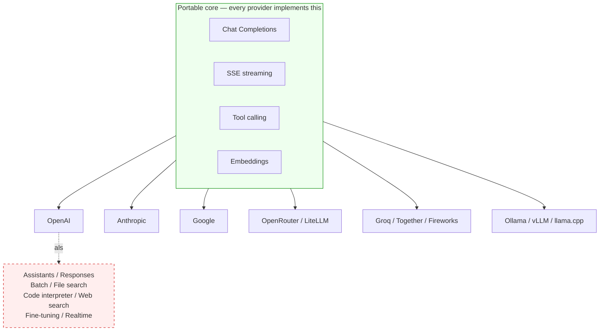

## Why the docs feel overwhelming

Calling an LLM is, in principle, simple: send some text, get some text back. But anyone opening the OpenAI API docs for the first time runs into a sprawling product catalog — Chat Completions, Responses, Assistants, batch jobs, fine-tuning, file search, code interpreter, web search, realtime, embeddings, vision, moderation, evals…

It does not read like a `man` page. It reads like marketing.

The fix is to recognise that the docs describe **two different things wearing the same logo**:

1. **OpenAI-the-model-API** — a small, portable HTTP surface for talking to a language model.
2. **OpenAI-the-platform** — a managed-AI-app service built on top of that (state, sandboxes, search backends, batch infra, training).

Almost every open-source LLM project only cares about #1. Once you see this split, the docs collapse to something the size of a real manual page.

## The core: about four features

The 90% of the API that production code actually uses:

| Feature | Endpoint / mechanism | What it does |
|---|---|---|
| **Chat Completions** | `POST /v1/chat/completions` | Send `messages: [{role, content}]`, get a reply |
| **SSE streaming** | `stream: true` on the same endpoint | Tokens stream back as `data: {...}\n\n` chunks |
| **Tool calling** | `tools: [...]` in the request | Model emits `tool_calls`; you run them and send a `tool` role message back |
| **Embeddings** | `POST /v1/embeddings` | Returns a fixed-length vector for similarity / RAG |

Three knobs you actually turn on a chat call:

- `model` — e.g. `gpt-4o-mini`
- `messages` (or `input` for the Responses API) — the conversation so far
- `temperature` — randomness, 0 → deterministic-ish, 1 → creative

Auth is one header: `Authorization: Bearer $OPENAI_API_KEY`.

That is the manual-page-sized core.

## The optional 10%

Worth knowing exists, add when you need them:

- **Structured outputs / JSON mode** — guaranteed JSON instead of prose
- **Vision** — image inputs in the `content` array
- **Responses API** — newer, stateful-ish unification of chat + tools (OpenAI is steering new projects here, but Chat Completions is what 99% of existing code targets)

## The platform features most projects ignore

Everything in this list belongs to **OpenAI-the-platform**, not **OpenAI-the-model-API**:

| Feature | What it actually needs to run |
|---|---|
| Assistants API | Server-side conversation state, file storage |
| Responses API (with built-in tools) | Tool orchestration + the items below |
| File search | A managed vector database |
| Code interpreter | A sandboxed Python VM per session |
| Web search tool | A search backend + crawler |
| Batch API | A job queue with a 24h SLA |
| Fine-tuning | GPU training infrastructure |
| Realtime API | Bidirectional audio streaming infra |

None of these are portable. They only work against `api.openai.com`. That's why the open-source ecosystem largely skips them — they would lock projects to a single vendor.

## How the ecosystem reflects this split

Look at what real open-source projects use:

| Project | Primary OpenAI surface |
|---|---|
| SillyTavern | Chat Completions + SSE |
| Open WebUI | Chat Completions + SSE |
| LangChain | Chat Completions + SSE + tool calling + embeddings |
| LlamaIndex | Chat Completions + embeddings |
| Dify | Chat Completions + SSE + tool calling + embeddings |
| LiteLLM | Chat Completions (normalises everything *to* this format) |

And look at who else implements the same wire format:

- **Frontier providers**: Anthropic, Google, Mistral, DeepSeek, xAI all expose OpenAI-compatible `/v1/chat/completions` (directly or via proxy).
- **Inference services**: Together, Groq, Fireworks, DeepInfra, OpenRouter.
- **Local runtimes**: Ollama, llama.cpp server, vLLM, LM Studio, text-generation-webui.

Aggregators like OpenRouter advertise themselves as "OpenAI API compatible" but only implement the portable subset — Chat Completions, SSE, tool calling, sometimes embeddings. They literally **cannot** offer Assistants or code interpreter, because they don't run Python sandboxes or vector stores for you. They are routing layers, not platforms.

The picture:

The green box is what "the OpenAI API" effectively means in casual developer conversation. The red box is OpenAI's own platform layer — interesting, but a separate product the ecosystem has chosen not to adopt.

## A reading order for the docs

To stop drowning:

1. **Quickstart** — get one `curl` or one SDK call working.
2. **Chat Completions reference** — bookmark this; it's your `man` page.
3. **Embeddings reference** — when you start doing RAG.
4. Stop reading docs. Build something. Come back when you hit a wall.

Treat the API reference page as the manual. Treat the rest of the docs as a product catalogue you can browse later if a specific managed feature turns out to be worth the lock-in.

## Mental model in one sentence

> **"OpenAI API"** in practice ≈ **Chat Completions + SSE + tool calling + embeddings**.
> Everything else OpenAI ships is a separate product that happens to share a domain name and an API key.

Once that filter is on, the docs stop feeling like marketing and start feeling like a manual page with a long appendix you can ignore.
