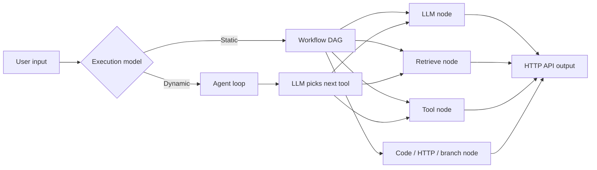

## What is Dify?

Dify is an open-source LLM application development platform built by **LangGenius**, a China-based company founded in 2023. It is Apache-2.0 licensed (with some commercial-use restrictions), commonly self-hosted via Docker Compose, and has an international user base.

Repo: [github.com/langgenius/dify](https://github.com/langgenius/dify)

The official site advertises a long list of features — Workflow, Agent, Studio, Knowledge, Tools, Annotations, Marketplace, and more. Read end-to-end, the docs are hard to grasp: some pieces feel like marketing, some feel experimental, and the boundaries between concepts blur.

## Stripping Dify down to its core

Ignore the feature taxonomy and Dify is really just five primitives:

| Primitive | What it is |
|---|---|
| **Prompt + model runner** | Send input to an LLM, get output. Everything else builds on this. |
| **DAG executor** | "Workflow" = nodes (LLM call, HTTP, code, branch) connected by edges. Same shape as n8n / Airflow / LangGraph. |
| **RAG store** | "Knowledge" = upload docs → chunk → embed → vector search. Nothing exotic. |
| **Tool-calling loop** | "Agent" = LLM in a `while` loop that calls functions. Standard ReAct / function-calling. |
| **HTTP API wrapper** | Every app you build is exposed as a REST endpoint. |

That is the whole core. Studio, Annotations, Monitoring, Marketplace, etc. are UI and ops scaffolding around those five things.



### Two execution models, one shape

Dify has two runtime modes:

- **Workflow** — a static DAG. You draw the graph, it runs deterministically.
- **Agent** — a dynamic loop. The LLM decides which tool / node to call next at each step.

Conceptually, *agent is just a DAG where the edges are chosen by the LLM at runtime*.

### The visual-builder bet

Dify's UX wager is **drag-and-drop instead of code**. You build the DAG in a browser by connecting nodes with a mouse. The platform handles execution, state, retries, and serving the result over HTTP.

That is essentially the whole product. The marketing surface makes it sound like much more.

## Why LLM project docs feel slippery

Dify is not unusual here. Most LLM open-source projects have docs that are harder to navigate than the underlying ideas justify. A few reasons:

### 1. Marketing-driven naming

"Agent", "Studio", "Knowledge Base", "Workflow Orchestrator" sound impressive in a pitch deck or landing page. *"DAG runner with LLM nodes"* does not raise a Series A.

### 2. No stable vocabulary yet

Unix had decades to converge on `grep` / `awk` / `sed`. LLM tooling is roughly three years old; everyone is inventing terms in parallel for the same primitives:

| Concept | LangChain | LlamaIndex | Dify | OpenAI |
|---|---|---|---|---|
| Chain of calls | Chain / Runnable | Engine | Workflow | Assistant |
| Retrieval | Retriever | Index / Engine | Knowledge | File search |
| Tool use | Tool / Agent | Agent | Tool / Agent | Function calling |

Nobody wants to adopt a competitor's name.

### 3. Branding lock-in

If Dify calls it "Knowledge" and LangChain calls it "Retriever", users build mental models tied to that vendor. Generic names like `retrieve` would make products interchangeable — which is the opposite of what platforms want.

### 4. Hiding simplicity

Many LLM products are thin wrappers (~500 lines of real logic) around a provider API. Heavy vocabulary makes the surface area look larger than the substance.

## LangChain as the extreme case

LangChain is probably the worst offender. The growing pains have been visible:

- **Package fragmentation** — `langchain`, `langchain-core`, `langchain-community`, `langgraph`, `langsmith`, `langserve`. You still cannot tell which one you actually need.
- **Abstraction tax** — sending a prompt requires `ChatPromptTemplate`, `RunnablePassthrough`, `StrOutputParser`, piped with `|`. Often longer than the raw `client.messages.create(...)` call.
- **LCEL (LangChain Expression Language)** — function composition with `|` operators, with its own sub-documentation about how `Runnable` works. `f(g(x))` with extra steps.
- **Churn** — `LLMChain` → `RunnableSequence` → ... Tutorials from six months ago no longer run. Stack Overflow answers are landmines.
- **Wrapper-of-a-wrapper** — `ChatOpenAI` wraps `openai`, `OpenAIEmbeddings` wraps `openai.embeddings`, `OpenAI` (legacy) wraps `openai.completions`. Three classes for what the SDK does in one.
- **Vocabulary explosion** — Chain, Runnable, Tool, Agent, AgentExecutor, Memory, Retriever, VectorStore, Document, BaseMessage, HumanMessage, AIMessage, SystemMessage, Callback, Handler — for what is fundamentally "send text, get text."

For anything beyond a demo, many experienced people end up calling the provider SDK directly with a small amount of glue. LangChain solved a problem ("swap providers easily") that turned out to matter less than its own complexity cost.

## What the Unix style gets right

The contrast that keeps coming up: `grep`, `cp`, `ls`. Each tool is dull, sharp, and unambiguous. Why it works:

- ✅ **One tool, one job.** `grep` searches. Period.
- ✅ **Names describe the verb, not the vibe.**
- ✅ **Fixed man-page structure.** `SYNOPSIS`, `DESCRIPTION`, `OPTIONS`, `EXAMPLES`. No "Why we built this" section.
- ✅ **Composition over features.** `ls | grep | wc` beats a monolithic `FileExplorerStudio`.

If LLM docs followed that style, Dify's man page would look roughly like:

```
DIFY(1)
NAME
    dify — run DAGs of LLM and tool-calling nodes
SYNOPSIS
    dify run <workflow.yaml> [--input <json>]
NODES
    llm       call a model with a prompt
    retrieve  fetch chunks from a vector store
    tool      invoke an external function
    branch    conditional edge
EXAMPLES
    dify run rag.yaml --input '{"q":"..."}'
```

Roughly 10× more useful than the current docs, and it fits on one screen.

The Unix equivalent of LangChain would be if `grep` required you to instantiate a `PatternMatchingRunnable`, wrap it in a `TextStreamHandler`, and pipe it through a `LineEmissionCallback`.

## How to actually evaluate an LLM project

Ignore the feature list. Ask three questions:

- [ ] Does the node / primitive I need actually exist?
- [ ] Can I call the result from my own code (HTTP, SDK, CLI)?
- [ ] What does the code that uses this thing look like in 10 lines?

That covers ~90% of real usage. Everything else in the docs is decoration.

## Takeaways

- 🧱 Dify's core = **DAG of LLM-flavored nodes + RAG + agent loop + HTTP wrapper**, with a drag-and-drop UI on top.
- 📚 LLM project documentation is in an early, vocabulary-inflating phase. Expect overlapping terms and shifting names.
- 🔪 When evaluating any LLM library or platform, mentally collapse its vocabulary down to a handful of primitives. If you cannot, the project may be hiding behind its naming.
- 🧰 The Unix-manual style — verb-named tools, fixed sections, composability — is still the right north star for technical docs.
