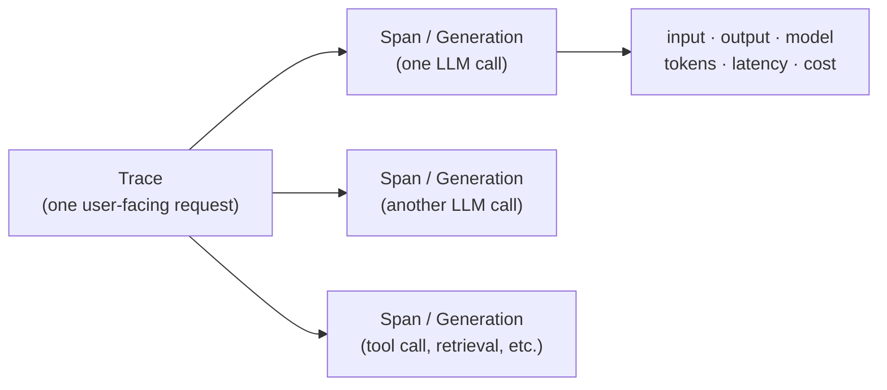

## What Langfuse is

Langfuse is an open-source LLM observability and tracing platform. Common uses:

- **Trace LLM calls** — capture request/response, latency, token counts, cost across multi-step chains or agents
- **Debug prompts** — inspect the exact prompt, completion, and any tool calls in a hierarchical trace view
- **Evaluate outputs** — run scored evaluations, manage datasets, compare prompt versions
- **Monitor production** — dashboards for usage, errors, user-level analytics

It integrates with most LLM SDKs (OpenAI, Anthropic, LangChain, LlamaIndex, etc.) via decorators or callback handlers. Self-hostable, or use the managed service at `cloud.langfuse.com`.

## The mental model that actually matters

At its heart, Langfuse is a **prompt/response viewer with history**. Everything else is built on top of that.



- **Trace** = one user-facing request (e.g., "user sent a message, got a reply")
- **Span / Generation** = one LLM call inside that trace (a trace can have many)
- Everything visible — input, output, model, tokens, latency — hangs off a span

## What the rest of the UI is

Layers added around the core:

| Feature | Purpose | Matters when... |
|---|---|---|
| Filters / search | Find traces among thousands | You have many traces |
| Sessions / Users | Group traces by conversation or end-user | You have real end-users |
| Scores / Evals | Attach quality ratings to traces | Doing systematic evaluation |
| Datasets | Collect traces into test sets | Running regression tests |
| Prompts | Version-control prompt templates | Decoupling prompts from code |
| Playground | Re-run a prompt with edits | Iterating on a single prompt |
| Dashboards | Aggregate metrics across traces | Production monitoring |

**For solo development, you can ignore ~90% of it.** The workflow collapses to:

1. Open Traces list
2. Click a trace
3. Read input/output on the right

The other features matter once you're in production with many users or doing systematic evaluation.

## The UI complaint that won't go away

The core viewing experience — reading a prompt with your eyes — is often *worse* than the surrounding feature surface. Tiny font, dense panels, no readability controls. You can adjust evals, datasets, playground, dashboards… but not the one thing the tool exists to do.

This isn't a Langfuse-specific problem. It's a pattern across most B2B/dev-tool SaaS.

## Why feature bloat happens (the structural reasons)

- **Feature count is legible to investors and enterprise buyers; readability is not.** A pricing-page checklist of "Evals, Datasets, Playground, Prompt Management, A/B Testing…" closes deals. "We made the font 2px bigger" does not.
- **Enterprise contracts drive the roadmap.** One customer paying $50k/year asks for SSO, RBAC, audit logs, custom dashboards — and those ship. The 10,000 solo devs who just want a comfortable prompt viewer don't have a procurement contact.
- **PMs are measured on shipped features, not removed friction.** "Improved trace readability" is a hard quarterly OKR to defend; "Launched Evals v2" is not.
- **Open-source projects compete on feature breadth** vs. competitors (Langsmith, Helicone, Phoenix, Arize). Each new competitor feature triggers a matching one.

The core tension: tools accrete features outward while their *primary* job stagnates. The center of the product becomes the least-loved part.

Tools that win long-term tend to obsessively polish the core (early Stripe docs, Linear's keyboard speed) rather than win the feature-checklist race. But market incentives mostly reward the latter.

## Workarounds while the vendor doesn't fix it

Ranked by effort:

### 1. Built-in browser zoom (zero effort)

- `Ctrl` + `+` to zoom the whole page
- Chrome remembers per-domain, so `cloud.langfuse.com` stays zoomed next time
- ⚠️ Zooms *everything*, including sidebars and buttons you didn't want bigger

### 2. Minimum font size (one-time setting)

- Visit `chrome://settings/fonts` → set **Minimum font size** to 14–16px
- Many sites with tiny text become readable instantly, not just Langfuse
- ✅ Best default first move

### 3. Font-size extensions

- **Font Changer** / **Custom Font Changer** — set a global minimum font size for all sites
- Mostly redundant with the built-in Chrome setting above

### 4. Custom CSS via Stylus (surgical, best for Langfuse specifically)

- **Stylus** is open-source — recommended
- ⚠️ Avoid **Stylish** (proprietary, has had privacy issues)
- Write a CSS rule targeting only the prompt/output panel on `cloud.langfuse.com`:

```css
/* applies only to langfuse */
[class*="prose"], pre, code, .markdown-body {
  font-size: 16px !important;
  line-height: 1.6 !important;
}
```

You'll need to inspect the page (right-click → Inspect) to find the actual class names Langfuse uses, then adjust the selector.

### 5. Reader-mode extensions

Strip the UI and show just text content — but **probably won't work well** on Langfuse since the prompt isn't in article-like HTML.

## Recommendation

Start with `chrome://settings/fonts` → minimum font size 14px. Zero-effort, helps every site with this problem. If that's not enough specifically for Langfuse, install Stylus and write a targeted rule.

The deeper takeaway: when a tool's surface keeps growing while its center stagnates, the user often has to patch the center themselves. The browser is the last layer of control you actually own.
