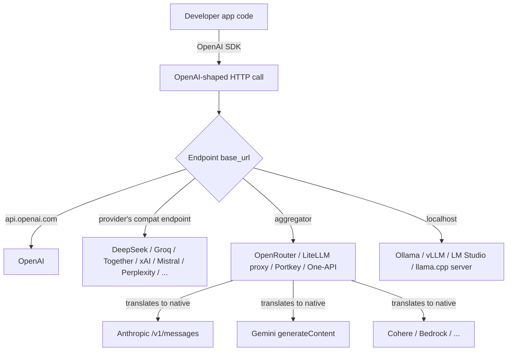

## The short answer

OpenAI's **Chat Completions API** (`POST /v1/chat/completions`, with `messages: [{role, content}]`, `model`, `temperature`, `tools`, `stream`, …) has become the lingua franca of the LLM ecosystem. Even though different companies build different models, almost everyone — providers, open-source projects, aggregators, local runtimes — adopts the OpenAI request/response shape as the default wire format.

This document walks through how that convergence happened, who participates, what gets lost in the process, and why the resulting equilibrium is stable.

## The layers of the ecosystem



The OpenAI SDK is the client; everything to the right of `base_url` is interchangeable.

## Who follows the OpenAI format

### Providers with OpenAI-compatible endpoints

Most non-OpenAI providers expose an OpenAI-compatible endpoint alongside (or instead of) their native one:

- **Groq, Together AI, Fireworks, Perplexity, xAI (Grok), Mistral (La Plateforme), DeepSeek, Moonshot/Kimi, Zhipu/GLM, Qwen (DashScope), SiliconFlow**
- **Azure OpenAI** — naturally compatible
- **OpenRouter** — its own product *is* an OpenAI-compatible endpoint that fans out to many providers

### Providers with their own native format

A handful keep first-class native APIs because their feature set exceeds what the OpenAI schema can express:

| Provider | Native API | Why |
|---|---|---|
| **Anthropic** | `/v1/messages` | Distinct message/content-block model, tool use semantics, system prompt as separate field, caching, extended thinking |
| **Google** | `generateContent` | `contents`/`parts` model, native multimodal (audio/video), grounding, safety settings |
| **Cohere** | Its own API | Embeddings, rerank, RAG-shaped endpoints |
| **AWS Bedrock** | `Converse` + per-model native | Multi-tenant gateway over many providers |

Even these usually also offer an OpenAI-compatible shim — because the ecosystem expects it.

### Local runtimes

Every popular self-hosted inference server ships an OpenAI-compatible HTTP layer:

- **Ollama**, **vLLM**, **LM Studio**, **llama.cpp server**, **TGI (HuggingFace)**, **LocalAI**

You point the OpenAI SDK at `http://localhost:<port>/v1` and it just works.

## The "no SDK, use OpenAI's" pattern

Many providers skip building and maintaining their own SDKs entirely. Their docs literally tell users:

```python
from openai import OpenAI

client = OpenAI(
    api_key="<provider-key>",
    base_url="https://api.<provider>.com/v1",  # not OpenAI's URL
)
client.chat.completions.create(
    model="<their-model>",
    messages=[{"role": "user", "content": "hello"}],
)
```

Why providers do this:

- ✅ **Zero SDK maintenance cost** — no Python/JS/Go/Java client libraries to ship and version
- ✅ **Instant ecosystem compatibility** — any tool that speaks OpenAI works on day one
- ✅ **Frictionless onboarding** — developers migrating from OpenAI change two lines

The providers that still ship native SDKs (Anthropic, Google, Cohere, AWS Bedrock) do so because their advanced features can't fit into the OpenAI shape without losing fidelity.

## Why open-source LLM projects treat OpenAI API as first-class

Look at the most popular GitHub LLM projects and the pattern is consistent:

| Project | Primary integration |
|---|---|
| **Open WebUI** | OpenAI-compatible endpoints are the core abstraction |
| **LiteLLM** | Normalizes ~100 providers *into* the OpenAI request/response format |
| **SillyTavern** | "Chat Completion" mode is OpenAI-shaped |
| **AnythingLLM, LobeChat, LibreChat, Chatbox, NextChat, BetterChatGPT** | OpenAI schema by default |
| **Continue, Cline, Aider, Cursor, Zed AI** | Accept any OpenAI-compatible base URL as a generic provider slot |
| **LangChain / LlamaIndex / Vercel AI SDK** | OpenAI integration is the reference; others are adapters |

Reasons maintainers build this way:

1. **One integration covers the long tail.** Implement OpenAI once → instantly support DeepSeek, Groq, Together, Fireworks, xAI, Mistral, OpenRouter, every local runtime, plus user-hosted endpoints.
2. **User expectation.** Users already have an OpenAI key and mental model. A "Base URL + API Key" field is universally understood.
3. **Stable, well-documented schema.** `messages`, `tools`, `stream`, `temperature` are battle-tested shapes — easy to design UIs and features around.
4. **Composability.** Middleware (LiteLLM, OpenRouter, caches, observability like Langfuse/Helicone) all sit on the OpenAI wire format, so projects inherit that ecosystem for free.

## The first-party advantage

A consequence of OpenAI-shape convergence: **the most advanced features of Claude and Gemini are mostly used only by the company's own products.** Open-source projects ignore them because supporting them breaks the universal interface assumption.

| Tier | Who | What they use |
|---|---|---|
| **First-party apps** | Claude Code, Claude.ai, Projects, Artifacts, Computer Use; Gemini app, NotebookLM, AI Studio, Gemini in Workspace; ChatGPT itself | **Every feature** the model supports — including ones not in the public API yet |
| **Provider-native OSS** | A small set of projects that target one provider's depth (Aider, Cline, Roo Code lean on Anthropic caching) | Native SDK + advanced features |
| **Mainstream OSS** | Open WebUI, LibreChat, LobeChat, SillyTavern, AnythingLLM, most agent frameworks | **OpenAI-shaped subset only**; advanced provider features ignored or stubbed |

### Features that mostly stay first-party

- **Anthropic** 🟣 — prompt caching, extended thinking / reasoning budgets, computer use, citations, fine-grained tool use, 1M context (Sonnet), files API, code execution tool, MCP integration depth
- **Google Gemini** 🔵 — long-context (1M–2M tokens) retrieval patterns, native multimodal (audio in/out, video frames), grounding with Google Search, code execution tool, context caching, "thinking" mode, Live API (real-time bidirectional)
- **OpenAI** 🟢 — Realtime API, Assistants/Threads, structured outputs with strict schemas, Operator/computer-use, Deep Research, advanced voice mode (OSS projects still mostly use plain Chat Completions)

### Why first-party uses everything and OSS doesn't

1. **Information asymmetry.** The lab's own engineers know exactly how caching, tool use, and thinking interact. OSS devs see a fraction of the design space.
2. **Single-target optimization.** Claude Code only needs to be great on Claude; it can lean into prompt caching, system prompts, tool schemas tuned for one model family.
3. **Distribution incentive.** Anthropic and Google ship flagship apps to *demonstrate* the features and drive API revenue. OSS maintainers have no reason to maintain N divergent code paths.
4. **Velocity.** Provider-native features evolve fast. Tracking the slowly-moving OpenAI shape is far cheaper.
5. **Abstraction cost.** Exposing "thinking budget" or "cache_control" in a generic UI requires per-provider UX. Maintainers skip it.

A useful mental model:

- **OpenAI API = the HTML of LLMs.** Universal, lowest common denominator, what every tool renders.
- **Anthropic/Gemini native APIs = native mobile apps.** More powerful, but only the platform owner (and a few committed third parties) bothers to use them fully.
- **Provider's own products = the showcase.** Claude Code and NotebookLM exist partly to prove "look what's actually possible if you use the whole API."

## Aggregators: proxies that are also translators

OpenRouter and its peers do more than route traffic — they **translate request/response shapes**:

1. App sends an OpenAI-shaped `chat/completions` request.
2. Aggregator rewrites it into Anthropic's `/v1/messages`, Gemini's `generateContent`, Cohere's API, etc.
3. Provider's response is rewritten back into an OpenAI `ChatCompletion` (or SSE delta) shape.
4. App never knows it wasn't talking to OpenAI.

That's why "just point the OpenAI SDK at OpenRouter" gives you Claude, Gemini, Llama, DeepSeek, Mistral — hundreds of models — behind one client.

### The aggregator landscape

- **OpenRouter** — hosted, pay-as-you-go credits, one of the largest model catalogs
- **LiteLLM proxy** — self-hostable OSS gateway, normalizes ~100 providers
- **Portkey** — hosted gateway with observability and routing
- **One-API / NewAPI** — self-hosted, popular in China
- **Cloudflare AI Gateway** — caching + routing layer
- **Helicone** — observability-first with proxy capabilities

### Why maintainers prefer aggregators

- One integration, one auth flow, one error model
- No model whitelist to maintain — new models just appear as strings in the dropdown
- No SDK version churn — OpenAI's SDK is stable; provider SDKs each break independently
- Users bring their own key — aggregator handles billing/quotas
- Smaller dependency footprint

### Why users prefer aggregators

- One API key, one bill, one dashboard for Claude + Gemini + everything else
- Easy model switching — change a dropdown, not a provider config
- No per-provider signup hell (KYC, payment method, region restrictions)
- Fallback and routing — automatic failover, load balancing, cheaper-route selection
- Privacy abstraction — the provider sees the aggregator, not the end user

### The "minor issues" both sides accept

- ❌ **Feature ceiling = OpenAI schema.** No prompt caching, no extended thinking, no Gemini grounding, no native multimodal beyond what the schema models, no provider-specific tool semantics
- ❌ **Translation lossiness.** System prompts handled differently (Anthropic separate field, OpenAI as a role); stop sequences, tool schemas, streaming deltas, token counting, and error codes all need careful mapping — bugs happen
- ❌ **Latency overhead.** Extra hop, typically tens of ms
- ❌ **Trust surface.** Prompts pass through a third party
- ❌ **Pricing markup.** Aggregators add a small fee (~5%) or arbitrage rates
- ❌ **Rate limit opacity.** Provider-specific limits hidden behind the aggregator's own limits

## The stable equilibrium

> **Maintainers ship one OpenAI integration. Users plug in an aggregator key. Both accept the feature ceiling because the alternative — N native integrations or N provider accounts — is worse for everyone.**

The cost of unlocking the top 10% of features is enormous (per-provider code paths, UI surfaces, docs), and the benefit is concentrated in specific workflows: coding agents that want caching, research tools that want grounding, voice apps that want Realtime. For a general chat UI or a generic agent framework, **~80% of the model's value lives in the chat + tools + streaming surface** — and that's exactly what the OpenAI shape captures.

The projects that *do* break out of this pattern — Claude Code, Aider, Cline, NotebookLM — are precisely the ones where a specific advanced feature (caching, long context, computer use) is **load-bearing to the product**. For everyone else, the OpenAI-shaped aggregator world is good enough, and "good enough that's universal" beats "perfect but fragmented" almost every time.

## Takeaways

- ✅ The OpenAI Chat Completions schema is the **wire-format standard** for LLMs, even though OpenAI doesn't make all the models.
- ✅ Most non-OpenAI providers ship an OpenAI-compatible endpoint and skip making their own SDK.
- ✅ Open-source LLM projects build features against the OpenAI shape; "support more providers" means "accept any OpenAI-compatible base URL."
- ✅ Aggregators (OpenRouter, LiteLLM, etc.) close the gap by **translating** OpenAI requests into native Anthropic / Gemini / Cohere calls and back.
- ⚠️ Provider-unique features (Anthropic caching, Gemini grounding, OpenAI Realtime) live mostly in **first-party apps** because the universal interface can't express them.
- ⚖️ The trade — feature ceiling in exchange for universal compatibility — is accepted by both maintainers and users, and the equilibrium is stable.
