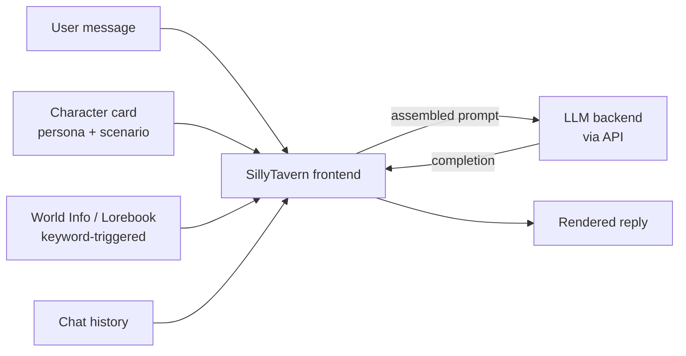

SillyTavern is one of those tools where the official docs, blog posts, and YouTube tutorials each show you a slice, and none of them quite resolve into a single mental model. This note tries to pin down what it is, what it isn't, and what the moving parts actually do — then closes with practical model and character-card guidance.

## What SillyTavern is

A **locally-installed, open-source chat frontend** for LLMs. Originally a fork of TavernAI back in 2023. You run it as a Node.js app and access it in a browser.

Two clarifications people often miss:

1. **It is a frontend only — bring your own backend.** Unlike `chatgpt.com`, SillyTavern does not come with a model. You point it at an API: OpenAI, Anthropic, OpenRouter, KoboldAI, Oobabooga's text-generation-webui, NovelAI, or a local model server. It is a *client*, not a service.
2. **Its feature set is optimized for sustained character-driven conversation.** Nothing technically stops you from making a "You are a helpful Python tutor" card, but the culture and the toolset are built around long-form roleplay, collaborative fiction, and in-character dialogue — exactly the use cases that ChatGPT and Claude.ai deliberately restrict.

So the cleaner framing: **SillyTavern is a power-user chat frontend whose features (character cards, lorebooks, group chats, instruct templates, regex scripts) are tuned for roleplay and storytelling.** Roleplay is the dominant use case, not the only one.

## The mental model

SillyTavern's real job is **prompt assembly**. Every turn, it stitches together:

- The character card (system prompt with structured fields).
- Any World Info entries whose keywords appear in recent chat.
- Author's Note, persona, jailbreak prompt, instruct-mode wrappers.
- Recent chat history (trimmed to fit the context window).

It sends that bundle to whichever API you've configured, then renders the reply. The "magic" of cards and lorebooks is convention and tooling on top of plain prompt engineering.

## Character cards

A character card is **mostly just a structured system prompt**. Standard fields:

| Field | What it is |
|---|---|
| Name | Character's name |
| Description | Appearance, traits, backstory |
| Personality | Short personality summary |
| Scenario | Setting / situation when chat opens |
| First message | Opening line shown to the user |
| Example dialogue | Few-shot examples the LLM imitates |

The "special" part is convention — SillyTavern knows how to format these fields and inject them. Under the hood it's still text the LLM sees as instructions.

**Card file format.** Cards are PNG files with the JSON data embedded in image metadata ("Character Card v2" spec). You drag the PNG into SillyTavern or paste a URL — it reads the embedded JSON and creates the character. The image becomes the avatar. This is why cards get shared as images on sites and Discord.

## World Info (lorebooks)

This is the feature most tutorials gloss over and the one that matters most for long sessions.

- World Info entries are **keyword-triggered**, not always-on.
- Each entry has a keyword (or list of keywords) and a body of lore text.
- An entry only enters the prompt **when its keyword appears in recent chat**.

Consequence: a setting with 200 lore entries doesn't blow your context budget — only the relevant ones get pulled in. It's essentially **manual RAG**: you decide what gets retrieved, by writing the keywords.

## Where character cards come from

SillyTavern ships with a few built-in characters (Seraphina, an assistant, others). They exist as examples — to show what a card looks like and confirm the install works. Almost nobody uses them long-term.

**Real sources:**

- **chub.ai** (formerly characterhub) — the largest repository. Searchable by tag, SFW/NSFW filter, direct download or fetch-by-URL inside SillyTavern.
- **JanitorAI** — has its own chat site; cards are exportable and many get reused in SillyTavern.
- **Discord servers** — some creators drop cards in Discord communities before/instead of public sites.
- **Reddit** — `r/SillyTavernAI` and adjacent subs.
- **Pygmalion / Backyard / AI Character Editor** — alternate ecosystems; cards are largely cross-compatible.

**What most users actually do:**

1. Download 5–20 cards that look interesting.
2. Realize ~80% are mediocre — bloated descriptions, broken example dialogue, prompt-injection padding inflating the token count.
3. Either start editing the good ones (trimming, fixing example messages, tightening the personality), or eventually write their own.

Writing your own card is the skill that separates casual users from people who get consistently good output. Once you understand which fields the LLM actually sees and how they're formatted, you can write much tighter cards than most public ones.

## Picking a model on OpenRouter

There's no single "best" — it's a triangle of **prose quality, willingness (uncensored), and cost**. Community taste also drifts every few months. As of early 2026, the rough landscape:

### Top prose, need jailbreak prompts for NSFW

- **Claude Opus 4.x / Sonnet 4.x** — widely considered the best prose stylists. Strong character voice, long-form coherence, subtle emotional beats. Refuses by default; the SillyTavern community shares "Claude presets" (system prompt + prefill tricks) that work around this. Expensive.
- **Gemini 2.x Pro** — long context (huge for lorebook-heavy chats), decent prose, also gated but jailbreakable. Cheaper than Claude.
- **GPT-4o / GPT-5** — competent but generally drier and more sterile than Claude for RP. Heavier filtering.

### Uncensored out of the box, popular for RP/NSFW

- **DeepSeek V3 / R1** — became the default "free or near-free" RP model in 2025. Surprisingly good prose, barely refuses anything, extremely cheap. R1 reasons before responding — some people love it, others find it slows pacing. Most newcomers start here.
- **Magnum v4 (72B / 123B)** — Anthracite's RP fine-tunes of Qwen / Mistral Large. Built specifically for this. Less "sloppy" prose than generic models.
- **Midnight Miqu, Euryale, Stheno, Lumimaid** (Sao10K and others) — Llama-based RP fine-tunes, long-standing community favorites. Smaller (70B) and cheap.
- **WizardLM-2 8x22B** — older but still in rotation.

### Middle ground — smart and reasonably permissive

- **Mistral Large 2** — solid all-rounder.
- **Command R+** (Cohere) — strong at long context, decent prose.
- **Qwen 2.5 / 3 72B** — improving fast; base for many fine-tunes.

### Practical pick order

1. **Start with DeepSeek V3.** Cheap, no jailbreak needed, lets you learn the SillyTavern workflow without prompt-engineering on top.
2. **Upgrade to Claude Sonnet 4.6** if you want noticeably better prose and don't mind setting up a jailbreak preset. Opus for special occasions — pricey per message.
3. **Try Gemini 2.x Pro** for long-running stories with heavy lorebooks (1M+ context).
4. **Check `r/SillyTavernAI`'s weekly "best models" megathread** for current taste — it shifts every couple months as new models drop.

One warning: OpenRouter exposes hundreds of models, and many "RP-tuned" variants are barely different from their base. Don't model-hop endlessly — pick one, learn to write good cards and prompts for it, and switch only when you hit a clear ceiling.

## Summary

| Concept | One-line summary |
|---|---|
| SillyTavern | A local browser-based chat frontend; you connect it to an LLM API. |
| Character card | A structured system prompt packaged as a PNG with embedded JSON metadata. |
| World Info | Keyword-triggered context injection — manual RAG for lore. |
| Built-in cards | Examples only; real cards come from chub.ai, JanitorAI exports, Discord, Reddit. |
| Model choice | Triangle of prose quality, willingness, cost — start with DeepSeek V3, upgrade to Claude or Gemini as needs grow. |

The shortest version: SillyTavern is what you use when you want the chat experience of ChatGPT, but with full control over the system prompt, retrieval, model, and content policy — at the cost of running it yourself and paying for your own API calls.
